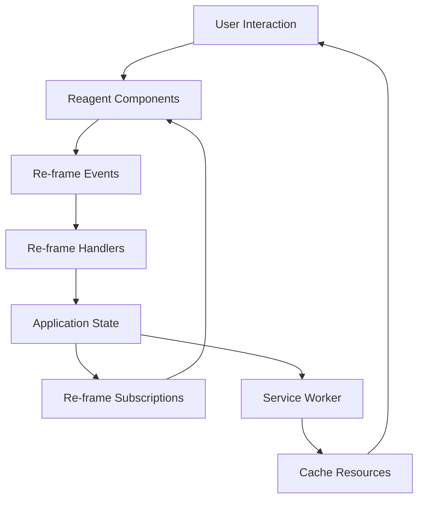

## 18.5. ClojureScript for Mobile Web Apps

In the ever-evolving landscape of mobile development, creating applications that deliver a seamless, native-like experience is crucial. ClojureScript, a powerful language that compiles to JavaScript, offers a unique approach to building mobile web applications. By leveraging ClojureScript, developers can create Progressive Web Applications (PWAs) that combine the best of web and mobile apps, providing users with fast, reliable, and engaging experiences.

### Understanding Mobile Web Apps and PWAs

**Mobile Web Apps** are web applications optimized for mobile devices. They are accessible through a browser and do not require installation from an app store. **Progressive Web Applications (PWAs)** take this a step further by offering features traditionally associated with native apps, such as offline access, push notifications, and home screen installation.

#### Advantages of Mobile Web Apps and PWAs

1. **Cross-Platform Compatibility**: Mobile web apps run on any device with a browser, reducing the need for platform-specific development.
2. **Ease of Updates**: Updates are deployed on the server, ensuring users always access the latest version without manual updates.
3. **Cost-Effectiveness**: Developing a single web app is generally more cost-effective than maintaining separate native apps for different platforms.
4. **Improved Reach**: PWAs can be indexed by search engines, increasing discoverability.

### Leveraging ClojureScript for Mobile Web Apps

ClojureScript is well-suited for building mobile web apps due to its functional programming paradigm, immutability, and powerful abstractions. It allows developers to write concise, expressive code that is easy to maintain and extend.

#### Using Reagent and Re-frame

**[Reagent](https://reagent-project.github.io/)** and **[Re-frame](https://github.com/day8/re-frame)** are popular ClojureScript frameworks that facilitate the development of reactive user interfaces.

- **Reagent** is a minimalistic interface to React, providing a simple way to create React components using ClojureScript.
- **Re-frame** builds on Reagent, offering a structured approach to managing application state and side effects.

##### Example: Creating a Simple Mobile Web App with Reagent

```clojure
(ns my-app.core
  (:require [reagent.core :as r]))

(defn hello-world []
  [:div
   [:h1 "Hello, Mobile Web!"]
   [:p "Welcome to your first ClojureScript mobile web app."]])

(defn init []
  (r/render [hello-world]
            (.getElementById js/document "app")))

;; Call the init function to render the app
(init)
```

In this example, we define a simple component `hello-world` using Reagent. The `init` function renders this component into the DOM element with the ID "app".

##### Building a More Complex App with Re-frame

Re-frame introduces a unidirectional data flow pattern, making it easier to manage complex state interactions.

```clojure
(ns my-app.core
  (:require [re-frame.core :as rf]
            [reagent.core :as r]))

;; Define an event to update the app state
(rf/reg-event-db
 :initialize
 (fn [_ _]
   {:message "Hello, Mobile Web with Re-frame!"}))

;; Define a subscription to access the app state
(rf/reg-sub
 :message
 (fn [db _]
   (:message db)))

;; Define a component that uses the subscription
(defn hello-world []
  (let [message (rf/subscribe [:message])]
    (fn []
      [:div
       [:h1 @message]
       [:p "Welcome to your first Re-frame mobile web app."]])))

(defn init []
  (rf/dispatch-sync [:initialize])
  (r/render [hello-world]
            (.getElementById js/document "app")))

;; Call the init function to render the app
(init)
```

In this example, we use Re-frame to manage the application state. The `:initialize` event sets the initial state, and the `:message` subscription allows the `hello-world` component to access this state.

### Responsive Design and Offline Capabilities

Creating mobile web apps that work seamlessly across different devices and network conditions is essential. Responsive design and offline capabilities are key aspects of this.

#### Responsive Design

Responsive design ensures that your app looks and functions well on various screen sizes. Use CSS media queries and flexible layouts to achieve this.

```css
/* Example CSS for responsive design */
body {
  font-family: Arial, sans-serif;
}

.container {
  max-width: 600px;
  margin: 0 auto;
  padding: 20px;
}

@media (max-width: 600px) {
  .container {
    padding: 10px;
  }
}
```

#### Offline Capabilities

PWAs can function offline by caching resources using Service Workers. This ensures that users can access your app even without an internet connection.

```javascript
// Example Service Worker for caching resources
self.addEventListener('install', event => {
  event.waitUntil(
    caches.open('my-app-cache').then(cache => {
      return cache.addAll([
        '/',
        '/index.html',
        '/styles.css',
        '/app.js'
      ]);
    })
  );
});

self.addEventListener('fetch', event => {
  event.respondWith(
    caches.match(event.request).then(response => {
      return response || fetch(event.request);
    })
  );
});
```

### Best Practices for Optimizing Performance on Mobile Browsers

1. **Minimize JavaScript and CSS**: Use tools like UglifyJS and CSSNano to reduce file sizes.
2. **Lazy Load Images and Resources**: Load images and other resources only when needed to reduce initial load times.
3. **Optimize Images**: Use modern formats like WebP and compress images to reduce bandwidth usage.
4. **Use a Content Delivery Network (CDN)**: Distribute your app's resources across multiple servers to reduce latency.
5. **Leverage Browser Caching**: Set appropriate cache headers to reduce the need for repeated downloads.

### Visualizing the Architecture of a ClojureScript Mobile Web App

Below is a diagram illustrating the architecture of a ClojureScript mobile web app using Reagent and Re-frame.



**Diagram Description**: This diagram shows the flow of data and interactions in a ClojureScript mobile web app. User interactions trigger Reagent components, which dispatch Re-frame events. These events are handled by Re-frame handlers, updating the application state. Subscriptions access this state to update the UI. A Service Worker caches resources for offline access.

### Try It Yourself

Experiment with the code examples provided. Try modifying the `hello-world` component to display dynamic content based on user input. Implement additional features such as offline notifications or a responsive navigation menu.

### References and Further Reading

- [Reagent Documentation](https://reagent-project.github.io/)
- [Re-frame GitHub Repository](https://github.com/day8/re-frame)
- [Progressive Web Apps on MDN](https://developer.mozilla.org/en-US/docs/Web/Progressive_web_apps)
- [Service Workers on MDN](https://developer.mozilla.org/en-US/docs/Web/API/Service_Worker_API)

### Knowledge Check

- What are the key advantages of using ClojureScript for mobile web apps?
- How does Re-frame help manage application state in ClojureScript apps?
- What are some best practices for optimizing mobile web app performance?

### Embrace the Journey

Remember, building mobile web apps with ClojureScript is a journey. As you explore and experiment, you'll discover new ways to create engaging, efficient applications. Keep learning, stay curious, and enjoy the process!

## **Ready to Test Your Knowledge?**



### What is a key advantage of Progressive Web Applications (PWAs)?

- [x] They offer offline capabilities and push notifications.
- [ ] They require installation from an app store.
- [ ] They are only compatible with Android devices.
- [ ] They cannot be indexed by search engines.

> **Explanation:** PWAs offer features like offline capabilities and push notifications, providing a native-like experience without requiring installation from an app store.

### Which ClojureScript framework provides a minimalistic interface to React?

- [x] Reagent
- [ ] Re-frame
- [ ] Om
- [ ] Fulcro

> **Explanation:** Reagent is a minimalistic interface to React, allowing developers to create React components using ClojureScript.

### How does Re-frame manage application state?

- [x] Through a unidirectional data flow pattern.
- [ ] By using global variables.
- [ ] Through direct DOM manipulation.
- [ ] By storing state in local storage.

> **Explanation:** Re-frame uses a unidirectional data flow pattern, where events update the application state, and subscriptions access this state to update the UI.

### What is the purpose of Service Workers in PWAs?

- [x] To cache resources for offline access.
- [ ] To handle user authentication.
- [ ] To manage database connections.
- [ ] To render HTML on the server.

> **Explanation:** Service Workers cache resources, enabling PWAs to function offline and improve performance by reducing network requests.

### Which CSS technique is essential for responsive design?

- [x] Media queries
- [ ] Inline styles
- [ ] CSS resets
- [ ] CSS animations

> **Explanation:** Media queries are used to apply different styles based on screen size, ensuring that the app is responsive across devices.

### What is a best practice for optimizing images in mobile web apps?

- [x] Use modern formats like WebP and compress images.
- [ ] Use only PNG format for all images.
- [ ] Avoid using images altogether.
- [ ] Store images in a database.

> **Explanation:** Using modern formats like WebP and compressing images reduces bandwidth usage and improves load times.

### How can you reduce JavaScript file sizes for mobile web apps?

- [x] Use tools like UglifyJS to minify JavaScript files.
- [ ] Write all JavaScript in a single file.
- [ ] Avoid using JavaScript altogether.
- [ ] Store JavaScript in a database.

> **Explanation:** Minifying JavaScript files with tools like UglifyJS reduces file sizes, improving load times and performance.

### What is a benefit of using a Content Delivery Network (CDN)?

- [x] It reduces latency by distributing resources across multiple servers.
- [ ] It increases the size of JavaScript files.
- [ ] It limits the app to a single geographic location.
- [ ] It requires manual updates for each user.

> **Explanation:** A CDN distributes resources across multiple servers, reducing latency and improving load times for users worldwide.

### True or False: Re-frame subscriptions allow components to access the application state.

- [x] True
- [ ] False

> **Explanation:** Re-frame subscriptions provide a way for components to access the application state, enabling reactive updates to the UI.

### True or False: ClojureScript is not suitable for building mobile web apps.

- [ ] True
- [x] False

> **Explanation:** ClojureScript is well-suited for building mobile web apps, offering powerful abstractions and a functional programming paradigm that enhances development efficiency.


