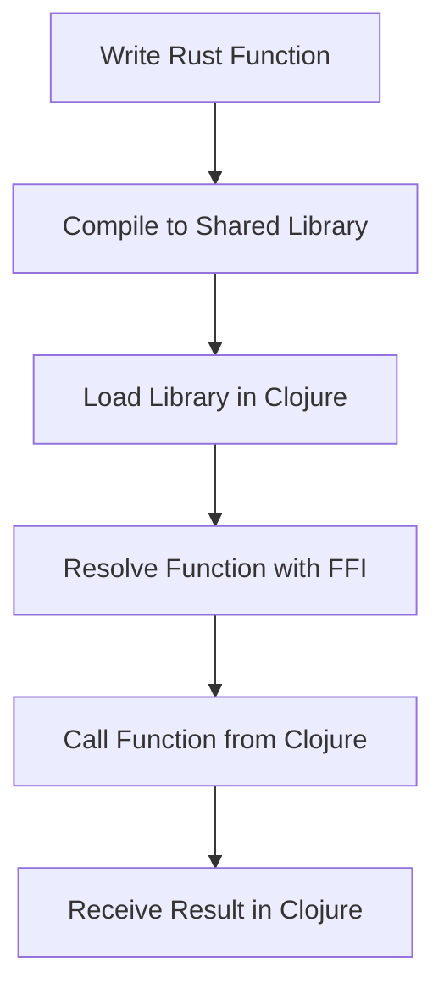

## 18.7. Rust and Clojure Interop for Mobile Libraries

In the realm of mobile development, performance is a critical factor that can significantly impact user experience. As developers, we often seek ways to optimize our applications, especially when dealing with performance-critical components. Rust, known for its speed and safety, emerges as a powerful ally in this quest. By leveraging Rust's capabilities, we can enhance the performance of mobile applications built with Clojure. This section explores the interoperability between Rust and Clojure, providing insights into integrating high-performance native libraries into mobile applications.

### Benefits of Using Rust for Performance-Critical Components

Rust is a systems programming language that offers several advantages for performance-critical components:

- **Memory Safety**: Rust ensures memory safety without a garbage collector, preventing common bugs such as null pointer dereferencing and buffer overflows.
- **Concurrency**: Rust's ownership model facilitates fearless concurrency, allowing developers to write concurrent code without data races.
- **Performance**: Rust's performance is comparable to C and C++, making it ideal for computationally intensive tasks.
- **Cross-Platform**: Rust can compile to various platforms, including mobile, making it versatile for cross-platform development.

By integrating Rust with Clojure, we can harness these benefits to build robust and efficient mobile applications.

### Integrating Rust Code with Clojure

To integrate Rust code with Clojure, we can use tools like Clojure's Java Interop and Foreign Function Interface (FFI). These tools allow us to call Rust functions from Clojure, enabling seamless cross-language interaction.

#### Clojure's Java Interop

Clojure's Java Interop provides a way to interact with Java classes and methods directly from Clojure code. Since Rust can compile to a shared library that can be called from Java, we can use Java Interop to bridge the gap between Rust and Clojure.

#### Foreign Function Interface (FFI)

The Foreign Function Interface (FFI) allows Clojure to call functions written in other languages, such as Rust. The `ffi-clj` library is a popular choice for implementing FFI in Clojure, providing a straightforward way to call Rust functions.

### Example: Calling Rust Functions from Clojure

Let's walk through an example of calling a Rust function from Clojure using FFI. We'll create a simple Rust library that performs a mathematical operation and call it from Clojure.

#### Step 1: Create a Rust Library

First, let's create a Rust library that exports a function to add two numbers:

```rust
// src/lib.rs

#[no_mangle]
pub extern "C" fn add_numbers(a: i32, b: i32) -> i32 {
    a + b
}
```

Compile the Rust library to a shared object file:

```bash
$ cargo build --release
```

This will generate a shared library file (e.g., `libmyrustlib.so` on Linux).

#### Step 2: Set Up Clojure Project

Next, set up a Clojure project and include the `ffi-clj` library in your `project.clj`:

```clojure
(defproject rust-clojure-interop "0.1.0-SNAPSHOT"
  :dependencies [[org.clojure/clojure "1.10.3"]
                 [ffi-clj "0.2.0"]])
```

#### Step 3: Call Rust Function from Clojure

Now, let's write Clojure code to call the Rust function using FFI:

```clojure
(ns rust-clojure-interop.core
  (:require [ffi-clj.core :as ffi]))

(def rust-lib (ffi/load-library "path/to/libmyrustlib"))

(defn add-numbers [a b]
  ((ffi/resolve rust-lib "add_numbers") a b))

(defn -main []
  (println "The sum of 5 and 3 is:" (add-numbers 5 3)))
```

In this example, we load the Rust library using `ffi/load-library` and resolve the `add_numbers` function using `ffi/resolve`. We then call the function with the desired arguments.

#### Step 4: Run the Clojure Program

Run the Clojure program to see the result:

```bash
$ lein run
```

You should see the output:

```
The sum of 5 and 3 is: 8
```

### Challenges and Solutions in Cross-Language Interaction

While integrating Rust and Clojure offers numerous benefits, it also presents challenges. Here are some common challenges and their solutions:

- **Data Types**: Rust and Clojure have different data types, which can lead to compatibility issues. Use appropriate conversion functions to map data types between the two languages.
- **Error Handling**: Rust's error handling is based on `Result` and `Option` types, while Clojure uses exceptions. Implement error conversion mechanisms to handle errors gracefully.
- **Performance Overhead**: FFI calls can introduce performance overhead. Minimize the number of FFI calls by batching operations or using efficient data structures.

### Visualizing Rust and Clojure Interop

To better understand the interaction between Rust and Clojure, let's visualize the process using a flowchart:



**Figure 1**: Flowchart of Rust and Clojure Interoperability Process

### Try It Yourself

Experiment with the code example by modifying the Rust function to perform different operations, such as multiplication or division. Observe how the changes affect the Clojure code and the final output.

### References and Links

- [Clojure's Java Interop](https://clojure.org/reference/java_interop)
- [FFI in Clojure](https://github.com/ctford/ffi-clj)
- [Rust Programming Language](https://www.rust-lang.org/)

### Knowledge Check

To reinforce your understanding of Rust and Clojure interop, try answering the following questions:

## **Ready to Test Your Knowledge?**



### What is the primary benefit of using Rust for performance-critical components in mobile applications?

- [x] Memory safety without a garbage collector
- [ ] Built-in garbage collection
- [ ] Dynamic typing
- [ ] High-level abstractions

> **Explanation:** Rust ensures memory safety without a garbage collector, making it ideal for performance-critical components.

### Which tool allows Clojure to call functions written in other languages, such as Rust?

- [x] Foreign Function Interface (FFI)
- [ ] Java Interop
- [ ] ClojureScript
- [ ] Leiningen

> **Explanation:** The Foreign Function Interface (FFI) allows Clojure to call functions written in other languages like Rust.

### How do you compile a Rust library to a shared object file?

- [x] Use `cargo build --release`
- [ ] Use `rustc --release`
- [ ] Use `cargo compile`
- [ ] Use `rustc compile`

> **Explanation:** The command `cargo build --release` compiles a Rust library to a shared object file.

### What is the purpose of the `ffi/load-library` function in Clojure?

- [x] To load a shared library for FFI
- [ ] To compile Rust code
- [ ] To resolve Java classes
- [ ] To manage dependencies

> **Explanation:** The `ffi/load-library` function loads a shared library for use with FFI in Clojure.

### What is a common challenge when integrating Rust and Clojure?

- [x] Data type compatibility
- [ ] Lack of concurrency support
- [ ] Absence of error handling
- [ ] Limited performance

> **Explanation:** Data type compatibility is a common challenge when integrating Rust and Clojure.

### How can you minimize performance overhead when using FFI?

- [x] Batch operations to reduce FFI calls
- [ ] Increase the number of FFI calls
- [ ] Use dynamic typing
- [ ] Avoid error handling

> **Explanation:** Batching operations can minimize performance overhead by reducing the number of FFI calls.

### Which Rust feature facilitates fearless concurrency?

- [x] Ownership model
- [ ] Garbage collection
- [ ] Dynamic typing
- [ ] High-level abstractions

> **Explanation:** Rust's ownership model facilitates fearless concurrency by preventing data races.

### What is the role of `ffi/resolve` in Clojure?

- [x] To resolve a function from a loaded library
- [ ] To compile Rust code
- [ ] To manage dependencies
- [ ] To handle errors

> **Explanation:** The `ffi/resolve` function resolves a function from a loaded library for use in Clojure.

### True or False: Rust can compile to various platforms, including mobile.

- [x] True
- [ ] False

> **Explanation:** Rust can compile to various platforms, including mobile, making it versatile for cross-platform development.

### What is a benefit of using Rust's `Result` and `Option` types?

- [x] They provide a robust error handling mechanism
- [ ] They simplify dynamic typing
- [ ] They enhance garbage collection
- [ ] They improve high-level abstractions

> **Explanation:** Rust's `Result` and `Option` types provide a robust error handling mechanism.



Remember, this is just the beginning of your journey into Rust and Clojure interop for mobile libraries. As you progress, you'll discover more advanced techniques and optimizations. Keep experimenting, stay curious, and enjoy the journey!
