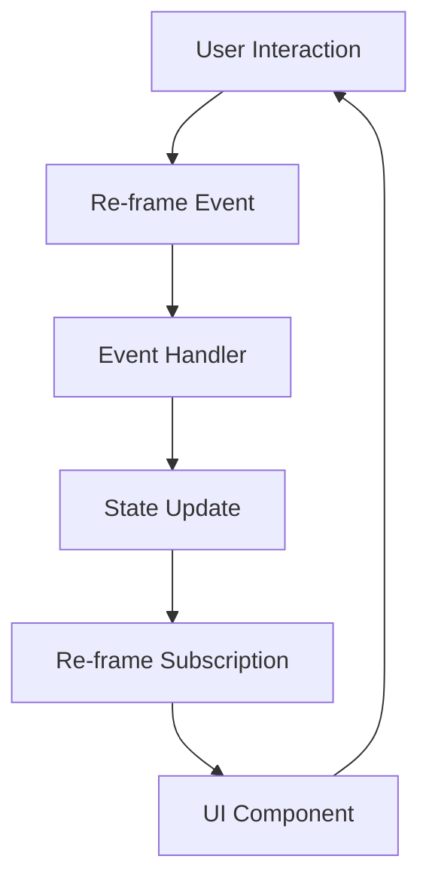

## 18.8. Case Studies of Mobile Apps Powered by Clojure

In the realm of mobile development, Clojure and ClojureScript have carved a niche for themselves by offering a unique blend of functional programming paradigms, immutability, and seamless JavaScript interoperability. This section delves into real-world case studies of mobile applications powered by Clojure, showcasing their architecture, development processes, and the outcomes achieved. Through these examples, we aim to provide insights into the practical applications of Clojure in mobile development, highlighting both the successes and challenges faced along the way.

### Case Study 1: Day8 Re-frame App

#### Project Goals
Day8, a software development company, aimed to create a highly interactive and responsive mobile application using ClojureScript. The goal was to leverage the power of Re-frame, a ClojureScript framework for building user interfaces, to deliver a seamless user experience.

#### Technical Stack
- **ClojureScript**: For writing the application logic.
- **Re-frame**: A framework for managing application state and side effects.
- **React Native**: For rendering the user interface on mobile devices.
- **Expo**: To streamline the development and deployment process.

#### Implementation Details
The application was structured around Re-frame's event-driven architecture, which allowed for a clear separation of concerns. The core components included:
- **Event Handlers**: To manage user interactions and application state changes.
- **Subscriptions**: For reactive data flow, ensuring that UI components automatically update in response to state changes.
- **Effects and Co-effects**: To handle side effects such as API calls and local storage access.

```clojure
(ns day8.core
  (:require [re-frame.core :as re-frame]))

;; Define an event handler
(re-frame/reg-event-db
 :initialize-db
 (fn [_ _]
   {:counter 0}))

;; Define a subscription
(re-frame/reg-sub
 :counter
 (fn [db _]
   (:counter db)))

;; Define a component
(defn counter-component []
  (let [counter (re-frame/subscribe [:counter])]
    [:div
     [:h1 "Counter: " @counter]
     [:button {:on-click #(re-frame/dispatch [:increment-counter])} "Increment"]]))
```

#### Successes and Challenges
The use of Re-frame allowed Day8 to build a highly maintainable and scalable application. The reactive data flow ensured that the UI remained consistent with the application state, reducing bugs and improving user satisfaction. However, the team faced challenges with integrating native modules in React Native, which required custom bridging code.

#### Lessons Learned
- **Leverage Re-frame's architecture**: The separation of concerns and reactive data flow are powerful tools for building complex applications.
- **Plan for native integration**: Anticipate the need for custom native modules and plan accordingly.

### Case Study 2: Metabase Mobile

#### Project Goals
Metabase, an open-source business intelligence tool, sought to extend its platform to mobile devices. The goal was to provide users with access to their dashboards and analytics on the go, using ClojureScript to maintain consistency with their existing codebase.

#### Technical Stack
- **ClojureScript**: For maintaining a consistent codebase with the web application.
- **React Native**: To provide a native mobile experience.
- **Reagent**: A minimalistic interface between ClojureScript and React.

#### Implementation Details
The Metabase mobile app was designed to mirror the functionality of the web application, with a focus on performance and usability. Key components included:
- **Data Fetching**: Using ClojureScript's async capabilities to fetch data from the Metabase API.
- **UI Components**: Built with Reagent, leveraging React Native's component library for a native look and feel.
- **State Management**: Using Re-frame to manage application state and synchronize it with the server.

```clojure
(ns metabase.mobile
  (:require [reagent.core :as reagent]
            [re-frame.core :as re-frame]))

;; Define a component for displaying a dashboard
(defn dashboard-component [dashboard-id]
  (let [dashboard (re-frame/subscribe [:get-dashboard dashboard-id])]
    (fn []
      [:div
       [:h1 (:title @dashboard)]
       [:div (:content @dashboard)]])))
```

#### Successes and Challenges
The Metabase team successfully delivered a mobile app that extended the functionality of their web platform. The use of ClojureScript allowed for code reuse and consistency across platforms. However, optimizing performance for mobile devices required significant effort, particularly in managing large datasets.

#### Lessons Learned
- **Optimize for mobile performance**: Pay attention to data fetching and rendering performance to ensure a smooth user experience.
- **Reuse code where possible**: ClojureScript's interoperability with JavaScript allows for significant code reuse between web and mobile applications.

### Case Study 3: CircleCI Mobile

#### Project Goals
CircleCI, a continuous integration and delivery platform, aimed to provide its users with a mobile application to monitor and manage their builds and deployments. The goal was to create a responsive and intuitive interface using ClojureScript.

#### Technical Stack
- **ClojureScript**: For application logic and state management.
- **Re-frame**: To handle application state and side effects.
- **React Native**: For building the mobile user interface.
- **GraphQL**: For efficient data querying and manipulation.

#### Implementation Details
The CircleCI mobile app was built with a focus on real-time updates and user interaction. Key features included:
- **Real-time Notifications**: Using GraphQL subscriptions to provide users with instant updates on build status.
- **User Interface**: Built with React Native components, styled for a consistent look and feel.
- **State Management**: Managed with Re-frame, ensuring a responsive and consistent user experience.

```clojure
(ns circleci.mobile
  (:require [re-frame.core :as re-frame]
            [reagent.core :as reagent]))

;; Define a component for displaying build status
(defn build-status-component [build-id]
  (let [build-status (re-frame/subscribe [:get-build-status build-id])]
    (fn []
      [:div
       [:h2 "Build Status"]
       [:p (:status @build-status)]])))
```

#### Successes and Challenges
The CircleCI mobile app successfully provided users with a powerful tool for managing their CI/CD pipelines on the go. The use of GraphQL allowed for efficient data fetching and real-time updates. However, integrating GraphQL with Re-frame required custom solutions to handle subscriptions and mutations.

#### Lessons Learned
- **Utilize GraphQL for real-time updates**: GraphQL's subscription model is well-suited for applications requiring real-time data.
- **Custom solutions may be necessary**: Be prepared to develop custom integrations when using new technologies with existing frameworks.

### Insights and Lessons Learned

Through these case studies, several key insights emerge for developers considering Clojure for mobile development:

1. **Embrace Functional Programming**: Clojure's functional programming paradigm offers significant advantages in terms of code maintainability and scalability. Embrace immutability and pure functions to build robust applications.

2. **Leverage ClojureScript's Interoperability**: The ability to interoperate with JavaScript and React Native allows for seamless integration with existing technologies and platforms.

3. **Plan for Performance Optimization**: Mobile applications require careful attention to performance, particularly in terms of data fetching and rendering. Optimize your application for the constraints of mobile devices.

4. **Prepare for Native Integration**: While ClojureScript and React Native provide a powerful combination, integrating native modules may require additional effort. Plan for this in your development process.

5. **Utilize Re-frame for State Management**: Re-frame's architecture is well-suited for managing complex application state, providing a clear separation of concerns and a reactive data flow.

6. **Consider Real-Time Data Needs**: For applications requiring real-time updates, consider using GraphQL or similar technologies to efficiently manage data subscriptions and mutations.

### Try It Yourself

To get hands-on experience with Clojure mobile development, try modifying the code examples provided in this section. Experiment with adding new features, optimizing performance, or integrating additional libraries. This will help solidify your understanding of the concepts discussed and provide valuable experience in building mobile applications with Clojure.

### Visualizing the Architecture

To better understand the architecture of these applications, let's visualize the typical flow of data and control in a ClojureScript mobile app using Re-frame and React Native.



**Diagram Description**: This diagram illustrates the flow of data and control in a ClojureScript mobile app using Re-frame. User interactions trigger events, which are handled by event handlers that update the application state. Subscriptions react to state changes, updating the UI components accordingly.

### References and Links

For further reading and exploration, consider the following resources:

- [Re-frame Documentation](https://github.com/day8/re-frame)
- [React Native Official Website](https://reactnative.dev/)
- [ClojureScript Documentation](https://clojurescript.org/)
- [GraphQL Official Website](https://graphql.org/)

### Ready to Test Your Knowledge?



### What is a key advantage of using ClojureScript for mobile development?

- [x] Interoperability with JavaScript and React Native
- [ ] Built-in support for native modules
- [ ] Automatic performance optimization
- [ ] Predefined mobile UI components

> **Explanation:** ClojureScript's interoperability with JavaScript and React Native allows for seamless integration with existing technologies and platforms.

### Which framework is commonly used with ClojureScript for managing application state?

- [x] Re-frame
- [ ] Redux
- [ ] MobX
- [ ] Vuex

> **Explanation:** Re-frame is a popular framework for managing application state in ClojureScript applications.

### What is a common challenge when integrating ClojureScript with React Native?

- [x] Integrating native modules
- [ ] Writing JavaScript code
- [ ] Handling asynchronous operations
- [ ] Managing application state

> **Explanation:** Integrating native modules often requires custom bridging code, which can be challenging.

### What technology is used in CircleCI's mobile app for real-time updates?

- [x] GraphQL
- [ ] REST API
- [ ] WebSockets
- [ ] Firebase

> **Explanation:** CircleCI's mobile app uses GraphQL subscriptions for real-time updates.

### What is a benefit of using Re-frame in mobile applications?

- [x] Clear separation of concerns and reactive data flow
- [ ] Automatic UI rendering
- [ ] Built-in native module support
- [ ] Predefined mobile components

> **Explanation:** Re-frame provides a clear separation of concerns and a reactive data flow, which are beneficial for managing complex application state.

### What should developers plan for when using ClojureScript and React Native?

- [x] Native module integration
- [ ] Automatic code generation
- [ ] Built-in testing tools
- [ ] Predefined UI themes

> **Explanation:** Developers should plan for the integration of native modules, which may require additional effort.

### How can developers optimize mobile app performance?

- [x] Optimize data fetching and rendering
- [ ] Use more complex algorithms
- [ ] Increase the number of UI components
- [ ] Avoid using state management

> **Explanation:** Optimizing data fetching and rendering is crucial for ensuring a smooth user experience on mobile devices.

### What is a common use case for GraphQL in mobile apps?

- [x] Real-time data updates
- [ ] Static data fetching
- [ ] Local storage management
- [ ] UI component styling

> **Explanation:** GraphQL is often used for real-time data updates through its subscription model.

### What is a lesson learned from the Metabase mobile app case study?

- [x] Optimize for mobile performance
- [ ] Avoid code reuse
- [ ] Use only native components
- [ ] Ignore data fetching

> **Explanation:** The Metabase team learned the importance of optimizing for mobile performance, particularly in data fetching and rendering.

### True or False: ClojureScript allows for significant code reuse between web and mobile applications.

- [x] True
- [ ] False

> **Explanation:** ClojureScript's interoperability with JavaScript allows for significant code reuse between web and mobile applications.



Remember, this is just the beginning. As you progress, you'll build more complex and interactive mobile applications. Keep experimenting, stay curious, and enjoy the journey!
