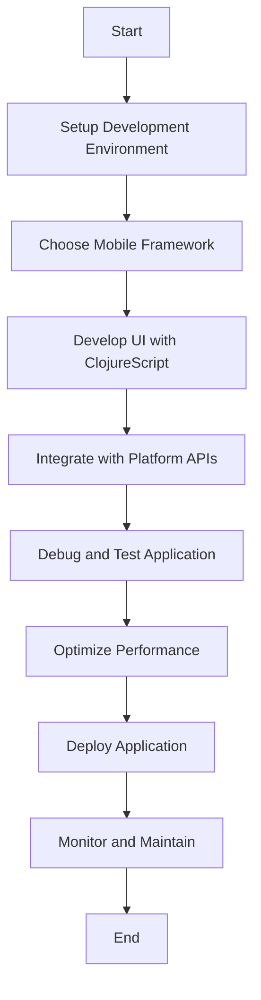

## 18.9. Challenges and Best Practices

Mobile development with Clojure presents a unique set of challenges and opportunities. As a functional programming language that runs on the Java Virtual Machine (JVM), Clojure offers powerful features like immutability, first-class functions, and a rich set of libraries. However, when it comes to mobile platforms, developers often encounter specific hurdles. In this section, we will explore these challenges and provide best practices to overcome them, ensuring a smooth and efficient development process.

### Understanding the Challenges

#### Tooling Limitations

One of the primary challenges in mobile development with Clojure is the tooling ecosystem. While Clojure has a robust set of tools for web and server-side development, mobile-specific tools are less mature. This can lead to difficulties in setting up development environments, building applications, and managing dependencies.

- **Limited IDE Support**: Unlike Java or Kotlin, which have extensive support in IDEs like Android Studio, Clojure's support is more limited. This can make tasks like code completion, refactoring, and debugging more cumbersome.
- **Build Tools**: While Leiningen and Boot are excellent for general Clojure development, integrating them with mobile build systems can be challenging. Developers often need to bridge the gap between Clojure's build tools and those used in mobile development, such as Gradle for Android.

#### Debugging Difficulties

Debugging Clojure applications on mobile platforms can be more complex than on the web or server-side. The dynamic nature of Clojure, combined with the constraints of mobile environments, can make it difficult to diagnose and fix issues.

- **Limited Debugging Tools**: The debugging tools available for Clojure are not as advanced as those for other languages commonly used in mobile development. This can make it harder to trace issues and understand application behavior.
- **Concurrency and State Management**: Clojure's emphasis on immutability and concurrency can introduce unique debugging challenges, especially when dealing with state management in mobile applications.

#### Platform-Specific Quirks

Mobile platforms, such as Android and iOS, have their own quirks and constraints that can affect Clojure development.

- **Platform APIs**: Accessing platform-specific APIs from Clojure can be cumbersome, requiring developers to write interop code or use libraries that bridge the gap.
- **Performance Considerations**: Mobile devices have limited resources compared to desktops or servers. Ensuring that Clojure applications perform well on these devices requires careful consideration of performance optimization techniques.

### Best Practices for Overcoming Challenges

#### Embrace Community Resources

The Clojure community is a valuable resource for overcoming challenges in mobile development. Engaging with the community can provide access to libraries, tools, and shared knowledge that can simplify the development process.

- **Leverage Open Source Libraries**: Many open-source libraries are available to help with common mobile development tasks, such as UI frameworks, networking, and data storage. Libraries like Reagent and Re-frame can be particularly useful for building mobile UIs with ClojureScript.
- **Participate in Forums and Meetups**: Engaging with the Clojure community through forums, meetups, and conferences can provide insights into best practices and emerging trends. Platforms like ClojureVerse and the Clojure Slack channel are great places to start.

#### Stay Updated with Latest Developments

Mobile development is a rapidly evolving field, and staying updated with the latest developments is crucial for success.

- **Follow Clojure and Mobile Development Blogs**: Regularly reading blogs and articles about Clojure and mobile development can help you stay informed about new tools, libraries, and techniques.
- **Contribute to Open Source Projects**: Contributing to open source projects not only helps the community but also keeps you engaged with the latest developments and challenges in the field.

#### Effective Team Collaboration

Collaboration is key to successful mobile development, especially when using a language like Clojure that may be new to some team members.

- **Establish Clear Communication Channels**: Use tools like Slack, Trello, or Jira to keep the team aligned and informed about project progress and challenges.
- **Conduct Regular Code Reviews**: Regular code reviews can help ensure code quality and provide opportunities for team members to learn from each other.
- **Encourage Pair Programming**: Pair programming can be an effective way to share knowledge and solve complex problems collaboratively.

### Practical Solutions and Recommendations

#### Tooling and Environment Setup

Setting up a robust development environment is crucial for efficient mobile development with Clojure.

- **Use ClojureScript for UI Development**: ClojureScript, a variant of Clojure that compiles to JavaScript, can be used to build mobile UIs with frameworks like React Native. This allows developers to leverage the rich ecosystem of JavaScript libraries and tools.
- **Integrate with Existing Build Systems**: Use tools like Leiningen plugins or Gradle tasks to integrate Clojure build processes with mobile build systems. This can help streamline the build process and reduce friction.

#### Debugging Strategies

Effective debugging strategies can help overcome the challenges of diagnosing and fixing issues in Clojure mobile applications.

- **Use Logging and Monitoring Tools**: Implement logging and monitoring tools to gain insights into application behavior and identify issues early. Tools like Logcat for Android can be integrated with Clojure applications to capture logs.
- **Leverage REPL for Interactive Debugging**: The Clojure REPL (Read-Eval-Print Loop) can be a powerful tool for interactive debugging. Use it to test code snippets, inspect application state, and experiment with different solutions.

#### Performance Optimization Techniques

Optimizing performance is critical for mobile applications, where resources are limited.

- **Profile and Optimize Code**: Use profiling tools to identify performance bottlenecks and optimize code accordingly. Tools like YourKit and VisualVM can be used to profile Clojure applications.
- **Minimize Memory Usage**: Use Clojure's persistent data structures and lazy sequences to minimize memory usage and improve performance. Avoid unnecessary data copying and use transients for temporary data structures.

### Visualizing the Development Workflow

To better understand the mobile development workflow with Clojure, let's visualize the process using a flowchart.

**Figure 1: Mobile Development Workflow with Clojure**

This flowchart illustrates the key steps in the mobile development process with Clojure, from setting up the development environment to deploying and maintaining the application.

### Knowledge Check

To reinforce your understanding of the challenges and best practices in mobile development with Clojure, consider the following questions:

1. What are some common challenges in mobile development with Clojure?
2. How can the Clojure community help overcome these challenges?
3. What are some best practices for effective team collaboration when using Clojure?
4. How can you optimize the performance of Clojure mobile applications?
5. What tools and techniques can be used for debugging Clojure applications on mobile platforms?

### Embrace the Journey

Remember, mobile development with Clojure is a journey filled with opportunities to learn and grow. By embracing the challenges and following best practices, you can build robust and efficient mobile applications. Keep experimenting, stay curious, and enjoy the journey!

## **Ready to Test Your Knowledge?**



### What is a primary challenge in mobile development with Clojure?

- [x] Tooling limitations
- [ ] Lack of libraries
- [ ] Absence of community support
- [ ] Incompatibility with JVM

> **Explanation:** Tooling limitations are a primary challenge due to the less mature ecosystem for mobile-specific tools in Clojure.

### How can the Clojure community assist in overcoming mobile development challenges?

- [x] By providing open-source libraries
- [ ] By offering proprietary tools
- [ ] By restricting access to resources
- [ ] By discouraging experimentation

> **Explanation:** The Clojure community offers open-source libraries and shared knowledge that can simplify mobile development tasks.

### What is a recommended practice for effective team collaboration in Clojure projects?

- [x] Conduct regular code reviews
- [ ] Avoid using communication tools
- [ ] Discourage pair programming
- [ ] Limit team meetings

> **Explanation:** Regular code reviews help ensure code quality and facilitate knowledge sharing among team members.

### Which tool can be used for interactive debugging in Clojure?

- [x] REPL
- [ ] Logcat
- [ ] Gradle
- [ ] Android Studio

> **Explanation:** The Clojure REPL is a powerful tool for interactive debugging, allowing developers to test code snippets and inspect application state.

### What is a key performance optimization technique for Clojure mobile applications?

- [x] Minimize memory usage
- [ ] Increase data copying
- [ ] Use blocking operations
- [ ] Avoid profiling

> **Explanation:** Minimizing memory usage through persistent data structures and lazy sequences is crucial for optimizing performance in mobile applications.

### Which framework can be used to build mobile UIs with ClojureScript?

- [x] React Native
- [ ] Android Studio
- [ ] Logcat
- [ ] Gradle

> **Explanation:** React Native can be used with ClojureScript to build mobile UIs, leveraging the JavaScript ecosystem.

### What is a common debugging difficulty in Clojure mobile development?

- [x] Limited debugging tools
- [ ] Excessive IDE support
- [ ] Overabundance of libraries
- [ ] Simplified concurrency management

> **Explanation:** Limited debugging tools make it challenging to trace issues and understand application behavior in Clojure mobile development.

### How can you stay updated with the latest developments in Clojure mobile development?

- [x] Follow Clojure and mobile development blogs
- [ ] Avoid reading articles
- [ ] Ignore community forums
- [ ] Disregard open-source projects

> **Explanation:** Following blogs and articles helps developers stay informed about new tools, libraries, and techniques in Clojure mobile development.

### What is a benefit of using ClojureScript for mobile development?

- [x] Access to JavaScript libraries
- [ ] Limited community support
- [ ] Incompatibility with React Native
- [ ] Lack of tooling

> **Explanation:** ClojureScript allows developers to access the rich ecosystem of JavaScript libraries, enhancing mobile development capabilities.

### True or False: Pair programming is discouraged in Clojure mobile development.

- [ ] True
- [x] False

> **Explanation:** Pair programming is encouraged as it facilitates knowledge sharing and collaborative problem-solving in Clojure mobile development.


