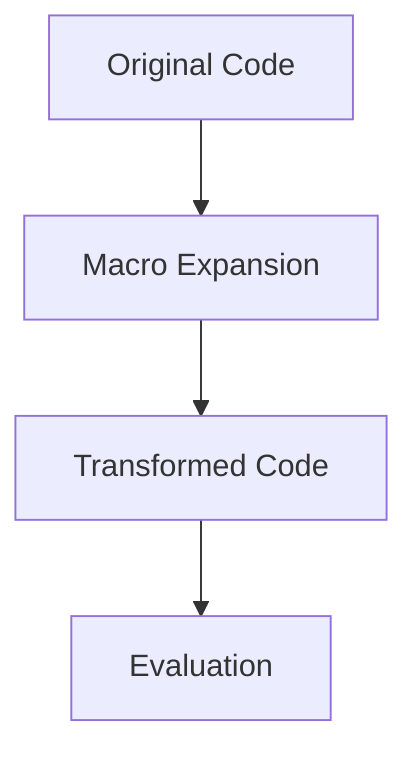

## 19.1. Introduction to Macros in Clojure

Welcome to the fascinating world of Clojure macros, where code becomes data and data becomes code. In this section, we will delve into the concept of macros in Clojure, exploring their purpose, power, and how they enable metaprogramming by allowing developers to manipulate code as data. Whether you're new to Clojure or an experienced developer looking to deepen your understanding, this guide will provide you with the knowledge and tools to harness the full potential of macros in your Clojure projects.

### What Are Macros?

Macros in Clojure are a powerful feature that allows you to extend the language by writing code that generates code. Unlike functions, which operate on values, macros operate on the code itself, transforming it before it is evaluated. This capability makes macros an essential tool for metaprogramming, enabling developers to create domain-specific languages, simplify complex code patterns, and introduce new syntactic constructs.

### The Power of Code-as-Data: Homoiconicity

One of the key concepts that empower macros in Clojure is **homoiconicity**. Homoiconicity means that the code is represented as data structures that the language itself can manipulate. In Clojure, code is written in the form of lists, vectors, maps, and other data structures, which makes it easy to manipulate and transform. This property allows macros to treat code as data, enabling powerful transformations and code generation.

### Macros vs. Functions: Understanding the Difference

While both macros and functions are used to encapsulate reusable code, they serve different purposes and operate at different stages of code execution. Here are some key differences:

- **Stage of Execution**: Functions are evaluated at runtime, while macros are expanded at compile time. This means that macros can transform the code before it is executed, allowing for more flexible and powerful code generation.
- **Input and Output**: Functions take values as input and return values as output. Macros, on the other hand, take code as input and return transformed code as output.
- **Use Cases**: Functions are used for computation and data manipulation, while macros are used for code transformation and metaprogramming.

### Simple Examples of Macro Usage

Let's start with a simple example to illustrate how macros work in Clojure. Consider a scenario where you want to create a custom `unless` construct, similar to an `if` statement but with inverted logic.

```clojure
(defmacro unless [condition then-branch else-branch]
  `(if (not ~condition)
     ~then-branch
     ~else-branch))

;; Usage
(unless false
  (println "This will be printed")
  (println "This will not be printed"))
```

In this example, the `unless` macro takes a condition and two branches of code. It transforms the code into an `if` statement with the condition negated. The backtick (`) is used to quote the expression, and the tilde (`~`) is used to unquote parts of the expression that should be evaluated.

### Visualizing Macro Expansion

To better understand how macros work, let's visualize the macro expansion process. The following diagram illustrates the transformation of code during macro expansion:



In this diagram, the original code is transformed by the macro expansion process into new code, which is then evaluated. This transformation allows macros to introduce new syntactic constructs and perform complex code manipulations.

### Key Considerations When Using Macros

While macros are powerful, they should be used judiciously. Here are some best practices and considerations when working with macros:

- **Avoid Overuse**: Macros can make code harder to read and debug. Use them only when necessary and when they provide a clear benefit.
- **Maintain Macro Hygiene**: Ensure that macros do not inadvertently capture or shadow variables from the surrounding code. Use `gensym` to generate unique symbols when necessary.
- **Test Thoroughly**: Since macros transform code, they can introduce subtle bugs. Test macros thoroughly to ensure they behave as expected.

### Try It Yourself: Experimenting with Macros

To deepen your understanding of macros, try modifying the `unless` macro to add logging functionality. For example, you could log the condition and branches before executing them. Experiment with different transformations and see how they affect the generated code.

### Further Reading and Resources

For more information on macros and metaprogramming in Clojure, consider exploring the following resources:

- [Clojure Official Documentation](https://clojure.org/reference/macros)
- [Clojure Programming by Chas Emerick, Brian Carper, and Christophe Grand](https://www.oreilly.com/library/view/clojure-programming/9781449310387/)
- [Clojure for the Brave and True by Daniel Higginbotham](https://www.braveclojure.com/)

### Summary

In this section, we've introduced the concept of macros in Clojure, exploring their purpose, power, and how they enable metaprogramming. We've discussed the key differences between macros and functions, provided simple examples of macro usage, and highlighted best practices for working with macros. Remember, macros are a powerful tool in your Clojure toolkit, but they should be used judiciously to maintain code clarity and readability.

## **Ready to Test Your Knowledge?**



### What is the primary purpose of macros in Clojure?

- [x] To transform code before it is evaluated
- [ ] To perform runtime computations
- [ ] To manage state in Clojure applications
- [ ] To handle exceptions in Clojure

> **Explanation:** Macros in Clojure are used to transform code before it is evaluated, allowing for metaprogramming and code generation.

### What is homoiconicity in Clojure?

- [x] The property that code is represented as data structures
- [ ] The ability to execute code in parallel
- [ ] The use of immutable data structures
- [ ] The support for first-class functions

> **Explanation:** Homoiconicity means that code is represented as data structures, allowing macros to manipulate code as data.

### How do macros differ from functions in Clojure?

- [x] Macros operate on code, while functions operate on values
- [ ] Macros are evaluated at runtime, while functions are evaluated at compile time
- [ ] Macros are used for data manipulation, while functions are used for code transformation
- [ ] Macros are a type of function in Clojure

> **Explanation:** Macros operate on code and transform it before evaluation, while functions operate on values at runtime.

### What is a key consideration when using macros in Clojure?

- [x] Avoid overuse to maintain code readability
- [ ] Use macros for all code transformations
- [ ] Always use macros instead of functions
- [ ] Avoid using macros for metaprogramming

> **Explanation:** Macros should be used judiciously to maintain code readability and avoid making code harder to debug.

### What is the role of the backtick (`) in macro definitions?

- [x] To quote the expression for macro expansion
- [ ] To unquote parts of the expression
- [ ] To define a function in Clojure
- [ ] To create a new namespace

> **Explanation:** The backtick is used to quote the expression in macro definitions, allowing for macro expansion.

### What is the purpose of `gensym` in macro definitions?

- [x] To generate unique symbols and avoid variable capture
- [ ] To define a new macro in Clojure
- [ ] To perform arithmetic operations
- [ ] To create a new data structure

> **Explanation:** `gensym` is used to generate unique symbols in macro definitions to avoid variable capture and shadowing.

### How can you test macros effectively in Clojure?

- [x] By thoroughly testing the transformed code
- [ ] By using macros only in small projects
- [ ] By avoiding the use of macros in production code
- [ ] By using macros only for simple transformations

> **Explanation:** Thorough testing of the transformed code is essential to ensure that macros behave as expected.

### What is a potential risk of using macros in Clojure?

- [x] Making code harder to read and debug
- [ ] Increasing runtime performance
- [ ] Reducing code flexibility
- [ ] Limiting the use of functions

> **Explanation:** Macros can make code harder to read and debug, so they should be used carefully.

### What is the output of the following macro usage?

```clojure
(unless true
  (println "This will not be printed")
  (println "This will be printed"))
```

- [x] This will be printed
- [ ] This will not be printed
- [ ] Both statements will be printed
- [ ] Neither statement will be printed

> **Explanation:** The `unless` macro negates the condition, so the second branch is executed.

### True or False: Macros in Clojure are evaluated at runtime.

- [ ] True
- [x] False

> **Explanation:** Macros are expanded at compile time, transforming code before it is evaluated at runtime.


