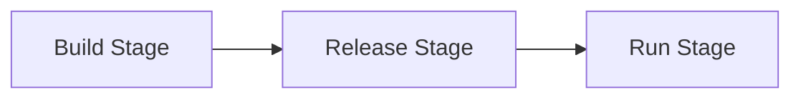

## 19.1 Twelve-Factor App Principles in Clojure

The Twelve-Factor App methodology provides a set of best practices for building scalable, maintainable, and cloud-native applications. These principles are particularly relevant in the context of Clojure, a language known for its simplicity, immutability, and functional programming paradigms. In this section, we will explore how to apply each of the twelve factors using Clojure, leveraging its features and ecosystem to create robust applications.

### Codebase Management

A twelve-factor app is always tracked in a version control system like Git, with a single codebase that can be deployed in multiple environments.

- **Single Codebase:** Maintain a single codebase per application, tracked in version control, with multiple deploys (e.g., production, staging).
- **Logical Organization:** Use Clojure's namespace system to organize code logically, separating concerns into distinct modules.

```clojure
(ns myapp.core
  (:require [myapp.db :as db]
            [myapp.web :as web]))

(defn start-app []
  (db/connect)
  (web/start-server))
```

### Dependencies Declaration

Explicitly declare all dependencies to ensure consistency across environments.

- **Dependency Management:** Use `deps.edn` or `project.clj` to declare dependencies, avoiding reliance on system-wide packages.

```clojure
;; deps.edn
{:deps {org.clojure/clojure {:mvn/version "1.10.3"}
        ring/ring-core {:mvn/version "1.9.0"}}}
```

- **Tools:** Utilize tools like Leiningen or Clojure CLI to manage dependencies effectively.

### Config Management

Store configuration in the environment, not in code, to separate config from code.

- **Environment Variables:** Use environment variables or libraries like `environ` to manage configuration settings.

```clojure
;; Using environ
(require '[environ.core :refer [env]])

(def db-url (env :database-url))
```

- **Security:** Ensure secrets and credentials are not hard-coded or checked into version control.

### Backing Services as Attached Resources

Treat backing services as attached resources, accessed via configuration.

- **Configuration Access:** Use configuration to access databases, message queues, etc., allowing for easy swapping without code changes.

```clojure
(defn connect-to-db []
  (let [db-url (env :database-url)]
    (jdbc/get-connection db-url)))
```

### Build, Release, Run Separation

Separate the build, release, and run stages to streamline deployment.

- **CI/CD Pipelines:** Implement continuous integration and deployment pipelines to automate these stages.



### Stateless Processes

Design applications to be stateless, with any persistent data stored in backing services.

- **State Management:** Avoid storing session data on the server; use external stores like Redis if necessary.

```clojure
;; Example of using Redis for session storage
(require '[carmine :as redis])

(defn store-session [session-id data]
  (redis/wcar {} (redis/set session-id data)))
```

### Port Binding

Export services via port binding, allowing the app to be self-contained.

- **Embedded Servers:** Use embedded servers like Jetty or HTTP Kit to handle HTTP requests.

```clojure
(require '[org.httpkit.server :refer [run-server]])

(defn start-server []
  (run-server handler {:port (Integer. (env :port))}))
```

### Concurrency

Scale applications by running multiple instances rather than relying on threading.

- **Concurrency Handling:** Ensure the application can handle concurrent requests without shared mutable state.

```clojure
;; Example of using core.async for concurrency
(require '[clojure.core.async :refer [go chan >! <!]])

(defn process-request [request]
  (go
    (let [response (<! (handle-request request))]
      (deliver-response response))))
```

### Disposability

Maximize robustness with fast startup and graceful shutdown.

- **Graceful Termination:** Handle signals for graceful termination and clean up resources during shutdown.

```clojure
(defn shutdown []
  (println "Shutting down...")
  ;; Clean up resources
  )

(.addShutdownHook (Runtime/getRuntime) (Thread. shutdown))
```

### Dev/Prod Parity

Keep development, staging, and production environments as similar as possible.

- **Environment Consistency:** Use Docker to standardize environments across all stages.

```dockerfile
FROM clojure:openjdk-11
COPY . /app
WORKDIR /app
RUN lein uberjar
CMD ["java", "-jar", "target/myapp.jar"]
```

### Logs as Event Streams

Treat logs as event streams, outputting to STDOUT/STDERR for collection.

- **Log Management:** Avoid managing log files within the application; let the platform handle log aggregation.

```clojure
(require '[clojure.tools.logging :as log])

(log/info "Application started")
```

### Admin Processes

Run admin or management tasks as one-off processes using the same codebase.

- **REPL-Driven Development:** Use the REPL for tasks like database migrations or data fixes.

```clojure
;; Example of a one-off admin task
(defn migrate-db []
  (println "Running database migrations..."))
```

### Advantages and Disadvantages

**Advantages:**
- **Scalability:** Facilitates scaling applications across multiple environments.
- **Maintainability:** Promotes clean code organization and separation of concerns.
- **Flexibility:** Allows easy swapping of backing services and configuration changes.

**Disadvantages:**
- **Complexity:** Requires careful management of environment variables and configuration.
- **Learning Curve:** May have a steep learning curve for developers new to cloud-native practices.

### Best Practices

- **Version Control:** Always use version control for codebase management.
- **Environment Variables:** Use environment variables for configuration to ensure flexibility and security.
- **CI/CD:** Implement CI/CD pipelines for automated deployment.
- **Docker:** Use Docker to ensure consistency across environments.

### Conclusion

The Twelve-Factor App methodology provides a robust framework for building cloud-native applications in Clojure. By adhering to these principles, developers can create scalable, maintainable, and flexible applications that are well-suited for modern cloud environments. Embracing these practices not only enhances the development process but also ensures that applications are resilient and adaptable to changing requirements.

## Quiz Time!



### What is the primary purpose of the Twelve-Factor App methodology?

- [x] To provide best practices for building scalable and maintainable cloud-native applications.
- [ ] To enforce strict coding standards.
- [ ] To optimize application performance.
- [ ] To simplify database management.

> **Explanation:** The Twelve-Factor App methodology is designed to offer best practices for developing scalable, maintainable, and cloud-native applications.

### How should dependencies be managed in a Twelve-Factor App using Clojure?

- [x] By declaring them in `deps.edn` or `project.clj`.
- [ ] By installing them system-wide.
- [ ] By hardcoding them in the application code.
- [ ] By using environment variables.

> **Explanation:** Dependencies should be explicitly declared in `deps.edn` or `project.clj` to ensure consistency across environments.

### What is the recommended way to handle configuration in a Twelve-Factor App?

- [x] Store configuration in environment variables.
- [ ] Hardcode configuration in the application code.
- [ ] Use a configuration file checked into version control.
- [ ] Store configuration in a database.

> **Explanation:** Configuration should be stored in environment variables to separate it from the code and allow for flexibility.

### Which of the following is a key characteristic of stateless processes in a Twelve-Factor App?

- [x] They do not store session data on the server.
- [ ] They rely on system-wide state management.
- [ ] They use shared mutable state for efficiency.
- [ ] They require manual scaling.

> **Explanation:** Stateless processes do not store session data on the server, ensuring that any persistent data is stored in backing services.

### How should logs be treated in a Twelve-Factor App?

- [x] As event streams output to STDOUT/STDERR.
- [ ] As files managed by the application.
- [ ] As database entries.
- [ ] As in-memory data structures.

> **Explanation:** Logs should be treated as event streams and output to STDOUT/STDERR for collection by the execution environment.

### What is the benefit of using Docker in a Twelve-Factor App?

- [x] It standardizes the environment across development, staging, and production.
- [ ] It increases application performance.
- [ ] It simplifies codebase management.
- [ ] It enhances security by default.

> **Explanation:** Docker helps standardize the environment across different stages, ensuring consistency and reducing environment-specific issues.

### What is the purpose of separating build, release, and run stages in a Twelve-Factor App?

- [x] To streamline deployment and ensure consistency.
- [ ] To increase application performance.
- [ ] To simplify codebase management.
- [ ] To enhance security.

> **Explanation:** Separating these stages helps streamline deployment processes and ensures consistency across different environments.

### How should admin processes be run in a Twelve-Factor App?

- [x] As one-off processes using the same codebase and configuration.
- [ ] As part of the main application process.
- [ ] As separate applications with different configurations.
- [ ] As background services.

> **Explanation:** Admin processes should be run as one-off processes using the same codebase and configuration to maintain consistency.

### What is a disadvantage of the Twelve-Factor App methodology?

- [x] It requires careful management of environment variables and configuration.
- [ ] It limits application scalability.
- [ ] It enforces strict coding standards.
- [ ] It simplifies database management.

> **Explanation:** Managing environment variables and configuration can add complexity, which is a potential disadvantage of the Twelve-Factor App methodology.

### True or False: The Twelve-Factor App methodology is only applicable to web applications.

- [ ] True
- [x] False

> **Explanation:** The Twelve-Factor App methodology is applicable to any type of application, not just web applications, as it provides general best practices for cloud-native development.


