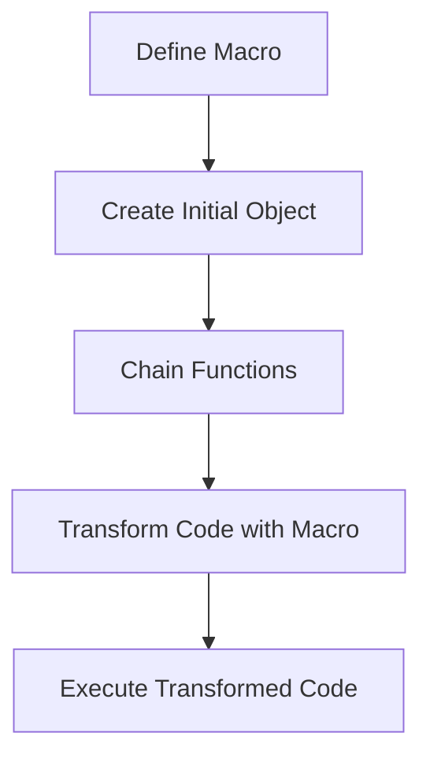

## 19.10. Building Fluent Interfaces with Macros

### Introduction

In the world of software development, **fluent interfaces** have emerged as a powerful design pattern that enhances code readability and expressiveness. By allowing method chaining and domain-specific expressions, fluent interfaces enable developers to write code that reads almost like natural language. In Clojure, the use of **macros** provides a unique opportunity to create these interfaces, leveraging the language's metaprogramming capabilities to transform code into more intuitive and expressive forms.

In this section, we will delve into the concept of fluent interfaces, explore how macros can be used to implement them in Clojure, and provide practical examples to illustrate their benefits. We will also discuss the trade-offs and best practices to consider when building fluent interfaces with macros.

### Understanding Fluent Interfaces

#### Definition and Benefits

A fluent interface is a design pattern that allows for the chaining of method calls, resulting in code that is more readable and expressive. This pattern is particularly useful in creating domain-specific languages (DSLs) where the code closely resembles human language, making it easier to understand and maintain.

**Benefits of Fluent Interfaces:**

- **Readability**: Code written with fluent interfaces is often more readable and easier to understand, as it mimics natural language.
- **Expressiveness**: Fluent interfaces allow for concise and expressive code, reducing boilerplate and enhancing clarity.
- **Chaining**: Method chaining enables the execution of multiple operations in a single, fluid expression.

#### Example of a Fluent Interface

Consider a simple example of a fluent interface for building a query:

```clojure
(query-builder)
  .select("name", "age")
  .from("users")
  .where("age > 18")
  .orderBy("name")
  .execute()
```

This example illustrates how a fluent interface can make code more intuitive and readable by chaining method calls.

### Leveraging Macros for Fluent Interfaces in Clojure

#### Introduction to Macros

In Clojure, macros are a powerful tool that allows developers to perform metaprogramming—writing code that writes code. Macros operate at the syntactic level, transforming code before it is evaluated. This capability makes them ideal for creating fluent interfaces, as they can manipulate and transform code to achieve the desired expressiveness.

#### Enabling Method Chaining with Macros

To implement method chaining in Clojure, we can use macros to transform a series of function calls into a single, cohesive expression. Let's explore how this can be achieved with a practical example.

#### Example: Building a Fluent API with Macros

Suppose we want to create a fluent interface for configuring a web server. We can use macros to enable method chaining and create a more expressive API.

```clojure
(defmacro ->server
  [& body]
  `(-> (create-server)
       ~@body))

(defn create-server []
  {:host "localhost"
   :port 8080})

(defn set-host [server host]
  (assoc server :host host))

(defn set-port [server port]
  (assoc server :port port))

(defn start-server [server]
  (println "Starting server on" (:host server) "port" (:port server))
  server)

;; Usage
(->server
  (set-host "127.0.0.1")
  (set-port 3000)
  start-server)
```

**Explanation:**

- The `->server` macro uses the threading macro `->` to chain function calls.
- The `create-server` function initializes the server configuration.
- The `set-host` and `set-port` functions update the server configuration.
- The `start-server` function starts the server with the configured settings.

This example demonstrates how macros can be used to create a fluent interface that allows for method chaining, resulting in more readable and expressive code.

### Trade-offs and Best Practices

#### Trade-offs

While fluent interfaces offer significant benefits, there are trade-offs to consider:

- **Complexity**: Implementing fluent interfaces with macros can introduce complexity, especially for developers unfamiliar with macros.
- **Debugging**: Debugging macro-generated code can be challenging, as the transformation process can obscure the original code.
- **Performance**: Macros can impact performance if not used judiciously, as they introduce additional layers of abstraction.

#### Best Practices

To effectively use macros for building fluent interfaces, consider the following best practices:

- **Keep It Simple**: Avoid overcomplicating macros. Aim for simplicity and clarity in your macro definitions.
- **Document Macros**: Provide clear documentation for macros, including usage examples and explanations of their behavior.
- **Test Thoroughly**: Test macro-generated code thoroughly to ensure correctness and performance.
- **Use Macros Judiciously**: Use macros only when necessary. Consider alternative approaches if macros introduce unnecessary complexity.

### Visualizing Fluent Interfaces with Macros

To better understand the flow of creating fluent interfaces with macros, let's visualize the process using a flowchart.



**Description**: This flowchart illustrates the process of creating fluent interfaces with macros. It begins with defining a macro, creating an initial object, chaining functions, transforming code with the macro, and executing the transformed code.

### Try It Yourself

Now that we've explored the concept of fluent interfaces and how to implement them with macros, it's time to experiment with the code. Try modifying the example to add additional configuration options for the server, such as setting a timeout or enabling SSL. This exercise will help reinforce your understanding of fluent interfaces and macros in Clojure.

### References and Further Reading

- [Clojure Macros](https://clojure.org/reference/macros)
- [Fluent Interface Pattern](https://martinfowler.com/bliki/FluentInterface.html)
- [Metaprogramming in Clojure](https://clojure.org/guides/macros)

### Knowledge Check

To reinforce your understanding of fluent interfaces and macros, let's test your knowledge with a quiz.

## **Ready to Test Your Knowledge?**



### What is a fluent interface?

- [x] A design pattern that allows for method chaining and enhances code readability.
- [ ] A type of user interface for web applications.
- [ ] A database query language.
- [ ] A Clojure library for data processing.

> **Explanation:** A fluent interface is a design pattern that allows for method chaining, making code more readable and expressive.

### What is the primary benefit of using macros in Clojure?

- [x] They allow for metaprogramming, enabling code transformation before evaluation.
- [ ] They improve runtime performance.
- [ ] They simplify error handling.
- [ ] They provide built-in security features.

> **Explanation:** Macros in Clojure enable metaprogramming, allowing developers to transform code before it is evaluated.

### How do macros enhance fluent interfaces in Clojure?

- [x] By enabling method chaining and transforming code into more expressive forms.
- [ ] By providing built-in error handling.
- [ ] By improving database connectivity.
- [ ] By simplifying user interface design.

> **Explanation:** Macros enhance fluent interfaces by enabling method chaining and transforming code into more expressive forms.

### What is a potential trade-off of using macros for fluent interfaces?

- [x] Increased complexity and potential debugging challenges.
- [ ] Improved performance and simplicity.
- [ ] Enhanced security features.
- [ ] Reduced code readability.

> **Explanation:** Using macros for fluent interfaces can increase complexity and make debugging more challenging.

### What is the purpose of the `->server` macro in the example?

- [x] To enable method chaining for configuring a web server.
- [ ] To improve database query performance.
- [ ] To simplify error handling in web applications.
- [ ] To enhance user interface design.

> **Explanation:** The `->server` macro enables method chaining for configuring a web server, making the code more readable and expressive.

### What is a best practice when using macros for fluent interfaces?

- [x] Keep macros simple and provide clear documentation.
- [ ] Use macros for all code transformations.
- [ ] Avoid testing macro-generated code.
- [ ] Focus on performance over readability.

> **Explanation:** Keeping macros simple and providing clear documentation are best practices when using macros for fluent interfaces.

### What is the role of the `create-server` function in the example?

- [x] To initialize the server configuration.
- [ ] To start the server.
- [ ] To handle errors in server configuration.
- [ ] To improve server performance.

> **Explanation:** The `create-server` function initializes the server configuration, setting default values for host and port.

### How can you test macro-generated code effectively?

- [x] By writing thorough tests to ensure correctness and performance.
- [ ] By avoiding testing and focusing on performance.
- [ ] By using macros for all code transformations.
- [ ] By simplifying the code to avoid errors.

> **Explanation:** Writing thorough tests is essential to ensure the correctness and performance of macro-generated code.

### What is a key consideration when using macros in Clojure?

- [x] Use them judiciously to avoid unnecessary complexity.
- [ ] Use them for all code transformations.
- [ ] Avoid documenting macro behavior.
- [ ] Focus on performance over readability.

> **Explanation:** Using macros judiciously helps avoid unnecessary complexity and maintain code readability.

### True or False: Fluent interfaces are only useful for web development.

- [ ] True
- [x] False

> **Explanation:** Fluent interfaces are useful in various domains, not just web development, as they enhance code readability and expressiveness.



Remember, this is just the beginning. As you progress, you'll build more complex and expressive fluent interfaces using macros in Clojure. Keep experimenting, stay curious, and enjoy the journey!
