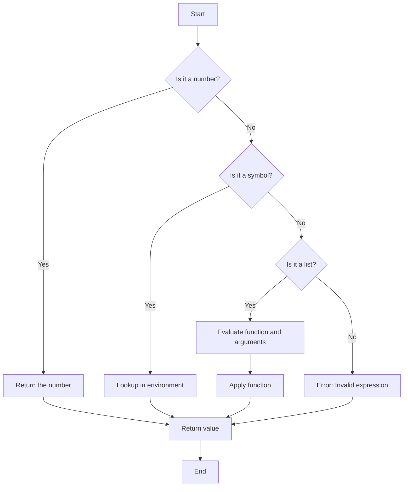

## 19.11. Meta-Circular Evaluators

### Introduction to Meta-Circular Evaluators

Meta-circular evaluators are a fascinating concept in the world of programming languages, particularly within the Lisp family, to which Clojure belongs. A meta-circular evaluator is an interpreter for a programming language that is written in the same language it interprets. This self-referential nature allows for a deep understanding of the language's semantics and provides a powerful tool for exploring language features and extensions.

### What is a Meta-Circular Evaluator?

A meta-circular evaluator is essentially a self-interpreter. It is a program that can interpret or execute code written in the same language as itself. This concept is deeply rooted in the Lisp tradition, where the language's simplicity and uniform syntax make it particularly amenable to self-interpretation.

**Significance in Lisp Languages**

In Lisp languages, the meta-circular evaluator serves as a pedagogical tool and a foundation for understanding the language's semantics. It provides insights into how the language processes expressions, manages environments, and applies functions. By studying a meta-circular evaluator, developers can gain a deeper understanding of the language's core principles and design.

### The Role of Meta-Circular Evaluators in Clojure

Clojure, as a modern Lisp dialect, inherits the tradition of meta-circular evaluation. While Clojure itself does not include a built-in meta-circular evaluator, understanding the concept is crucial for grasping the language's evaluation model and its powerful macro system.

#### Clojure's Evaluation Model

Clojure's evaluation model is based on the principles of functional programming and immutability. It emphasizes the use of pure functions, immutable data structures, and a powerful macro system for metaprogramming. The evaluation process in Clojure involves reading expressions, evaluating them, and producing results. This process is similar to other Lisp languages, where the code is treated as data and can be manipulated programmatically.

### How Macros Interact with the Evaluator

Macros are a key feature of Clojure and other Lisp languages, allowing developers to extend the language's syntax and introduce new constructs. They operate at the syntactic level, transforming code before it is evaluated. This transformation process is closely related to the concept of meta-circular evaluation, as macros can be seen as a form of self-interpretation.

#### Understanding Macros in Clojure

Macros in Clojure are functions that take code as input and produce transformed code as output. They are executed at compile time, allowing developers to define new syntactic constructs and control the evaluation process. This capability makes macros a powerful tool for metaprogramming, enabling the creation of domain-specific languages and custom control structures.

### Theoretical Underpinnings of Clojure's Evaluation Model

Clojure's evaluation model is grounded in the principles of functional programming and the Lisp tradition. It emphasizes immutability, first-class functions, and a powerful macro system. The meta-circular evaluator concept provides a theoretical framework for understanding these principles and their implementation in Clojure.

#### Key Concepts in Clojure's Evaluation Model

1. **Immutability**: Clojure's data structures are immutable by default, ensuring that functions do not have side effects and enabling safe concurrent programming.

2. **First-Class Functions**: Functions in Clojure are first-class citizens, meaning they can be passed as arguments, returned from other functions, and stored in data structures.

3. **Macros**: Macros allow developers to extend the language's syntax and introduce new constructs, providing a powerful tool for metaprogramming.

4. **Homoiconicity**: Clojure, like other Lisp languages, is homoiconic, meaning that code and data share the same structure. This property enables powerful metaprogramming capabilities, as code can be manipulated as data.

### Building a Simple Meta-Circular Evaluator in Clojure

To illustrate the concept of a meta-circular evaluator, let's build a simple interpreter for a subset of Clojure. This interpreter will demonstrate the basic principles of evaluation and provide insights into how Clojure processes expressions.

```clojure
;; Define a simple environment for variable bindings
(defn make-env [bindings]
  (atom bindings))

;; Lookup a variable in the environment
(defn lookup [env var]
  (get @env var))

;; Extend the environment with a new binding
(defn extend-env [env var value]
  (swap! env assoc var value))

;; Evaluate a simple expression
(defn eval-expr [expr env]
  (cond
    ;; If the expression is a number, return it as is
    (number? expr) expr

    ;; If the expression is a symbol, look it up in the environment
    (symbol? expr) (lookup env expr)

    ;; If the expression is a list, evaluate it as a function application
    (list? expr)
    (let [[fn & args] expr
          fn-value (eval-expr fn env)
          arg-values (map #(eval-expr % env) args)]
      (apply fn-value arg-values))))

;; Example usage
(let [env (make-env {'x 10 'y 20})]
  (extend-env env 'add +)
  (println (eval-expr '(add x y) env))) ;; Output: 30
```

**Explanation of the Code**

- **Environment**: We define a simple environment using an atom to store variable bindings. The `make-env`, `lookup`, and `extend-env` functions manage this environment.

- **Expression Evaluation**: The `eval-expr` function evaluates expressions based on their type. It handles numbers, symbols, and lists, demonstrating the basic principles of evaluation.

- **Function Application**: When evaluating a list, the first element is treated as a function, and the remaining elements are evaluated as arguments. The function is then applied to the arguments.

### Visualizing the Evaluation Process

To better understand the evaluation process, let's visualize it using a flowchart. This diagram illustrates the steps involved in evaluating an expression in our simple meta-circular evaluator.



**Description of the Diagram**

- **Start**: The evaluation process begins with an expression.

- **Number Check**: If the expression is a number, it is returned as is.

- **Symbol Check**: If the expression is a symbol, it is looked up in the environment.

- **List Check**: If the expression is a list, it is evaluated as a function application.

- **Function Application**: The function and its arguments are evaluated, and the function is applied to the arguments.

- **End**: The evaluation process concludes with the result of the expression.

### Try It Yourself

Experiment with the simple meta-circular evaluator by modifying the code. Here are some suggestions:

- **Add Support for Additional Data Types**: Extend the evaluator to handle strings, booleans, and other data types.

- **Implement Additional Functions**: Add support for more built-in functions, such as subtraction, multiplication, and division.

- **Introduce Conditionals**: Implement support for conditional expressions, such as `if` statements.

### References and Further Reading

- [Structure and Interpretation of Computer Programs](https://mitpress.mit.edu/sites/default/files/sicp/full-text/book/book.html) - A classic text on programming languages and meta-circular evaluators.
- [Clojure Documentation](https://clojure.org/reference/documentation) - Official documentation for Clojure, including information on macros and evaluation.
- [Lisp in Small Pieces](https://www.amazon.com/Lisp-Small-Pieces-Christian-Queinnec/dp/0521545668) - A comprehensive book on Lisp interpreters and meta-circular evaluation.

### Knowledge Check

To reinforce your understanding of meta-circular evaluators and their role in Clojure, let's explore some questions and challenges.

## **Ready to Test Your Knowledge?**



### What is a meta-circular evaluator?

- [x] An interpreter written in the same language it interprets
- [ ] A compiler for a different language
- [ ] A tool for optimizing code
- [ ] A debugger for finding errors

> **Explanation:** A meta-circular evaluator is an interpreter written in the same language it interprets, allowing for self-referential evaluation.

### How do macros interact with the evaluator in Clojure?

- [x] They transform code before it is evaluated
- [ ] They execute code at runtime
- [ ] They optimize code for performance
- [ ] They provide debugging information

> **Explanation:** Macros in Clojure transform code before it is evaluated, allowing for syntactic extensions and custom constructs.

### What is the significance of homoiconicity in Clojure?

- [x] It allows code to be manipulated as data
- [ ] It improves performance
- [ ] It simplifies error handling
- [ ] It enhances security

> **Explanation:** Homoiconicity means that code and data share the same structure, enabling powerful metaprogramming capabilities.

### Which of the following is a key feature of Clojure's evaluation model?

- [x] Immutability
- [ ] Mutable state
- [ ] Object-oriented programming
- [ ] Static typing

> **Explanation:** Clojure's evaluation model emphasizes immutability, ensuring that data structures are immutable by default.

### What is the role of the environment in a meta-circular evaluator?

- [x] It stores variable bindings
- [ ] It optimizes code execution
- [ ] It provides debugging information
- [ ] It manages memory allocation

> **Explanation:** The environment in a meta-circular evaluator stores variable bindings, allowing for variable lookup and extension.

### How can you extend a simple meta-circular evaluator?

- [x] By adding support for additional data types
- [ ] By removing built-in functions
- [ ] By disabling macros
- [ ] By optimizing for performance

> **Explanation:** You can extend a simple meta-circular evaluator by adding support for additional data types and functions.

### What is the purpose of the `eval-expr` function in the example code?

- [x] To evaluate expressions based on their type
- [ ] To optimize code for performance
- [ ] To provide debugging information
- [ ] To manage memory allocation

> **Explanation:** The `eval-expr` function evaluates expressions based on their type, handling numbers, symbols, and lists.

### Which of the following is a benefit of using a meta-circular evaluator?

- [x] It provides insights into the language's semantics
- [ ] It improves code performance
- [ ] It simplifies error handling
- [ ] It enhances security

> **Explanation:** A meta-circular evaluator provides insights into the language's semantics, helping developers understand its core principles.

### What is the output of the example code when evaluating `(add x y)`?

- [x] 30
- [ ] 10
- [ ] 20
- [ ] 0

> **Explanation:** The example code evaluates `(add x y)` to 30, as `x` is 10 and `y` is 20 in the environment.

### True or False: Clojure includes a built-in meta-circular evaluator.

- [ ] True
- [x] False

> **Explanation:** False. Clojure does not include a built-in meta-circular evaluator, but understanding the concept is crucial for grasping the language's evaluation model.



### Conclusion

Meta-circular evaluators offer a unique perspective on programming languages, particularly in the Lisp family. By exploring the concept of meta-circular evaluation in Clojure, we gain insights into the language's evaluation model, macro system, and core principles. As you continue your journey with Clojure, remember that understanding these foundational concepts will empower you to harness the full potential of the language. Keep experimenting, stay curious, and enjoy the journey!
