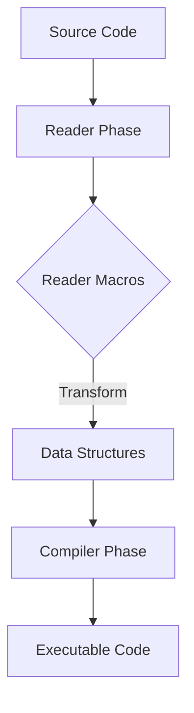

## 19.12. Reader Macros and Custom Syntax

### Introduction

In the world of Clojure, metaprogramming is a powerful tool that allows developers to write code that writes code. One of the lesser-known but equally powerful aspects of Clojure's metaprogramming capabilities is the use of reader macros. Reader macros operate at the parsing level, allowing for custom syntax and transformations before the code is even compiled. This section will delve into what reader macros are, how they differ from regular macros, and how they can be used to modify the reading of code.

### What Are Reader Macros?

Reader macros in Clojure are a mechanism for extending the syntax of the language at the reader level. The reader is the part of the Clojure compiler that parses the text of your code into data structures. Reader macros allow you to define custom syntax that the reader will recognize and transform into Clojure data structures before the code is evaluated.

#### Key Differences from Regular Macros

- **Level of Operation**: Reader macros operate at the parsing level, transforming text into data structures. Regular macros, on the other hand, operate at the code level, transforming data structures into other data structures.
- **Timing**: Reader macros are applied before the code is compiled, during the reading phase. Regular macros are applied during the macro expansion phase, after the code has been read.
- **Purpose**: Reader macros are used to introduce new syntactic constructs, while regular macros are used to introduce new semantic constructs.

### Built-in Reader Macros

Clojure comes with several built-in reader macros that provide syntactic sugar for common operations. Understanding these built-in reader macros is crucial for leveraging Clojure's full potential.

#### Quoting with `'`

The single quote (`'`) is a reader macro used for quoting expressions. Quoting prevents the evaluation of an expression, returning it as a data structure instead.

```clojure
;; Example of quoting
(def my-list '(1 2 3))
;; my-list is now a list containing the numbers 1, 2, and 3
```

#### Syntax-Quote with `` ` ``

The syntax-quote (`` ` ``) is a more powerful form of quoting that allows for unquoting and splicing. It is used in macro definitions to construct code templates.

```clojure
;; Example of syntax-quote
(defmacro example-macro [x]
  `(println "The value is" ~x))

(example-macro 42)
;; Output: The value is 42
```

#### Unquote with `~` and Unquote-Splicing with `~@`

Within a syntax-quoted expression, you can use `~` to unquote an expression, allowing it to be evaluated. The `~@` is used for unquote-splicing, which evaluates a sequence and splices its elements into the surrounding context.

```clojure
;; Example of unquote and unquote-splicing
(defmacro listify [x]
  `(list ~@x))

(listify [1 2 3])
;; Returns: (1 2 3)
```

### Custom Reader Macros

While Clojure does not natively support user-defined reader macros, you can achieve similar functionality by using the `read` function and custom data readers. This allows you to define new syntax for your specific needs.

#### Creating a Custom Reader Macro

To create a custom reader macro, you need to define a data reader function and associate it with a tag. This is done using the `data_readers.clj` file or by setting the `*data-readers*` dynamic variable.

```clojure
;; Define a custom data reader
(defn my-custom-reader [value]
  (str "Custom: " value))

;; Associate the reader with a tag
(alter-var-root #'clojure.core/*data-readers*
  assoc 'my/custom my-custom-reader)

;; Use the custom reader
#my/custom "Hello"
;; Returns: "Custom: Hello"
```

### Caution: Complexity and Maintainability

While reader macros can be powerful, they also introduce complexity and can make code harder to read and maintain. It's important to use them judiciously and document their usage thoroughly. Overuse of custom syntax can lead to code that is difficult for others to understand, especially if they are not familiar with the custom syntax you've introduced.

### Examples of Reader Macro Usage

Let's explore some practical examples of how reader macros can be used to modify the reading of code.

#### Example 1: Custom Syntax for Units

Suppose you want to introduce custom syntax for representing units of measurement. You can define a reader macro that parses strings like `#unit "5kg"` into a map representing the value and unit.

```clojure
;; Define a custom reader for units
(defn unit-reader [value]
  (let [[_ num unit] (re-matches #"(\d+)(\w+)" value)]
    {:value (Integer. num) :unit unit}))

;; Associate the reader with a tag
(alter-var-root #'clojure.core/*data-readers*
  assoc 'unit unit-reader)

;; Use the custom unit syntax
#unit "5kg"
;; Returns: {:value 5, :unit "kg"}
```

#### Example 2: Embedding Domain-Specific Languages (DSLs)

Reader macros can be used to embed DSLs within Clojure code. For instance, you might define a custom syntax for SQL queries that gets transformed into Clojure data structures.

```clojure
;; Define a custom reader for SQL
(defn sql-reader [query]
  {:sql query})

;; Associate the reader with a tag
(alter-var-root #'clojure.core/*data-readers*
  assoc 'sql sql-reader)

;; Use the custom SQL syntax
#sql "SELECT * FROM users"
;; Returns: {:sql "SELECT * FROM users"}
```

### Visualizing Reader Macro Workflow

To better understand how reader macros work, let's visualize the workflow of code parsing and transformation using a diagram.



**Diagram Description**: This diagram illustrates the flow of code parsing and transformation in Clojure. The source code is first processed by the reader phase, where reader macros can transform the text into data structures. These data structures are then passed to the compiler phase, resulting in executable code.

### Knowledge Check

Before we conclude, let's pose a few questions to reinforce your understanding of reader macros.

1. What is the primary difference between reader macros and regular macros in Clojure?
2. How does the syntax-quote differ from a regular quote in Clojure?
3. Why should you be cautious when using custom reader macros?

### Try It Yourself

Now that you've learned about reader macros, try experimenting with them in your own Clojure projects. Here are a few ideas to get you started:

- Create a custom reader macro for a domain-specific language relevant to your work.
- Experiment with different ways to represent data using custom syntax.
- Share your custom reader macros with others and gather feedback on their usability.

### Conclusion

Reader macros are a powerful tool in Clojure's metaprogramming arsenal, allowing for custom syntax and transformations at the parsing level. While they can introduce complexity, they also offer a unique way to extend the language to fit your specific needs. As you continue your journey with Clojure, remember to use reader macros judiciously and always prioritize code readability and maintainability.

## **Ready to Test Your Knowledge?**



### What is the primary difference between reader macros and regular macros in Clojure?

- [x] Reader macros operate at the parsing level, while regular macros operate at the code level.
- [ ] Reader macros are faster than regular macros.
- [ ] Regular macros are used for syntax, while reader macros are used for semantics.
- [ ] Reader macros are applied after the code is compiled.

> **Explanation:** Reader macros transform text into data structures during the parsing phase, whereas regular macros transform data structures during the macro expansion phase.

### How does the syntax-quote differ from a regular quote in Clojure?

- [x] Syntax-quote allows for unquoting and splicing, while a regular quote does not.
- [ ] Syntax-quote is used for strings, while a regular quote is used for symbols.
- [ ] Regular quote is faster than syntax-quote.
- [ ] Syntax-quote is only used in ClojureScript.

> **Explanation:** Syntax-quote (`` ` ``) allows for unquoting (`~`) and unquote-splicing (`~@`), making it more powerful for constructing code templates.

### Why should you be cautious when using custom reader macros?

- [x] They can introduce complexity and make code harder to read and maintain.
- [ ] They are not supported in Clojure.
- [ ] They slow down the compilation process.
- [ ] They are only useful for advanced developers.

> **Explanation:** Custom reader macros can make code less readable and maintainable, especially for those unfamiliar with the custom syntax.

### What is the purpose of the `*data-readers*` dynamic variable in Clojure?

- [x] It associates custom reader functions with tags for custom syntax.
- [ ] It speeds up the reading process.
- [ ] It is used for debugging reader macros.
- [ ] It stores all built-in reader macros.

> **Explanation:** The `*data-readers*` variable is used to associate custom reader functions with specific tags, enabling custom syntax.

### Which of the following is a built-in reader macro in Clojure?

- [x] Quoting with `'`
- [ ] Looping with `for`
- [ ] Conditional with `if`
- [ ] Function definition with `defn`

> **Explanation:** Quoting with `'` is a built-in reader macro that prevents evaluation of an expression.

### What does the `#unit "5kg"` syntax represent in the custom reader macro example?

- [x] A map with a value and unit, e.g., `{:value 5, :unit "kg"}`
- [ ] A string with the text "5kg"
- [ ] A list with two elements: 5 and "kg"
- [ ] An integer with the value 5

> **Explanation:** The custom reader macro transforms the `#unit "5kg"` syntax into a map representing the value and unit.

### How can you define a custom reader macro in Clojure?

- [x] By defining a data reader function and associating it with a tag using `*data-readers*`.
- [ ] By using the `defmacro` keyword.
- [ ] By creating a new namespace.
- [ ] By modifying the Clojure compiler.

> **Explanation:** Custom reader macros are defined by creating a data reader function and associating it with a tag using the `*data-readers*` variable.

### What is the role of the reader phase in Clojure's compilation process?

- [x] To parse text into data structures.
- [ ] To execute the code.
- [ ] To optimize the code for performance.
- [ ] To generate bytecode.

> **Explanation:** The reader phase parses the text of the code into data structures, which are then passed to the compiler phase.

### Can reader macros be used to embed domain-specific languages (DSLs) in Clojure?

- [x] True
- [ ] False

> **Explanation:** Reader macros can be used to embed DSLs by defining custom syntax that gets transformed into Clojure data structures.

### What should be prioritized when using reader macros in Clojure?

- [x] Code readability and maintainability.
- [ ] Execution speed.
- [ ] Minimizing code size.
- [ ] Using as many custom syntaxes as possible.

> **Explanation:** When using reader macros, it's important to prioritize code readability and maintainability to ensure that the code remains understandable and easy to work with.


