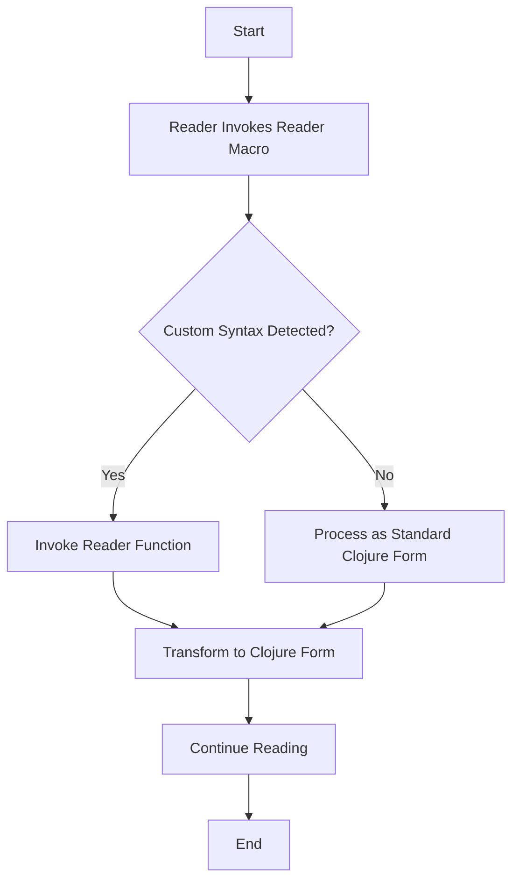

## 19.13. Writing Custom Reader Macros

### Introduction

In the world of Clojure, macros are a powerful tool that allow developers to extend the language and introduce new syntactic constructs. However, beyond the traditional macros, Clojure also supports reader macros, which operate at the level of the reader, allowing you to define custom syntax that can be transformed into Clojure code before it is compiled or interpreted. This guide will delve into the intricacies of writing custom reader macros, exploring their benefits, potential pitfalls, and best practices.

### Understanding Reader Macros

Reader macros in Clojure are a way to extend the syntax of the language. They are processed by the reader, which is the part of the Clojure runtime that converts text into data structures. This happens before the code is compiled or interpreted, allowing for powerful transformations and custom syntax.

#### Key Concepts

- **Reader**: The component that reads Clojure code and converts it into data structures.
- **Reader Macros**: Special syntax that the reader can interpret and transform into standard Clojure forms.
- **Syntax Extension**: The ability to introduce new syntactic constructs that are not part of the core language.

### Defining Custom Reader Macros

To define custom reader macros, you can use the `readers` option in Clojure. This involves creating a mapping of characters to functions that define how the reader should interpret the custom syntax.

#### Steps to Define a Custom Reader Macro

1. **Identify the Syntax**: Decide on the syntax you want to introduce. This could be a new character or sequence of characters.
2. **Create a Reader Function**: Write a function that takes the reader and the character as arguments and returns the desired Clojure form.
3. **Register the Reader Macro**: Use the `readers` option to map the syntax to the reader function.

#### Example: Creating a Simple Reader Macro

Let's create a simple reader macro that interprets `#d` as a directive to double a number.

```clojure
(ns custom-reader-macro.core
  (:require [clojure.tools.reader :as reader]))

(defn double-reader [rdr _]
  (let [num (reader/read rdr)]
    (* 2 num)))

(def custom-readers {'d double-reader})

;; Usage
(binding [*data-readers* custom-readers]
  (println (read-string "#d 5"))) ; Output: 10
```

### When to Use Custom Reader Macros

Custom reader macros can be beneficial in scenarios where you need to introduce domain-specific syntax or simplify complex code patterns. However, they should be used judiciously due to their potential to confuse other developers and complicate code maintenance.

#### Scenarios for Custom Reader Macros

- **Domain-Specific Languages (DSLs)**: When creating a DSL, custom reader macros can provide a more natural syntax for domain experts.
- **Code Simplification**: In cases where certain patterns are repeated frequently, a reader macro can simplify the syntax.
- **Experimental Features**: When experimenting with new language features or constructs, reader macros can provide a playground for testing ideas.

### Debugging Custom Reader Macros

Debugging reader macros can be challenging due to their low-level nature. Here are some techniques to help you troubleshoot issues:

1. **Logging**: Add logging statements to your reader functions to trace their execution.
2. **Isolation**: Test reader macros in isolation to ensure they work as expected before integrating them into larger codebases.
3. **Error Handling**: Implement robust error handling in your reader functions to catch and report issues.

### Risks and Maintenance Implications

While custom reader macros can be powerful, they come with risks and maintenance implications. It's important to weigh these factors before deciding to use them.

#### Potential Risks

- **Confusion**: Custom syntax can be confusing to developers unfamiliar with the codebase.
- **Compatibility**: Reader macros may not be compatible with all Clojure tools and libraries.
- **Maintenance**: Changes to the reader macro or its usage can lead to maintenance challenges.

#### Best Practices

- **Documentation**: Thoroughly document your reader macros and their intended usage.
- **Restraint**: Use reader macros sparingly and only when they provide significant benefits.
- **Testing**: Ensure comprehensive testing of reader macros to catch any issues early.

### Visualizing Reader Macro Processing

To better understand how reader macros work, let's visualize the process using a flowchart.



**Figure 1**: This flowchart illustrates the process of how a custom reader macro is invoked and processed by the Clojure reader.

### Try It Yourself

To get hands-on experience with custom reader macros, try modifying the example provided earlier. Experiment with different syntax and transformations to see how they affect the code.

#### Suggested Modifications

- Change the `#d` syntax to something else, like `#t`, and modify the reader function to triple the number instead of doubling it.
- Create a reader macro that interprets a custom syntax for lists, such as `#l` to create a list from space-separated values.

### References and Further Reading

- [Clojure Documentation on Reader Macros](https://clojure.org/reference/reader)
- [Clojure Tools Reader](https://github.com/clojure/tools.reader)
- [Metaprogramming in Clojure](https://clojure.org/guides/learn/metaprogramming)

### Knowledge Check

Before moving on, let's test your understanding of custom reader macros with a few questions.

## **Ready to Test Your Knowledge?**



### What is the primary purpose of a reader macro in Clojure?

- [x] To extend the syntax of the language
- [ ] To optimize code execution
- [ ] To handle errors during compilation
- [ ] To manage memory allocation

> **Explanation:** Reader macros allow you to introduce new syntactic constructs by extending the language's syntax.

### How do you register a custom reader macro in Clojure?

- [x] Using the `readers` option
- [ ] By modifying the compiler settings
- [ ] Through the `defmacro` function
- [ ] By creating a new namespace

> **Explanation:** Custom reader macros are registered using the `readers` option, which maps syntax to reader functions.

### What is a potential risk of using custom reader macros?

- [x] They can confuse other developers
- [ ] They improve code readability
- [ ] They automatically optimize performance
- [ ] They simplify error handling

> **Explanation:** Custom syntax can be confusing to developers who are not familiar with the codebase, leading to maintenance challenges.

### Which of the following is a scenario where custom reader macros might be beneficial?

- [x] Creating a Domain-Specific Language (DSL)
- [ ] Optimizing algorithm performance
- [ ] Managing memory allocation
- [ ] Handling concurrency issues

> **Explanation:** Custom reader macros can provide a more natural syntax for DSLs, making them beneficial in such scenarios.

### What is a recommended practice when using custom reader macros?

- [x] Thoroughly document their usage
- [ ] Use them extensively throughout the codebase
- [ ] Avoid testing them
- [ ] Ignore compatibility with other tools

> **Explanation:** It's important to document reader macros thoroughly to ensure other developers understand their usage and purpose.

### True or False: Reader macros are processed after the code is compiled.

- [ ] True
- [x] False

> **Explanation:** Reader macros are processed by the reader before the code is compiled or interpreted.

### Which function is used to read the next form in a custom reader macro function?

- [x] `reader/read`
- [ ] `read-string`
- [ ] `eval`
- [ ] `parse`

> **Explanation:** The `reader/read` function is used to read the next form from the reader in a custom reader macro function.

### What should you do to debug a custom reader macro?

- [x] Add logging statements
- [ ] Ignore errors
- [ ] Use `println` statements in production
- [ ] Avoid testing

> **Explanation:** Adding logging statements can help trace the execution of reader macros and identify issues.

### Which of the following is NOT a benefit of using custom reader macros?

- [ ] Simplifying complex code patterns
- [ ] Introducing domain-specific syntax
- [x] Automatically improving performance
- [ ] Experimenting with new language features

> **Explanation:** Custom reader macros do not automatically improve performance; they are used for syntax extension and transformation.

### True or False: Custom reader macros can be used to manage memory allocation.

- [ ] True
- [x] False

> **Explanation:** Custom reader macros are not related to memory management; they are used for syntax transformation.



### Conclusion

Writing custom reader macros in Clojure is a powerful technique that allows you to extend the language's syntax and introduce new constructs. However, with great power comes great responsibility. It's crucial to use reader macros judiciously, document them thoroughly, and ensure they are well-tested to avoid confusion and maintenance challenges. As you continue your journey in mastering Clojure, remember to experiment, stay curious, and enjoy the process of learning and discovery.
