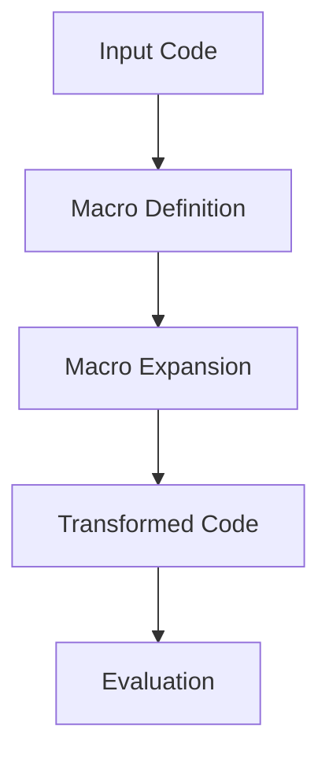

## 19.2. Writing Your First Macro

Welcome to the fascinating world of Clojure macros! In this section, we will guide you through writing your first macro, a powerful feature that allows you to extend the language and create custom syntactic constructs. Macros are a cornerstone of metaprogramming in Clojure, enabling you to manipulate code as data and transform it before evaluation. Let's dive in and explore how to harness this power effectively.

### Understanding Macros in Clojure

Before we start writing a macro, it's essential to understand what a macro is and how it differs from a regular function. In Clojure, a macro is a special kind of function that operates on the code itself, transforming it into another form before it is evaluated. This allows you to create new syntactic constructs and abstractions that are not possible with regular functions.

#### Key Concepts

- **Code as Data**: Clojure, being a Lisp, treats code as data. This means you can manipulate code structures using the same tools you use for data manipulation.
- **Macro Expansion**: Macros transform input code into a new form, which is then evaluated. This transformation process is called macro expansion.
- **`defmacro`**: This is the special form used to define a macro in Clojure.

### Writing Your First Macro

Let's start by writing a simple macro. We'll create a macro called `when-not`, which is similar to the built-in `when` macro but executes its body only when a condition is false.

#### Step 1: Define the Macro

To define a macro, we use the `defmacro` keyword. Here's how you can define the `when-not` macro:

```clojure
(defmacro when-not [condition & body]
  `(if (not ~condition)
     (do ~@body)))
```

**Explanation**:
- **`defmacro`**: This keyword is used to define a macro.
- **`when-not`**: The name of the macro.
- **`[condition & body]`**: The arguments to the macro. `condition` is the condition to check, and `body` is the code to execute if the condition is false.
- **Backquote (`) and Unquote (~)**: The backquote is used to create a template for the code transformation. The unquote (`~`) is used to insert the value of `condition` into the template.
- **Unquote-splicing (`~@`)**: This is used to insert the elements of `body` into the template.

#### Step 2: Use the Macro

Now that we have defined the `when-not` macro, let's see how it can be used:

```clojure
(when-not false
  (println "This will be printed because the condition is false."))
```

This code will print the message because the condition `false` evaluates to false.

#### Step 3: Macro Expansion

To understand how the macro transforms the code, we can use the `macroexpand` function. This function shows the expanded form of the macro:

```clojure
(macroexpand '(when-not false
                (println "This will be printed because the condition is false.")))
```

The output will be:

```clojure
(if (not false)
  (do (println "This will be printed because the condition is false.")))
```

As you can see, the `when-not` macro transforms into an `if` expression with a `not` condition.

### Experimenting with Macros

Macros are a powerful tool, and experimenting with them can lead to a deeper understanding of their capabilities. Here are some suggestions for modifying and extending the `when-not` macro:

- **Add an `else` Clause**: Modify the macro to include an optional `else` clause that executes if the condition is true.
- **Logging**: Add logging to the macro to print a message whenever the condition is true or false.
- **Error Handling**: Extend the macro to handle errors gracefully if the condition is not a boolean.

### Best Practices for Writing Macros

Writing macros can be tricky, and it's important to follow best practices to avoid common pitfalls:

- **Keep Macros Simple**: Macros should be as simple as possible. Complex logic should be handled in functions, not macros.
- **Avoid Side Effects**: Macros should not have side effects. They should only transform code.
- **Use `macroexpand`**: Always use `macroexpand` to verify the transformation of your macro.
- **Test Extensively**: Macros can introduce subtle bugs. Test them thoroughly to ensure they behave as expected.

### Visualizing Macro Expansion

To better understand how macros work, let's visualize the macro expansion process using a flowchart:



**Caption**: This flowchart illustrates the process of macro expansion in Clojure, where input code is transformed by the macro definition into a new form, which is then evaluated.

### References and Further Reading

- [Clojure Macros Documentation](https://clojure.org/reference/macros)
- [Clojure for the Brave and True: Macros](https://www.braveclojure.com/writing-macros/)
- [Clojure Programming: Macros](https://www.oreilly.com/library/view/clojure-programming/9781449310387/ch04.html)

### Knowledge Check

Let's test your understanding of macros with some questions and exercises.

## **Ready to Test Your Knowledge?**



### What is the primary purpose of a macro in Clojure?

- [x] To transform code before it is evaluated
- [ ] To execute code at runtime
- [ ] To optimize performance
- [ ] To handle errors

> **Explanation:** Macros in Clojure are used to transform code before it is evaluated, allowing for custom syntactic constructs.

### Which keyword is used to define a macro in Clojure?

- [ ] defn
- [x] defmacro
- [ ] def
- [ ] let

> **Explanation:** The `defmacro` keyword is used to define a macro in Clojure.

### What does the `~` symbol represent in a macro definition?

- [ ] It denotes a comment
- [x] It unquotes an expression
- [ ] It is used for string interpolation
- [ ] It marks the end of a macro

> **Explanation:** The `~` symbol is used to unquote an expression within a macro template.

### How can you view the expanded form of a macro?

- [ ] Using the `eval` function
- [ ] Using the `println` function
- [x] Using the `macroexpand` function
- [ ] Using the `expand` function

> **Explanation:** The `macroexpand` function is used to view the expanded form of a macro.

### What is the output of `(macroexpand '(when-not true (println "Hello")))`?

- [ ] (if true (do (println "Hello")))
- [ ] (do (println "Hello"))
- [x] (if (not true) (do (println "Hello")))
- [ ] (println "Hello")

> **Explanation:** The `when-not` macro expands to an `if` expression with a `not` condition.

### Which of the following is a best practice for writing macros?

- [x] Keep macros simple
- [ ] Use macros for complex logic
- [ ] Avoid using `macroexpand`
- [ ] Use side effects in macros

> **Explanation:** Keeping macros simple is a best practice to ensure they are easy to understand and maintain.

### What does the `~@` symbol do in a macro?

- [ ] It comments out a line
- [ ] It concatenates strings
- [x] It unquote-splices a list
- [ ] It marks the end of a macro

> **Explanation:** The `~@` symbol is used to unquote-splice a list into a macro template.

### What is the role of `defmacro` in Clojure?

- [ ] It defines a function
- [x] It defines a macro
- [ ] It declares a variable
- [ ] It imports a library

> **Explanation:** `defmacro` is used to define a macro in Clojure.

### True or False: Macros should have side effects.

- [ ] True
- [x] False

> **Explanation:** Macros should not have side effects; they should only transform code.

### What is the result of using `macroexpand` on a macro?

- [x] It shows the transformed code
- [ ] It executes the code
- [ ] It optimizes the code
- [ ] It compiles the code

> **Explanation:** `macroexpand` shows the transformed code that results from macro expansion.



### Embrace the Journey

Remember, writing macros is just the beginning of your journey into the world of metaprogramming in Clojure. As you progress, you'll discover more advanced techniques and patterns that will enable you to write more expressive and powerful code. Keep experimenting, stay curious, and enjoy the journey!
