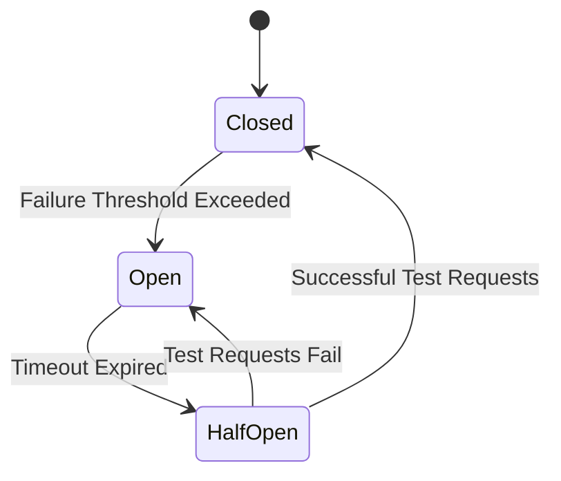

## 19.2 Circuit Breaker in Clojure

In the realm of cloud-native applications, resilience and fault tolerance are paramount. The Circuit Breaker pattern is a crucial design strategy that helps prevent cascading failures and enhances system responsiveness under failure conditions. This article delves into the Circuit Breaker pattern, its implementation in Clojure, and best practices for leveraging this pattern effectively.

### Introduction

The Circuit Breaker pattern is inspired by electrical circuit breakers, which prevent electrical overloads by interrupting the flow of electricity. Similarly, in software systems, a Circuit Breaker monitors interactions with external services and interrupts the flow of requests when failures are detected. This prevents the system from being overwhelmed by repeated failures and allows it to recover gracefully.

### Purpose of Circuit Breaker

- **Prevent Cascading Failures:** By detecting service failures early, the Circuit Breaker stops requests to failing services, preventing the failure from propagating through the system.
- **Improve System Resilience:** By managing failures gracefully, the Circuit Breaker enhances the overall resilience and responsiveness of the system under failure conditions.

### Implementing Circuit Breaker in Clojure

Clojure, with its rich ecosystem and Java interoperability, offers several ways to implement the Circuit Breaker pattern. You can use existing libraries like `clj-circuit-breaker` or integrate with Java-based solutions like Hystrix.

#### Using `clj-circuit-breaker`

The `clj-circuit-breaker` library provides a straightforward way to implement Circuit Breakers in Clojure. Here's a basic example:

```clojure
(require '[clj-circuit-breaker.core :as circuit-breaker])

(def circuit-options
  {:failure-threshold 5
   :timeout-ms 1000
   :reset-timeout-ms 5000})

(defn call-external-service []
  (circuit-breaker/with-circuit-breaker
    circuit-options
    (fn []
      (make-http-request))))
```

In this example, `call-external-service` is wrapped with a Circuit Breaker that monitors failures and manages state transitions.

#### Integrating with Hystrix

Hystrix, a popular Java library for implementing Circuit Breakers, can be used in Clojure through Java interop. This approach is beneficial if you're already using Hystrix in a polyglot environment.

### Key Components of Circuit Breaker

1. **Closed State:**
   - In this state, requests are allowed to pass through while the Circuit Breaker monitors for failures.
   - If failures exceed a predefined threshold, the Circuit Breaker transitions to the Open State.

2. **Open State:**
   - The Circuit Breaker blocks further requests temporarily to prevent further failures.
   - After a specified timeout, the Circuit Breaker transitions to the Half-Open State to test if the service has recovered.

3. **Half-Open State:**
   - A limited number of test requests are allowed to determine if the external service has recovered.
   - If successful, the Circuit Breaker transitions back to the Closed State; otherwise, it returns to the Open State.



### Failure Detection

- **Thresholds:** Configure thresholds for failure counts or error rates to determine when to open the circuit.
- **Timeouts:** Define timeouts for service calls to detect unresponsive services and trigger state transitions.

### Fallback Mechanisms

- **Default Responses:** Provide default responses or cached data when the circuit is open, ensuring the system remains functional.
- **User Notifications:** Inform users of degraded service gracefully, maintaining a good user experience.

### Monitoring and Metrics

- **Metrics Collection:** Collect metrics on request success/failure rates to monitor the health of external services.
- **Visualization Tools:** Use monitoring tools to visualize Circuit Breaker states and performance, aiding in proactive management.

### Example Usage

Here's an example of wrapping external HTTP calls with a Circuit Breaker function:

```clojure
(defn make-http-request []
  ;; Simulate an HTTP request to an external service
  (println "Making HTTP request"))

(defn call-external-service []
  (circuit-breaker/with-circuit-breaker
    circuit-options
    (fn []
      (make-http-request))))
```

### Testing Circuit Breaker

- **Simulate Failures:** In testing environments, simulate service failures to verify that the Circuit Breaker transitions between states appropriately.
- **State Verification:** Ensure that the Circuit Breaker correctly handles state transitions and fallback mechanisms.

### Best Practices

- **Threshold Configuration:** Set appropriate thresholds to balance responsiveness and fault tolerance.
- **Thread Safety:** Ensure that the Circuit Breaker state is thread-safe if stored in memory, especially in concurrent environments.

### Advantages and Disadvantages

**Advantages:**
- Enhances system resilience by preventing cascading failures.
- Provides a mechanism for graceful degradation and recovery.

**Disadvantages:**
- Requires careful configuration to avoid unnecessary interruptions.
- May introduce complexity in managing state transitions and fallbacks.

### Conclusion

The Circuit Breaker pattern is an essential tool for building resilient cloud-native applications in Clojure. By preventing cascading failures and managing service interactions gracefully, it enhances system reliability and user experience. Implementing this pattern using libraries like `clj-circuit-breaker` or integrating with Hystrix can significantly improve your application's fault tolerance.

## Quiz Time!



### What is the primary purpose of the Circuit Breaker pattern?

- [x] To prevent cascading failures by detecting service failures and stopping requests to failing services.
- [ ] To enhance data processing speed.
- [ ] To manage user authentication.
- [ ] To optimize database queries.

> **Explanation:** The Circuit Breaker pattern is designed to prevent cascading failures by detecting service failures and stopping requests to failing services.

### Which state allows requests to pass through while monitoring for failures?

- [x] Closed State
- [ ] Open State
- [ ] Half-Open State
- [ ] Failed State

> **Explanation:** In the Closed State, requests are allowed to pass through while the Circuit Breaker monitors for failures.

### What happens when the Circuit Breaker is in the Open State?

- [x] It blocks further requests temporarily.
- [ ] It allows all requests to pass through.
- [ ] It resets the failure count.
- [ ] It sends an alert to the administrator.

> **Explanation:** In the Open State, the Circuit Breaker blocks further requests temporarily to prevent further failures.

### How does the Circuit Breaker test if an external service has recovered?

- [x] By allowing a limited number of test requests in the Half-Open State.
- [ ] By sending a notification to the service.
- [ ] By resetting the failure count.
- [ ] By increasing the timeout duration.

> **Explanation:** In the Half-Open State, the Circuit Breaker allows a limited number of test requests to determine if the external service has recovered.

### What is a common fallback mechanism when the Circuit Breaker is open?

- [x] Provide default responses or cached data.
- [ ] Increase the number of requests.
- [ ] Disable the Circuit Breaker.
- [ ] Retry the requests indefinitely.

> **Explanation:** A common fallback mechanism is to provide default responses or cached data when the Circuit Breaker is open.

### Which library can be used in Clojure to implement the Circuit Breaker pattern?

- [x] clj-circuit-breaker
- [ ] core.async
- [ ] Ring
- [ ] Pedestal

> **Explanation:** The `clj-circuit-breaker` library can be used in Clojure to implement the Circuit Breaker pattern.

### What should be monitored to ensure the Circuit Breaker is functioning correctly?

- [x] Request success/failure rates
- [ ] User login attempts
- [ ] Database query times
- [ ] Memory usage

> **Explanation:** Monitoring request success/failure rates helps ensure the Circuit Breaker is functioning correctly.

### What is a potential disadvantage of using the Circuit Breaker pattern?

- [x] It may introduce complexity in managing state transitions and fallbacks.
- [ ] It reduces system resilience.
- [ ] It increases the risk of data loss.
- [ ] It slows down data processing.

> **Explanation:** A potential disadvantage is that it may introduce complexity in managing state transitions and fallbacks.

### How can you test the Circuit Breaker in a development environment?

- [x] Simulate service failures to verify state transitions.
- [ ] Increase the number of requests.
- [ ] Disable the Circuit Breaker.
- [ ] Reduce the timeout duration.

> **Explanation:** Simulating service failures in a development environment helps verify that the Circuit Breaker transitions between states appropriately.

### True or False: The Circuit Breaker pattern can be used to manage user authentication.

- [ ] True
- [x] False

> **Explanation:** False. The Circuit Breaker pattern is not used for managing user authentication; it is used to prevent cascading failures by detecting service failures and stopping requests to failing services.


