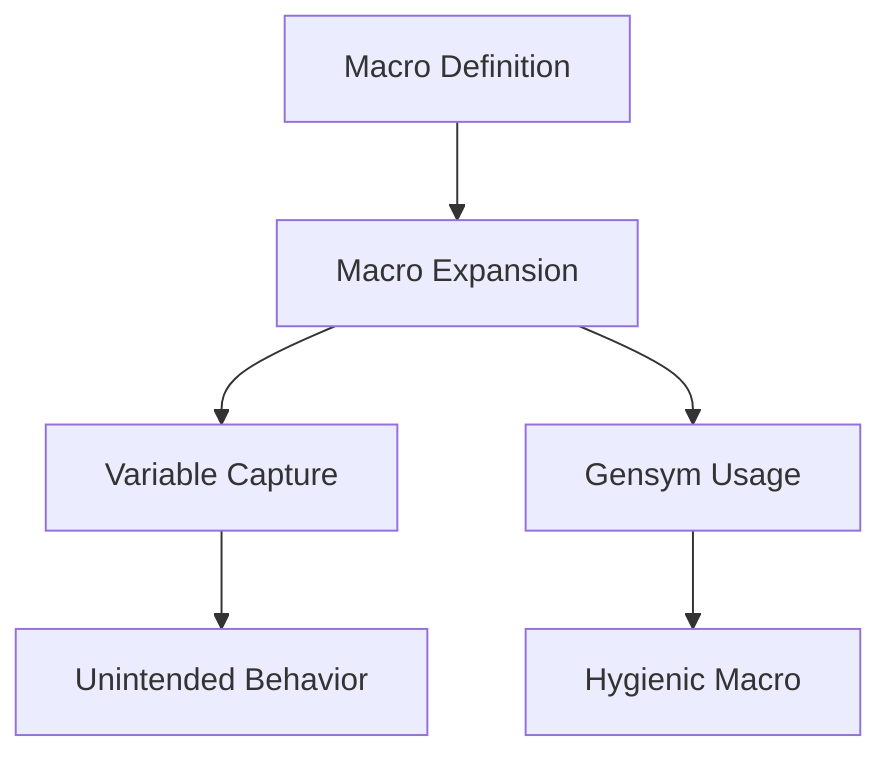

## 19.3. Macro Hygiene and Best Practices

In the world of Clojure, macros are powerful tools that allow developers to extend the language and create domain-specific languages. However, with great power comes great responsibility. One of the key responsibilities when writing macros is ensuring macro hygiene. This concept is crucial to prevent naming collisions and unintended side effects in macro expansions. In this section, we will explore macro hygiene, the use of gensyms, common pitfalls, and best practices for writing hygienic macros.

### Understanding Macro Hygiene

Macro hygiene refers to the practice of writing macros in a way that avoids unintended interactions with the surrounding code. This is particularly important in Lisp-like languages, where macros can manipulate code at a syntactic level. Without proper hygiene, macros can inadvertently capture or shadow variables, leading to bugs that are difficult to trace.

#### The Problem of Variable Capture

Variable capture occurs when a macro unintentionally binds a variable that is already in use in the surrounding code. This can lead to unexpected behavior and hard-to-debug errors. Consider the following example:

```clojure
(defmacro bad-macro [x]
  `(let [y 10]
     (+ ~x y)))

(let [y 5]
  (bad-macro y)) ; What will this return?
```

In this example, the `bad-macro` introduces a local binding for `y`. However, when `bad-macro` is used, it captures the `y` from the surrounding `let`, leading to unexpected results.

### Gensyms: A Solution to Variable Capture

To avoid variable capture, Clojure provides a mechanism called gensyms. A gensym is a generated symbol that is guaranteed to be unique. By using gensyms, we can ensure that the variables introduced by a macro do not interfere with those in the surrounding code.

#### Using Gensyms in Macros

Let's rewrite the previous example using gensyms:

```clojure
(defmacro good-macro [x]
  (let [y (gensym "y")]
    `(let [~y 10]
       (+ ~x ~y))))

(let [y 5]
  (good-macro y)) ; This will now return 15
```

In this version, `good-macro` uses a gensym to create a unique symbol for `y`, preventing any naming conflicts with the surrounding code.

### Guidelines for Writing Hygienic Macros

1. **Use Gensyms for Local Bindings**: Always use gensyms for any local bindings within a macro to avoid variable capture.

2. **Avoid Unintended Side Effects**: Ensure that macros do not introduce side effects that could affect the surrounding code. This includes avoiding global state changes.

3. **Limit the Scope of Macros**: Keep the scope of macros as narrow as possible. This reduces the risk of unintended interactions with other code.

4. **Test Macro Expansions**: Use the `macroexpand` function to test and verify the expansions of your macros. This helps ensure that the macro behaves as expected.

5. **Document Macro Usage**: Clearly document the intended use of your macros, including any assumptions or limitations.

### Common Pitfalls in Macro Writing

#### Shadowing Variables

Shadowing occurs when a macro introduces a binding that has the same name as an existing variable. This can lead to confusion and bugs. Always use gensyms to avoid shadowing.

#### Overuse of Macros

While macros are powerful, they should not be overused. In many cases, functions or higher-order functions can achieve the same result with less complexity. Reserve macros for situations where they provide a clear advantage.

#### Complex Macro Logic

Macros should be as simple as possible. Complex logic within a macro can make it difficult to understand and maintain. Break down complex macros into smaller, more manageable pieces.

### Example: Writing a Hygienic Macro

Let's create a macro that logs the execution time of a block of code. We'll ensure that it is hygienic by using gensyms:

```clojure
(defmacro time-it [expr]
  (let [start-time (gensym "start-time")
        end-time (gensym "end-time")]
    `(let [~start-time (System/nanoTime)]
       (let [result# ~expr
             ~end-time (System/nanoTime)]
         (println "Execution time:" (/ (- ~end-time ~start-time) 1e6) "ms")
         result#))))

(time-it (Thread/sleep 1000)) ; Logs the execution time of the sleep
```

In this macro, we use gensyms for `start-time` and `end-time` to ensure they do not conflict with any variables in the surrounding code. The macro logs the execution time of the given expression without introducing any side effects.

### Visualizing Macro Hygiene

To better understand macro hygiene, let's visualize the process of macro expansion and variable capture using a diagram.



**Diagram Description**: This flowchart illustrates the process of macro expansion. Without gensyms, variable capture can lead to unintended behavior. By using gensyms, we can create hygienic macros that avoid these issues.

### Try It Yourself

Experiment with the `time-it` macro by modifying the expression it evaluates. Try using different expressions and observe how the macro handles them. Consider creating your own macros using gensyms to ensure hygiene.

### References and Further Reading

- [Clojure Macros](https://clojure.org/reference/macros)
- [Macro Hygiene in Lisp](https://en.wikipedia.org/wiki/Hygienic_macro)
- [Gensyms in Clojure](https://clojure.org/reference/special_forms#gensym)

### Knowledge Check

Before we wrap up, let's test your understanding of macro hygiene with a few questions.

## **Ready to Test Your Knowledge?**



### What is macro hygiene?

- [x] The practice of writing macros that avoid unintended interactions with surrounding code.
- [ ] The process of cleaning up unused macros in a codebase.
- [ ] A technique for optimizing macro performance.
- [ ] A method for documenting macros.

> **Explanation:** Macro hygiene ensures that macros do not interfere with the surrounding code, preventing issues like variable capture.

### What is a gensym?

- [x] A generated symbol that is guaranteed to be unique.
- [ ] A global variable used in macros.
- [ ] A type of macro that does not require hygiene.
- [ ] A function for optimizing macro performance.

> **Explanation:** Gensyms are unique symbols used in macros to prevent naming conflicts.

### Why is variable capture problematic?

- [x] It can lead to unexpected behavior and hard-to-debug errors.
- [ ] It improves the performance of macros.
- [ ] It simplifies the macro writing process.
- [ ] It is necessary for macro hygiene.

> **Explanation:** Variable capture can cause macros to interfere with the surrounding code, leading to bugs.

### How can you test macro expansions?

- [x] Use the `macroexpand` function.
- [ ] Use the `gensym` function.
- [ ] Use the `println` function.
- [ ] Use the `eval` function.

> **Explanation:** The `macroexpand` function allows you to see how a macro expands, helping you verify its behavior.

### What is a common pitfall when writing macros?

- [x] Shadowing variables.
- [ ] Using too many gensyms.
- [ ] Avoiding side effects.
- [ ] Documenting macro usage.

> **Explanation:** Shadowing occurs when a macro introduces a binding with the same name as an existing variable, leading to confusion.

### What should you do to avoid variable capture?

- [x] Use gensyms for local bindings.
- [ ] Avoid using macros altogether.
- [ ] Use global variables.
- [ ] Use the `eval` function.

> **Explanation:** Gensyms ensure that local bindings in macros do not conflict with surrounding code.

### Why should macros be simple?

- [x] Complex macros are difficult to understand and maintain.
- [ ] Simple macros run faster.
- [ ] Simple macros are more hygienic.
- [ ] Complex macros are more prone to errors.

> **Explanation:** Keeping macros simple makes them easier to understand and maintain.

### What is the purpose of the `time-it` macro?

- [x] To log the execution time of a block of code.
- [ ] To optimize the performance of a block of code.
- [ ] To clean up unused variables in a block of code.
- [ ] To document the usage of a block of code.

> **Explanation:** The `time-it` macro logs the execution time of the given expression.

### How can you ensure a macro is hygienic?

- [x] Use gensyms and avoid side effects.
- [ ] Use global variables and side effects.
- [ ] Avoid using gensyms and side effects.
- [ ] Use complex logic and side effects.

> **Explanation:** Using gensyms and avoiding side effects helps ensure macro hygiene.

### True or False: Macros should be used sparingly and only when necessary.

- [x] True
- [ ] False

> **Explanation:** Macros should be reserved for situations where they provide a clear advantage, as they can introduce complexity.



Remember, mastering macro hygiene is an essential skill for any Clojure developer. By following these best practices, you can write macros that are both powerful and safe, avoiding common pitfalls and ensuring your code remains robust and maintainable. Keep experimenting, stay curious, and enjoy the journey of mastering Clojure macros!
