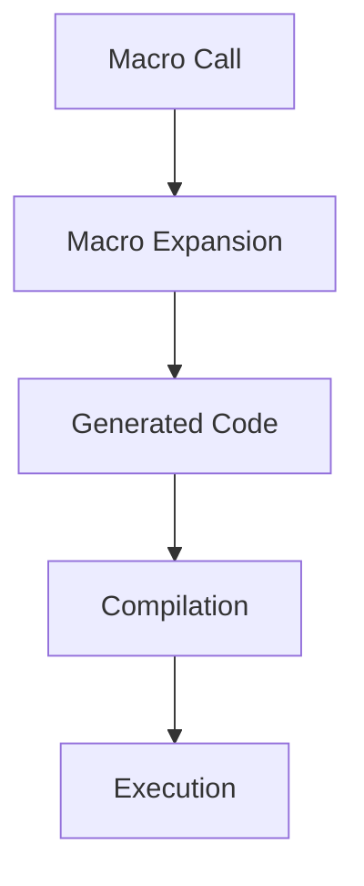

## 19.4. Advanced Macro Techniques

In the world of Clojure, macros are powerful tools that allow developers to extend the language and perform complex code transformations. In this section, we will explore advanced macro techniques, including recursive macros, macro-generating macros, and compile-time computations. These techniques can help you write more expressive, efficient, and maintainable code.

### Introduction to Advanced Macro Concepts

Macros in Clojure are a form of metaprogramming that allows you to manipulate code as data. They are functions that take code as input and produce code as output, enabling you to create new syntactic constructs and perform transformations that are not possible with regular functions.

#### When to Use Advanced Macros

Advanced macros are particularly useful when you need to:

- **Abstract repetitive patterns**: Create reusable code structures that can be applied in various contexts.
- **Optimize performance**: Move computations to compile-time to reduce runtime overhead.
- **Implement domain-specific languages (DSLs)**: Create custom syntax tailored to specific problem domains.
- **Perform complex code transformations**: Modify code structure to achieve specific goals, such as adding logging or instrumentation.

### Writing Recursive Macros

Recursive macros are macros that call themselves during their expansion. They can be used to process nested data structures or generate repetitive code patterns.

#### Example: A Recursive Macro for Nested Data Structures

Let's create a recursive macro that flattens a nested list structure:

```clojure
(defmacro flatten-list [lst]
  (if (seq? lst)
    `(concat ~@(map flatten-list lst))
    lst))

;; Usage
(flatten-list (1 (2 3) ((4 5) 6)))
;; => (1 2 3 4 5 6)
```

**Explanation**: The `flatten-list` macro checks if the input is a sequence. If it is, it recursively calls itself on each element, concatenating the results. Otherwise, it returns the element itself.

### Macro-Generating Macros

Macro-generating macros are macros that produce other macros. This technique is useful for creating families of related macros with similar behavior.

#### Example: A Macro-Generating Macro for Logging

Let's create a macro that generates logging macros for different log levels:

```clojure
(defmacro deflog [level]
  `(defmacro ~(symbol (str "log-" level)) [msg]
     `(println ~(str "[" (clojure.string/upper-case ~level) "]") ~msg)))

;; Generate logging macros
(deflog "info")
(deflog "warn")
(deflog "error")

;; Usage
(log-info "This is an info message.")
(log-warn "This is a warning message.")
(log-error "This is an error message.")
```

**Explanation**: The `deflog` macro generates a new macro for each log level, which prints a message with the appropriate log level prefix.

### Compile-Time Computations

Compile-time computations allow you to perform calculations during macro expansion, reducing runtime overhead and improving performance.

#### Example: Compile-Time Factorial Calculation

Let's create a macro that computes the factorial of a number at compile-time:

```clojure
(defmacro compile-time-factorial [n]
  (let [factorial (fn [x] (reduce * (range 1 (inc x))))]
    (factorial n)))

;; Usage
(compile-time-factorial 5)
;; => 120
```

**Explanation**: The `compile-time-factorial` macro uses a local function to compute the factorial of the input number during macro expansion.

### Implications of Compile-Time Computations

Moving computations to compile-time can have several benefits:

- **Performance**: Reduces runtime overhead by performing calculations ahead of time.
- **Code Clarity**: Simplifies runtime code by removing complex calculations.
- **Error Detection**: Catches errors early by evaluating expressions during compilation.

However, it also has some drawbacks:

- **Complexity**: Increases the complexity of the macro, making it harder to understand and maintain.
- **Limited Flexibility**: Compile-time computations cannot handle dynamic inputs that are only known at runtime.

### Complex Code Transformations with Macros

Macros can be used to perform complex code transformations, such as adding instrumentation or modifying control flow.

#### Example: A Macro for Instrumentation

Let's create a macro that adds timing instrumentation to a function:

```clojure
(defmacro with-timing [expr]
  `(let [start# (System/nanoTime)
         result# ~expr
         end# (System/nanoTime)]
     (println "Execution time:" (/ (- end# start#) 1e6) "ms")
     result#))

;; Usage
(with-timing (Thread/sleep 1000))
;; => Execution time: 1000.123 ms
```

**Explanation**: The `with-timing` macro wraps an expression with timing instrumentation, printing the execution time in milliseconds.

### Visualizing Macro Expansion

Understanding how macros expand can be challenging. Visualizing the expansion process can help clarify how macros transform code.

#### Diagram: Macro Expansion Process



**Description**: This diagram illustrates the macro expansion process, where a macro call is expanded into generated code, which is then compiled and executed.

### Try It Yourself: Experimenting with Macros

To deepen your understanding of advanced macro techniques, try modifying the examples provided:

- **Modify the `flatten-list` macro** to handle other data structures, such as maps or sets.
- **Create additional logging macros** for different log levels, such as `debug` or `trace`.
- **Experiment with compile-time computations** by creating macros that perform other mathematical operations, such as exponentiation or Fibonacci sequence generation.

### Knowledge Check

- **What are the benefits of using recursive macros?**
- **How can macro-generating macros simplify code?**
- **What are the trade-offs of moving computations to compile-time?**
- **How can macros be used to add instrumentation to code?**

### Summary

In this section, we've explored advanced macro techniques in Clojure, including recursive macros, macro-generating macros, and compile-time computations. These techniques enable you to perform sophisticated code transformations, optimize performance, and create expressive DSLs. As you continue to experiment with macros, remember to balance the power of macros with the complexity they introduce.

## **Ready to Test Your Knowledge?**



### What is a recursive macro in Clojure?

- [x] A macro that calls itself during its expansion
- [ ] A macro that generates other macros
- [ ] A macro that performs compile-time computations
- [ ] A macro that modifies control flow

> **Explanation:** A recursive macro is one that calls itself during its expansion, allowing it to process nested data structures or generate repetitive code patterns.

### What is the purpose of macro-generating macros?

- [x] To create families of related macros with similar behavior
- [ ] To perform compile-time computations
- [ ] To optimize runtime performance
- [ ] To add instrumentation to code

> **Explanation:** Macro-generating macros are used to create families of related macros with similar behavior, simplifying code and reducing repetition.

### What is a benefit of compile-time computations?

- [x] Reduces runtime overhead
- [ ] Increases code complexity
- [ ] Allows handling of dynamic inputs
- [ ] Simplifies macro definitions

> **Explanation:** Compile-time computations reduce runtime overhead by performing calculations during macro expansion, improving performance.

### What is a drawback of compile-time computations?

- [x] Limited flexibility with dynamic inputs
- [ ] Increased runtime overhead
- [ ] Simplified macro definitions
- [ ] Reduced code complexity

> **Explanation:** Compile-time computations have limited flexibility because they cannot handle dynamic inputs that are only known at runtime.

### How can macros be used to add instrumentation to code?

- [x] By wrapping expressions with additional code, such as timing instrumentation
- [ ] By generating other macros
- [ ] By performing compile-time computations
- [ ] By modifying control flow

> **Explanation:** Macros can add instrumentation by wrapping expressions with additional code, such as timing instrumentation, to measure execution time.

### What is the role of macro expansion in Clojure?

- [x] To transform macro calls into generated code
- [ ] To execute macros at runtime
- [ ] To handle dynamic inputs
- [ ] To simplify macro definitions

> **Explanation:** Macro expansion transforms macro calls into generated code, which is then compiled and executed.

### What is a potential use case for recursive macros?

- [x] Processing nested data structures
- [ ] Adding instrumentation to code
- [ ] Performing compile-time computations
- [ ] Generating other macros

> **Explanation:** Recursive macros are useful for processing nested data structures, allowing them to traverse and transform complex hierarchies.

### What is a key consideration when using advanced macros?

- [x] Balancing power with complexity
- [ ] Ensuring macros are executed at runtime
- [ ] Handling dynamic inputs
- [ ] Simplifying macro definitions

> **Explanation:** When using advanced macros, it's important to balance their power with the complexity they introduce, ensuring maintainability and clarity.

### What is an example of a compile-time computation?

- [x] Calculating a factorial during macro expansion
- [ ] Generating logging macros
- [ ] Adding timing instrumentation
- [ ] Modifying control flow

> **Explanation:** Calculating a factorial during macro expansion is an example of a compile-time computation, where the calculation is performed ahead of time.

### True or False: Macros can only be used for simple code transformations.

- [ ] True
- [x] False

> **Explanation:** False. Macros can be used for complex code transformations, including adding instrumentation, modifying control flow, and generating other macros.



Remember, this is just the beginning. As you progress, you'll discover even more powerful ways to leverage macros in Clojure. Keep experimenting, stay curious, and enjoy the journey!
