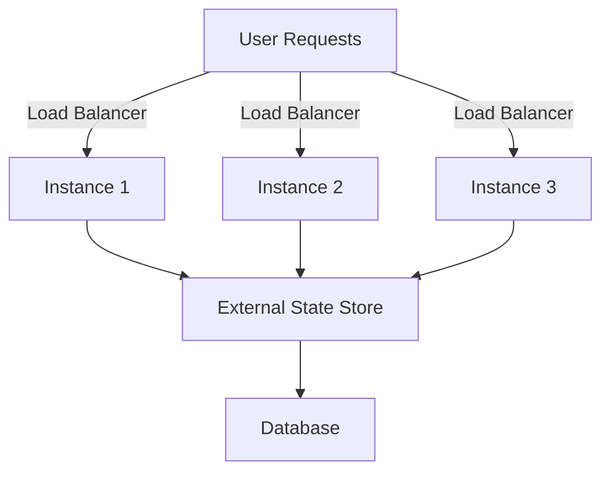
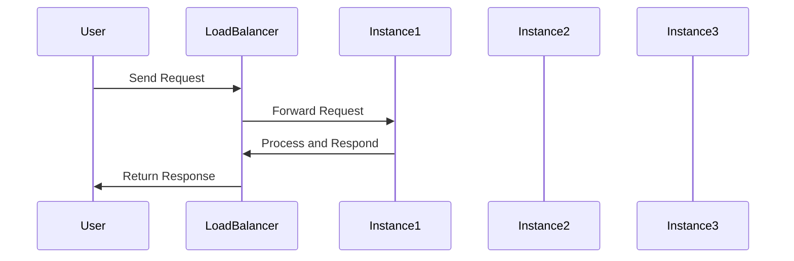

## 19.4 Auto-Scaling and Load Balancing in Clojure

In the realm of cloud-native applications, auto-scaling and load balancing are crucial components that ensure your Clojure applications can handle varying workloads efficiently. This section delves into the concepts, implementation strategies, and best practices for integrating these patterns into your Clojure applications.

### Introduction

Auto-scaling and load balancing are essential for maintaining application performance and availability in dynamic cloud environments. Auto-scaling allows your application to dynamically adjust the number of running instances based on current demand, while load balancing distributes incoming traffic across these instances to prevent any single instance from becoming a bottleneck.

### Auto-Scaling Concepts

Auto-scaling is the process of automatically adjusting the number of application instances in response to changes in demand. This ensures that your application can handle varying workloads efficiently without manual intervention.

- **Dynamic Adjustment:** Automatically increase or decrease the number of instances based on predefined metrics such as CPU usage, memory consumption, or request rates.
- **Efficient Resource Utilization:** Optimize resource usage by scaling out during peak times and scaling in during low-demand periods.

### Preparing Clojure Applications for Auto-Scaling

To effectively implement auto-scaling, your Clojure applications must be designed with certain principles in mind:

#### Statelessness

Design your application to be stateless, meaning that each instance can handle any request independently without relying on local state. This allows instances to be added or removed without affecting user sessions.

- **Session Management:** Store session data in external stores like databases or Redis, rather than in-memory.
- **Idempotency:** Ensure that repeated requests produce the same result, which is crucial for handling retries in distributed systems.

#### External State Management

Manage shared state, caches, and session data externally to maintain consistency across instances.

- **Databases and Caches:** Use databases or distributed caches to store shared data.
- **Configuration Management:** Use environment variables or configuration services to ensure consistent configuration across instances.

### Implementing Auto-Scaling

Auto-scaling can be implemented using tools and services provided by cloud providers:

- **AWS Auto Scaling Groups:** Automatically adjust the number of EC2 instances based on demand.
- **Kubernetes Horizontal Pod Autoscaler:** Scale the number of pods in a Kubernetes cluster based on observed CPU utilization or other custom metrics.

#### Metrics-Based Scaling Policies

Define scaling policies based on key performance metrics:

- **CPU Usage:** Scale out when CPU usage exceeds a certain threshold.
- **Request Rates:** Increase instances when incoming request rates are high.

### Load Balancing

Load balancing distributes incoming requests across multiple instances to ensure no single instance is overwhelmed.

- **Cloud Load Balancers:** Use load balancers provided by cloud platforms like AWS Elastic Load Balancing or Google Cloud Load Balancing.
- **Reverse Proxies:** Set up reverse proxies like NGINX or HAProxy to manage traffic distribution.

#### Session Stickiness

While session stickiness can ensure users are routed to the same instance, it can limit the effectiveness of load balancing. Avoid session stickiness when possible, or use techniques like consistent hashing to manage it.

### Health Checks

Implement health check endpoints in your application to monitor the health of instances. Configure load balancers to use these endpoints to detect and remove unhealthy instances from the pool.

### Scaling Strategies

#### Reactive Scaling

Scale out or in based on current metrics. This approach reacts to changes in demand, ensuring resources are available when needed.

#### Predictive Scaling

Anticipate load changes based on historical data and adjust capacity ahead of time. This proactive approach can prevent performance degradation during sudden spikes in demand.

### Monitoring and Metrics

Collect and analyze metrics on application performance, response times, and error rates using monitoring tools like Prometheus and Grafana. Visualizing this data helps in fine-tuning scaling policies and ensuring optimal performance.

### Cost Optimization

Balance performance with cost by setting appropriate scaling thresholds. Consider using spot instances or autoscaling groups with mixed instance types to reduce costs.

### Testing Auto-Scaling

Simulate load increases to test your scaling policies. Verify that new instances are correctly provisioned and registered with load balancers, ensuring seamless scaling.

### Deployment Considerations

Use immutable deployment artifacts, such as Docker images, to ensure consistency across instances. Automate the deployment process to streamline the provisioning of new instances.

### Configuration Management

Ensure all instances use the same configuration by pulling settings from environment variables or configuration services. This consistency is crucial for maintaining application stability during scaling.

### Visual Aids

To better understand the concepts discussed, let's look at a few diagrams illustrating the architecture and workflows involved in auto-scaling and load balancing.

#### Auto-Scaling Architecture

#### Load Balancing Workflow

### Conclusion

Auto-scaling and load balancing are vital for building resilient, scalable, and cost-effective cloud-native applications in Clojure. By designing stateless applications, leveraging cloud provider tools, and implementing robust monitoring and scaling strategies, you can ensure your applications remain performant and responsive under varying loads.

## Quiz Time!



### What is the primary goal of auto-scaling in cloud-native applications?

- [x] To dynamically adjust the number of application instances based on load
- [ ] To increase the number of servers regardless of demand
- [ ] To decrease the number of servers regardless of demand
- [ ] To maintain a fixed number of instances at all times

> **Explanation:** Auto-scaling aims to dynamically adjust the number of application instances based on current demand to optimize resource utilization.

### Why is statelessness important for auto-scaling?

- [x] It allows instances to be added or removed without affecting user sessions
- [ ] It ensures that all instances store their own session data
- [ ] It requires each instance to maintain its own state
- [ ] It prevents instances from communicating with each other

> **Explanation:** Statelessness ensures that instances can be added or removed without affecting user sessions, as state is managed externally.

### Which tool can be used for auto-scaling in Kubernetes?

- [x] Kubernetes Horizontal Pod Autoscaler
- [ ] AWS Auto Scaling Groups
- [ ] NGINX
- [ ] HAProxy

> **Explanation:** The Kubernetes Horizontal Pod Autoscaler is used to scale the number of pods in a Kubernetes cluster based on metrics.

### What is the role of a load balancer in cloud-native applications?

- [x] To distribute incoming requests across multiple instances
- [ ] To store session data for all instances
- [ ] To increase the number of application instances
- [ ] To decrease the number of application instances

> **Explanation:** A load balancer distributes incoming requests across multiple instances to ensure no single instance is overwhelmed.

### What is a potential drawback of session stickiness?

- [x] It can limit the effectiveness of load balancing
- [ ] It ensures users are always routed to the same instance
- [ ] It improves the distribution of requests
- [ ] It enhances the scalability of the application

> **Explanation:** Session stickiness can limit the effectiveness of load balancing by routing users to the same instance, which can create bottlenecks.

### What is reactive scaling?

- [x] Scaling out/in based on current metrics
- [ ] Anticipating load changes and adjusting capacity ahead of time
- [ ] Maintaining a fixed number of instances
- [ ] Scaling based on historical data

> **Explanation:** Reactive scaling involves scaling out or in based on current metrics, reacting to changes in demand.

### Which monitoring tool can be used to visualize application metrics?

- [x] Grafana
- [ ] Docker
- [ ] NGINX
- [ ] HAProxy

> **Explanation:** Grafana is a tool used to visualize and analyze application metrics.

### What is the benefit of using immutable deployment artifacts?

- [x] Ensures consistency across instances
- [ ] Allows for manual configuration of each instance
- [ ] Requires instances to maintain their own state
- [ ] Increases the complexity of deployment

> **Explanation:** Immutable deployment artifacts, such as Docker images, ensure consistency across instances by providing a fixed, unchangeable deployment package.

### What is the purpose of health checks in load balancing?

- [x] To detect and remove unhealthy instances from the pool
- [ ] To increase the number of application instances
- [ ] To store session data for all instances
- [ ] To decrease the number of application instances

> **Explanation:** Health checks are used to detect and remove unhealthy instances from the pool, ensuring that only healthy instances receive traffic.

### True or False: Predictive scaling anticipates load changes based on historical data.

- [x] True
- [ ] False

> **Explanation:** Predictive scaling anticipates load changes based on historical data and adjusts capacity ahead of time to prevent performance degradation.


