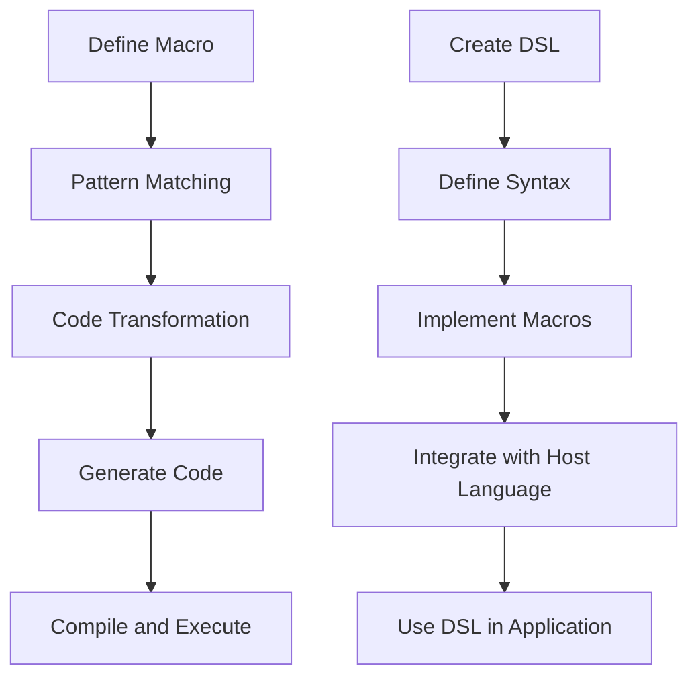

## 19.5. Code Generation and DSLs

In the world of software development, the ability to automate repetitive tasks and express complex logic succinctly is invaluable. Clojure, with its powerful macro system, offers developers the tools to achieve these goals through code generation and the creation of domain-specific languages (DSLs). In this section, we will delve into how macros can be leveraged for code generation, explore the benefits of DSLs, and provide practical examples and best practices for designing user-friendly DSLs.

### Understanding Macros in Clojure

Before we dive into code generation and DSLs, it's essential to understand what macros are and how they function in Clojure. Macros are a metaprogramming feature that allows developers to manipulate code as data. This capability is rooted in Clojure's Lisp heritage, where code is represented as lists, making it easy to transform and generate new code.

#### Key Features of Macros

- **Code as Data**: In Clojure, code is treated as data structures (typically lists), allowing macros to transform code before it's evaluated.
- **Compile-Time Execution**: Macros are expanded at compile time, meaning they can generate and manipulate code before the program runs.
- **Syntax Extension**: Macros can introduce new syntactic constructs, effectively extending the language.

### Code Generation with Macros

Code generation involves creating code dynamically, often to reduce boilerplate or automate repetitive tasks. Macros are particularly suited for this purpose because they operate at the syntactic level, allowing developers to define patterns and generate code accordingly.

#### Example: Generating Boilerplate Code

Consider a scenario where you need to define multiple functions that follow a similar pattern. Instead of writing each function manually, you can use a macro to generate them.

```clojure
(defmacro defn-multiple
  [name-args & body]
  `(do
     ~@(for [[name args] name-args]
         `(defn ~name ~args ~@body))))

;; Usage
(defn-multiple
  [[add [a b]]
   [subtract [a b]]]
  (+ a b))

;; The macro expands to:
;; (defn add [a b] (+ a b))
;; (defn subtract [a b] (+ a b))
```

In this example, the `defn-multiple` macro generates multiple function definitions based on the provided patterns, significantly reducing repetitive code.

### Domain-Specific Languages (DSLs)

A domain-specific language (DSL) is a specialized language designed to express solutions in a particular domain. DSLs can be internal, embedded within a host language like Clojure, or external, with their own syntax and parser. In Clojure, macros are often used to create internal DSLs, allowing developers to express domain logic more naturally and succinctly.

#### Benefits of DSLs

- **Expressiveness**: DSLs enable developers to express domain concepts directly, reducing the cognitive load and improving readability.
- **Abstraction**: By abstracting complex logic, DSLs allow developers to focus on the domain rather than implementation details.
- **Reusability**: DSLs can encapsulate common patterns, making them reusable across different parts of an application.

#### Example: Creating a DSL for SQL Queries

Let's create a simple DSL for constructing SQL queries. This DSL will allow developers to express queries in a more natural and concise manner.

```clojure
(defmacro select
  [& clauses]
  `(str "SELECT " ~@(interpose ", " clauses)))

(defmacro from
  [table]
  `(str " FROM " ~table))

(defmacro where
  [& conditions]
  `(str " WHERE " ~@(interpose " AND " conditions)))

;; Usage
(def query
  (str (select "name" "age")
       (from "users")
       (where "age > 30" "name LIKE 'A%'")))

;; The query expands to:
;; "SELECT name, age FROM users WHERE age > 30 AND name LIKE 'A%'"
```

In this example, the DSL allows developers to construct SQL queries using Clojure's syntax, making the code more readable and maintainable.

### Best Practices for Designing DSLs

Creating a user-friendly DSL requires careful consideration of several factors:

1. **Simplicity**: Keep the DSL simple and focused on the domain. Avoid adding unnecessary complexity that could confuse users.

2. **Consistency**: Ensure that the DSL's syntax and semantics are consistent with the host language (Clojure) to minimize the learning curve.

3. **Error Handling**: Provide meaningful error messages and validations to help users understand and correct mistakes.

4. **Documentation**: Document the DSL thoroughly, including examples and use cases, to aid users in understanding and using it effectively.

5. **Performance**: Consider the performance implications of the DSL, especially if it involves complex transformations or large-scale code generation.

### Visualizing Code Generation and DSLs

To better understand the flow of code generation and DSL creation, let's visualize the process using a flowchart.



**Description**: This flowchart illustrates the process of code generation and DSL creation in Clojure. It begins with defining macros, which match patterns and transform code, leading to code generation. For DSLs, the process involves defining syntax, implementing macros, and integrating with the host language.

### Try It Yourself

To deepen your understanding of code generation and DSLs, try modifying the examples provided:

- **Extend the `defn-multiple` macro** to include additional function attributes, such as documentation strings or metadata.
- **Enhance the SQL DSL** to support additional SQL clauses, such as `JOIN` or `ORDER BY`.

### References and Further Reading

- [Clojure Macros](https://clojure.org/reference/macros)
- [Domain-Specific Languages](https://martinfowler.com/books/dsl.html)
- [Metaprogramming in Clojure](https://www.braveclojure.com/)

### Knowledge Check

To reinforce your learning, let's test your understanding of code generation and DSLs in Clojure.

## **Ready to Test Your Knowledge?**



### What is the primary purpose of macros in Clojure?

- [x] To manipulate code as data and generate new code
- [ ] To execute code at runtime
- [ ] To create graphical user interfaces
- [ ] To manage memory allocation

> **Explanation:** Macros in Clojure allow developers to manipulate code as data, enabling code generation and transformation at compile time.

### Which of the following is a benefit of using DSLs?

- [x] Improved expressiveness and readability
- [ ] Increased complexity
- [ ] Reduced performance
- [ ] Limited reusability

> **Explanation:** DSLs improve expressiveness and readability by allowing developers to express domain concepts directly, reducing complexity and enhancing reusability.

### How do macros differ from functions in Clojure?

- [x] Macros operate at compile time, while functions operate at runtime
- [ ] Macros are faster than functions
- [ ] Functions can manipulate code, while macros cannot
- [ ] Macros are limited to specific data types

> **Explanation:** Macros operate at compile time, allowing them to transform code before it is evaluated, whereas functions operate at runtime.

### What is a key consideration when designing a DSL?

- [x] Simplicity and focus on the domain
- [ ] Maximizing complexity
- [ ] Minimizing documentation
- [ ] Ignoring error handling

> **Explanation:** A well-designed DSL should be simple and focused on the domain, with clear documentation and error handling to aid users.

### Which of the following is an example of code generation?

- [x] Using a macro to create multiple function definitions
- [ ] Writing functions manually
- [ ] Executing code in a REPL
- [ ] Using a loop to iterate over data

> **Explanation:** Code generation involves creating code dynamically, such as using a macro to automate the creation of multiple function definitions.

### What is the role of macros in creating DSLs?

- [x] To define new syntactic constructs and transform code
- [ ] To execute code at runtime
- [ ] To manage memory allocation
- [ ] To create graphical user interfaces

> **Explanation:** Macros play a crucial role in creating DSLs by defining new syntactic constructs and transforming code to express domain logic.

### How can you enhance the SQL DSL example provided?

- [x] By adding support for additional SQL clauses like `JOIN` or `ORDER BY`
- [ ] By removing existing clauses
- [ ] By converting it to a graphical interface
- [ ] By limiting it to a single SQL statement

> **Explanation:** Enhancing the SQL DSL involves adding support for additional SQL clauses, making it more versatile and expressive.

### What is a common pitfall when using macros for code generation?

- [x] Overcomplicating the macro logic
- [ ] Simplifying the code too much
- [ ] Ignoring runtime performance
- [ ] Focusing on error handling

> **Explanation:** A common pitfall is overcomplicating the macro logic, which can lead to difficult-to-maintain code and obscure errors.

### True or False: DSLs can only be used for database queries.

- [ ] True
- [x] False

> **Explanation:** False. DSLs can be used in various domains, not just for database queries, to express domain-specific logic succinctly.

### What is the benefit of using macros for code generation?

- [x] Reducing boilerplate and automating repetitive tasks
- [ ] Increasing code complexity
- [ ] Limiting code reusability
- [ ] Decreasing code readability

> **Explanation:** Macros help reduce boilerplate and automate repetitive tasks, improving code maintainability and readability.



Remember, this is just the beginning. As you progress, you'll build more complex and interactive applications using Clojure's powerful macro system. Keep experimenting, stay curious, and enjoy the journey!


