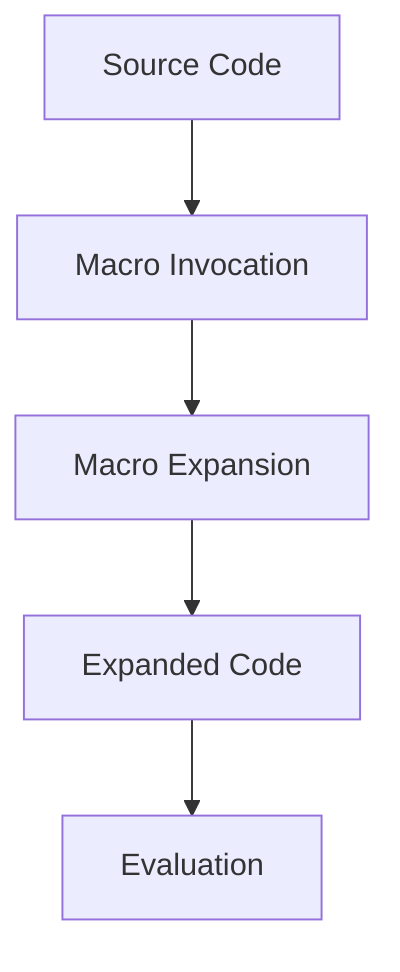

## 19.6. Debugging Macros

Macros are one of the most powerful features of Clojure, allowing developers to extend the language and create domain-specific languages (DSLs). However, with great power comes great responsibility, and debugging macros can be notoriously challenging. This section will guide you through the common issues encountered when writing macros, and provide you with techniques and tools to effectively debug them.

### Understanding Macros and Their Challenges

Macros in Clojure are functions that transform code before it is evaluated. They operate on the code as data, thanks to Clojure's homoiconicity, which means that code and data share the same structure. This allows macros to generate and manipulate code, but it also introduces complexity when things don't work as expected.

#### Common Issues with Macros

1. **Unexpected Code Expansion**: Macros can expand into code that is different from what you intended, leading to unexpected behavior.
2. **Variable Capture**: Macros can inadvertently capture variables from their surrounding context, leading to subtle bugs.
3. **Complexity in Expansion**: As macros become more complex, understanding their expansion becomes more difficult.
4. **Error Messages**: Errors in macro-generated code can be hard to trace back to the macro itself.

### Tools and Techniques for Debugging Macros

To effectively debug macros, you need to understand how they expand and interact with the surrounding code. Here are some essential tools and techniques:

#### Using `macroexpand` and `macroexpand-1`

The `macroexpand` and `macroexpand-1` functions are invaluable tools for inspecting macro expansions. They allow you to see the code that a macro generates, which is crucial for understanding its behavior.

- **`macroexpand-1`**: Expands the macro once, showing the immediate result of the macro expansion.
- **`macroexpand`**: Recursively expands the macro until it is no longer a macro form.

**Example:**

```clojure
(defmacro my-macro [x]
  `(println "The value is:" ~x))

;; Using macroexpand-1
(macroexpand-1 '(my-macro 10))
;; => (clojure.core/println "The value is:" 10)

;; Using macroexpand
(macroexpand '(my-macro 10))
;; => (clojure.core/println "The value is:" 10)
```

In this example, both `macroexpand-1` and `macroexpand` show the same result because the macro expands directly to a function call.

#### Tips for Testing Macros

Testing macros can be tricky, but it's essential for ensuring they behave as expected. Here are some tips:

1. **Write Unit Tests**: Use Clojure's testing libraries to write unit tests for your macros. Test both the macro's expansion and its runtime behavior.

2. **Test Edge Cases**: Consider edge cases and unusual inputs that might cause your macro to behave unexpectedly.

3. **Use `macroexpand` in Tests**: Include `macroexpand` in your tests to verify that the macro expands to the expected code.

**Example:**

```clojure
(ns my-macros-test
  (:require [clojure.test :refer :all]
            [my-macros :refer :all]))

(deftest test-my-macro
  (is (= (macroexpand '(my-macro 10))
         '(clojure.core/println "The value is:" 10)))
  (is (= (with-out-str (my-macro 10))
         "The value is: 10\n")))
```

In this test, we verify both the expansion of the macro and its runtime output.

#### Editor and REPL Tools

Modern Clojure development environments offer tools that can assist in debugging macros:

- **CIDER (Emacs)**: Provides interactive macro expansion and debugging tools.
- **Cursive (IntelliJ IDEA)**: Offers macro expansion features and integrates with the REPL for interactive development.
- **REPL-Driven Development**: Use the REPL to interactively test and debug macros. Evaluate macro expansions and test their behavior in real-time.

### Visualizing Macro Expansion

To better understand how macros work, it's helpful to visualize the process of macro expansion. The following diagram illustrates the flow of macro expansion in Clojure:



**Diagram Description**: This diagram shows the process of macro expansion in Clojure. The source code contains a macro invocation, which is expanded into code by the macro. The expanded code is then evaluated.

### Best Practices for Debugging Macros

1. **Keep Macros Simple**: Write simple macros that do one thing well. Complex macros are harder to debug and maintain.

2. **Avoid Variable Capture**: Use `gensym` or `let` bindings to avoid capturing variables from the surrounding context.

3. **Document Macro Behavior**: Clearly document what your macro does and any assumptions it makes about its inputs.

4. **Use `assert` Statements**: Include `assert` statements in your macros to check for preconditions and invariants.

5. **Leverage Community Resources**: Engage with the Clojure community for advice and best practices on writing and debugging macros.

### Try It Yourself

Experiment with the following macro and try modifying it to see how it behaves:

```clojure
(defmacro debug-macro [x]
  `(do
     (println "Debugging value:" ~x)
     ~x))

;; Try expanding the macro
(macroexpand '(debug-macro (+ 1 2)))

;; Try running the macro
(debug-macro (+ 1 2))
```

**Exercise**: Modify the `debug-macro` to include additional debugging information, such as the type of `x` or the current timestamp.

### Knowledge Check

Before we wrap up, let's test your understanding of debugging macros in Clojure.

## **Ready to Test Your Knowledge?**



### What is the primary purpose of the `macroexpand` function in Clojure?

- [x] To inspect the code generated by a macro.
- [ ] To execute a macro.
- [ ] To compile a macro.
- [ ] To optimize a macro.

> **Explanation:** `macroexpand` is used to inspect the code that a macro generates, helping developers understand its behavior.

### Which function expands a macro only once?

- [x] `macroexpand-1`
- [ ] `macroexpand`
- [ ] `expand-once`
- [ ] `macro-eval`

> **Explanation:** `macroexpand-1` expands a macro only once, showing the immediate result of the macro expansion.

### What is a common issue encountered when writing macros?

- [x] Variable capture
- [ ] Memory leaks
- [ ] Network latency
- [ ] File I/O errors

> **Explanation:** Variable capture occurs when a macro inadvertently captures variables from its surrounding context, leading to subtle bugs.

### Which tool can assist in debugging macros in Emacs?

- [x] CIDER
- [ ] Eclipse
- [ ] NetBeans
- [ ] Visual Studio

> **Explanation:** CIDER is an Emacs package that provides interactive macro expansion and debugging tools for Clojure.

### What should you include in your macros to check for preconditions?

- [x] `assert` statements
- [ ] `try-catch` blocks
- [ ] `if` statements
- [ ] `loop` constructs

> **Explanation:** `assert` statements can be used in macros to check for preconditions and invariants, ensuring they behave as expected.

### True or False: Macros in Clojure operate on code as data.

- [x] True
- [ ] False

> **Explanation:** True. Clojure's homoiconicity allows macros to operate on code as data, enabling powerful code transformations.

### What is the benefit of using `gensym` in macros?

- [x] To avoid variable capture
- [ ] To improve performance
- [ ] To enhance readability
- [ ] To reduce memory usage

> **Explanation:** `gensym` generates unique symbols, helping to avoid variable capture in macros.

### Which of the following is a best practice for writing macros?

- [x] Keep macros simple
- [ ] Use global variables
- [ ] Avoid documentation
- [ ] Ignore edge cases

> **Explanation:** Keeping macros simple makes them easier to debug and maintain.

### What is the role of `macroexpand` in unit tests for macros?

- [x] To verify macro expansion
- [ ] To execute the macro
- [ ] To compile the macro
- [ ] To optimize the macro

> **Explanation:** `macroexpand` is used in unit tests to verify that a macro expands to the expected code.

### Which of the following is NOT a common issue with macros?

- [x] Network latency
- [ ] Unexpected code expansion
- [ ] Variable capture
- [ ] Complexity in expansion

> **Explanation:** Network latency is not related to macros. Common issues with macros include unexpected code expansion, variable capture, and complexity in expansion.



### Conclusion

Debugging macros in Clojure can be challenging, but with the right tools and techniques, you can ensure your macros expand correctly and behave as intended. Remember to use `macroexpand` and `macroexpand-1` to inspect macro expansions, write comprehensive tests, and leverage the power of the REPL for interactive development. Keep experimenting, stay curious, and enjoy the journey of mastering macros in Clojure!
