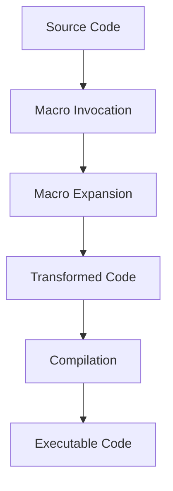

## 19.7. The Role of Homoiconicity in Metaprogramming

### Introduction

In the realm of programming languages, Clojure stands out for its unique features that empower developers to write expressive and efficient code. One of the most intriguing aspects of Clojure, inherited from its Lisp heritage, is **homoiconicity**. This characteristic allows Clojure to treat code as data, enabling powerful metaprogramming capabilities through the use of macros. In this section, we will delve into the concept of homoiconicity, explore its significance in Lisp languages, and demonstrate how it facilitates seamless manipulation of code structures in Clojure.

### Understanding Homoiconicity

**Homoiconicity** is a property of some programming languages where the primary representation of programs is also a data structure in a primitive type of the language itself. In simpler terms, it means that code and data are interchangeable. This concept is a hallmark of Lisp languages, including Clojure, where code is written in the form of lists and can be manipulated just like any other data structure.

#### Significance in Lisp Languages

In Lisp languages, homoiconicity is not just a theoretical concept; it is a practical feature that enables developers to write code that can generate and transform other code. This capability is at the heart of metaprogramming, allowing for the creation of powerful abstractions and domain-specific languages (DSLs). By treating code as data, Lisp languages provide a level of flexibility and expressiveness that is difficult to achieve in non-homoiconic languages.

### Homoiconicity in Clojure

Clojure, as a modern Lisp dialect, fully embraces homoiconicity. In Clojure, code is represented as lists, vectors, maps, and other data structures, which can be manipulated programmatically. This allows developers to write macros that can transform code at compile time, leading to more concise and expressive programs.

#### Code as Data

In Clojure, every piece of code is a data structure. For example, a function call is represented as a list, where the first element is the function and the subsequent elements are the arguments. This representation allows Clojure to easily manipulate and transform code.

```clojure
;; A simple function call
(+ 1 2 3)

;; The above code is represented as a list
(list '+ 1 2 3)
```

In the example above, the function call `(+ 1 2 3)` is equivalent to the list `(list '+ 1 2 3)`. This equivalence is the essence of homoiconicity, allowing code to be treated as data.

### Metaprogramming with Macros

One of the most powerful features enabled by homoiconicity in Clojure is the use of **macros**. Macros are functions that operate on code, allowing developers to generate and transform code at compile time. This capability is a cornerstone of metaprogramming in Clojure, enabling the creation of custom syntactic constructs and DSLs.

#### Creating Macros

Let's explore how macros work in Clojure by creating a simple macro that logs the execution time of a given expression.

```clojure
(defmacro time-it [expr]
  `(let [start# (System/nanoTime)
         result# ~expr
         end# (System/nanoTime)]
     (println "Execution time:" (/ (- end# start#) 1e6) "ms")
     result#))

;; Usage
(time-it (reduce + (range 1000000)))
```

In this example, the `time-it` macro takes an expression `expr` and wraps it in code that measures its execution time. The backtick (`) is used to quote the code, allowing it to be manipulated as data. The `~` operator is used to unquote `expr`, inserting its value into the generated code. The `#` suffix is used to generate unique symbols, preventing naming conflicts.

#### Transforming Code

Macros can be used to transform code in powerful ways. For example, let's create a macro that simplifies the creation of conditional expressions.

```clojure
(defmacro when-not [condition & body]
  `(if (not ~condition)
     (do ~@body)))

;; Usage
(when-not false
  (println "This will be printed"))
```

The `when-not` macro takes a condition and a body of code. It transforms the code into an `if` expression that executes the body if the condition is false. The `~@` operator is used to splice the body into the generated code.

### Differentiating Clojure from Other Languages

Clojure's homoiconicity and macro system set it apart from many other programming languages. In non-homoiconic languages, metaprogramming often involves complex and error-prone techniques such as code generation and reflection. In contrast, Clojure's approach is more elegant and straightforward, allowing developers to write concise and expressive code.

#### Comparison with Other Languages

In languages like Java or Python, metaprogramming typically involves manipulating strings or using reflection to inspect and modify code at runtime. These techniques can be cumbersome and error-prone, as they often require parsing and generating code as text.

In Clojure, the ability to treat code as data simplifies metaprogramming significantly. Developers can manipulate code using familiar data structures and functions, leading to more robust and maintainable programs.

### Visualizing Homoiconicity and Macros

To better understand the relationship between homoiconicity and macros, let's visualize the process of macro expansion in Clojure.



In this diagram, we see the flow of code through the macro system. The source code is first processed by macro invocations, which expand into transformed code. This transformed code is then compiled into executable code, ready to be run.

### Practical Applications of Homoiconicity

Homoiconicity in Clojure enables a wide range of practical applications, from creating DSLs to simplifying complex code patterns. Let's explore some of these applications in more detail.

#### Domain-Specific Languages (DSLs)

One of the most powerful applications of homoiconicity is the creation of DSLs. By leveraging macros, developers can create custom syntactic constructs that are tailored to specific problem domains. This can lead to more readable and maintainable code.

For example, let's create a simple DSL for defining HTML elements.

```clojure
(defmacro html [& body]
  `(str "<html>" ~@body "</html>"))

(defmacro body [& body]
  `(str "<body>" ~@body "</body>"))

(defmacro p [text]
  `(str "<p>" ~text "</p>"))

;; Usage
(html
  (body
    (p "Hello, world!")))
```

In this example, we define macros for creating HTML elements. The `html`, `body`, and `p` macros generate HTML code by transforming the input expressions into strings. This DSL allows developers to write HTML code in a more concise and expressive way.

#### Simplifying Complex Code Patterns

Homoiconicity also enables the simplification of complex code patterns. By using macros, developers can encapsulate repetitive or complex logic into reusable constructs.

For instance, let's create a macro that simplifies error handling in Clojure.

```clojure
(defmacro try-catch [expr]
  `(try
     ~expr
     (catch Exception e#
       (println "An error occurred:" (.getMessage e#)))))

;; Usage
(try-catch
  (/ 1 0))
```

The `try-catch` macro wraps an expression in a `try` block and catches any exceptions that occur. This simplifies error handling by providing a reusable construct for common error-handling patterns.

### Conclusion

Homoiconicity is a defining feature of Clojure, enabling powerful metaprogramming capabilities through the use of macros. By treating code as data, Clojure allows developers to write expressive and concise code that can generate and transform other code. This capability sets Clojure apart from many other programming languages, providing a level of flexibility and expressiveness that is difficult to achieve elsewhere.

As you continue your journey with Clojure, remember that homoiconicity is just one of the many powerful features that make Clojure a unique and compelling language. Embrace the power of macros and explore the endless possibilities of metaprogramming in Clojure.

### Try It Yourself

To deepen your understanding of homoiconicity and macros in Clojure, try modifying the code examples provided in this section. Experiment with creating your own macros and explore how they can simplify and enhance your code.

### Further Reading

For more information on homoiconicity and metaprogramming in Clojure, consider exploring the following resources:

- [Clojure Documentation](https://clojure.org/reference/macros)
- [Clojure for the Brave and True](https://www.braveclojure.com/)
- [The Joy of Clojure](https://www.manning.com/books/the-joy-of-clojure)

## **Ready to Test Your Knowledge?**



### What is homoiconicity?

- [x] A property where code is represented as data structures
- [ ] A feature that allows dynamic typing
- [ ] A method for optimizing performance
- [ ] A technique for error handling

> **Explanation:** Homoiconicity is a property where code is represented as data structures, allowing seamless manipulation of code.

### How does homoiconicity benefit metaprogramming in Clojure?

- [x] It allows code to be manipulated as data
- [ ] It enables static typing
- [ ] It improves runtime performance
- [ ] It simplifies error handling

> **Explanation:** Homoiconicity allows code to be manipulated as data, enabling powerful metaprogramming capabilities.

### What is a macro in Clojure?

- [x] A function that operates on code to transform it
- [ ] A data structure for storing code
- [ ] A method for error handling
- [ ] A type of loop construct

> **Explanation:** A macro is a function that operates on code to transform it at compile time.

### Which operator is used to unquote expressions in Clojure macros?

- [x] ~
- [ ] @
- [ ] #
- [ ] $

> **Explanation:** The `~` operator is used to unquote expressions in Clojure macros.

### What is the purpose of the `#` suffix in Clojure macros?

- [x] To generate unique symbols
- [ ] To denote a comment
- [ ] To indicate a loop
- [ ] To specify a type

> **Explanation:** The `#` suffix is used to generate unique symbols, preventing naming conflicts in macros.

### How does Clojure's approach to metaprogramming differ from Java's?

- [x] Clojure uses code as data, while Java uses strings and reflection
- [ ] Clojure uses static typing, while Java uses dynamic typing
- [ ] Clojure relies on runtime code generation, while Java does not
- [ ] Clojure does not support metaprogramming

> **Explanation:** Clojure uses code as data, allowing for more elegant and straightforward metaprogramming compared to Java's use of strings and reflection.

### What is the primary representation of code in Clojure?

- [x] Lists and other data structures
- [ ] Strings
- [ ] Classes
- [ ] Objects

> **Explanation:** In Clojure, code is primarily represented as lists and other data structures, enabling homoiconicity.

### What is the role of the backtick (`) in Clojure macros?

- [x] To quote code for manipulation
- [ ] To denote a comment
- [ ] To start a loop
- [ ] To specify a type

> **Explanation:** The backtick (`) is used to quote code, allowing it to be manipulated as data in macros.

### Can Clojure macros be used to create DSLs?

- [x] True
- [ ] False

> **Explanation:** True. Clojure macros can be used to create domain-specific languages (DSLs) by defining custom syntactic constructs.

### What is the benefit of using macros for error handling in Clojure?

- [x] They provide reusable constructs for common patterns
- [ ] They improve runtime performance
- [ ] They enable static typing
- [ ] They simplify data storage

> **Explanation:** Macros provide reusable constructs for common error-handling patterns, simplifying code and improving maintainability.



Remember, this is just the beginning. As you progress, you'll discover more advanced techniques and patterns in Clojure. Keep experimenting, stay curious, and enjoy the journey!
