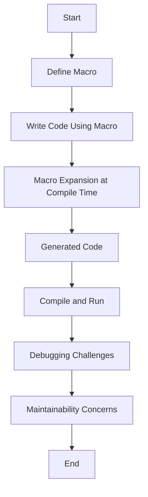

## 19.9. Risks and Limitations of Macros

Macros are a powerful feature in Clojure, allowing developers to extend the language and create domain-specific languages (DSLs). However, with great power comes great responsibility. While macros can simplify code by abstracting repetitive patterns, they can also introduce complexity, obscure code logic, and lead to maintenance challenges if not used judiciously. In this section, we will explore the risks and limitations associated with macros in Clojure, providing guidelines on when to use them and when to opt for simpler alternatives like functions.

### Understanding Macros in Clojure

Before diving into the risks, let's briefly revisit what macros are and how they function in Clojure. Macros are a metaprogramming tool that allows you to manipulate code as data. They operate at compile time, transforming input expressions into new code that is then evaluated. This capability enables developers to create new syntactic constructs and control structures that are not natively supported by the language.

Macros are defined using the `defmacro` keyword and can take any number of arguments, just like functions. However, unlike functions, macros receive their arguments as unevaluated code, allowing them to generate and return new code structures.

```clojure
(defmacro unless [condition & body]
  `(if (not ~condition)
     (do ~@body)))

;; Usage
(unless false
  (println "This will be printed"))
```

In the example above, the `unless` macro inverts the logic of an `if` statement, executing the body only if the condition is false.

### Risks of Using Macros

#### 1. Increased Complexity

One of the primary risks of using macros is the potential for increased complexity. Macros can obscure the flow of a program by introducing new syntactic constructs that are not immediately recognizable to someone unfamiliar with the codebase. This can make the code harder to read and understand, especially for developers who are new to the project or to Clojure itself.

**Example:**

```clojure
(defmacro with-logging [expr]
  `(do
     (println "Executing:" '~expr)
     ~expr))

;; Usage
(with-logging (+ 1 2))
```

While the `with-logging` macro adds useful logging functionality, it also introduces a layer of abstraction that may not be immediately clear to someone reading the code. Overuse of such macros can lead to a codebase that is difficult to navigate and understand.

#### 2. Debugging Challenges

Macros can complicate the debugging process. Since they operate at compile time, errors in macro expansion can be difficult to trace back to their source. The generated code may not be immediately visible, making it challenging to identify where things went wrong.

**Example:**

```clojure
(defmacro debug [expr]
  `(let [result# ~expr]
     (println "Debug:" '~expr "=" result#)
     result#))

;; Usage
(debug (/ 1 0)) ;; This will cause a runtime error
```

In the example above, the `debug` macro attempts to print the result of an expression. However, if the expression results in an error (such as division by zero), it can be difficult to determine whether the issue lies in the macro itself or the expression being evaluated.

#### 3. Maintainability Concerns

Macros can lead to maintainability issues, especially when they are overused or poorly documented. As the codebase evolves, macros may need to be updated to accommodate new requirements or changes in the underlying logic. Without thorough documentation, understanding the purpose and behavior of a macro can be challenging, leading to potential errors during maintenance.

**Guidelines for Maintainability:**

- **Document Macros Thoroughly:** Provide clear documentation for each macro, explaining its purpose, usage, and any potential side effects.
- **Limit Macro Usage:** Use macros sparingly and only when they provide a clear benefit over functions or other constructs.
- **Test Macros Rigorously:** Ensure that macros are thoroughly tested to catch any issues during macro expansion or execution.

### Limitations of Macros

#### 1. Lack of Runtime Flexibility

Macros are expanded at compile time, which means they lack the flexibility of runtime constructs. Once a macro is expanded, its structure is fixed, and it cannot adapt to changes in runtime conditions. This limitation can be a drawback in scenarios where dynamic behavior is required.

**Example:**

```clojure
(defmacro conditional-exec [condition expr]
  `(if ~condition
     ~expr
     nil))

;; Usage
(conditional-exec true (println "This will be printed"))
```

In the example above, the `conditional-exec` macro evaluates the expression based on the condition at compile time. If the condition changes at runtime, the macro cannot adapt, limiting its flexibility.

#### 2. Potential for Code Bloat

Macros can lead to code bloat if they generate large amounts of code during expansion. This can increase the size of the compiled code and potentially impact performance. Careful consideration is needed to ensure that macros do not generate unnecessary or redundant code.

**Example:**

```clojure
(defmacro repeat-n-times [n & body]
  `(dotimes [i# ~n]
     ~@body))

;; Usage
(repeat-n-times 3 (println "Hello"))
```

The `repeat-n-times` macro generates a loop that executes the body `n` times. If `n` is large, the generated code can become unwieldy, leading to potential performance issues.

### When to Avoid Macros

While macros can be a powerful tool, there are situations where they should be avoided in favor of simpler alternatives like functions. Here are some guidelines to help determine when to avoid macros:

- **Prefer Functions for Simple Transformations:** If a task can be accomplished with a function, opt for a function instead of a macro. Functions are easier to understand, test, and maintain.
- **Avoid Macros for Runtime Behavior:** If dynamic behavior is required at runtime, use functions or other constructs that can adapt to changing conditions.
- **Limit Macros to Syntactic Abstractions:** Use macros primarily for creating new syntactic constructs or DSLs that provide significant value over existing language features.

### Best Practices for Using Macros

To mitigate the risks and limitations of macros, consider the following best practices:

- **Use Descriptive Names:** Choose clear and descriptive names for macros to convey their purpose and functionality.
- **Provide Examples:** Include usage examples in the documentation to illustrate how the macro should be used.
- **Encourage Code Reviews:** Conduct code reviews to ensure that macros are used appropriately and do not introduce unnecessary complexity.
- **Leverage Testing Frameworks:** Use testing frameworks to validate the behavior of macros and catch any issues during macro expansion.

### Visualizing Macro Expansion

To better understand how macros work and the potential pitfalls, let's visualize the macro expansion process using a flowchart.



**Figure 1: Macro Expansion Process**

This flowchart illustrates the macro expansion process, highlighting the stages where challenges such as debugging and maintainability concerns can arise.

### Try It Yourself

To deepen your understanding of macros and their limitations, try modifying the examples provided in this section. Experiment with creating your own macros and observe how they behave during expansion and execution. Consider the following exercises:

1. **Create a Macro with Side Effects:** Design a macro that introduces side effects and observe how it impacts the codebase.
2. **Refactor a Macro to a Function:** Take an existing macro and refactor it into a function. Compare the readability and maintainability of both approaches.
3. **Document a Complex Macro:** Choose a complex macro from your codebase and write thorough documentation explaining its purpose and usage.

### Knowledge Check

To reinforce your understanding of the risks and limitations of macros, let's test your knowledge with some quiz questions.

## **Ready to Test Your Knowledge?**



### What is a primary risk of using macros in Clojure?

- [x] Increased complexity
- [ ] Improved performance
- [ ] Simplified debugging
- [ ] Enhanced runtime flexibility

> **Explanation:** Macros can increase complexity by introducing new syntactic constructs that may not be immediately recognizable, making the code harder to read and understand.

### Why can macros complicate the debugging process?

- [x] Errors in macro expansion can be difficult to trace
- [ ] Macros are always error-free
- [ ] Macros provide detailed error messages
- [ ] Macros execute at runtime

> **Explanation:** Since macros operate at compile time, errors in macro expansion can be difficult to trace back to their source, complicating the debugging process.

### What is a limitation of macros in terms of runtime behavior?

- [x] Lack of runtime flexibility
- [ ] Ability to adapt to runtime conditions
- [ ] Dynamic behavior at runtime
- [ ] Enhanced runtime performance

> **Explanation:** Macros are expanded at compile time, which means they lack the flexibility to adapt to changes in runtime conditions.

### How can macros lead to code bloat?

- [x] By generating large amounts of code during expansion
- [ ] By reducing the size of the compiled code
- [ ] By optimizing code for performance
- [ ] By eliminating redundant code

> **Explanation:** Macros can lead to code bloat if they generate large amounts of code during expansion, increasing the size of the compiled code.

### When should you prefer functions over macros?

- [x] For simple transformations
- [ ] For creating new syntactic constructs
- [x] For runtime behavior
- [ ] For compile-time optimizations

> **Explanation:** Functions should be preferred for simple transformations and runtime behavior, as they are easier to understand, test, and maintain.

### What is a best practice for using macros?

- [x] Use descriptive names
- [ ] Avoid documentation
- [ ] Ignore code reviews
- [ ] Avoid testing

> **Explanation:** Using descriptive names for macros helps convey their purpose and functionality, making the code more understandable.

### What should be included in macro documentation?

- [x] Usage examples
- [ ] Only the macro name
- [ ] Compiler errors
- [ ] Runtime exceptions

> **Explanation:** Including usage examples in macro documentation helps illustrate how the macro should be used and aids in understanding its behavior.

### What is a potential drawback of overusing macros?

- [x] Maintainability concerns
- [ ] Simplified codebase
- [ ] Enhanced readability
- [ ] Improved performance

> **Explanation:** Overusing macros can lead to maintainability concerns, as they may need to be updated to accommodate changes in the codebase.

### True or False: Macros can adapt to changes in runtime conditions.

- [ ] True
- [x] False

> **Explanation:** False. Macros are expanded at compile time and cannot adapt to changes in runtime conditions.

### What is the role of code reviews in macro usage?

- [x] Ensuring macros are used appropriately
- [ ] Eliminating the need for documentation
- [ ] Ignoring potential issues
- [ ] Avoiding testing

> **Explanation:** Code reviews help ensure that macros are used appropriately and do not introduce unnecessary complexity into the codebase.



Remember, while macros are a powerful tool in Clojure, they should be used judiciously to avoid potential pitfalls. By understanding the risks and limitations, you can make informed decisions about when and how to use macros effectively. Keep experimenting, stay curious, and enjoy the journey of mastering Clojure's metaprogramming capabilities!
