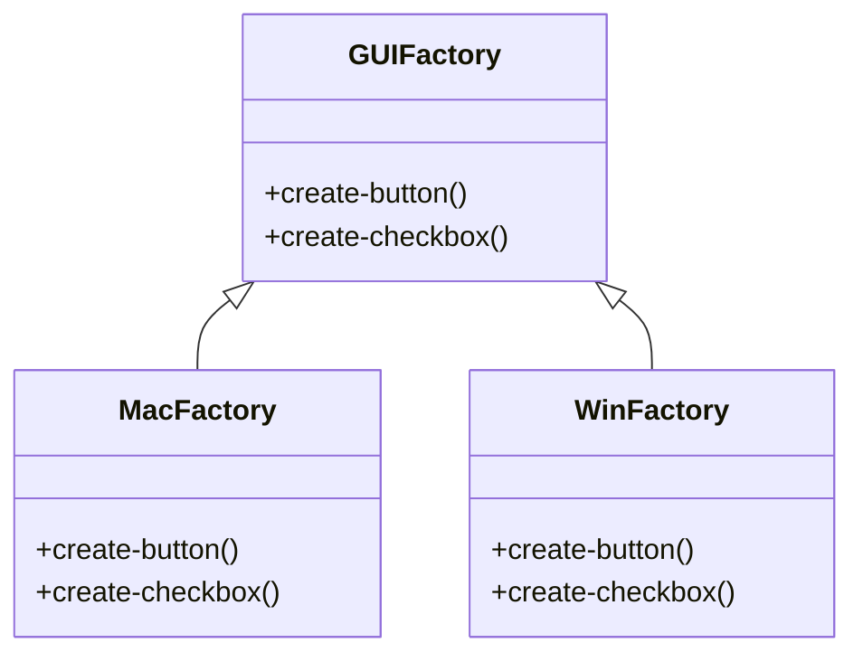

## 2.1.1 Abstract Factory (GoF) in Clojure

### Introduction

The Abstract Factory pattern is a creational design pattern that provides an interface for creating families of related or dependent objects without specifying their concrete classes. This pattern is particularly useful when a system needs to be independent of how its objects are created, composed, and represented. In Clojure, a functional programming language with dynamic typing, we can implement the Abstract Factory pattern using protocols and multimethods, offering a unique approach compared to traditional object-oriented languages.

### Detailed Explanation

#### Purpose and Structure

The Abstract Factory pattern aims to encapsulate a group of individual factories that have a common theme. It provides a way to create objects that are related by a common interface, without having to specify the exact class of the object that will be created. This is particularly useful in scenarios where you want to switch between different families of products without altering the client code.

In Clojure, we can leverage protocols to define the interfaces for the abstract products and use records or maps to implement concrete factories. This approach aligns with Clojure's emphasis on immutability and functional programming.

#### Protocols and Multimethods

Clojure's protocols provide a way to define a set of functions that can be implemented by different data types. This is similar to interfaces in object-oriented programming. Multimethods, on the other hand, allow for method dispatch based on multiple criteria, offering flexibility in function implementation.

### Implementing Abstract Factory in Clojure

#### Step 1: Define Protocols

First, we define a protocol that declares the functions representing the abstract products. In this example, we have a `GUIFactory` protocol with methods to create buttons and checkboxes.

```clojure
(defprotocol GUIFactory
  (create-button [this])
  (create-checkbox [this]))
```

#### Step 2: Implement Concrete Factories

Next, we create concrete factory implementations using records. Each factory implements the `GUIFactory` protocol and provides specific implementations for the button and checkbox creation.

```clojure
(defrecord MacFactory []
  GUIFactory
  (create-button [this] (MacButton.))
  (create-checkbox [this] (MacCheckbox.)))

(defrecord WinFactory []
  GUIFactory
  (create-button [this] (WinButton.))
  (create-checkbox [this] (WinCheckbox.)))
```

Here, `MacButton`, `MacCheckbox`, `WinButton`, and `WinCheckbox` would be other records or data structures representing the concrete products.

#### Step 3: Use the Factory

We can now write functions that utilize the factory without depending on concrete implementations. This allows for flexibility and scalability in the application.

```clojure
(defn render [factory]
  (let [btn (create-button factory)
        chk (create-checkbox factory)]
    ;; Use btn and chk
    ))
```

#### Step 4: Select Factory at Runtime

Finally, we decide which factory to use based on configuration or context. This decision can be made at runtime, allowing the application to adapt to different environments or requirements.

```clojure
(def factory (if mac-os?
               (->MacFactory)
               (->WinFactory)))
```

### Visual Aids

#### Conceptual Diagram



### Use Cases

The Abstract Factory pattern is ideal for applications that need to support multiple platforms or themes. For instance, a GUI application might need to render differently on macOS and Windows. By using the Abstract Factory pattern, the application can switch between different UI components seamlessly.

### Advantages and Disadvantages

#### Advantages

- **Decoupling:** The pattern decouples the client code from the concrete classes, enhancing flexibility and scalability.
- **Consistency:** Ensures that related objects are used together, maintaining consistency across the application.
- **Ease of Maintenance:** Changes to the product families can be made independently without affecting the client code.

#### Disadvantages

- **Complexity:** The pattern can introduce additional complexity, especially if there are many product families.
- **Overhead:** Implementing the pattern may require more boilerplate code compared to simpler solutions.

### Best Practices

- **Use Protocols Wisely:** Leverage Clojure's protocols to define clear and concise interfaces for your abstract products.
- **Embrace Immutability:** Ensure that your concrete products and factories are immutable, aligning with Clojure's functional programming principles.
- **Consider Multimethods:** Use multimethods for more complex dispatching logic, allowing for greater flexibility in your factory implementations.

### Comparisons

The Abstract Factory pattern is often compared to the Factory Method pattern. While both patterns deal with object creation, the Abstract Factory pattern focuses on creating families of related objects, whereas the Factory Method pattern is concerned with creating a single product.

### Conclusion

The Abstract Factory pattern is a powerful tool for managing object creation in a flexible and scalable manner. By leveraging Clojure's protocols and records, developers can implement this pattern in a way that aligns with functional programming principles, ensuring maintainable and robust codebases.

## Quiz Time!



### What is the primary purpose of the Abstract Factory pattern?

- [x] To create families of related objects without specifying their concrete classes.
- [ ] To provide a single interface for creating an object.
- [ ] To encapsulate a request as an object.
- [ ] To define a one-to-many dependency between objects.

> **Explanation:** The Abstract Factory pattern is designed to create families of related objects without specifying their concrete classes, allowing for flexibility and scalability.


### In Clojure, which feature is used to define interfaces for abstract products?

- [x] Protocols
- [ ] Macros
- [ ] Atoms
- [ ] Agents

> **Explanation:** Protocols in Clojure are used to define a set of functions that can be implemented by different data types, similar to interfaces in OOP.


### What is a key advantage of using the Abstract Factory pattern?

- [x] It decouples the client code from concrete classes.
- [ ] It simplifies the code by reducing the number of classes.
- [ ] It ensures that only one instance of a class is created.
- [ ] It allows for dynamic method dispatch.

> **Explanation:** The Abstract Factory pattern decouples the client code from concrete classes, enhancing flexibility and scalability.


### How does Clojure's dynamic typing affect the implementation of the Abstract Factory pattern?

- [x] It allows for more flexible implementations compared to static typing.
- [ ] It requires additional type checks at runtime.
- [ ] It limits the use of protocols.
- [ ] It enforces strict type constraints.

> **Explanation:** Clojure's dynamic typing allows for more flexible implementations of design patterns like Abstract Factory, as it doesn't enforce strict type constraints.


### Which Clojure feature can be used for complex dispatching logic in factory implementations?

- [x] Multimethods
- [ ] Refs
- [ ] Futures
- [ ] Vars

> **Explanation:** Multimethods in Clojure allow for method dispatch based on multiple criteria, providing flexibility in function implementation.


### What is a potential disadvantage of the Abstract Factory pattern?

- [x] It can introduce additional complexity.
- [ ] It limits the number of objects that can be created.
- [ ] It enforces a strict hierarchy of classes.
- [ ] It reduces code readability.

> **Explanation:** The Abstract Factory pattern can introduce additional complexity, especially if there are many product families.


### Which of the following is a real-world use case for the Abstract Factory pattern?

- [x] Creating UI components for different operating systems.
- [ ] Managing database connections.
- [ ] Implementing a logging system.
- [ ] Handling user authentication.

> **Explanation:** The Abstract Factory pattern is ideal for creating UI components that need to render differently on different operating systems.


### What is the role of records in the Abstract Factory pattern in Clojure?

- [x] To implement concrete factories.
- [ ] To define abstract products.
- [ ] To manage state changes.
- [ ] To handle concurrency.

> **Explanation:** In Clojure, records are used to implement concrete factories that provide specific implementations for the abstract products.


### How does the Abstract Factory pattern ensure consistency across an application?

- [x] By ensuring that related objects are used together.
- [ ] By enforcing strict type constraints.
- [ ] By reducing the number of classes.
- [ ] By simplifying the code structure.

> **Explanation:** The Abstract Factory pattern ensures consistency by ensuring that related objects are used together, maintaining uniformity across the application.


### True or False: The Abstract Factory pattern is only applicable in object-oriented programming languages.

- [ ] True
- [x] False

> **Explanation:** False. The Abstract Factory pattern can be implemented in functional programming languages like Clojure, leveraging features like protocols and records.


