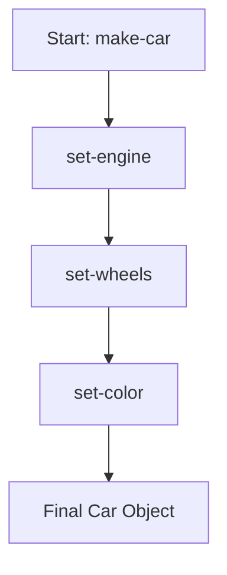

## 2.1.2 Builder (GoF) in Clojure

The Builder pattern is a creational design pattern that provides a flexible solution for constructing complex objects. In Clojure, where immutability and functional programming are core principles, the Builder pattern can be adapted to create complex data structures in a clean and maintainable way. This article delves into the Builder pattern's application in Clojure, demonstrating how to construct objects with numerous parameters using function chaining and threading macros.

### Introduction

In traditional object-oriented programming, the Builder pattern is used to construct complex objects step by step. It separates the construction of a complex object from its representation, allowing the same construction process to create different representations. In Clojure, we adapt this pattern to work with immutable data structures, leveraging the language's functional capabilities.

### Detailed Explanation

#### Scenarios for Using the Builder Pattern

The Builder pattern is particularly useful in scenarios where:

- An object requires numerous parameters for its construction.
- The construction process involves several steps or configurations.
- The object needs to be immutable, requiring a new instance for each modification.

#### Immutable Data Structures in Clojure

Clojure's emphasis on immutability means that once a data structure is created, it cannot be modified. This necessitates a different approach for building complex objects, where each step in the construction process returns a new instance of the object.

#### Function Chaining and Threading Macros

Clojure's threading macros, such as `->`, allow for a clean and readable way to chain function calls. This is particularly useful for simulating the Builder pattern, where each function call represents a step in the construction process.

### Implementing the Builder Pattern in Clojure

#### Define Initial Data Structure

Start by defining a base data structure, typically a map, representing the object to be constructed.

```clojure
(defn make-car []
  {:engine nil :wheels nil :color nil})
```

#### Create Builder Functions

Next, create functions to set each attribute of the object. Each function returns a new map with the updated attribute, ensuring immutability.

```clojure
(defn set-engine [car engine]
  (assoc car :engine engine))

(defn set-wheels [car wheels]
  (assoc car :wheels wheels))

(defn set-color [car color]
  (assoc car :color color))
```

#### Chain Functions with Threading Macros

Use the `->` threading macro to chain the builder functions, constructing the object step by step.

```clojure
(def my-car
  (-> (make-car)
      (set-engine "V8")
      (set-wheels 4)
      (set-color "Red")))
```

#### Ensure Immutability

Each builder function returns a new instance of the object, preserving immutability. This is a key aspect of functional programming and ensures that data remains consistent and predictable.

#### Provide Defaults if Necessary

To simplify object creation, you can provide default values using `merge`. This allows for easy customization while maintaining sensible defaults.

```clojure
(def default-car {:engine "V6" :wheels 4 :color "Black"})

(defn make-custom-car [overrides]
  (merge default-car overrides))
```

### Visualizing the Builder Pattern

Below is a conceptual diagram illustrating the Builder pattern in Clojure:



### Use Cases

The Builder pattern is applicable in various real-world scenarios, such as:

- Constructing configuration objects with numerous optional parameters.
- Building complex data structures in a domain-specific language (DSL).
- Creating immutable objects in a system where state changes frequently.

### Advantages and Disadvantages

#### Advantages

- **Clarity and Readability:** The use of threading macros and function chaining makes the construction process clear and easy to follow.
- **Immutability:** Each step returns a new object, ensuring that data remains immutable and consistent.
- **Flexibility:** The pattern allows for flexible object construction, accommodating various configurations and defaults.

#### Disadvantages

- **Overhead:** For simple objects, the Builder pattern may introduce unnecessary complexity.
- **Performance:** Creating new instances for each modification can be less efficient than modifying an existing object, though this is mitigated by Clojure's efficient handling of immutable data.

### Best Practices

- **Use When Necessary:** Apply the Builder pattern when constructing complex objects with numerous parameters. For simpler objects, consider alternative approaches.
- **Leverage Defaults:** Use default values to simplify the construction process and reduce the number of required parameters.
- **Maintain Immutability:** Ensure that each builder function returns a new instance, preserving the immutability of data structures.

### Comparisons with Other Patterns

The Builder pattern is often compared with the Factory Method pattern. While both are creational patterns, the Builder pattern is more suited for complex objects with multiple configuration options, whereas the Factory Method is ideal for creating objects without exposing the instantiation logic.

### Conclusion

The Builder pattern in Clojure provides a powerful mechanism for constructing complex objects in a functional and immutable manner. By leveraging function chaining and threading macros, developers can create flexible and maintainable code that adheres to Clojure's core principles.

## Quiz Time!



### What is the primary purpose of the Builder pattern in Clojure?

- [x] To construct complex objects with numerous parameters in a flexible manner.
- [ ] To modify existing objects in place.
- [ ] To enforce strict type checking.
- [ ] To optimize performance by reducing object creation.

> **Explanation:** The Builder pattern is used to construct complex objects with numerous parameters, allowing for flexible and incremental building.

### How does Clojure ensure immutability when using the Builder pattern?

- [x] By returning a new instance of the object with each modification.
- [ ] By modifying the original object directly.
- [ ] By using mutable data structures.
- [ ] By enforcing compile-time checks.

> **Explanation:** Clojure ensures immutability by returning a new instance of the object with each modification, preserving the original data.

### Which Clojure macro is commonly used to chain functions in the Builder pattern?

- [x] `->`
- [ ] `->>`
- [ ] `doto`
- [ ] `let`

> **Explanation:** The `->` threading macro is commonly used to chain functions in the Builder pattern, allowing for a clean and readable construction process.

### What is a key advantage of using the Builder pattern in Clojure?

- [x] It provides clarity and readability in constructing complex objects.
- [ ] It reduces the need for function calls.
- [ ] It allows for direct modification of objects.
- [ ] It enforces strict type safety.

> **Explanation:** The Builder pattern provides clarity and readability by using function chaining and threading macros to construct complex objects.

### When should you consider using default values in the Builder pattern?

- [x] When you want to simplify object creation and provide sensible defaults.
- [ ] When you need to enforce strict parameter requirements.
- [ ] When performance is the primary concern.
- [ ] When you want to avoid using threading macros.

> **Explanation:** Default values simplify object creation by providing sensible defaults, reducing the number of required parameters.

### What is a potential disadvantage of the Builder pattern in Clojure?

- [x] It may introduce unnecessary complexity for simple objects.
- [ ] It enforces mutable data structures.
- [ ] It limits the number of parameters an object can have.
- [ ] It requires the use of Java interop.

> **Explanation:** For simple objects, the Builder pattern may introduce unnecessary complexity compared to more straightforward approaches.

### How does the Builder pattern compare to the Factory Method pattern?

- [x] The Builder pattern is more suited for complex objects with multiple configuration options.
- [ ] The Builder pattern is used for creating objects without exposing instantiation logic.
- [ ] The Builder pattern enforces strict type checking.
- [ ] The Builder pattern is primarily used for performance optimization.

> **Explanation:** The Builder pattern is more suited for complex objects with multiple configuration options, while the Factory Method is ideal for creating objects without exposing instantiation logic.

### What is a common use case for the Builder pattern in Clojure?

- [x] Constructing configuration objects with numerous optional parameters.
- [ ] Enforcing strict type safety.
- [ ] Optimizing performance by reducing object creation.
- [ ] Modifying existing objects in place.

> **Explanation:** A common use case for the Builder pattern is constructing configuration objects with numerous optional parameters, allowing for flexible customization.

### Which of the following is a best practice when implementing the Builder pattern in Clojure?

- [x] Ensure that each builder function returns a new instance, preserving immutability.
- [ ] Modify the original object directly for efficiency.
- [ ] Use mutable data structures to simplify the process.
- [ ] Avoid using defaults to enforce strict parameter requirements.

> **Explanation:** A best practice is to ensure that each builder function returns a new instance, preserving the immutability of data structures.

### True or False: The Builder pattern in Clojure can be used to modify existing objects directly.

- [ ] True
- [x] False

> **Explanation:** False. The Builder pattern in Clojure constructs new instances with each modification, preserving immutability and not modifying existing objects directly.


