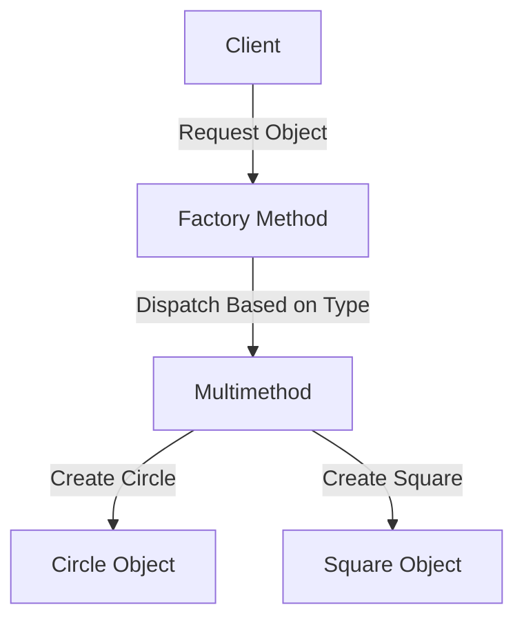

## 2.1.3 Factory Method (GoF) in Clojure

### Introduction

The Factory Method pattern is a creational design pattern that provides an interface for creating objects in a superclass but allows subclasses to alter the type of objects that will be created. In Clojure, a functional language, we can leverage its dynamic capabilities and multimethods to implement this pattern without relying on class-based inheritance. This approach enhances flexibility and scalability, allowing for easy extension and maintenance.

### Detailed Explanation

The Factory Method pattern in Clojure involves using multimethods to delegate the creation of objects based on a specified type. This method of object creation is particularly useful when the exact types of objects to be created are determined at runtime.

#### Key Concepts

- **Delegation of Object Creation:** The pattern delegates the responsibility of instantiating objects to specific methods or functions, which can be dynamically determined.
- **Polymorphic Dispatch:** Clojure's multimethods allow for polymorphic dispatch based on a dispatch function, enabling flexible and dynamic object creation.
- **Encapsulation of Creation Logic:** The instantiation details are encapsulated within the multimethod implementations, promoting separation of concerns.

### Visual Aids

#### Conceptual Diagram



### Code Examples

Let's explore how to implement the Factory Method pattern in Clojure using multimethods.

#### Define a Multimethod for Object Creation

We start by defining a multimethod `create-shape` that will dispatch based on the `:type` key in the input map.

```clojure
(defmulti create-shape :type)
```

#### Implement Concrete Methods with `defmethod`

Next, we define specific methods for each shape type using `defmethod`.

```clojure
(defmethod create-shape :circle [params]
  (make-circle (:radius params)))

(defmethod create-shape :square [params]
  (make-square (:length params)))
```

Here, `make-circle` and `make-square` are functions that encapsulate the logic for creating circle and square objects, respectively.

#### Use the Factory Method

To create objects, we simply call the `create-shape` function with the appropriate parameters.

```clojure
(def circle (create-shape {:type :circle :radius 5}))
(def square (create-shape {:type :square :length 10}))
```

#### Encapsulate Creation Logic

The instantiation logic is hidden within the multimethod implementations, allowing for clean and maintainable code.

#### Extend Easily

Adding new shapes is straightforward. Simply define a new method for the new shape type without altering existing code.

```clojure
(defmethod create-shape :triangle [params]
  (make-triangle (:base params) (:height params)))
```

### Use Cases

The Factory Method pattern is particularly useful in scenarios where:

- The exact types of objects to be created are determined at runtime.
- The system needs to be open for extension but closed for modification, adhering to the Open/Closed Principle.
- There is a need to encapsulate the instantiation logic and promote separation of concerns.

### Advantages and Disadvantages

#### Advantages

- **Flexibility:** Easily extendable to accommodate new types without modifying existing code.
- **Encapsulation:** Creation logic is encapsulated within the factory methods, promoting separation of concerns.
- **Polymorphism:** Leverages Clojure's polymorphic dispatch for dynamic object creation.

#### Disadvantages

- **Complexity:** Can introduce additional complexity if overused or applied inappropriately.
- **Performance:** May incur a slight performance overhead due to dynamic dispatch.

### Best Practices

- **Use Descriptive Dispatch Functions:** Ensure that the dispatch function is clear and descriptive to facilitate understanding and maintenance.
- **Encapsulate Complex Logic:** Keep the creation logic within the multimethod implementations to maintain clean and organized code.
- **Leverage Clojure's Functional Features:** Utilize Clojure's functional programming paradigms, such as higher-order functions, to enhance the flexibility and power of your factory methods.

### Comparisons

The Factory Method pattern can be compared to other creational patterns like Abstract Factory and Builder. While Abstract Factory provides an interface for creating families of related objects, Factory Method focuses on delegating the creation of a single object type. The Builder pattern, on the other hand, is used for constructing complex objects step by step.

### Conclusion

The Factory Method pattern in Clojure, implemented using multimethods, offers a powerful and flexible approach to object creation. By leveraging Clojure's dynamic capabilities and functional paradigms, developers can create scalable and maintainable systems that are easy to extend and modify.

## Quiz Time!



### What is the primary purpose of the Factory Method pattern?

- [x] To delegate object creation to subclasses or specific methods.
- [ ] To create a single instance of a class.
- [ ] To provide a simplified interface to a complex subsystem.
- [ ] To compose objects into tree structures.

> **Explanation:** The Factory Method pattern delegates the responsibility of object creation to subclasses or specific methods, allowing for flexible and dynamic instantiation.

### How does Clojure implement the Factory Method pattern?

- [x] Using multimethods and polymorphic dispatch.
- [ ] Using class-based inheritance.
- [ ] Using singletons.
- [ ] Using decorators.

> **Explanation:** Clojure uses multimethods and polymorphic dispatch to implement the Factory Method pattern, leveraging its dynamic and functional capabilities.

### What is the role of `defmulti` in Clojure's Factory Method pattern?

- [x] It defines a multimethod for dispatching based on a specified function.
- [ ] It creates a single instance of an object.
- [ ] It encapsulates the creation logic within a class.
- [ ] It provides a simplified interface to a complex subsystem.

> **Explanation:** `defmulti` is used to define a multimethod in Clojure, allowing for dispatch based on a specified function, which is crucial for implementing the Factory Method pattern.

### Which of the following is a benefit of using the Factory Method pattern in Clojure?

- [x] Flexibility in extending the system with new types.
- [ ] Guaranteed single instance of an object.
- [ ] Simplified interface to a complex subsystem.
- [ ] Reduced memory usage through shared instances.

> **Explanation:** The Factory Method pattern provides flexibility in extending the system with new types by allowing new methods to be added without modifying existing code.

### What is a potential disadvantage of the Factory Method pattern?

- [x] It can introduce additional complexity.
- [ ] It restricts the system to a single instance of an object.
- [ ] It simplifies the interface to a complex subsystem.
- [ ] It reduces memory usage through shared instances.

> **Explanation:** The Factory Method pattern can introduce additional complexity if overused or applied inappropriately, as it involves dynamic dispatch and multiple methods.

### How can new shapes be added to the Factory Method pattern in Clojure?

- [x] By defining a new method using `defmethod`.
- [ ] By modifying the existing `defmulti`.
- [ ] By creating a new class.
- [ ] By using a singleton pattern.

> **Explanation:** New shapes can be added by defining a new method using `defmethod`, which allows for easy extension without modifying existing code.

### What does the `:type` key represent in the `create-shape` multimethod?

- [x] It is the dispatch value used to determine which method to call.
- [ ] It is the name of the shape being created.
- [ ] It is the size of the shape.
- [ ] It is the color of the shape.

> **Explanation:** The `:type` key is used as the dispatch value in the `create-shape` multimethod to determine which specific method to call for object creation.

### Which principle does the Factory Method pattern adhere to by allowing easy extension?

- [x] Open/Closed Principle.
- [ ] Single Responsibility Principle.
- [ ] Liskov Substitution Principle.
- [ ] Interface Segregation Principle.

> **Explanation:** The Factory Method pattern adheres to the Open/Closed Principle by allowing the system to be open for extension but closed for modification.

### What is the main difference between Factory Method and Abstract Factory patterns?

- [x] Factory Method focuses on creating a single object type, while Abstract Factory creates families of related objects.
- [ ] Factory Method creates a single instance, while Abstract Factory creates multiple instances.
- [ ] Factory Method simplifies interfaces, while Abstract Factory reduces memory usage.
- [ ] Factory Method uses inheritance, while Abstract Factory uses composition.

> **Explanation:** The main difference is that Factory Method focuses on creating a single object type, while Abstract Factory is concerned with creating families of related objects.

### True or False: The Factory Method pattern in Clojure relies on class-based inheritance.

- [ ] True
- [x] False

> **Explanation:** False. The Factory Method pattern in Clojure does not rely on class-based inheritance; instead, it uses multimethods and polymorphic dispatch.


