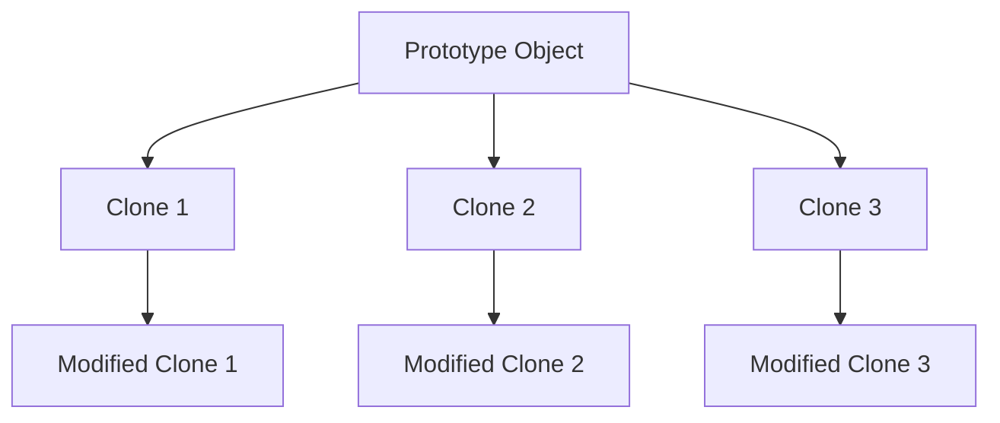

---

linkTitle: "2.1.4 Prototype (GoF) in Clojure"
title: "Prototype Pattern in Clojure: Efficient Object Creation with Immutability"
description: "Explore the Prototype design pattern in Clojure, leveraging immutable data structures for efficient object cloning and modification."
categories:
- Design Patterns
- Clojure Programming
- Software Development
tags:
- Prototype Pattern
- Clojure
- Immutable Data
- Creational Patterns
- Software Design
date: 2024-10-25
type: docs
nav_weight: 214000
canonical: "https://softwarepatternslexicon.com/patterns-clojure/2/1/4"
license: "© 2024 Tokenizer Inc. CC BY-NC-SA 4.0"
---

## 2.1.4 Prototype (GoF) in Clojure

### Introduction

The Prototype pattern is a creational design pattern that allows for the creation of new objects by cloning existing ones. This approach is particularly useful when object creation is costly or complex. In Clojure, the Prototype pattern is naturally aligned with the language's emphasis on immutability and functional programming. By leveraging Clojure's immutable data structures, we can efficiently clone and modify objects without affecting the originals, making this pattern both performant and safe.

### Detailed Explanation

The Prototype pattern involves creating a base object, known as the prototype, and then cloning it to produce new objects. This is especially beneficial in scenarios where the cost of creating a new object from scratch is high. In Clojure, cloning is made efficient through structural sharing, a feature of its persistent data structures.

#### Key Concepts

- **Cloning for Performance:** Cloning existing objects can be a performant way to create new objects, especially when the creation process is resource-intensive.
- **Immutable Data Structures:** Clojure's immutable data structures inherently support efficient copying, as they share structure between copies.
- **Safe Modifications:** Modifying copies doesn't affect the original due to immutability, ensuring data integrity.

### Visual Aids

#### Conceptual Diagram



*Diagram 1: Cloning and modifying prototype objects in Clojure.*

### Code Examples

Let's explore how to implement the Prototype pattern in Clojure with practical examples.

#### Creating a Prototype Instance

First, we define a base object that serves as the prototype.

```clojure
(def default-character {:health 100 :mana 50 :level 1})
```

This `default-character` map acts as our prototype, encapsulating the default attributes of a character.

#### Cloning and Modifying the Prototype

We can create new instances by cloning the prototype and modifying specific attributes using `assoc`.

```clojure
(def hero (assoc default-character :name "Hero" :class "Warrior"))
(def mage (assoc default-character :name "Mage" :class "Wizard" :mana 150))
```

Here, `hero` and `mage` are new instances derived from `default-character`, each with unique attributes.

#### Abstracting the Cloning Process

To streamline the creation of new instances, we can write a function that clones prototypes with custom attributes.

```clojure
(defn make-character [prototype attrs]
  (merge prototype attrs))
```

Using `make-character`, we can easily create new characters:

```clojure
(def rogue (make-character default-character {:name "Rogue" :class "Thief" :stealth 80}))
```

### Use Cases

The Prototype pattern is particularly useful in scenarios where:

- **Performance is Critical:** When creating objects is resource-intensive, cloning can save time and resources.
- **Complex Initialization:** When objects require complex setup or configuration, cloning simplifies the process.
- **Immutable Data:** In functional programming, where immutability is a core principle, cloning ensures data integrity.

### Advantages and Disadvantages

#### Advantages

- **Efficiency:** Cloning is often faster than creating new objects from scratch, especially with complex initialization.
- **Simplicity:** Reduces the complexity of object creation by reusing existing instances.
- **Safety:** Immutable data structures ensure that modifications to clones do not affect the original.

#### Disadvantages

- **Memory Usage:** Cloning can lead to increased memory usage if not managed properly, although Clojure's structural sharing mitigates this.
- **Complexity in Management:** Managing a large number of prototypes can become complex if not organized well.

### Best Practices

- **Utilize Structural Sharing:** Leverage Clojure's persistent data structures to efficiently manage memory and performance.
- **Abstract Cloning Logic:** Use functions to encapsulate cloning logic, making it reusable and maintainable.
- **Avoid Unnecessary Cloning:** Reuse prototypes when possible to minimize resource consumption.

### Comparisons

The Prototype pattern can be compared with other creational patterns like Factory Method and Abstract Factory. While factories focus on creating objects without specifying their concrete classes, the Prototype pattern emphasizes cloning existing instances. This makes it more suitable for scenarios where object creation is costly or complex.

### Conclusion

The Prototype pattern in Clojure offers a powerful way to efficiently create new objects by cloning existing ones. By leveraging Clojure's immutable data structures, developers can ensure performance and safety, making this pattern an excellent choice for scenarios requiring complex or resource-intensive object creation.

## Quiz Time!



### What is the primary advantage of using the Prototype pattern in Clojure?

- [x] Efficient object creation through cloning
- [ ] Simplifying the interface of a class
- [ ] Enforcing a single instance of a class
- [ ] Separating object creation from its representation

> **Explanation:** The Prototype pattern allows for efficient object creation by cloning existing instances, which is particularly useful when object creation is costly or complex.

### How does Clojure's immutability benefit the Prototype pattern?

- [x] It ensures that modifications to clones do not affect the original.
- [ ] It allows for mutable state changes.
- [ ] It requires explicit synchronization for thread safety.
- [ ] It mandates the use of global variables.

> **Explanation:** Clojure's immutability ensures that when a clone is modified, the original remains unchanged, maintaining data integrity.

### Which Clojure function is commonly used to modify a cloned prototype?

- [x] `assoc`
- [ ] `reduce`
- [ ] `filter`
- [ ] `map`

> **Explanation:** The `assoc` function is used to add or update key-value pairs in a map, making it ideal for modifying cloned prototypes.

### What is structural sharing in Clojure?

- [x] A technique that allows efficient memory usage by sharing parts of data structures
- [ ] A method for synchronizing threads
- [ ] A way to enforce immutability
- [ ] A pattern for organizing code

> **Explanation:** Structural sharing allows Clojure to efficiently manage memory by sharing unchanged parts of data structures between copies.

### In which scenario is the Prototype pattern most beneficial?

- [x] When object creation is resource-intensive
- [ ] When objects need to be created in a specific order
- [ ] When objects require a single point of access
- [ ] When objects need to be serialized

> **Explanation:** The Prototype pattern is beneficial when object creation is resource-intensive, as it allows for efficient cloning of existing instances.

### What is a potential disadvantage of the Prototype pattern?

- [x] Increased memory usage if not managed properly
- [ ] Difficulty in creating new instances
- [ ] Lack of flexibility in object creation
- [ ] Inability to modify cloned objects

> **Explanation:** While Clojure's structural sharing mitigates memory usage, improper management of clones can still lead to increased memory consumption.

### How can the cloning process be abstracted in Clojure?

- [x] By writing a function that merges custom attributes with the prototype
- [ ] By using global variables to store prototypes
- [ ] By creating a new class for each clone
- [ ] By using a loop to iterate over prototypes

> **Explanation:** Writing a function that merges custom attributes with the prototype allows for an abstracted and reusable cloning process.

### What is the role of a prototype in the Prototype pattern?

- [x] It serves as a base object for cloning.
- [ ] It defines the interface for creating objects.
- [ ] It manages the lifecycle of objects.
- [ ] It provides a single point of access to objects.

> **Explanation:** In the Prototype pattern, the prototype serves as a base object from which new instances are cloned.

### Which of the following is a key concept of the Prototype pattern?

- [x] Cloning for performance
- [ ] Enforcing a single instance
- [ ] Separating interface from implementation
- [ ] Managing object dependencies

> **Explanation:** Cloning for performance is a key concept of the Prototype pattern, as it allows for efficient creation of new objects.

### True or False: In Clojure, modifying a cloned prototype affects the original prototype.

- [x] False
- [ ] True

> **Explanation:** In Clojure, due to immutability, modifying a cloned prototype does not affect the original prototype.


