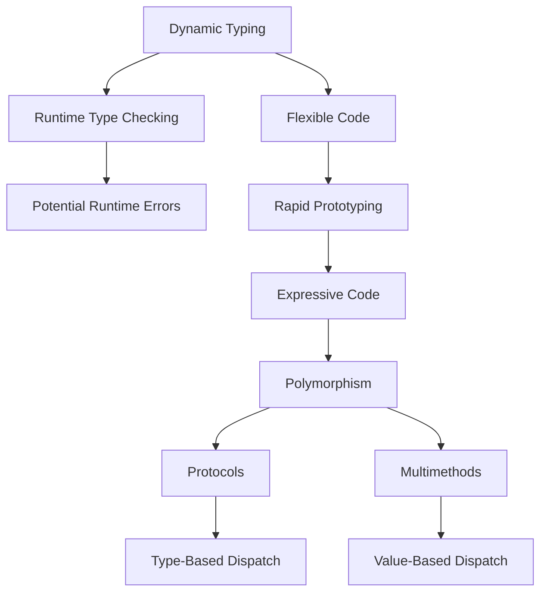

## 2.10. Dynamic Typing and Polymorphism

Clojure, a modern Lisp dialect running on the Java Virtual Machine (JVM), embraces a dynamic type system that offers flexibility and expressiveness. In this section, we will delve into the concepts of dynamic typing and polymorphism in Clojure, exploring how they enable developers to write adaptable and concise code. We will also discuss the use of protocols and multimethods to achieve polymorphic behavior, highlighting the benefits and challenges associated with dynamic typing.

### Understanding Dynamic Typing in Clojure

Dynamic typing in Clojure means that the type of a variable is determined at runtime rather than at compile time. This contrasts with statically typed languages, where types are checked during compilation. In Clojure, you can assign any type of value to a variable without declaring its type explicitly. This flexibility allows for rapid prototyping and concise code.

#### Dynamic Typing vs. Static Typing

- **Dynamic Typing**: Types are associated with values, not variables. This allows for greater flexibility but can lead to runtime errors if types are not handled carefully.
- **Static Typing**: Types are associated with variables, and type checking occurs at compile time. This can prevent certain types of errors but may require more boilerplate code.

**Example of Dynamic Typing in Clojure:**

```clojure
(defn add [a b]
  (+ a b))

;; Works with integers
(println (add 2 3)) ; Output: 5

;; Works with floats
(println (add 2.5 3.5)) ; Output: 6.0

;; Works with strings (concatenation)
(println (add "Hello, " "world!")) ; Output: Hello, world!
```

In the example above, the `add` function can operate on integers, floats, and strings without any type declarations.

### Polymorphism in Clojure

Polymorphism allows functions to operate on different types of data. In Clojure, polymorphism is achieved through protocols and multimethods, which provide a way to define behavior that can vary based on the type of the arguments.

#### Protocols

Protocols in Clojure are similar to interfaces in other languages. They define a set of functions that can be implemented by different types. This allows for polymorphic behavior where the same function can operate differently depending on the type of the data.

**Defining and Using Protocols:**

```clojure
(defprotocol Drawable
  (draw [this]))

(defrecord Circle [radius]
  Drawable
  (draw [this]
    (println "Drawing a circle with radius" radius)))

(defrecord Square [side]
  Drawable
  (draw [this]
    (println "Drawing a square with side" side)))

(def c (->Circle 5))
(def s (->Square 10))

(draw c) ; Output: Drawing a circle with radius 5
(draw s) ; Output: Drawing a square with side 10
```

In this example, the `Drawable` protocol defines a `draw` function. Both `Circle` and `Square` implement this protocol, providing their own versions of the `draw` function.

#### Multimethods

Multimethods provide another way to achieve polymorphism in Clojure. They allow you to define a function that can have different implementations based on the value of one or more of its arguments. Multimethods are more flexible than protocols because they can dispatch on any criteria, not just the type of the first argument.

**Defining and Using Multimethods:**

```clojure
(defmulti area :shape)

(defmethod area :circle
  [{:keys [radius]}]
  (* Math/PI radius radius))

(defmethod area :square
  [{:keys [side]}]
  (* side side))

(def circle {:shape :circle :radius 5})
(def square {:shape :square :side 10})

(println (area circle)) ; Output: 78.53981633974483
(println (area square)) ; Output: 100
```

Here, the `area` multimethod dispatches on the `:shape` key in the map, allowing different implementations for circles and squares.

### Benefits of Dynamic Typing and Polymorphism

- **Flexibility**: Dynamic typing allows for more flexible and concise code, reducing the need for boilerplate.
- **Rapid Prototyping**: Developers can quickly iterate and test ideas without being constrained by type declarations.
- **Expressiveness**: Polymorphism enables functions to handle a wide range of data types, making code more expressive and reusable.

### Challenges of Dynamic Typing

- **Runtime Errors**: Without compile-time type checking, errors may only surface at runtime, potentially leading to bugs that are harder to diagnose.
- **Performance**: Dynamic typing can introduce overhead, as type checks are performed at runtime.
- **Readability**: Code can become less readable if types are not clear from the context, making it harder for others to understand.

### Thoughtful Use of Types

While dynamic typing offers flexibility, it is essential to use types thoughtfully to avoid runtime errors. Consider using Clojure's `spec` library to define and validate data structures, ensuring that functions receive the expected types.

**Example Using Clojure Spec:**

```clojure
(require '[clojure.spec.alpha :as s])

(s/def ::radius number?)
(s/def ::circle (s/keys :req-un [::radius]))

(defn draw-circle [circle]
  (if (s/valid? ::circle circle)
    (println "Drawing circle with radius" (:radius circle))
    (println "Invalid circle")))

(draw-circle {:radius 5}) ; Output: Drawing circle with radius 5
(draw-circle {:radius "five"}) ; Output: Invalid circle
```

In this example, `spec` is used to ensure that the `draw-circle` function receives a valid circle map.

### Visualizing Dynamic Typing and Polymorphism

To better understand how dynamic typing and polymorphism work in Clojure, let's visualize the process using a Mermaid.js diagram.



This diagram illustrates the flow from dynamic typing to polymorphism, highlighting the benefits and challenges along the way.

### Encouraging Experimentation

As you explore dynamic typing and polymorphism in Clojure, try modifying the code examples to see how they behave with different data types. Experiment with creating your own protocols and multimethods to gain a deeper understanding of these concepts.

### References and Further Reading

- [Clojure Official Documentation](https://clojure.org/)
- [Clojure Spec Guide](https://clojure.org/guides/spec)
- [Clojure Multimethods](https://clojure.org/reference/multimethods)
- [Clojure Protocols](https://clojure.org/reference/protocols)

### Key Takeaways

- Dynamic typing in Clojure allows for flexible and concise code but requires careful handling to avoid runtime errors.
- Polymorphism is achieved through protocols and multimethods, enabling functions to operate on different data types.
- Thoughtful use of types and validation can mitigate the challenges of dynamic typing.

Remember, this is just the beginning. As you progress, you'll discover more ways to leverage Clojure's dynamic typing and polymorphism to write robust and elegant code. Keep experimenting, stay curious, and enjoy the journey!

## **Ready to Test Your Knowledge?**



### What is dynamic typing in Clojure?

- [x] Types are determined at runtime.
- [ ] Types are determined at compile time.
- [ ] Types are explicitly declared.
- [ ] Types are inferred by the compiler.

> **Explanation:** In Clojure, dynamic typing means that types are determined at runtime, allowing for greater flexibility.

### Which of the following is a benefit of dynamic typing?

- [x] Flexibility and rapid prototyping.
- [ ] Compile-time error checking.
- [ ] Improved performance.
- [ ] Reduced runtime errors.

> **Explanation:** Dynamic typing allows for flexibility and rapid prototyping, but it does not provide compile-time error checking.

### How does Clojure achieve polymorphism?

- [x] Through protocols and multimethods.
- [ ] Through inheritance.
- [ ] Through interfaces only.
- [ ] Through abstract classes.

> **Explanation:** Clojure uses protocols and multimethods to achieve polymorphism, allowing functions to operate on different data types.

### What is a protocol in Clojure?

- [x] A set of functions that can be implemented by different types.
- [ ] A class that defines methods.
- [ ] A function that dispatches on multiple criteria.
- [ ] A type declaration.

> **Explanation:** A protocol in Clojure is a set of functions that can be implemented by different types, similar to interfaces in other languages.

### What is a multimethod in Clojure?

- [x] A function with different implementations based on argument values.
- [ ] A function that only operates on one type.
- [ ] A method defined in a class.
- [ ] A type declaration.

> **Explanation:** A multimethod in Clojure is a function that can have different implementations based on the value of one or more of its arguments.

### What is a potential challenge of dynamic typing?

- [x] Runtime errors.
- [ ] Compile-time errors.
- [ ] Increased code verbosity.
- [ ] Reduced flexibility.

> **Explanation:** A potential challenge of dynamic typing is runtime errors, as types are not checked at compile time.

### How can you mitigate the challenges of dynamic typing in Clojure?

- [x] By using Clojure's spec library for validation.
- [ ] By avoiding polymorphism.
- [ ] By using static typing.
- [ ] By writing more code.

> **Explanation:** Using Clojure's spec library for validation can help ensure that functions receive the expected types, mitigating runtime errors.

### Which of the following is true about protocols in Clojure?

- [x] They define a set of functions for different types.
- [ ] They are used for compile-time type checking.
- [ ] They are only used for single dispatch.
- [ ] They require explicit type declarations.

> **Explanation:** Protocols in Clojure define a set of functions that can be implemented by different types, enabling polymorphism.

### Which of the following is true about multimethods in Clojure?

- [x] They allow dispatch based on any criteria.
- [ ] They are limited to type-based dispatch.
- [ ] They require explicit type declarations.
- [ ] They are used for compile-time type checking.

> **Explanation:** Multimethods in Clojure allow dispatch based on any criteria, providing flexibility in function implementation.

### Dynamic typing in Clojure allows for compile-time error checking.

- [ ] True
- [x] False

> **Explanation:** Dynamic typing in Clojure does not allow for compile-time error checking; types are determined at runtime.


