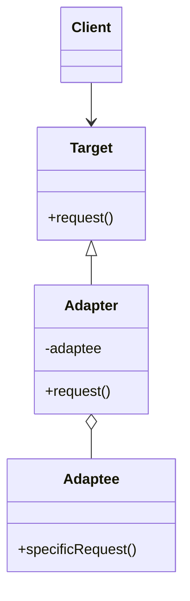

## 2.2.1 Adapter (GoF) in Clojure

In the realm of software design, the Adapter pattern is a structural pattern that plays a crucial role in making incompatible interfaces compatible. This pattern allows objects with incompatible interfaces to collaborate by acting as a bridge between them. In Clojure, the Adapter pattern can be effectively implemented using protocols and records, enabling seamless integration with existing code or third-party libraries without modifying them.

### Introduction

The Adapter pattern is essential when you need to integrate a new system with an existing one, especially when the interfaces do not match. It allows for the conversion of one interface into another, making it possible for classes to work together that otherwise couldn't due to incompatible interfaces.

### Detailed Explanation

The Adapter pattern involves creating an intermediary that translates the interface of one class into an interface expected by the clients. In Clojure, this can be achieved using protocols to define the target interface and records to implement the adapter.

#### Recognizing the Need for an Adapter

Consider a scenario where you have a legacy system with a specific interface, and you want to use a new library that does not conform to this interface. Instead of modifying the existing system or the library, you can create an adapter that conforms to the expected interface and delegates calls to the new library.

#### Defining the Target Protocol

The first step in implementing the Adapter pattern in Clojure is to define the target protocol. This protocol represents the interface that the client expects.

```clojure
(defprotocol Target
  (request [this]))
```

#### Implementing the Adapter

Next, you implement the adapter using a record. The adapter will implement the target protocol and internally use an instance of the adaptee (the class with the incompatible interface) to fulfill the requests.

```clojure
(defrecord Adapter [adaptee]
  Target
  (request [this]
    (specific-request adaptee)))
```

In this implementation, `specific-request` is a function provided by the adaptee that does not match the `request` method expected by the client.

#### Using the Adapter

To use the adapter, you create an instance of the adaptee and then wrap it with the adapter. The client interacts with the adapter as if it were the adaptee.

```clojure
(def adaptee (->Adaptee))
(def adapter (->Adapter adaptee))
(request adapter)
```

### Visual Aids

To better understand the Adapter pattern, let's visualize the interaction between the client, adapter, and adaptee.



### Use Cases

- **Legacy System Integration:** When integrating new components into a legacy system, adapters can bridge the gap between old and new interfaces.
- **Third-Party Library Usage:** Adapters allow you to use third-party libraries that do not conform to your application's interface requirements.
- **Interface Standardization:** In systems where multiple components need to adhere to a standard interface, adapters can ensure compliance without altering the components themselves.

### Advantages and Disadvantages

#### Advantages

- **Flexibility:** Adapters provide a flexible way to integrate incompatible interfaces without modifying existing code.
- **Reusability:** Once created, adapters can be reused across different parts of the application.
- **Decoupling:** Adapters decouple the client from the adaptee, promoting a cleaner architecture.

#### Disadvantages

- **Complexity:** Introducing adapters can add complexity to the system, especially if overused.
- **Performance Overhead:** There might be a slight performance overhead due to the additional layer of abstraction.

### Best Practices

- **Minimal Interface:** Keep the adapter interface minimal to reduce complexity and improve maintainability.
- **Single Responsibility:** Ensure that the adapter only handles the translation between interfaces and does not introduce additional logic.
- **Documentation:** Clearly document the purpose and usage of adapters to aid future developers in understanding their role.

### Comparisons

The Adapter pattern is often compared to the Facade pattern. While both provide a simplified interface, the Adapter pattern focuses on converting an existing interface into one that the client expects, whereas the Facade pattern provides a new interface to a set of interfaces in a subsystem.

### Conclusion

The Adapter pattern is a powerful tool in the software design arsenal, enabling seamless integration of incompatible interfaces. By leveraging Clojure's protocols and records, developers can implement this pattern effectively, ensuring that their systems remain flexible and maintainable.

## Quiz Time!



### What is the primary purpose of the Adapter pattern?

- [x] To make incompatible interfaces work together
- [ ] To provide a simplified interface to a complex subsystem
- [ ] To manage object creation
- [ ] To encapsulate a request as an object

> **Explanation:** The Adapter pattern is used to make incompatible interfaces work together by acting as a bridge between them.

### Which Clojure construct is used to define the target interface in the Adapter pattern?

- [x] Protocol
- [ ] Record
- [ ] Multimethod
- [ ] Namespace

> **Explanation:** In Clojure, a protocol is used to define the target interface that the adapter will implement.

### What is the role of the Adapter in the Adapter pattern?

- [x] It translates method calls to the adaptee's interface
- [ ] It creates objects
- [ ] It manages object lifecycles
- [ ] It provides a simplified interface to a subsystem

> **Explanation:** The Adapter translates method calls from the client to the adaptee's interface, allowing them to work together.

### How does the Adapter pattern promote decoupling?

- [x] By separating the client from the adaptee
- [ ] By combining multiple interfaces into one
- [ ] By managing object creation
- [ ] By encapsulating a request as an object

> **Explanation:** The Adapter pattern promotes decoupling by separating the client from the adaptee, allowing them to interact through the adapter.

### What is a potential disadvantage of using the Adapter pattern?

- [x] It can add complexity to the system
- [ ] It simplifies the interface
- [ ] It improves performance
- [ ] It reduces code reuse

> **Explanation:** Introducing adapters can add complexity to the system, especially if overused.

### In the Adapter pattern, what is the 'adaptee'?

- [x] The class with the incompatible interface
- [ ] The client class
- [ ] The interface expected by the client
- [ ] The simplified interface to a subsystem

> **Explanation:** The adaptee is the class with the incompatible interface that the adapter translates for the client.

### Which of the following is a best practice when implementing the Adapter pattern?

- [x] Keep the adapter interface minimal
- [ ] Add additional logic to the adapter
- [ ] Use the adapter to manage object lifecycles
- [ ] Combine multiple adapters into one

> **Explanation:** Keeping the adapter interface minimal reduces complexity and improves maintainability.

### What is the difference between the Adapter and Facade patterns?

- [x] Adapter converts interfaces, Facade provides a new interface
- [ ] Adapter manages object creation, Facade simplifies interfaces
- [ ] Adapter encapsulates requests, Facade manages object lifecycles
- [ ] Adapter simplifies interfaces, Facade converts interfaces

> **Explanation:** The Adapter pattern converts an existing interface into one that the client expects, while the Facade pattern provides a new interface to a set of interfaces in a subsystem.

### Which Clojure construct is used to implement the adapter in the Adapter pattern?

- [x] Record
- [ ] Protocol
- [ ] Multimethod
- [ ] Namespace

> **Explanation:** In Clojure, a record is used to implement the adapter, which conforms to the target protocol.

### True or False: The Adapter pattern can be used to integrate third-party libraries without modifying them.

- [x] True
- [ ] False

> **Explanation:** The Adapter pattern allows you to integrate third-party libraries by creating an adapter that conforms to the expected interface, without modifying the library itself.


