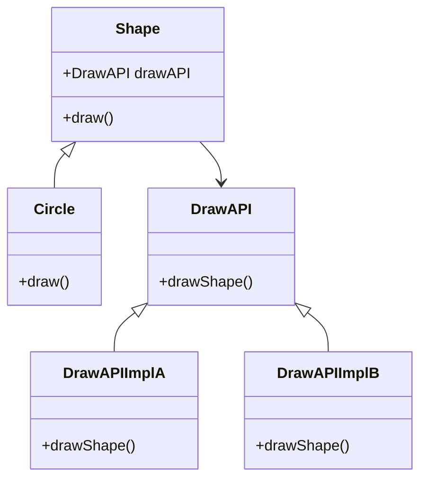

## 2.2.2 Bridge (GoF) in Clojure

### Introduction

The Bridge design pattern is a structural pattern that aims to decouple an abstraction from its implementation, allowing both to vary independently. This pattern is particularly useful in scenarios where you want to avoid a permanent binding between an abstraction and its implementation. In Clojure, we can leverage protocols and records to effectively implement the Bridge pattern, promoting flexibility and scalability in our codebase.

### Detailed Explanation

The Bridge pattern involves four main components:

1. **Abstraction**: Defines the interface for the control part of the two-class system. It maintains a reference to the implementor.
2. **Refined Abstraction**: Extends the interface defined by Abstraction.
3. **Implementor**: Defines the interface for implementation classes. This interface doesn't need to correspond directly to Abstraction's interface; in fact, the two interfaces can be quite different.
4. **Concrete Implementor**: Implements the Implementor interface and defines its concrete implementation.

#### Decoupling Abstraction from Implementation

The primary goal of the Bridge pattern is to separate the abstraction from its implementation so that both can evolve independently. This separation is achieved by introducing an interface (or protocol in Clojure) that the abstraction uses to perform its operations, while the actual implementation is provided by concrete classes (or records in Clojure).

### Visual Representation

Here's a conceptual diagram illustrating the Bridge pattern:



### Implementing the Bridge Pattern in Clojure

Let's walk through the implementation of the Bridge pattern in Clojure using protocols and records.

#### Step 1: Define the Abstraction Protocol

The `Shape` protocol acts as the abstraction, defining the `draw` method that concrete shapes will implement.

```clojure
(defprotocol Shape
  (draw [this]))
```

#### Step 2: Define the Implementor Protocol

The `DrawAPI` protocol serves as the implementor, providing the `draw-shape` method that different drawing APIs will implement.

```clojure
(defprotocol DrawAPI
  (draw-shape [this]))
```

#### Step 3: Implement Concrete Implementors

Here, we define two concrete implementors, `DrawAPIImplA` and `DrawAPIImplB`, each providing a specific implementation of the `draw-shape` method.

```clojure
(defrecord DrawAPIImplA []
  DrawAPI
  (draw-shape [this] (println "Drawing shape with API A")))

(defrecord DrawAPIImplB []
  DrawAPI
  (draw-shape [this] (println "Drawing shape with API B")))
```

#### Step 4: Implement the Abstraction with Implementor

The `Circle` record represents a refined abstraction that uses a `DrawAPI` to perform its `draw` operation.

```clojure
(defrecord Circle [draw-api]
  Shape
  (draw [this]
    (draw-shape draw-api)))
```

#### Step 5: Use the Bridge Pattern

Finally, we create instances of `Circle` using different drawing APIs and invoke the `draw` method to see the Bridge pattern in action.

```clojure
(def circle-a (->Circle (->DrawAPIImplA)))
(def circle-b (->Circle (->DrawAPIImplB)))

(draw circle-a) ;; Output: Drawing shape with API A
(draw circle-b) ;; Output: Drawing shape with API B
```

### Use Cases

The Bridge pattern is particularly useful in the following scenarios:

- **When you need to switch implementations at runtime**: The Bridge pattern allows you to change the implementation of an abstraction dynamically.
- **When you want to extend a class in multiple orthogonal dimensions**: By separating abstraction from implementation, you can extend both independently.
- **When you want to hide implementation details from clients**: The Bridge pattern encapsulates implementation details, exposing only the abstraction to clients.

### Advantages and Disadvantages

#### Advantages

- **Decouples Interface and Implementation**: Promotes separation of concerns by decoupling the interface from its implementation.
- **Improves Flexibility**: Allows for the independent extension of both abstraction and implementation.
- **Enhances Maintainability**: Simplifies code maintenance by reducing the dependency between abstraction and implementation.

#### Disadvantages

- **Increased Complexity**: Introduces additional layers of abstraction, which can increase the complexity of the codebase.
- **Overhead**: May introduce overhead due to the additional indirection between abstraction and implementation.

### Best Practices

- **Use Protocols and Records**: Leverage Clojure's protocols and records to define abstractions and implementations, respectively.
- **Keep Interfaces Simple**: Ensure that the interfaces (protocols) are simple and focused on a single responsibility.
- **Favor Composition Over Inheritance**: Use composition to achieve the separation of abstraction and implementation, rather than relying on inheritance.

### Comparisons

The Bridge pattern is often compared with the Adapter pattern. While both patterns deal with interfaces, the Bridge pattern is used to separate abstraction from implementation, whereas the Adapter pattern is used to make existing interfaces compatible with each other.

### Conclusion

The Bridge design pattern is a powerful tool for decoupling abstraction from implementation, allowing both to vary independently. By leveraging Clojure's protocols and records, developers can implement this pattern effectively, enhancing the flexibility and maintainability of their codebases.

## Quiz Time!



### What is the primary purpose of the Bridge design pattern?

- [x] To decouple abstraction from implementation
- [ ] To provide a simplified interface to a complex subsystem
- [ ] To allow an object to alter its behavior when its internal state changes
- [ ] To define a family of algorithms, encapsulate each one, and make them interchangeable

> **Explanation:** The Bridge pattern's primary purpose is to decouple abstraction from implementation, allowing both to vary independently.

### Which Clojure construct is used to define the abstraction in the Bridge pattern?

- [x] Protocol
- [ ] Record
- [ ] Multimethod
- [ ] Namespace

> **Explanation:** In Clojure, a protocol is used to define the abstraction in the Bridge pattern.

### What is the role of the Implementor in the Bridge pattern?

- [x] To define the interface for implementation classes
- [ ] To provide a simplified interface to a complex subsystem
- [ ] To encapsulate a request as an object
- [ ] To compose objects into tree structures

> **Explanation:** The Implementor defines the interface for implementation classes in the Bridge pattern.

### How does the Bridge pattern improve flexibility?

- [x] By allowing independent extension of both abstraction and implementation
- [ ] By providing a simplified interface to a complex subsystem
- [ ] By encapsulating a request as an object
- [ ] By composing objects into tree structures

> **Explanation:** The Bridge pattern improves flexibility by allowing the independent extension of both abstraction and implementation.

### Which of the following is a disadvantage of the Bridge pattern?

- [x] Increased complexity
- [ ] Tight coupling between abstraction and implementation
- [ ] Lack of flexibility
- [ ] Poor maintainability

> **Explanation:** The Bridge pattern can introduce increased complexity due to additional layers of abstraction.

### What is the output of the following code snippet?
```clojure
(def circle-a (->Circle (->DrawAPIImplA)))
(draw circle-a)
```

- [x] Drawing shape with API A
- [ ] Drawing shape with API B
- [ ] Drawing shape with API C
- [ ] No output

> **Explanation:** The `draw` method of `circle-a` uses `DrawAPIImplA`, resulting in the output "Drawing shape with API A".

### In the Bridge pattern, what is the relationship between the Abstraction and Implementor?

- [x] The Abstraction maintains a reference to the Implementor
- [ ] The Implementor maintains a reference to the Abstraction
- [ ] They are independent and do not reference each other
- [ ] They are tightly coupled

> **Explanation:** In the Bridge pattern, the Abstraction maintains a reference to the Implementor.

### Which Clojure construct is used to define concrete implementors in the Bridge pattern?

- [x] Record
- [ ] Protocol
- [ ] Multimethod
- [ ] Namespace

> **Explanation:** In Clojure, a record is used to define concrete implementors in the Bridge pattern.

### What is a common use case for the Bridge pattern?

- [x] When you need to switch implementations at runtime
- [ ] When you want to provide a simplified interface to a complex subsystem
- [ ] When you need to encapsulate a request as an object
- [ ] When you want to compose objects into tree structures

> **Explanation:** A common use case for the Bridge pattern is when you need to switch implementations at runtime.

### True or False: The Bridge pattern is used to make existing interfaces compatible with each other.

- [ ] True
- [x] False

> **Explanation:** False. The Bridge pattern is used to decouple abstraction from implementation, not to make existing interfaces compatible with each other.


