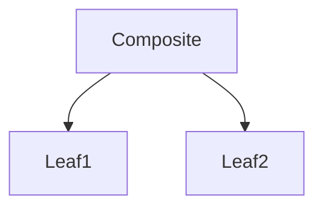

## 2.2.3 Composite (GoF) in Clojure

The Composite design pattern is a structural pattern from the Gang of Four (GoF) that allows you to compose objects into tree structures to represent part-whole hierarchies. This pattern enables clients to treat individual objects and compositions of objects uniformly. In Clojure, the Composite pattern can be effectively implemented using recursive data structures such as lists or maps, along with protocols and records to define and manage components.

### Introduction

The Composite pattern is particularly useful when you need to work with tree-like structures or when you want to treat a group of objects in the same way as a single object. This pattern is commonly used in graphical user interfaces, file systems, and other hierarchical data representations.

### Detailed Explanation

In Clojure, the Composite pattern can be implemented using protocols to define a common interface for both leaf and composite objects. Records are used to create concrete implementations of these interfaces. The key idea is to allow both individual objects (leaves) and compositions of objects (composites) to be treated uniformly through a common interface.

#### Defining the Component Protocol

The first step in implementing the Composite pattern is to define a protocol that specifies the operations that can be performed on both leaf and composite objects. In Clojure, this is done using the `defprotocol` construct.

```clojure
(defprotocol Component
  (operation [this]))
```

This protocol defines a single method, `operation`, which will be implemented by both leaf and composite components.

#### Implementing Leaf Components

Leaf components are the simplest form of components in the Composite pattern. They represent individual objects that do not have any children. In Clojure, leaf components can be implemented using records.

```clojure
(defrecord Leaf [name]
  Component
  (operation [this]
    (println "Leaf operation on" name)))
```

In this implementation, the `Leaf` record has a single field, `name`, and implements the `operation` method defined in the `Component` protocol. The `operation` method simply prints a message indicating that an operation is being performed on the leaf.

#### Implementing Composite Components

Composite components are more complex than leaf components because they can contain other components, including both leaves and other composites. In Clojure, composite components can also be implemented using records.

```clojure
(defrecord Composite [children]
  Component
  (operation [this]
    (doseq [child children]
      (operation child))))
```

The `Composite` record has a single field, `children`, which is a collection of components. The `operation` method iterates over each child and calls its `operation` method, effectively propagating the operation to all child components.

#### Building the Composite Structure

With the component protocol and concrete implementations in place, you can now build a composite structure by creating instances of leaf and composite components.

```clojure
(def leaf1 (->Leaf "Leaf1"))
(def leaf2 (->Leaf "Leaf2"))
(def composite (->Composite [leaf1 leaf2]))
```

In this example, two leaf components are created, and a composite component is created that contains these leaves as its children.

#### Executing Operations

Once the composite structure is built, you can execute operations on it. The operation will be propagated to all components in the structure, demonstrating the uniform treatment of individual and composite objects.

```clojure
(operation composite)
```

This will output:

```
Leaf operation on Leaf1
Leaf operation on Leaf2
```

### Visual Aids

To better understand the Composite pattern, let's visualize the structure using a diagram.



In this diagram, the `Composite` node has two children, `Leaf1` and `Leaf2`, illustrating the hierarchical structure of the composite pattern.

### Use Cases

The Composite pattern is widely applicable in scenarios where you need to work with hierarchical data structures. Some common use cases include:

- **Graphical User Interfaces (GUIs):** Representing UI components such as windows, panels, and buttons in a hierarchical manner.
- **File Systems:** Modeling directories and files, where directories can contain both files and other directories.
- **Document Structures:** Representing documents with nested elements such as sections, paragraphs, and text.

### Advantages and Disadvantages

#### Advantages

- **Uniformity:** Treats individual objects and compositions uniformly, simplifying client code.
- **Flexibility:** Easily extendable to add new types of components.
- **Simplicity:** Reduces complexity by allowing clients to interact with a single interface.

#### Disadvantages

- **Complexity:** Can introduce unnecessary complexity if the hierarchy is simple.
- **Overhead:** May incur performance overhead due to recursive operations on large structures.

### Best Practices

- **Use Protocols:** Leverage Clojure's protocols to define common interfaces for components.
- **Immutable Data Structures:** Use immutable data structures to ensure thread safety and reduce side effects.
- **Recursive Functions:** Utilize recursive functions to traverse and operate on composite structures.

### Comparisons

The Composite pattern is often compared with other structural patterns such as Decorator and Proxy. While all these patterns involve composition, the Composite pattern is unique in its ability to represent part-whole hierarchies and treat individual and composite objects uniformly.

### Conclusion

The Composite design pattern is a powerful tool for managing hierarchical data structures in Clojure. By leveraging protocols, records, and recursive data structures, you can create flexible and maintainable systems that treat individual objects and compositions uniformly. This pattern is particularly useful in scenarios where you need to work with tree-like structures or when you want to simplify client interactions with complex hierarchies.

## Quiz Time!



### What is the primary purpose of the Composite design pattern?

- [x] To compose objects into tree structures and treat them uniformly.
- [ ] To enhance the performance of individual objects.
- [ ] To simplify the creation of singleton objects.
- [ ] To manage concurrent operations in a system.

> **Explanation:** The Composite pattern is designed to compose objects into tree structures to represent part-whole hierarchies, allowing clients to treat individual objects and compositions uniformly.

### In Clojure, which construct is used to define a common interface for components in the Composite pattern?

- [x] Protocols
- [ ] Macros
- [ ] Atoms
- [ ] Agents

> **Explanation:** Protocols in Clojure are used to define a common interface for components, allowing both leaf and composite objects to implement the same set of operations.

### How are leaf components typically implemented in Clojure when using the Composite pattern?

- [x] Using records
- [ ] Using macros
- [ ] Using refs
- [ ] Using agents

> **Explanation:** Leaf components in the Composite pattern are typically implemented using records in Clojure, which provide a way to define concrete implementations of protocols.

### What is a key advantage of using the Composite pattern?

- [x] It allows for uniform treatment of individual and composite objects.
- [ ] It automatically optimizes performance of operations.
- [ ] It simplifies the creation of concurrent systems.
- [ ] It ensures data consistency across distributed systems.

> **Explanation:** A key advantage of the Composite pattern is that it allows for uniform treatment of individual and composite objects, simplifying client code.

### Which of the following is a common use case for the Composite pattern?

- [x] Graphical User Interfaces
- [ ] Real-time data processing
- [ ] Network communication protocols
- [ ] Cryptographic algorithms

> **Explanation:** The Composite pattern is commonly used in graphical user interfaces to represent UI components in a hierarchical manner.

### What is a potential disadvantage of the Composite pattern?

- [x] It can introduce unnecessary complexity if the hierarchy is simple.
- [ ] It requires extensive use of mutable state.
- [ ] It is not compatible with functional programming principles.
- [ ] It cannot be used with recursive data structures.

> **Explanation:** A potential disadvantage of the Composite pattern is that it can introduce unnecessary complexity if the hierarchy is simple, as the overhead of managing the structure may not be justified.

### How does the Composite pattern handle operations on composite structures?

- [x] By recursively calling operations on child components.
- [ ] By using concurrent threads for each operation.
- [ ] By caching results of operations.
- [ ] By delegating operations to a central manager.

> **Explanation:** The Composite pattern handles operations on composite structures by recursively calling operations on child components, allowing the operation to propagate through the hierarchy.

### Which Clojure feature is essential for implementing recursive operations in the Composite pattern?

- [x] Recursive functions
- [ ] Transducers
- [ ] Futures
- [ ] Agents

> **Explanation:** Recursive functions are essential for implementing operations in the Composite pattern, as they allow for traversal and manipulation of hierarchical structures.

### What is the role of the `operation` method in the Composite pattern?

- [x] To define the behavior that should be executed on both leaf and composite components.
- [ ] To manage the lifecycle of components.
- [ ] To handle concurrent access to shared resources.
- [ ] To optimize memory usage in composite structures.

> **Explanation:** The `operation` method in the Composite pattern defines the behavior that should be executed on both leaf and composite components, ensuring uniformity in operations.

### True or False: The Composite pattern is only applicable to object-oriented programming languages.

- [ ] True
- [x] False

> **Explanation:** False. The Composite pattern is applicable to both object-oriented and functional programming languages, including Clojure, where it can be implemented using protocols and records.


