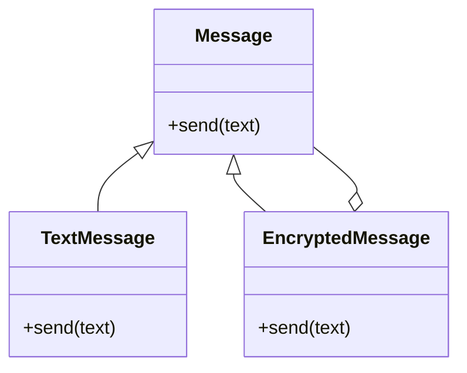

## 2.2.4 Decorator (GoF) in Clojure

### Introduction

The Decorator Pattern is a structural design pattern that allows behavior to be added to individual objects, either statically or dynamically, without affecting the behavior of other objects from the same class. This pattern is particularly useful when you want to add responsibilities to objects without modifying their code. In Clojure, we can leverage its functional programming paradigms, such as higher-order functions and records, to implement the Decorator Pattern effectively.

### Detailed Explanation

The core idea of the Decorator Pattern is to wrap an object to provide additional behavior while maintaining the same interface. This is achieved by creating a set of decorator classes that are used to wrap concrete components. Each decorator class has a reference to a component and implements the same interface as the component it decorates.

#### Key Concepts

- **Component Interface:** Defines the interface for objects that can have responsibilities added to them dynamically.
- **Concrete Component:** The original object that we want to add new behavior to.
- **Decorator:** Maintains a reference to a component object and defines an interface that conforms to the component's interface.
- **Concrete Decorators:** Extend the functionality of the component by adding new behavior.

### Visual Representation

Let's visualize the Decorator Pattern to understand the relationships between the components and decorators:



### Implementing the Decorator Pattern in Clojure

#### Step 1: Define the Component Protocol

First, we define a protocol that represents the component interface. This protocol will be implemented by both the concrete component and the decorators.

```clojure
(defprotocol Message
  (send [this text]))
```

#### Step 2: Implement the Concrete Component

Next, we implement the concrete component that will be decorated. In this example, `TextMessage` is a simple implementation of the `Message` protocol.

```clojure
(defrecord TextMessage []
  Message
  (send [this text]
    (println "Sending message:" text)))
```

#### Step 3: Implement the Decorator

The decorator is implemented as a record that also implements the `Message` protocol. It holds a reference to a component and adds additional behavior.

```clojure
(defrecord EncryptedMessage [component]
  Message
  (send [this text]
    (send component (encrypt text))))

(defn encrypt [text]
  (str "Encrypted(" text ")"))
```

#### Step 4: Compose Decorators

We can now create instances of our component and decorators, and compose them to add behavior dynamically.

```clojure
(def message (->TextMessage))
(def secure-message (->EncryptedMessage message))
(send secure-message "Hello")
```

This will output:

```
Sending message: Encrypted(Hello)
```

#### Step 5: Chain Multiple Decorators

Clojure's functional nature allows us to easily chain multiple decorators. For example, if we wanted to add logging functionality, we could create another decorator:

```clojure
(defrecord LoggedMessage [component]
  Message
  (send [this text]
    (println "Logging message:" text)
    (send component text)))

(def logged-secure-message (->LoggedMessage secure-message))
(send logged-secure-message "Hello")
```

This will output:

```
Logging message: Hello
Sending message: Encrypted(Hello)
```

### Use Cases

The Decorator Pattern is particularly useful in scenarios where:

- You need to add responsibilities to objects without modifying their code.
- You want to add behavior to objects dynamically at runtime.
- You need to adhere to the Open/Closed Principle, allowing objects to be open for extension but closed for modification.

### Advantages and Disadvantages

#### Advantages

- **Flexibility:** Allows for dynamic addition of behavior without modifying existing code.
- **Adheres to SOLID Principles:** Specifically, the Open/Closed Principle.
- **Reusability:** Decorators can be reused across different components.

#### Disadvantages

- **Complexity:** Can lead to a large number of small classes that can be difficult to manage.
- **Overhead:** Each decorator adds a layer of wrapping, which can introduce performance overhead.

### Best Practices

- Use decorators to add cross-cutting concerns like logging, security, or caching.
- Keep decorators focused on a single responsibility to maintain clarity and reusability.
- Consider using higher-order functions for simpler use cases where full decorator classes are unnecessary.

### Comparisons

The Decorator Pattern is often compared to other patterns like the Proxy Pattern. While both involve wrapping objects, decorators add behavior, whereas proxies control access.

### Conclusion

The Decorator Pattern is a powerful tool in a developer's toolkit, allowing for flexible and dynamic behavior extension. In Clojure, leveraging functional programming paradigms like higher-order functions and records makes implementing this pattern both elegant and efficient.

## Quiz Time!



### What is the primary purpose of the Decorator Pattern?

- [x] To add responsibilities to objects dynamically
- [ ] To create a single instance of a class
- [ ] To provide a simplified interface to a complex system
- [ ] To separate the construction of a complex object from its representation

> **Explanation:** The Decorator Pattern is used to add responsibilities to objects dynamically without altering their structure.

### Which Clojure construct is commonly used to implement the Decorator Pattern?

- [x] Records
- [ ] Atoms
- [ ] Refs
- [ ] Agents

> **Explanation:** Records in Clojure are used to implement the Decorator Pattern as they can hold references to other objects and implement protocols.

### How does the Decorator Pattern adhere to the Open/Closed Principle?

- [x] By allowing objects to be extended with new behavior without modifying existing code
- [ ] By ensuring that objects are closed for modification
- [ ] By providing a single point of access to an object
- [ ] By encapsulating object creation

> **Explanation:** The Decorator Pattern allows objects to be open for extension by adding new behavior while being closed for modification.

### What is the role of a Concrete Component in the Decorator Pattern?

- [x] It is the original object that can be decorated with additional behavior
- [ ] It defines the interface for objects that can be decorated
- [ ] It maintains a reference to a component object
- [ ] It adds new behavior to an object

> **Explanation:** The Concrete Component is the original object that can be decorated with additional behavior.

### What is a potential disadvantage of using the Decorator Pattern?

- [x] It can lead to a large number of small classes
- [ ] It makes objects immutable
- [ ] It requires the use of global variables
- [ ] It prevents code reuse

> **Explanation:** The Decorator Pattern can lead to a large number of small classes, which can increase complexity.

### In Clojure, how can multiple decorators be applied to a single component?

- [x] By chaining decorators using function composition
- [ ] By using global state
- [ ] By modifying the component directly
- [ ] By using a single decorator

> **Explanation:** In Clojure, multiple decorators can be applied by chaining them using function composition or nesting.

### What is a common use case for the Decorator Pattern?

- [x] Adding logging functionality to an object
- [ ] Creating a single instance of a class
- [ ] Managing object lifecycle
- [ ] Separating data access logic

> **Explanation:** A common use case for the Decorator Pattern is adding logging functionality to an object.

### Which of the following is NOT a characteristic of the Decorator Pattern?

- [ ] It maintains the same interface as the component it decorates
- [ ] It allows for dynamic behavior addition
- [x] It requires modifying the original component
- [ ] It can be used to add cross-cutting concerns

> **Explanation:** The Decorator Pattern does not require modifying the original component; it adds behavior dynamically.

### How does the Decorator Pattern differ from the Proxy Pattern?

- [x] Decorators add behavior, while proxies control access
- [ ] Proxies add behavior, while decorators control access
- [ ] Both patterns serve the same purpose
- [ ] Decorators and proxies are unrelated

> **Explanation:** Decorators add behavior to objects, while proxies control access to them.

### True or False: The Decorator Pattern can only be used with object-oriented programming languages.

- [ ] True
- [x] False

> **Explanation:** The Decorator Pattern can be implemented in functional programming languages like Clojure using constructs like higher-order functions and records.


