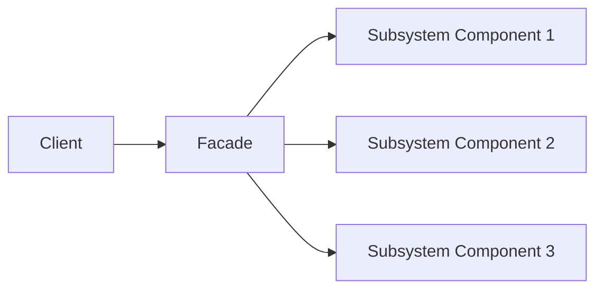

## 2.2.5 Facade (GoF) in Clojure

In the realm of software design, complexity often arises from the intricate interactions between various components of a system. The Facade design pattern, one of the classic Gang of Four (GoF) structural patterns, addresses this complexity by providing a unified interface to a set of interfaces in a subsystem. This pattern is particularly useful in Clojure, where functional programming paradigms can be leveraged to create clean and maintainable code.

### Introduction to the Facade Pattern

The Facade pattern simplifies the interface for interacting with complex subsystems. By encapsulating the complexities of the subsystem, it provides a higher-level interface that is easier to use and understand. This not only enhances code readability but also promotes a separation of concerns, allowing developers to interact with the subsystem without needing to understand its internal workings.

### Detailed Explanation

#### Components of the Facade Pattern

1. **Subsystem Components**: These are the individual components that make up the complex subsystem. Each component has its own set of responsibilities and interfaces.
2. **Facade Interface**: This is the simplified interface that provides access to the subsystem's functionality. It delegates client requests to appropriate subsystem objects.

#### Workflow of the Facade Pattern

The Facade pattern works by creating a single entry point for the subsystem, which internally manages the interactions between the various components. This approach hides the complexities and provides a streamlined interface for the client.

### Visual Representation

Here's a conceptual diagram illustrating the Facade pattern:



In this diagram, the client interacts with the Facade, which in turn communicates with the various components of the subsystem.

### Implementing the Facade Pattern in Clojure

Let's explore how to implement the Facade pattern in Clojure with a practical example.

#### Identifying Subsystem Components

Consider a scenario where we have a subsystem responsible for compiling, linking, and loading a program. Each of these tasks is handled by a separate function:

```clojure
(defn compile-code [code]
  ;; Simulate code compilation
  (str "compiled-" code))

(defn link-code [compiled-code]
  ;; Simulate code linking
  (str "linked-" compiled-code))

(defn load-program [binary]
  ;; Simulate loading the program
  (str "program-loaded: " binary))
```

#### Creating the Facade Function

The Facade function provides a simplified interface to the subsystem by chaining the operations together:

```clojure
(defn run-program [code]
  (-> code
      compile-code
      link-code
      load-program))
```

#### Using the Facade

The client can now use the Facade to interact with the subsystem without worrying about the underlying complexities:

```clojure
(run-program "print('Hello')")
;; => "program-loaded: linked-compiled-print('Hello')"
```

### Advantages and Disadvantages

#### Advantages

- **Simplified Interface**: The Facade pattern provides a simplified interface to complex subsystems, making it easier for clients to use.
- **Encapsulation**: It encapsulates the complexities of the subsystem, promoting a separation of concerns.
- **Improved Maintainability**: By decoupling the client from the subsystem, changes to the subsystem do not affect the client code.

#### Disadvantages

- **Limited Flexibility**: The Facade pattern may limit the flexibility of the client if it needs to access specific functionalities of the subsystem.
- **Overhead**: Introducing a Facade may add an additional layer of abstraction, which could be unnecessary for simple subsystems.

### Best Practices

- **Use When Necessary**: Apply the Facade pattern when dealing with complex subsystems that require a simplified interface.
- **Maintain Transparency**: Ensure that the Facade does not obscure important functionalities of the subsystem that the client may need.
- **Combine with Other Patterns**: Consider combining the Facade pattern with other design patterns, such as the Adapter or Proxy patterns, to enhance functionality and flexibility.

### Comparisons with Other Patterns

The Facade pattern is often compared with the Adapter and Proxy patterns. While the Adapter pattern focuses on converting interfaces to make them compatible, and the Proxy pattern controls access to objects, the Facade pattern aims to simplify the interface to a complex subsystem.

### Conclusion

The Facade design pattern is a powerful tool for managing complexity in software systems. By providing a unified interface to a set of interfaces, it simplifies interactions with complex subsystems, enhancing code maintainability and readability. In Clojure, the Facade pattern can be effectively implemented using functional programming constructs, making it a valuable addition to any developer's toolkit.

## Quiz Time!



### What is the primary purpose of the Facade design pattern?

- [x] To provide a unified interface to a set of interfaces in a subsystem
- [ ] To convert the interface of a class into another interface
- [ ] To control access to an object
- [ ] To define a family of algorithms

> **Explanation:** The Facade pattern provides a unified interface to simplify interactions with complex subsystems.

### Which of the following is a key advantage of using the Facade pattern?

- [x] Simplifies the interface for interacting with complex subsystems
- [ ] Increases the flexibility of the client
- [ ] Reduces the need for encapsulation
- [ ] Enhances the complexity of the subsystem

> **Explanation:** The Facade pattern simplifies the interface, making it easier for clients to interact with complex subsystems.

### In the provided Clojure example, what does the `run-program` function do?

- [x] It compiles, links, and loads a program
- [ ] It only compiles the code
- [ ] It only links the compiled code
- [ ] It only loads the program

> **Explanation:** The `run-program` function chains the operations of compiling, linking, and loading a program.

### What is a potential disadvantage of the Facade pattern?

- [x] It may limit the flexibility of the client
- [ ] It increases the complexity of the subsystem
- [ ] It reduces code maintainability
- [ ] It makes the subsystem more difficult to understand

> **Explanation:** The Facade pattern may limit flexibility if the client needs access to specific functionalities of the subsystem.

### How does the Facade pattern promote encapsulation?

- [x] By hiding the complexities of the subsystem from the client
- [ ] By exposing all internal details to the client
- [ ] By making the subsystem more complex
- [ ] By reducing the number of interfaces

> **Explanation:** The Facade pattern encapsulates the complexities, promoting a separation of concerns.

### Which design pattern is often compared with the Facade pattern?

- [x] Adapter pattern
- [ ] Singleton pattern
- [ ] Observer pattern
- [ ] Factory pattern

> **Explanation:** The Adapter pattern is often compared with the Facade pattern due to their roles in interface management.

### What is the role of the Facade interface in the pattern?

- [x] To provide a simplified interface to the subsystem
- [ ] To increase the complexity of the subsystem
- [ ] To expose all subsystem functionalities
- [ ] To convert interfaces

> **Explanation:** The Facade interface provides a simplified way to interact with the subsystem.

### In the context of Clojure, how can the Facade pattern be implemented?

- [x] Using functional programming constructs to chain operations
- [ ] By creating multiple interfaces for each subsystem component
- [ ] By exposing all internal details of the subsystem
- [ ] By avoiding the use of any abstraction

> **Explanation:** In Clojure, the Facade pattern can be implemented using functional programming constructs to streamline operations.

### What is a common use case for the Facade pattern?

- [x] Simplifying interactions with a complex library or API
- [ ] Increasing the complexity of a simple system
- [ ] Exposing internal details to the client
- [ ] Reducing the number of interfaces

> **Explanation:** The Facade pattern is commonly used to simplify interactions with complex libraries or APIs.

### True or False: The Facade pattern is primarily used to increase the flexibility of the client.

- [ ] True
- [x] False

> **Explanation:** The Facade pattern is used to simplify the interface, not necessarily to increase flexibility.


