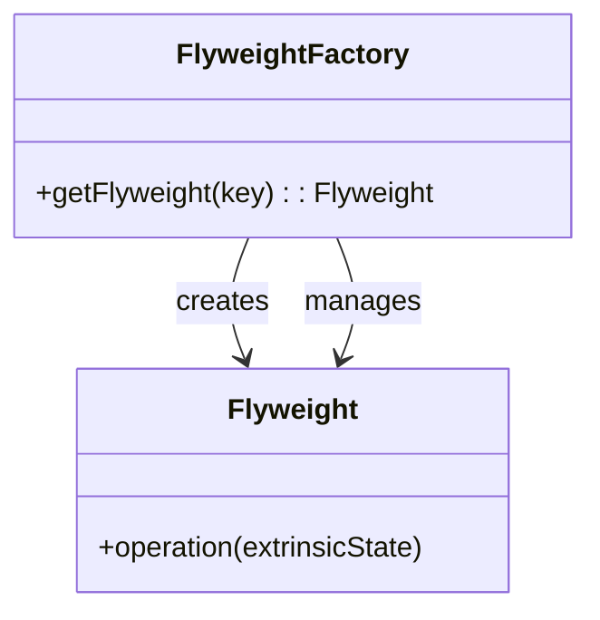

## 2.2.6 Flyweight (GoF) in Clojure

### Introduction

The Flyweight pattern is a structural design pattern that focuses on minimizing memory usage by sharing as much data as possible with similar objects. This pattern is particularly useful when dealing with a large number of objects that share common data. In Clojure, the Flyweight pattern can be effectively implemented using the language's inherent capabilities for data sharing and immutability.

### Detailed Explanation

The Flyweight pattern separates the intrinsic state (shared data) from the extrinsic state (context-specific data) of objects. By doing so, it allows multiple objects to share the intrinsic state, reducing memory consumption. This is particularly beneficial in scenarios where many objects are created with similar properties.

#### Key Concepts

- **Intrinsic State:** The shared, immutable data that can be reused across multiple objects.
- **Extrinsic State:** The context-specific data that is unique to each object and provided at runtime.
- **Flyweight Factory:** A mechanism to manage and provide shared objects, ensuring that intrinsic state is reused.

### Visual Aids

#### Conceptual Diagram



### Implementing Flyweight in Clojure

#### Flyweight Factory

The Flyweight Factory is responsible for managing the shared objects. It ensures that the intrinsic state is reused by storing and retrieving objects from a cache.

```clojure
(def flyweights (atom {}))

(defn get-shape [type]
  (if-let [shape (@flyweights type)]
    shape
    (let [new-shape (create-shape type)]
      (swap! flyweights assoc type new-shape)
      new-shape)))
```

#### Defining Intrinsic State

The intrinsic state is defined within the `create-shape` function. This function creates a new shape with shared properties that can be reused.

```clojure
(defn create-shape [type]
  (case type
    :circle {:type :circle :radius 5}
    :square {:type :square :side 10}
    :default {:type :unknown}))
```

#### Using Flyweight Objects

Flyweight objects are retrieved from the factory and can be used with extrinsic state provided at runtime.

```clojure
(def circle1 (get-shape :circle))
(def circle2 (get-shape :circle))

;; Both circle1 and circle2 share the same intrinsic state
```

#### Providing Extrinsic State at Runtime

The extrinsic state is provided when the flyweight object is used, allowing for context-specific customization.

```clojure
(defn draw [shape extrinsic-state]
  (println "Drawing" (:type shape) "at" extrinsic-state))

(draw circle1 {:x 10 :y 20})
(draw circle2 {:x 30 :y 40})
```

### Use Cases

The Flyweight pattern is ideal for applications where:

- A large number of similar objects are created.
- Memory usage is a concern, and optimization is necessary.
- Objects can share common data without compromising functionality.

### Advantages and Disadvantages

#### Advantages

- **Memory Efficiency:** Reduces memory footprint by sharing common data.
- **Performance Improvement:** Decreases the overhead of object creation and management.

#### Disadvantages

- **Complexity:** Introduces additional complexity in managing shared and unique states.
- **Thread Safety:** Requires careful handling in concurrent environments to ensure thread safety.

### Best Practices

- **Identify Shared Data:** Clearly distinguish between intrinsic and extrinsic states to maximize sharing.
- **Use Immutability:** Leverage Clojure's immutable data structures to safely share intrinsic state.
- **Optimize Factory Logic:** Ensure the Flyweight Factory efficiently manages and retrieves shared objects.

### Comparisons

The Flyweight pattern can be compared to other memory optimization techniques, such as object pooling. While both aim to reduce memory usage, Flyweight focuses on sharing data, whereas object pooling reuses entire objects.

### Conclusion

The Flyweight pattern is a powerful tool for optimizing memory usage in Clojure applications. By leveraging Clojure's strengths in data sharing and immutability, developers can implement this pattern to efficiently manage large numbers of similar objects.

## Quiz Time!



### What is the primary goal of the Flyweight pattern?

- [x] Minimize memory usage by sharing common data
- [ ] Improve object creation speed
- [ ] Enhance data security
- [ ] Simplify code structure

> **Explanation:** The Flyweight pattern aims to minimize memory usage by sharing as much data as possible with similar objects.

### In the Flyweight pattern, what is the intrinsic state?

- [x] Shared, immutable data
- [ ] Context-specific data
- [ ] Data that changes frequently
- [ ] Temporary data

> **Explanation:** Intrinsic state refers to the shared, immutable data that can be reused across multiple objects.

### How does the Flyweight pattern provide extrinsic state?

- [x] At runtime
- [ ] During object creation
- [ ] Through a configuration file
- [ ] Via a database

> **Explanation:** Extrinsic state is provided at runtime, allowing for context-specific customization of flyweight objects.

### What is the role of the Flyweight Factory?

- [x] Manage and provide shared objects
- [ ] Create unique objects for each request
- [ ] Store extrinsic state
- [ ] Handle user authentication

> **Explanation:** The Flyweight Factory manages and provides shared objects, ensuring that intrinsic state is reused.

### Which Clojure feature is leveraged in the Flyweight pattern for data sharing?

- [x] Immutability
- [ ] Dynamic typing
- [ ] Lazy evaluation
- [ ] Macros

> **Explanation:** Clojure's immutability is leveraged to safely share intrinsic state among flyweight objects.

### What is a potential disadvantage of the Flyweight pattern?

- [x] Increased complexity
- [ ] Higher memory usage
- [ ] Slower execution speed
- [ ] Reduced code readability

> **Explanation:** The Flyweight pattern can introduce additional complexity in managing shared and unique states.

### How can thread safety be ensured when using the Flyweight pattern?

- [x] Use immutable data structures
- [ ] Lock all shared resources
- [ ] Avoid concurrent execution
- [ ] Use global variables

> **Explanation:** Using immutable data structures helps ensure thread safety when sharing intrinsic state.

### What is a common use case for the Flyweight pattern?

- [x] Applications with a large number of similar objects
- [ ] Real-time data processing
- [ ] Secure data transmission
- [ ] Dynamic web page generation

> **Explanation:** The Flyweight pattern is ideal for applications where a large number of similar objects are created.

### How does the Flyweight pattern differ from object pooling?

- [x] Flyweight shares data, while object pooling reuses entire objects
- [ ] Flyweight focuses on performance, while object pooling focuses on security
- [ ] Flyweight is used for UI components, while object pooling is for databases
- [ ] Flyweight is simpler to implement than object pooling

> **Explanation:** The Flyweight pattern shares data among objects, whereas object pooling reuses entire objects.

### True or False: The Flyweight pattern is only applicable in object-oriented programming.

- [ ] True
- [x] False

> **Explanation:** The Flyweight pattern can be applied in functional programming languages like Clojure, leveraging data sharing and immutability.


