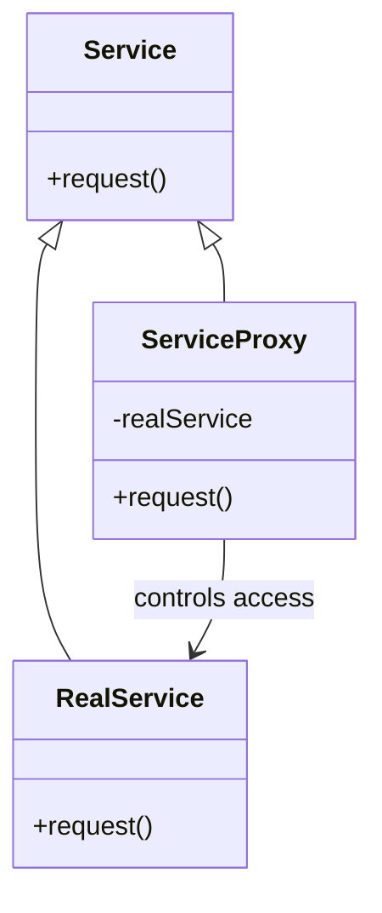

## 2.2.7 Proxy (GoF) in Clojure

### Introduction

The Proxy design pattern is a structural pattern from the Gang of Four (GoF) that provides a surrogate or placeholder for another object to control access to it. This pattern is particularly useful for implementing lazy initialization, logging, access control, and more. In Clojure, we can leverage the language's functional nature, along with protocols and records, to implement this pattern effectively.

### Detailed Explanation

The Proxy pattern involves creating an intermediary that controls access to a real subject. This intermediary, or proxy, can perform additional operations before or after forwarding a request to the real subject. The pattern is beneficial in scenarios where you need to defer resource-intensive operations, control access, or add additional functionality transparently.

#### Components of the Proxy Pattern

1. **Subject Interface/Protocol:** Defines the common interface for RealSubject and Proxy so that a Proxy can be used anywhere a RealSubject is expected.
2. **RealSubject:** The actual object that the proxy represents.
3. **Proxy:** The object that controls access to the RealSubject, implementing the same interface as the RealSubject.

### Visual Representation

Below is a conceptual diagram illustrating the Proxy pattern:



### Implementing Proxy in Clojure

Let's walk through implementing the Proxy pattern in Clojure using protocols and records.

#### Step 1: Define the Subject Protocol

First, we define a protocol that both the RealService and the Proxy will implement.

```clojure
(defprotocol Service
  (request [this]))
```

#### Step 2: Implement the Real Subject

The RealService is the actual object that performs the core functionality.

```clojure
(defrecord RealService []
  Service
  (request [this]
    (println "Real service processing request")))
```

#### Step 3: Implement the Proxy

The ServiceProxy controls access to the RealService. It can add additional behavior such as logging.

```clojure
(defrecord ServiceProxy [real-service]
  Service
  (request [this]
    (println "Proxy: Logging request")
    (request real-service)))
```

#### Step 4: Use the Proxy

Now, we can use the proxy to control access to the real service.

```clojure
(def service (->ServiceProxy (->RealService)))
(request service)
```

### Use Cases

- **Lazy Initialization:** Delay the creation and initialization of expensive objects until they are needed.
- **Access Control:** Restrict access to certain operations or data.
- **Logging and Auditing:** Automatically log requests or changes to the system.
- **Remote Proxy:** Represent an object that resides in a different address space.

### Advantages and Disadvantages

**Advantages:**

- **Controlled Access:** Provides a mechanism to control access to the real subject.
- **Separation of Concerns:** Allows additional functionality to be added without modifying the real subject.
- **Lazy Initialization:** Can defer the creation of resource-intensive objects.

**Disadvantages:**

- **Complexity:** Introduces additional layers, which can complicate the system.
- **Performance Overhead:** May introduce latency due to the extra level of indirection.

### Best Practices

- **Use Protocols and Records:** Leverage Clojure's protocols and records for clear and efficient implementations.
- **Keep Proxies Lightweight:** Ensure that proxies do not become bottlenecks by keeping them simple and efficient.
- **Encapsulate Logic:** Encapsulate any additional logic within the proxy to maintain separation of concerns.

### Comparisons

The Proxy pattern can be compared with other structural patterns like Decorator and Adapter. While Decorator adds responsibilities to objects, Proxy controls access. Adapter, on the other hand, changes the interface of an object.

### Conclusion

The Proxy pattern is a powerful tool in Clojure for controlling access to objects and adding additional behavior transparently. By using protocols and records, we can implement this pattern in a way that is idiomatic to Clojure, leveraging its functional programming paradigms.

## Quiz Time!



### What is the primary purpose of the Proxy pattern?

- [x] To control access to an object
- [ ] To add new functionality to an object
- [ ] To change the interface of an object
- [ ] To create a new object from an existing one

> **Explanation:** The Proxy pattern is primarily used to control access to an object, often adding additional behavior like logging or access control.

### Which Clojure construct is used to define the common interface for RealSubject and Proxy?

- [x] Protocol
- [ ] Record
- [ ] Multimethod
- [ ] Namespace

> **Explanation:** In Clojure, a protocol is used to define a common interface that both the RealSubject and Proxy implement.

### What is a common use case for the Proxy pattern?

- [x] Lazy initialization
- [ ] Data transformation
- [ ] Event handling
- [ ] State management

> **Explanation:** Lazy initialization is a common use case for the Proxy pattern, where object creation is deferred until necessary.

### How does the Proxy pattern differ from the Decorator pattern?

- [x] Proxy controls access, while Decorator adds responsibilities
- [ ] Proxy adds responsibilities, while Decorator controls access
- [ ] Both patterns serve the same purpose
- [ ] Proxy changes the interface, while Decorator controls access

> **Explanation:** The Proxy pattern controls access to an object, while the Decorator pattern adds responsibilities to an object.

### What is an advantage of using the Proxy pattern?

- [x] Controlled access to the real subject
- [ ] Simplifies the system architecture
- [ ] Eliminates the need for interfaces
- [ ] Reduces the number of classes

> **Explanation:** The Proxy pattern provides controlled access to the real subject, which is one of its main advantages.

### Which of the following is a disadvantage of the Proxy pattern?

- [x] Introduces complexity
- [ ] Reduces code readability
- [ ] Increases coupling
- [ ] Limits functionality

> **Explanation:** The Proxy pattern can introduce complexity due to the additional layers it adds to the system.

### In Clojure, what is used to implement the Proxy pattern?

- [x] Protocols and records
- [ ] Classes and interfaces
- [ ] Functions and macros
- [ ] Atoms and refs

> **Explanation:** In Clojure, protocols and records are used to implement the Proxy pattern effectively.

### What additional functionality can a Proxy provide?

- [x] Logging
- [ ] Data validation
- [ ] Event handling
- [ ] State management

> **Explanation:** A Proxy can provide additional functionality such as logging, access control, or lazy initialization.

### Which pattern is used to change the interface of an object?

- [x] Adapter
- [ ] Proxy
- [ ] Decorator
- [ ] Singleton

> **Explanation:** The Adapter pattern is used to change the interface of an object to make it compatible with another interface.

### True or False: The Proxy pattern can be used for remote proxies.

- [x] True
- [ ] False

> **Explanation:** True. The Proxy pattern can be used to represent objects that reside in different address spaces, such as remote proxies.


