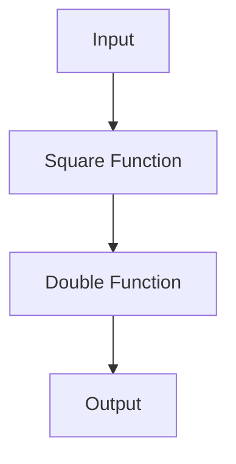

## 2.2. Functional Programming Fundamentals

Functional programming is a paradigm that treats computation as the evaluation of mathematical functions and avoids changing state or mutable data. Clojure, as a functional programming language, embraces these principles, allowing developers to write concise, predictable, and maintainable code. In this section, we will delve into the core principles of functional programming that are essential to Clojure, including pure functions, higher-order functions, and function composition.

### Pure Functions and Side-Effect-Free Programming

**Pure functions** are the building blocks of functional programming. A pure function is a function where the output value is determined only by its input values, without observable side effects. This means that calling a pure function with the same arguments will always produce the same result, and it does not alter any state or interact with the outside world (e.g., modifying a global variable, writing to a file, or printing to the console).

#### Benefits of Pure Functions

1. **Predictability**: Since pure functions always produce the same output for the same input, they are easy to reason about and test.
2. **Concurrency**: Pure functions do not modify shared state, making them inherently safe for concurrent execution.
3. **Memoization**: Pure functions can be memoized, meaning their results can be cached for efficiency.

#### Example of a Pure Function

```clojure
;; A pure function that adds two numbers
(defn add [x y]
  (+ x y))

;; Calling the function with the same arguments always returns the same result
(println (add 2 3)) ; => 5
```

In the example above, the `add` function is pure because it always returns the same result for the same inputs and does not cause any side effects.

### Functions as First-Class Citizens

In Clojure, functions are first-class citizens, meaning they can be passed as arguments to other functions, returned as values from other functions, and assigned to variables. This feature is fundamental to functional programming and enables powerful abstractions and code reuse.

#### Example of Functions as First-Class Citizens

```clojure
;; Assigning a function to a variable
(def add-fn add)

;; Passing a function as an argument
(defn apply-function [f x y]
  (f x y))

(println (apply-function add-fn 2 3)) ; => 5
```

In this example, `add-fn` is a variable that holds the `add` function, and `apply-function` takes a function `f` as an argument and applies it to `x` and `y`.

### Higher-Order Functions

**Higher-order functions** are functions that take other functions as arguments or return them as results. They are a powerful tool in functional programming, allowing for the creation of more abstract and reusable code.

#### Common Higher-Order Functions in Clojure

1. **`map`**: Applies a function to each element of a collection and returns a new collection of the results.
2. **`filter`**: Returns a new collection containing only the elements that satisfy a predicate function.
3. **`reduce`**: Reduces a collection to a single value by applying a function to an accumulator and each element of the collection.

#### Example of Higher-Order Functions

```clojure
;; Using map to increment each number in a list
(def numbers [1 2 3 4 5])
(def incremented (map inc numbers))
(println incremented) ; => (2 3 4 5 6)

;; Using filter to select even numbers
(def evens (filter even? numbers))
(println evens) ; => (2 4)

;; Using reduce to sum the numbers
(def sum (reduce + numbers))
(println sum) ; => 15
```

In these examples, `map`, `filter`, and `reduce` are higher-order functions that operate on the `numbers` collection.

### Function Composition

**Function composition** is the process of combining two or more functions to produce a new function. In Clojure, this is often done using the `comp` function, which takes a variable number of functions and returns a new function that is the composition of those functions.

#### Benefits of Function Composition

1. **Modularity**: Functions can be composed to create more complex operations from simpler ones.
2. **Reusability**: Composed functions can be reused in different contexts.
3. **Clarity**: Function composition can lead to clearer and more declarative code.

#### Example of Function Composition

```clojure
;; Composing functions to create a new function
(defn square [x] (* x x))
(defn double [x] (* 2 x))

(def square-and-double (comp double square))

(println (square-and-double 3)) ; => 18
```

In this example, `square-and-double` is a composed function that first squares its input and then doubles the result.

### Enabling Powerful Abstractions and Code Reuse

The fundamentals of functional programming in Clojure, such as pure functions, higher-order functions, and function composition, enable powerful abstractions and code reuse. By treating functions as first-class citizens and leveraging higher-order functions, developers can create more modular and maintainable code. Function composition allows for the creation of complex operations from simpler ones, promoting code reuse and clarity.

### Visualizing Function Composition

To better understand function composition, let's visualize the process using a flowchart.



In this flowchart, the input is first processed by the `Square Function`, then by the `Double Function`, resulting in the final output.

### Try It Yourself

Experiment with the code examples provided in this section. Try modifying the functions, creating your own higher-order functions, and composing different functions to see how they interact. This hands-on practice will deepen your understanding of functional programming fundamentals in Clojure.

### Knowledge Check

To reinforce your understanding of functional programming fundamentals in Clojure, consider the following questions:

1. What is a pure function, and why is it important in functional programming?
2. How do higher-order functions enable code reuse and abstraction?
3. What are some common higher-order functions in Clojure, and how are they used?
4. How does function composition promote modularity and clarity in code?

### Summary

In this section, we explored the core principles of functional programming in Clojure, including pure functions, higher-order functions, and function composition. These fundamentals enable powerful abstractions and code reuse, allowing developers to write concise, predictable, and maintainable code. By understanding and applying these concepts, you can unlock the full potential of Clojure as a functional programming language.

Remember, this is just the beginning. As you progress, you'll build more complex and interactive applications. Keep experimenting, stay curious, and enjoy the journey!

## **Ready to Test Your Knowledge?**



### What is a pure function?

- [x] A function that always produces the same output for the same input and has no side effects.
- [ ] A function that can modify global state.
- [ ] A function that interacts with the outside world.
- [ ] A function that depends on external variables.

> **Explanation:** A pure function is one that always produces the same output for the same input and does not cause any side effects, making it predictable and easy to test.

### Why are functions considered first-class citizens in Clojure?

- [x] Because they can be passed as arguments, returned from other functions, and assigned to variables.
- [ ] Because they can only be used within specific contexts.
- [ ] Because they cannot be modified.
- [ ] Because they are the only type of value in Clojure.

> **Explanation:** In Clojure, functions are first-class citizens, meaning they can be passed as arguments, returned from other functions, and assigned to variables, enabling powerful abstractions and code reuse.

### What is a higher-order function?

- [x] A function that takes other functions as arguments or returns them as results.
- [ ] A function that only operates on numbers.
- [ ] A function that modifies global state.
- [ ] A function that cannot be composed.

> **Explanation:** A higher-order function is one that takes other functions as arguments or returns them as results, allowing for more abstract and reusable code.

### Which of the following is an example of a higher-order function in Clojure?

- [x] `map`
- [ ] `println`
- [ ] `def`
- [ ] `let`

> **Explanation:** `map` is a higher-order function in Clojure that applies a function to each element of a collection and returns a new collection of the results.

### What is the purpose of function composition?

- [x] To combine two or more functions to produce a new function.
- [ ] To modify the behavior of a single function.
- [ ] To create side effects.
- [ ] To store functions in a database.

> **Explanation:** Function composition is the process of combining two or more functions to produce a new function, promoting modularity and code reuse.

### How does function composition benefit code clarity?

- [x] By allowing complex operations to be built from simpler ones.
- [ ] By making code more verbose.
- [ ] By increasing the number of functions needed.
- [ ] By reducing the need for comments.

> **Explanation:** Function composition allows complex operations to be built from simpler ones, leading to clearer and more declarative code.

### What is the result of the composed function `(comp double square)` when applied to the input `3`?

- [x] 18
- [ ] 9
- [ ] 6
- [ ] 12

> **Explanation:** The composed function `(comp double square)` first squares the input `3` to get `9`, then doubles it to get `18`.

### Which of the following is NOT a benefit of pure functions?

- [ ] Predictability
- [ ] Concurrency
- [ ] Memoization
- [x] Side effects

> **Explanation:** Pure functions do not have side effects, which is one of their benefits, as it makes them predictable and easy to test.

### What does the `reduce` function do in Clojure?

- [x] It reduces a collection to a single value by applying a function to an accumulator and each element of the collection.
- [ ] It filters elements from a collection.
- [ ] It maps a function over a collection.
- [ ] It sorts a collection.

> **Explanation:** The `reduce` function in Clojure reduces a collection to a single value by applying a function to an accumulator and each element of the collection.

### True or False: In Clojure, functions can be stored in variables and passed around like any other data type.

- [x] True
- [ ] False

> **Explanation:** True. In Clojure, functions are first-class citizens and can be stored in variables and passed around like any other data type.


