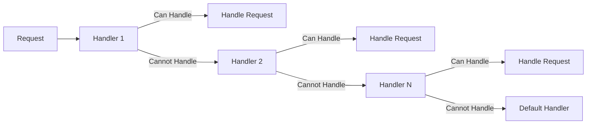

## 2.3.1 Chain of Responsibility (GoF) in Clojure

The Chain of Responsibility pattern is a behavioral design pattern that allows an object to pass a request along a chain of potential handlers until one of them handles the request. This pattern decouples the sender of a request from its receiver, promoting flexibility and reusability in handling requests. In Clojure, we can leverage functional programming paradigms such as higher-order functions and sequences to implement this pattern effectively.

### Introduction

The Chain of Responsibility pattern is particularly useful when multiple objects can handle a request, but the specific handler is not known in advance. By passing the request along a chain, we avoid coupling the sender to a specific receiver, enhancing the system's flexibility and scalability.

### Detailed Explanation

In Clojure, the Chain of Responsibility pattern can be implemented using sequences and higher-order functions. Each handler is a function that takes a request and either processes it or passes it to the next handler in the chain. This approach aligns well with Clojure's functional nature, allowing us to build dynamic and flexible chains of responsibility.

#### Components of the Pattern

1. **Handler Functions:** Each handler function checks if it can process the request. If it can, it performs the necessary actions; otherwise, it returns `nil`, allowing the next handler to attempt processing.

2. **Chain of Handlers:** A sequence (e.g., a vector) of handler functions that represents the chain. The request is passed through this sequence until a handler processes it or the chain is exhausted.

3. **Request Processing:** A function that iterates over the chain of handlers, passing the request to each handler until one returns a non-nil result.

### Visual Representation

Below is a conceptual diagram illustrating the Chain of Responsibility pattern:



### Code Examples

Let's explore how to implement the Chain of Responsibility pattern in Clojure.

#### Define Individual Handler Functions

Each handler function checks a condition and processes the request if applicable:

```clojure
(defn handler1 [request]
  (if (condition1? request)
    (handle1 request)
    nil))

(defn handler2 [request]
  (if (condition2? request)
    (handle2 request)
    nil))
```

#### Create a Chain of Handlers

We define a sequence of handlers that represents the chain:

```clojure
(def handlers [handler1 handler2])
```

#### Process Request Through the Chain

The `process-request` function iterates over the handlers, passing the request to each until one handles it:

```clojure
(defn process-request [request]
  (or (some #(% request) handlers)
      (default-handler request)))
```

### Use Cases

The Chain of Responsibility pattern is applicable in various scenarios, such as:

- **Event Handling:** When multiple listeners can handle an event, but only one should process it.
- **Logging:** Different loggers can handle log messages based on severity levels.
- **UI Frameworks:** Handling user input events where different components may respond to the same event.

### Advantages and Disadvantages

**Advantages:**

- **Decoupling:** Reduces coupling between the sender and receiver of a request.
- **Flexibility:** Handlers can be added or removed dynamically.
- **Responsibility Sharing:** Multiple handlers can share the responsibility of processing requests.

**Disadvantages:**

- **Uncertain Handling:** It may not be clear which handler will process the request.
- **Performance:** The request may pass through many handlers before being processed.

### Best Practices

- **Modular Handlers:** Keep handler functions modular and focused on a single responsibility.
- **Dynamic Chains:** Use data-driven approaches to modify the chain dynamically based on configuration or runtime conditions.
- **Logging and Monitoring:** Implement logging to trace the flow of requests through the chain for easier debugging and monitoring.

### Comparisons

The Chain of Responsibility pattern can be compared to other behavioral patterns like the Command pattern, which encapsulates requests as objects, or the Observer pattern, which notifies multiple observers of state changes. Each pattern has its unique use cases and trade-offs.

### Conclusion

The Chain of Responsibility pattern is a powerful tool for decoupling request senders and receivers in Clojure applications. By leveraging functional programming techniques, we can create flexible and dynamic chains of handlers that enhance the maintainability and scalability of our systems.

## Quiz Time!



### What is the primary purpose of the Chain of Responsibility pattern?

- [x] To decouple senders and receivers by giving multiple objects a chance to handle a request.
- [ ] To couple senders and receivers tightly for efficient communication.
- [ ] To ensure that only one object can handle a request.
- [ ] To prioritize requests based on their importance.

> **Explanation:** The Chain of Responsibility pattern is designed to decouple senders and receivers, allowing multiple objects to handle a request without specifying the exact receiver.

### How does the Chain of Responsibility pattern enhance flexibility?

- [x] By allowing handlers to be added or removed dynamically.
- [ ] By ensuring that requests are always handled by the first handler.
- [ ] By tightly coupling the sender and receiver.
- [ ] By using a fixed sequence of handlers.

> **Explanation:** The pattern enhances flexibility by allowing handlers to be added or removed dynamically, making it easy to modify the chain without altering the main logic.

### In Clojure, what is used to represent the chain of handlers?

- [x] A sequence (e.g., a vector) of handler functions.
- [ ] A single handler function.
- [ ] A map of handler functions.
- [ ] A list of request objects.

> **Explanation:** In Clojure, the chain of handlers is typically represented as a sequence (e.g., a vector) of handler functions.

### What is the role of the `process-request` function in the Chain of Responsibility pattern?

- [x] To iterate over the handlers and pass the request to each until one handles it.
- [ ] To handle the request directly without involving handlers.
- [ ] To create new handlers dynamically.
- [ ] To log the request details for auditing purposes.

> **Explanation:** The `process-request` function iterates over the handlers, passing the request to each until one handles it, or a default handler is invoked.

### Which of the following is a disadvantage of the Chain of Responsibility pattern?

- [x] It may not be clear which handler will process the request.
- [ ] It tightly couples the sender and receiver.
- [ ] It limits the number of handlers that can be used.
- [ ] It requires all handlers to process every request.

> **Explanation:** One disadvantage is that it may not be clear which handler will process the request, as the request passes through multiple handlers.

### How can you modify the chain of handlers in Clojure?

- [x] By adding or removing handler functions from the sequence.
- [ ] By changing the order of requests.
- [ ] By modifying the request object.
- [ ] By altering the default handler function.

> **Explanation:** The chain of handlers can be modified by adding or removing handler functions from the sequence, allowing for dynamic changes.

### What is a common use case for the Chain of Responsibility pattern?

- [x] Event handling where multiple listeners can handle an event.
- [ ] Direct communication between two tightly coupled objects.
- [ ] Storing data in a database.
- [ ] Rendering a user interface.

> **Explanation:** A common use case is event handling, where multiple listeners can handle an event, but only one should process it.

### Which Clojure feature is leveraged to implement the Chain of Responsibility pattern?

- [x] Higher-order functions and sequences.
- [ ] Mutable state and side effects.
- [ ] Object-oriented inheritance.
- [ ] Direct recursion.

> **Explanation:** The pattern leverages higher-order functions and sequences to implement the chain of handlers in a functional manner.

### What should be done if no handler processes the request in the Chain of Responsibility pattern?

- [x] A default handler should be invoked.
- [ ] The request should be discarded.
- [ ] The request should be sent back to the sender.
- [ ] The request should be logged for future reference.

> **Explanation:** If no handler processes the request, a default handler should be invoked to ensure the request is handled appropriately.

### True or False: The Chain of Responsibility pattern tightly couples the sender and receiver of a request.

- [ ] True
- [x] False

> **Explanation:** False. The Chain of Responsibility pattern is designed to decouple the sender and receiver, allowing multiple objects to handle a request without specifying the exact receiver.


