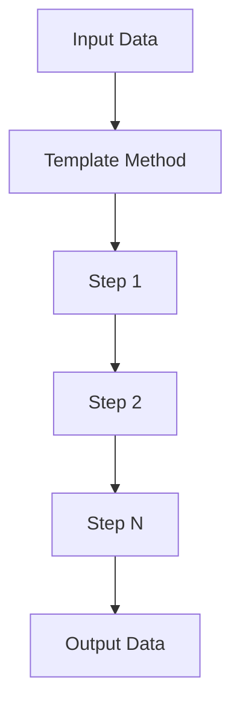

## 2.3.10 Template Method (GoF) in Clojure

### Introduction

The Template Method pattern is a behavioral design pattern that defines the skeleton of an algorithm in a method, deferring some steps to subclasses. This pattern allows subclasses to redefine certain steps of an algorithm without changing its overall structure. In Clojure, we can leverage higher-order functions and partial application to implement the Template Method pattern in a functional style, providing flexibility and reusability.

### Detailed Explanation

The Template Method pattern is particularly useful when you have an algorithm that consists of several steps, and you want to allow subclasses or specific implementations to override or customize some of these steps. This pattern promotes code reuse and enforces a consistent algorithm structure while allowing for customization.

In Clojure, we can implement the Template Method pattern using higher-order functions. Instead of defining a class with methods to override, we define a template function that takes a sequence of step functions and applies them in order to some initial data.

#### Key Components

1. **Template Function**: The core function that defines the algorithm's structure. It accepts a collection of step functions and applies them sequentially.
2. **Concrete Steps**: Individual functions that represent each step of the algorithm. These can be overridden or replaced to change the behavior.
3. **Execution**: The process of running the template function with a specific set of step functions and input data.

### Visual Aids

To better understand the Template Method pattern, let's visualize the flow of data through the template function and its steps.



In this diagram, the input data flows through a series of steps defined by the template method, resulting in output data. Each step can be customized or overridden.

### Code Examples

Let's explore how to implement the Template Method pattern in Clojure with practical code examples.

#### Define the Template Function

The template function is responsible for applying a sequence of step functions to the input data.

```clojure
(defn template-method [step-fns data]
  (reduce (fn [acc step]
            (step acc))
          data
          step-fns))
```

#### Define Concrete Steps

Here, we define some concrete step functions that will be used in our template method.

```clojure
(defn step1 [data]
  (println "Executing Step 1")
  (inc data))

(defn step2 [data]
  (println "Executing Step 2")
  (* data 2))
```

#### Execute the Template with Specific Steps

We can execute the template method by passing a vector of step functions and the initial data.

```clojure
(def input-data 5)

(template-method [step1 step2] input-data)
;; Output:
;; Executing Step 1
;; Executing Step 2
;; => 12
```

#### Override Steps to Modify Behavior

To customize the algorithm, we can override specific steps by providing alternative implementations.

```clojure
(defn custom-step1 [data]
  (println "Executing Custom Step 1")
  (+ data 10))

(template-method [custom-step1 step2] input-data)
;; Output:
;; Executing Custom Step 1
;; Executing Step 2
;; => 30
```

### Use Cases

The Template Method pattern is applicable in scenarios where you have a common algorithm structure with varying steps. Some real-world use cases include:

- **Data Processing Pipelines**: Where different data transformations need to be applied in a specific order.
- **Workflow Automation**: Where steps in a workflow can be customized based on specific requirements.
- **Game Development**: Where game logic can be defined with a common structure but different behaviors.

### Advantages and Disadvantages

#### Advantages

- **Code Reusability**: Promotes reuse of the algorithm structure while allowing customization of specific steps.
- **Consistency**: Ensures a consistent algorithm structure across different implementations.
- **Flexibility**: Allows easy customization and extension of algorithm steps.

#### Disadvantages

- **Complexity**: Can introduce complexity if overused or applied to simple algorithms.
- **Tight Coupling**: May lead to tight coupling between the template method and its steps if not designed carefully.

### Best Practices

- **Use Higher-Order Functions**: Leverage Clojure's functional capabilities to define flexible and reusable template methods.
- **Keep Steps Simple**: Ensure that each step function is simple and focused on a single responsibility.
- **Document Step Functions**: Clearly document the purpose and expected behavior of each step function.

### Comparisons

The Template Method pattern can be compared to other patterns like Strategy, where the focus is on defining interchangeable algorithms. While Strategy allows for complete algorithm replacement, Template Method focuses on customizing parts of an algorithm.

### Conclusion

The Template Method pattern in Clojure provides a powerful way to define flexible and reusable algorithms. By leveraging higher-order functions and partial application, we can create customizable workflows that adhere to a consistent structure. This pattern is particularly useful in scenarios where you need to enforce a common algorithm structure while allowing for specific customizations.

## Quiz Time!



### What is the main purpose of the Template Method pattern?

- [x] To define the skeleton of an algorithm, deferring some steps to subclasses.
- [ ] To encapsulate a request as an object, allowing for parameterization.
- [ ] To provide a way to access elements of an aggregate object sequentially.
- [ ] To decouple an abstraction from its implementation.

> **Explanation:** The Template Method pattern defines the skeleton of an algorithm, allowing specific steps to be overridden or customized.

### How is the Template Method pattern implemented in Clojure?

- [x] Using higher-order functions and partial application.
- [ ] Using classes and inheritance.
- [ ] Using global variables and mutable state.
- [ ] Using direct recursion and loops.

> **Explanation:** In Clojure, the Template Method pattern is implemented using higher-order functions and partial application to define flexible algorithm structures.

### What is a key advantage of the Template Method pattern?

- [x] It promotes code reusability by allowing customization of specific steps.
- [ ] It simplifies code by using global variables.
- [ ] It ensures all steps of an algorithm are executed in parallel.
- [ ] It eliminates the need for any algorithm structure.

> **Explanation:** The Template Method pattern promotes code reusability by allowing specific steps of an algorithm to be customized while maintaining a consistent structure.

### Which of the following is a disadvantage of the Template Method pattern?

- [x] It can introduce complexity if overused.
- [ ] It eliminates the need for any customization.
- [ ] It requires the use of mutable state.
- [ ] It enforces parallel execution of steps.

> **Explanation:** The Template Method pattern can introduce complexity if overused, especially in simple algorithms.

### In Clojure, how can you override a step in the Template Method pattern?

- [x] By providing an alternative implementation of the step function.
- [ ] By modifying the global state.
- [ ] By changing the algorithm structure directly.
- [ ] By using inheritance and subclassing.

> **Explanation:** In Clojure, you can override a step by providing an alternative implementation of the step function when executing the template method.

### What is the role of the template function in the Template Method pattern?

- [x] It defines the overall structure of the algorithm.
- [ ] It encapsulates data access logic.
- [ ] It manages the lifecycle of objects.
- [ ] It provides a user interface for the application.

> **Explanation:** The template function defines the overall structure of the algorithm, applying a sequence of step functions to the input data.

### Which of the following best describes a concrete step in the Template Method pattern?

- [x] A function that represents a specific step in the algorithm.
- [ ] A global variable used to store intermediate results.
- [ ] A class that encapsulates the entire algorithm.
- [ ] A loop that iterates over a collection of data.

> **Explanation:** A concrete step is a function that represents a specific step in the algorithm, which can be customized or overridden.

### How does the Template Method pattern ensure consistency in algorithm structure?

- [x] By defining a common template function that applies step functions in order.
- [ ] By using global variables to store algorithm state.
- [ ] By enforcing parallel execution of all steps.
- [ ] By eliminating the need for any customization.

> **Explanation:** The Template Method pattern ensures consistency by defining a common template function that applies step functions in a specific order.

### What is a common use case for the Template Method pattern?

- [x] Data processing pipelines with varying transformations.
- [ ] Managing global application state.
- [ ] Implementing user interfaces.
- [ ] Storing configuration settings.

> **Explanation:** A common use case for the Template Method pattern is data processing pipelines where different transformations need to be applied in a specific order.

### True or False: The Template Method pattern in Clojure relies on inheritance and subclassing.

- [ ] True
- [x] False

> **Explanation:** False. The Template Method pattern in Clojure relies on higher-order functions and partial application, not inheritance and subclassing.


