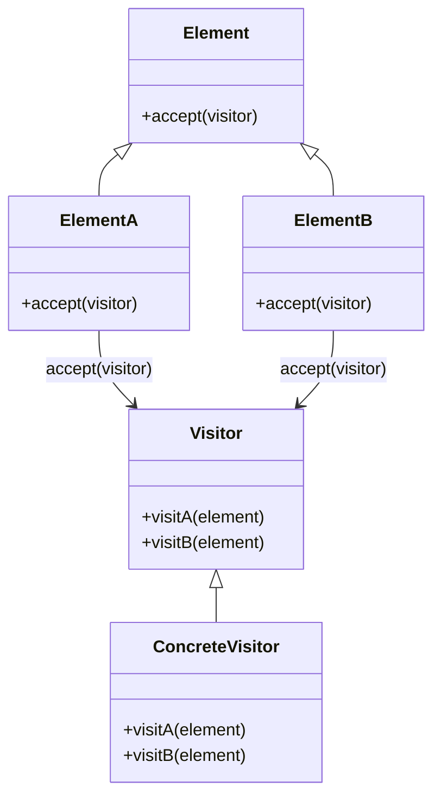

## 2.3.11 Visitor (GoF) in Clojure

The Visitor design pattern is a classic behavioral pattern from the Gang of Four (GoF) that allows you to define new operations on an object structure without changing the classes of the elements on which it operates. This pattern is particularly useful when you have a complex object structure and need to perform various unrelated operations across its elements. In Clojure, we can leverage protocols and multimethods to implement the Visitor pattern, taking advantage of Clojure's dynamic and functional nature.

### Introduction

The Visitor pattern represents an operation to be performed on elements of an object structure. It allows you to define a new operation without changing the classes of the elements on which it operates. This separation of algorithms from the objects they operate on is achieved through double dispatch, which can be elegantly implemented in Clojure using protocols and multimethods.

### Detailed Explanation

#### Key Components of the Visitor Pattern

1. **Element Interface**: Defines an `accept` method that takes a visitor.
2. **Concrete Elements**: Implement the `accept` method to call the visitor's method corresponding to the element's class.
3. **Visitor Interface**: Declares a visit method for each type of concrete element.
4. **Concrete Visitors**: Implement the visitor interface and define operations for each element type.

#### Implementing the Visitor Pattern in Clojure

##### Define Elements with Accept Method

In Clojure, we use protocols to define the `Element` interface with an `accept` method:

```clojure
(defprotocol Element
  (accept [this visitor]))
```

##### Implement Elements

Concrete elements implement the `Element` protocol. Each element's `accept` method calls the appropriate visitor method:

```clojure
(defrecord ElementA []
  Element
  (accept [this visitor]
    (visit-A visitor this)))

(defrecord ElementB []
  Element
  (accept [this visitor]
    (visit-B visitor this)))
```

##### Define Visitor Protocol

The `Visitor` protocol declares methods for each element type:

```clojure
(defprotocol Visitor
  (visit-A [this element])
  (visit-B [this element]))
```

##### Implement Concrete Visitor

Concrete visitors implement the `Visitor` protocol and define operations for each element type:

```clojure
(defrecord ConcreteVisitor []
  Visitor
  (visit-A [this element]
    (println "Visiting ElementA"))
  (visit-B [this element]
    (println "Visiting ElementB")))
```

##### Use the Visitor

To use the visitor, create an instance and iterate over the elements, calling `accept` on each:

```clojure
(def visitor (->ConcreteVisitor))
(def elements [(->ElementA) (->ElementB)])

(doseq [element elements]
  (accept element visitor))
```

### Visual Aids

#### Conceptual Diagram



### Use Cases

The Visitor pattern is particularly useful in scenarios where:

- You have a complex object structure and need to perform multiple unrelated operations.
- You want to add new operations without modifying the object structure.
- You need to separate algorithms from the objects they operate on.

### Advantages and Disadvantages

#### Advantages

- **Separation of Concerns**: Separates algorithms from the object structure.
- **Extensibility**: Easily add new operations without modifying existing elements.
- **Single Responsibility**: Each visitor focuses on a specific operation.

#### Disadvantages

- **Complexity**: Can introduce complexity with many visitor and element classes.
- **Double Dispatch**: Requires careful implementation to ensure correct method calls.

### Best Practices

- Use protocols and multimethods to leverage Clojure's dynamic capabilities.
- Keep visitor methods focused and cohesive.
- Consider using the Visitor pattern when you anticipate frequent changes to operations.

### Comparisons

The Visitor pattern is often compared with the Strategy pattern. While both separate algorithms from the objects they operate on, the Visitor pattern is more suited for operations across a complex object structure, whereas the Strategy pattern is better for interchangeable algorithms.

### Conclusion

The Visitor pattern in Clojure, implemented using protocols and multimethods, provides a powerful way to separate algorithms from object structures. By leveraging Clojure's dynamic capabilities, you can create flexible and extensible systems that accommodate new operations without modifying existing code.

## Quiz Time!



### What is the primary purpose of the Visitor pattern?

- [x] To separate algorithms from the objects on which they operate
- [ ] To encapsulate object creation
- [ ] To provide a simplified interface to a complex subsystem
- [ ] To manage object state transitions

> **Explanation:** The Visitor pattern is designed to separate algorithms from the objects they operate on, allowing new operations to be added without modifying the object structure.

### How does the Visitor pattern achieve separation of concerns?

- [x] By using double dispatch to separate algorithms from objects
- [ ] By encapsulating object creation logic
- [ ] By providing a unified interface to a set of interfaces
- [ ] By managing object state transitions

> **Explanation:** The Visitor pattern uses double dispatch to separate algorithms from the objects they operate on, allowing for independent extension of operations.

### In Clojure, what is used to define the `accept` method for elements?

- [x] Protocols
- [ ] Multimethods
- [ ] Macros
- [ ] Atoms

> **Explanation:** Protocols are used in Clojure to define the `accept` method for elements, allowing for polymorphic behavior.

### What is a key advantage of using the Visitor pattern?

- [x] It allows new operations to be added without modifying existing elements.
- [ ] It simplifies object creation.
- [ ] It reduces memory usage.
- [ ] It enhances data encapsulation.

> **Explanation:** The Visitor pattern allows new operations to be added without modifying existing elements, enhancing extensibility.

### Which Clojure feature is leveraged for double dispatch in the Visitor pattern?

- [x] Multimethods
- [ ] Atoms
- [ ] Refs
- [ ] Agents

> **Explanation:** Multimethods in Clojure are leveraged for double dispatch, allowing for dynamic method selection based on multiple criteria.

### What is a potential disadvantage of the Visitor pattern?

- [x] It can introduce complexity with many visitor and element classes.
- [ ] It limits the number of operations that can be performed.
- [ ] It tightly couples algorithms with objects.
- [ ] It reduces code readability.

> **Explanation:** The Visitor pattern can introduce complexity due to the need for multiple visitor and element classes, especially in large systems.

### How are concrete visitors implemented in Clojure?

- [x] By implementing the Visitor protocol
- [ ] By extending a base class
- [ ] By using macros
- [ ] By defining global functions

> **Explanation:** Concrete visitors in Clojure are implemented by defining records that implement the Visitor protocol.

### What is the role of the `accept` method in the Visitor pattern?

- [x] To allow a visitor to perform an operation on an element
- [ ] To create a new instance of an element
- [ ] To manage the state of an element
- [ ] To provide a default behavior for an element

> **Explanation:** The `accept` method allows a visitor to perform an operation on an element, facilitating double dispatch.

### Which pattern is often compared with the Visitor pattern?

- [x] Strategy pattern
- [ ] Singleton pattern
- [ ] Factory pattern
- [ ] Observer pattern

> **Explanation:** The Visitor pattern is often compared with the Strategy pattern, as both separate algorithms from the objects they operate on.

### True or False: The Visitor pattern is ideal for operations that frequently change.

- [x] True
- [ ] False

> **Explanation:** True. The Visitor pattern is ideal for operations that frequently change, as it allows new operations to be added without modifying existing elements.


