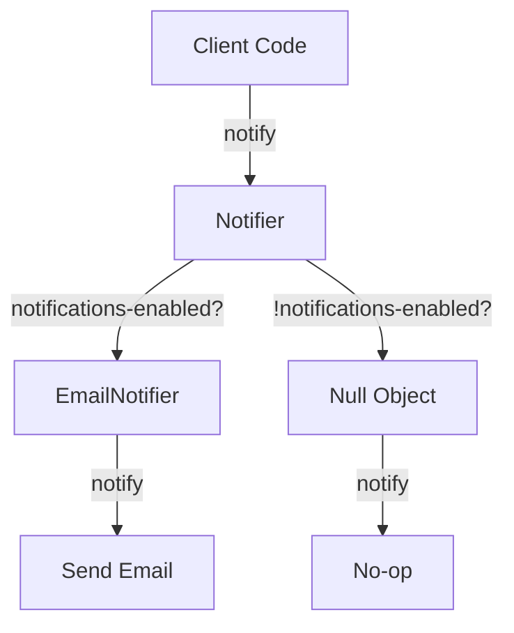

## 2.3.12 Null Object Pattern in Clojure

In software development, handling null references can often lead to complex and error-prone code. The Null Object Pattern offers a solution by providing an object with default behavior to represent nulls, thereby avoiding null checks and simplifying code. This pattern is particularly useful in Clojure, where leveraging protocols and default implementations can lead to more elegant and maintainable code.

### Introduction

The Null Object Pattern is a behavioral design pattern that provides a default object to represent the absence of a value. Instead of using `nil` or `null`, which requires explicit checks, a null object implements the expected interface with default or no-op behavior. This approach reduces conditional logic and enhances code readability and robustness.

### Detailed Explanation

In Clojure, the Null Object Pattern can be effectively implemented using protocols and records. By defining a protocol with default methods, you can create a null object that adheres to the same interface as real objects, allowing client code to interact with it seamlessly without additional null checks.

#### Defining a Protocol with Default Methods

To implement the Null Object Pattern, start by defining a protocol with the desired methods. You can provide default implementations for these methods using `extend-type`.

```clojure
(defprotocol Notifier
  (notify [this message]))

(extend-type Object
  Notifier
  (notify [this message]
    ;; Default behavior
    (println "Default notification: No action taken.")))
```

In this example, the `Notifier` protocol defines a `notify` method. The default implementation for `Object` simply prints a message indicating no action is taken.

#### Implementing a Real Notifier

Next, implement a real notifier that performs the actual notification logic. This can be done using Clojure's `defrecord`.

```clojure
(defrecord EmailNotifier []
  Notifier
  (notify [this message]
    ;; Send email notification
    (println (str "Sending email notification: " message))))
```

The `EmailNotifier` record implements the `Notifier` protocol and provides a concrete implementation for the `notify` method.

#### Using Notifier Without Null Checks

With the protocol and real notifier in place, you can use the notifier without worrying about null checks. The null object will handle cases where notifications are disabled.

```clojure
(def notifications-enabled? false)

(def notifier (if notifications-enabled?
                (->EmailNotifier)
                nil))

(notify notifier "Event occurred.")
```

In this scenario, if `notifications-enabled?` is `false`, `notifier` will be `nil`. However, thanks to the protocol extension for `nil`, the `notify` method will still be called without causing errors.

#### Leveraging Protocol Extensions to Handle `nil`

To handle `nil` gracefully, extend the protocol for `nil` and provide a no-op implementation.

```clojure
(extend-type nil
  Notifier
  (notify [this message]
    ;; Do nothing
    (println "No notification sent.")))
```

This extension ensures that calling `notify` on a `nil` notifier does not result in a null pointer exception. Instead, it executes the no-op implementation.

### Visual Aids

To better understand the Null Object Pattern, consider the following conceptual diagram illustrating the interaction between client code, the notifier, and the null object:



### Advantages and Disadvantages

**Advantages:**
- **Simplifies Code:** Eliminates the need for null checks, reducing conditional logic.
- **Enhances Readability:** Code is easier to read and understand without scattered null checks.
- **Improves Robustness:** Reduces the risk of null pointer exceptions.

**Disadvantages:**
- **Overhead:** May introduce additional objects, though this is minimal in Clojure due to its efficient handling of immutable data.
- **Complexity:** Can add complexity if overused or applied inappropriately.

### Best Practices

- **Use Sparingly:** Apply the Null Object Pattern in scenarios where null checks are frequent and cumbersome.
- **Combine with Other Patterns:** Consider combining with other patterns like Strategy or Factory for more flexible designs.
- **Leverage Clojure's Strengths:** Utilize Clojure's protocols and records to implement the pattern efficiently.

### Comparisons

The Null Object Pattern can be compared to other patterns like the Strategy Pattern, where different strategies (including a null strategy) can be used interchangeably. However, the Null Object Pattern specifically addresses the issue of null checks, making it more focused on handling absence.

### Conclusion

The Null Object Pattern in Clojure provides a powerful tool for simplifying code by eliminating null checks and using default behaviors. By leveraging Clojure's protocols and records, developers can create robust and maintainable systems that handle the absence of values gracefully.

## Quiz Time!



### What is the primary purpose of the Null Object Pattern?

- [x] To provide an object with default behavior to represent nulls
- [ ] To enhance performance by reducing object creation
- [ ] To simplify database interactions
- [ ] To manage concurrent processes

> **Explanation:** The Null Object Pattern provides an object with default behavior to represent nulls, avoiding null checks and simplifying code.

### How does the Null Object Pattern enhance code readability?

- [x] By eliminating the need for null checks
- [ ] By using complex algorithms
- [ ] By increasing the number of objects
- [ ] By adding more conditional logic

> **Explanation:** The Null Object Pattern enhances code readability by eliminating the need for null checks, reducing conditional logic.

### In Clojure, which construct is primarily used to implement the Null Object Pattern?

- [x] Protocols and records
- [ ] Atoms and refs
- [ ] Sequences and lists
- [ ] Macros and functions

> **Explanation:** Protocols and records are used in Clojure to implement the Null Object Pattern, allowing for default method implementations.

### What is a potential disadvantage of the Null Object Pattern?

- [x] It may introduce additional objects
- [ ] It complicates database queries
- [ ] It increases memory usage significantly
- [ ] It reduces code maintainability

> **Explanation:** A potential disadvantage is that it may introduce additional objects, though this is minimal in Clojure.

### Which of the following is a best practice when using the Null Object Pattern?

- [x] Use sparingly in scenarios with frequent null checks
- [ ] Apply to all objects in the system
- [ ] Avoid combining with other patterns
- [ ] Use only in database applications

> **Explanation:** It is best to use the Null Object Pattern sparingly in scenarios with frequent null checks to simplify code.

### What does the `extend-type` function do in Clojure?

- [x] It extends a protocol to a specific type
- [ ] It creates a new record
- [ ] It defines a new function
- [ ] It initializes a new object

> **Explanation:** The `extend-type` function in Clojure extends a protocol to a specific type, allowing for default method implementations.

### How does the Null Object Pattern improve robustness?

- [x] By reducing the risk of null pointer exceptions
- [ ] By increasing the number of conditional checks
- [ ] By complicating the code structure
- [ ] By adding more error handling

> **Explanation:** The Null Object Pattern improves robustness by reducing the risk of null pointer exceptions through default behaviors.

### Which Clojure feature allows handling `nil` gracefully in the Null Object Pattern?

- [x] Protocol extensions
- [ ] Macros
- [ ] Agents
- [ ] Futures

> **Explanation:** Protocol extensions in Clojure allow handling `nil` gracefully by providing default implementations.

### What is the role of a real notifier in the Null Object Pattern?

- [x] To perform the actual notification logic
- [ ] To act as a placeholder for null
- [ ] To increase the complexity of the system
- [ ] To manage database transactions

> **Explanation:** A real notifier performs the actual notification logic, while the null object handles cases where no action is needed.

### True or False: The Null Object Pattern is only applicable in object-oriented programming languages.

- [ ] True
- [x] False

> **Explanation:** False. The Null Object Pattern can be applied in functional programming languages like Clojure using protocols and records.


