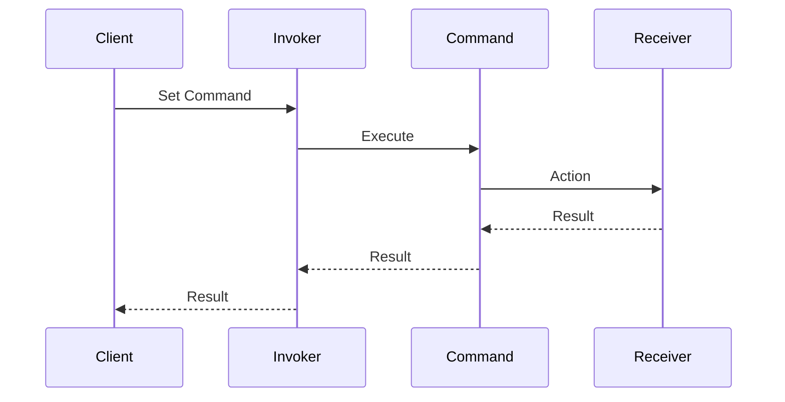

## 2.3.2 Command (GoF) in Clojure

### Introduction

The Command Pattern is a behavioral design pattern from the Gang of Four (GoF) that encapsulates a request as an object, thereby allowing for parameterization of clients with queues, requests, and operations. This pattern decouples the object that invokes the operation from the one that knows how to perform it. In Clojure, a functional programming language, we can leverage functions and data structures to implement this pattern effectively.

### Detailed Explanation

The Command Pattern involves several key components:

- **Command Interface:** Defines the interface for executing an operation.
- **Concrete Command:** Implements the command interface and defines the binding between a receiver and an action.
- **Invoker:** Asks the command to carry out the request.
- **Receiver:** Knows how to perform the operations associated with carrying out a request.

In Clojure, we can represent commands using functions or data structures, making it easy to queue, log, or undo operations.

### Visual Aids

Let's visualize the Command Pattern using a sequence diagram to illustrate the interaction between components:



### Code Examples

#### Define Command Functions

In Clojure, we can define command functions that encapsulate the logic for operations:

```clojure
(defn turn-on [device]
  (println (str "Turning on the " device)))

(defn turn-off [device]
  (println (str "Turning off the " device)))
```

#### Create Command Data Structures

We can create a list of command data structures, each containing an action and a target device:

```clojure
(def commands
  [{:action turn-on :device "Light"}
   {:action turn-off :device "Fan"}])
```

#### Execute Commands

Using a simple loop, we can execute each command by invoking the associated function:

```clojure
(doseq [cmd commands]
  ((:action cmd) (:device cmd)))
```

#### Implement Command Queueing

To queue commands for later execution, we can use a queue or stack data structure. Here's a simple example using a vector as a stack:

```clojure
(def command-stack (atom []))

(defn enqueue-command [command]
  (swap! command-stack conj command))

(defn execute-commands []
  (doseq [cmd @command-stack]
    ((:action cmd) (:device cmd)))
  (reset! command-stack []))
```

### Use Cases

The Command Pattern is particularly useful in scenarios where:

- You need to parameterize objects with operations.
- You want to queue operations for later execution.
- You need to support undoable operations.
- You want to log changes or operations.

### Advantages and Disadvantages

**Advantages:**

- **Decoupling:** Separates the invoker from the executor, promoting loose coupling.
- **Flexibility:** Easily add new commands without changing existing code.
- **Undo/Redo:** Facilitates implementing undoable operations by storing command history.

**Disadvantages:**

- **Complexity:** Introduces additional layers of abstraction, which can complicate simple tasks.
- **Overhead:** May introduce unnecessary overhead for simple operations.

### Best Practices

- **Use Data Structures:** Represent commands as data structures to leverage Clojure's strengths in data manipulation.
- **Leverage Higher-Order Functions:** Use higher-order functions to encapsulate command logic.
- **Maintain Immutability:** Ensure that command execution does not mutate shared state, preserving Clojure's functional paradigm.

### Comparisons

The Command Pattern can be compared to other behavioral patterns like Strategy and Observer. While Strategy focuses on encapsulating algorithms, Command encapsulates requests, and Observer deals with event-driven communication.

### Conclusion

The Command Pattern in Clojure provides a robust mechanism for encapsulating requests as objects, enabling flexible and decoupled system architectures. By leveraging Clojure's functional capabilities, we can implement this pattern efficiently, promoting clean and maintainable code.

## Quiz Time!



### What is the primary purpose of the Command Pattern?

- [x] To encapsulate requests as objects
- [ ] To manage object creation
- [ ] To define a family of algorithms
- [ ] To provide a simplified interface to a complex system

> **Explanation:** The Command Pattern encapsulates requests as objects, allowing for parameterization and queuing.

### In Clojure, how can commands be represented?

- [x] As functions or data structures
- [ ] As classes and interfaces
- [ ] As XML configurations
- [ ] As JSON objects

> **Explanation:** In Clojure, commands can be represented using functions or data structures, leveraging its functional nature.

### Which component in the Command Pattern knows how to perform the operation?

- [ ] Invoker
- [ ] Client
- [x] Receiver
- [ ] Command

> **Explanation:** The Receiver knows how to perform the operations associated with carrying out a request.

### What is a key advantage of the Command Pattern?

- [ ] It simplifies object creation.
- [x] It decouples the invoker from the executor.
- [ ] It reduces memory usage.
- [ ] It enhances data security.

> **Explanation:** The Command Pattern decouples the invoker from the executor, promoting loose coupling.

### How can command queueing be implemented in Clojure?

- [x] Using a vector as a stack
- [ ] Using a linked list
- [ ] Using a hash map
- [ ] Using a binary tree

> **Explanation:** Command queueing can be implemented using a vector as a stack to store commands for later execution.

### What is a potential disadvantage of the Command Pattern?

- [ ] It tightly couples components.
- [ ] It reduces code readability.
- [x] It introduces additional complexity.
- [ ] It limits scalability.

> **Explanation:** The Command Pattern can introduce additional complexity due to its abstraction layers.

### Which of the following is NOT a use case for the Command Pattern?

- [ ] Parameterizing objects with operations
- [ ] Queuing operations for later execution
- [x] Managing database connections
- [ ] Supporting undoable operations

> **Explanation:** Managing database connections is not a typical use case for the Command Pattern.

### What is a best practice when implementing the Command Pattern in Clojure?

- [ ] Use mutable state for command execution.
- [x] Leverage higher-order functions.
- [ ] Avoid using data structures.
- [ ] Implement commands as classes.

> **Explanation:** Leveraging higher-order functions is a best practice in Clojure for encapsulating command logic.

### How does the Command Pattern relate to the Strategy Pattern?

- [ ] Both focus on managing object creation.
- [x] Command encapsulates requests, while Strategy encapsulates algorithms.
- [ ] Both are structural patterns.
- [ ] Both are used for event-driven communication.

> **Explanation:** The Command Pattern encapsulates requests, while the Strategy Pattern encapsulates algorithms.

### True or False: The Command Pattern can facilitate implementing undoable operations.

- [x] True
- [ ] False

> **Explanation:** The Command Pattern can facilitate implementing undoable operations by storing command history.


