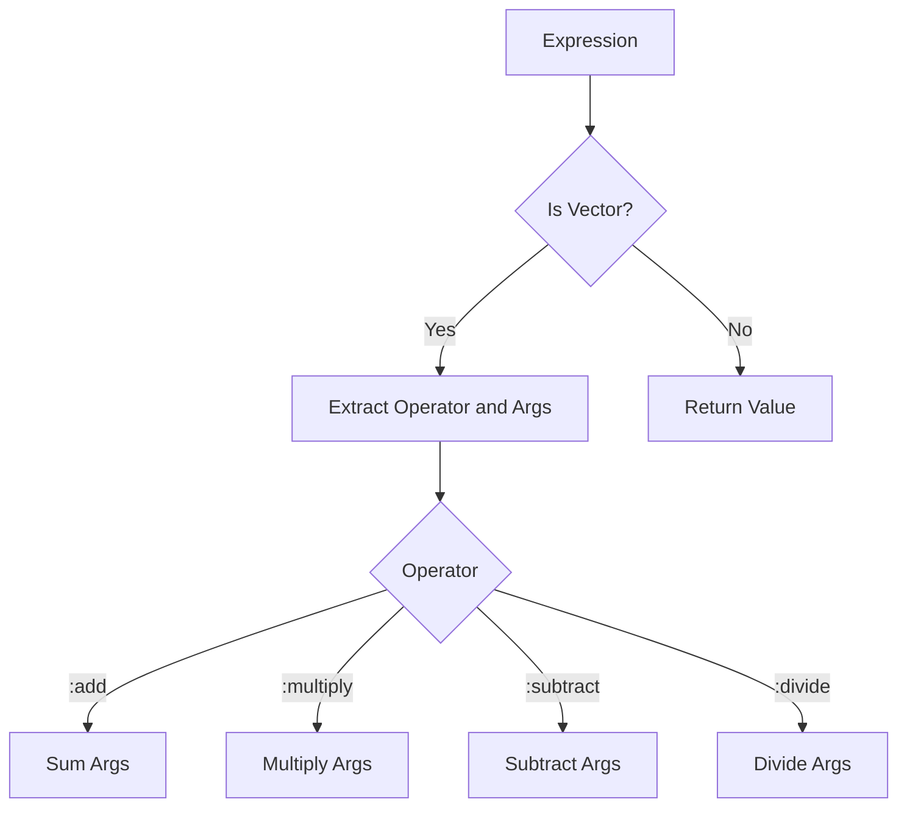

## 2.3.3 Interpreter (GoF) in Clojure

The Interpreter design pattern is a powerful tool for defining a representation of a grammar and providing a means to interpret or evaluate sentences in that language. In Clojure, this pattern can be particularly effective due to the language's strengths in symbolic computation and manipulation. This article delves into the implementation of the Interpreter pattern in Clojure, showcasing how to represent expressions as data structures and evaluate them efficiently.

### Introduction

The Interpreter pattern is part of the Behavioral design patterns in the Gang of Four (GoF) catalog. It is used to define a grammar for a language and provide an interpreter that uses this grammar to interpret sentences in the language. This pattern is particularly useful in scenarios where you need to evaluate expressions or commands dynamically.

### Detailed Explanation

In Clojure, the Interpreter pattern can be elegantly implemented using the language's native data structures and functional programming paradigms. The core idea is to represent expressions as data structures, such as vectors or lists, and then evaluate these structures using recursive functions.

#### Defining the Grammar Using Data Structures

To start, we define a simple grammar using Clojure's data structures. Consider an arithmetic expression grammar that supports addition and multiplication:

```clojure
(def expression [:add 1 [:multiply 2 3]])
```

In this representation, `:add` and `:multiply` are operators, and the numbers are operands. The expression `[:add 1 [:multiply 2 3]]` corresponds to the arithmetic expression `1 + (2 * 3)`.

#### Implementing an Evaluation Function

The next step is to implement a function that can evaluate these expressions. This function will recursively process the expression data structure, applying the appropriate operations:

```clojure
(defn evaluate [expr]
  (if (vector? expr)
    (let [[op & args] expr]
      (case op
        :add (reduce + (map evaluate args))
        :multiply (reduce * (map evaluate args))))
    expr))
```

This `evaluate` function checks if the expression is a vector. If it is, it destructures the vector into an operator `op` and its arguments `args`. The `case` expression is used to determine which operation to perform, recursively evaluating the arguments.

#### Evaluating Expressions

With the evaluation function in place, we can now evaluate expressions:

```clojure
(evaluate expression) ; => 7
```

This evaluates the expression `1 + (2 * 3)` to `7`.

#### Extending the Interpreter

One of the strengths of this approach is its extensibility. Adding new operations is straightforward: simply expand the `case` expression in the `evaluate` function. For example, to add subtraction and division:

```clojure
(defn evaluate [expr]
  (if (vector? expr)
    (let [[op & args] expr]
      (case op
        :add (reduce + (map evaluate args))
        :multiply (reduce * (map evaluate args))
        :subtract (reduce - (map evaluate args))
        :divide (reduce / (map evaluate args))))
    expr))
```

### Visual Aids

To better understand the flow of the Interpreter pattern, consider the following conceptual diagram:



This diagram illustrates the decision-making process within the `evaluate` function, showing how different operations are handled.

### Use Cases

The Interpreter pattern is useful in various scenarios, such as:

- **Scripting Languages:** Implementing simple scripting languages or domain-specific languages (DSLs).
- **Configuration Parsing:** Evaluating configuration files or command-line arguments.
- **Expression Evaluation:** Calculating mathematical expressions or logical conditions.

### Advantages and Disadvantages

**Advantages:**

- **Flexibility:** Easily extendable to support new operations or constructs.
- **Clarity:** Clear separation between the grammar definition and its evaluation.
- **Reusability:** Reusable for different types of expressions or languages.

**Disadvantages:**

- **Performance:** May not be suitable for performance-critical applications due to recursive evaluation.
- **Complexity:** Can become complex if the grammar grows significantly.

### Best Practices

- **Keep It Simple:** Start with a simple grammar and extend it as needed.
- **Use Clojure's Strengths:** Leverage Clojure's functional programming capabilities for clean and concise implementations.
- **Optimize Recursion:** Consider using techniques like tail recursion or trampolines to optimize recursive evaluations.

### Comparisons

The Interpreter pattern can be compared to other patterns like the Visitor pattern, which also deals with operations on data structures. However, the Interpreter pattern is more focused on evaluating expressions rather than applying operations.

### Conclusion

The Interpreter pattern in Clojure provides a powerful way to define and evaluate grammars using the language's symbolic computation capabilities. By representing expressions as data structures and using recursive evaluation, you can create flexible and extensible interpreters for various applications.

## Quiz Time!



### What is the primary purpose of the Interpreter pattern?

- [x] To define a representation for a grammar and provide a means to interpret it
- [ ] To encapsulate a request as an object
- [ ] To separate the construction of a complex object from its representation
- [ ] To provide a simplified interface to a complex subsystem

> **Explanation:** The Interpreter pattern is used to define a grammar and provide an interpreter for it.

### How are expressions represented in the Interpreter pattern in Clojure?

- [x] As data structures like vectors or lists
- [ ] As classes and objects
- [ ] As plain strings
- [ ] As XML documents

> **Explanation:** In Clojure, expressions are represented as data structures such as vectors or lists for easy manipulation.

### What does the `evaluate` function do in the Interpreter pattern?

- [x] It recursively processes the expression data structure to evaluate it
- [ ] It compiles the expression into machine code
- [ ] It converts the expression into a string
- [ ] It stores the expression in a database

> **Explanation:** The `evaluate` function recursively processes and evaluates the expression data structure.

### Which Clojure feature is leveraged for symbolic computation in the Interpreter pattern?

- [x] Functional programming and data structures
- [ ] Object-oriented programming
- [ ] Imperative loops
- [ ] Global variables

> **Explanation:** Clojure's functional programming and data structures are leveraged for symbolic computation.

### How can new operations be added to the Interpreter pattern in Clojure?

- [x] By expanding the `case` expression in the `evaluate` function
- [ ] By creating new classes
- [ ] By modifying the core language
- [ ] By using global variables

> **Explanation:** New operations can be added by expanding the `case` expression in the `evaluate` function.

### What is a potential disadvantage of the Interpreter pattern?

- [x] It may not be suitable for performance-critical applications
- [ ] It is too simple for most applications
- [ ] It cannot be extended
- [ ] It requires object-oriented programming

> **Explanation:** The recursive nature of the Interpreter pattern may not be suitable for performance-critical applications.

### Which of the following is a use case for the Interpreter pattern?

- [x] Scripting languages
- [ ] Database management
- [ ] Network communication
- [ ] File I/O operations

> **Explanation:** The Interpreter pattern is useful for implementing scripting languages and DSLs.

### What does the `case` expression do in the `evaluate` function?

- [x] It determines which operation to perform based on the operator
- [ ] It compiles the expression
- [ ] It converts the expression to a string
- [ ] It stores the expression in a database

> **Explanation:** The `case` expression determines the operation to perform based on the operator.

### What is an advantage of using Clojure for the Interpreter pattern?

- [x] Clojure's functional programming capabilities
- [ ] Clojure's object-oriented features
- [ ] Clojure's imperative syntax
- [ ] Clojure's global variables

> **Explanation:** Clojure's functional programming capabilities make it suitable for implementing the Interpreter pattern.

### True or False: The Interpreter pattern in Clojure can only evaluate arithmetic expressions.

- [ ] True
- [x] False

> **Explanation:** The Interpreter pattern can be extended to evaluate various types of expressions, not just arithmetic.


