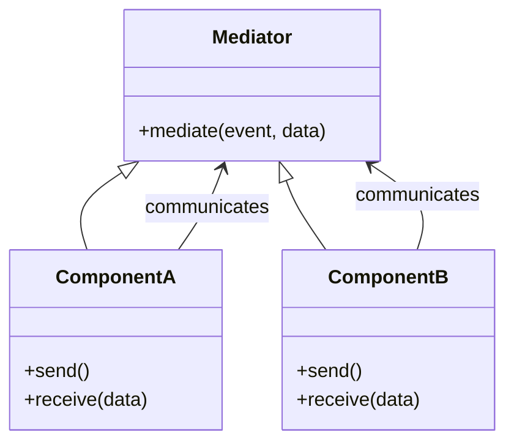

## 2.3.5 Mediator (GoF) in Clojure

The Mediator pattern is a behavioral design pattern that encapsulates how a set of objects interact, promoting loose coupling by preventing objects from referring to each other explicitly. Instead, they communicate through an intermediary known as the mediator. This pattern is particularly useful in scenarios where multiple objects need to interact in a complex manner, and direct communication would lead to a tangled web of dependencies.

### Introduction

In software design, managing the interactions between objects can become complex as the number of objects increases. The Mediator pattern addresses this complexity by introducing a mediator object that handles communication between objects, thereby reducing the dependencies between them. This leads to a more maintainable and scalable system architecture.

### Detailed Explanation

The Mediator pattern centralizes communication between components, allowing them to interact without being directly coupled. This is achieved by having each component communicate with the mediator, which in turn relays messages to the appropriate recipients. This decoupling enhances the flexibility and reusability of the components.

#### Key Components of the Mediator Pattern

- **Mediator:** The central hub that facilitates communication between components.
- **Colleagues:** The components or objects that interact with each other through the mediator.

### Visual Representation

Below is a conceptual diagram illustrating the Mediator pattern:



### Implementing the Mediator Pattern in Clojure

Let's explore how to implement the Mediator pattern in Clojure using both synchronous and asynchronous approaches.

#### Synchronous Mediation

In a synchronous setup, components communicate with the mediator directly through function calls.

```clojure
(defn handle-a [data]
  (println "Handling event A with data:" data))

(defn handle-b [data]
  (println "Handling event B with data:" data))

(defn mediator [event data]
  (case event
    :event-a (handle-a data)
    :event-b (handle-b data)))

(defn component-a []
  (mediator :event-b {:info "Data from A"}))

(defn component-b []
  (mediator :event-a {:info "Data from B"}))

;; Usage
(component-a)
(component-b)
```

In this example, `component-a` and `component-b` communicate through the `mediator` function, which delegates handling to the appropriate function based on the event type.

#### Asynchronous Mediation with `core.async`

For more complex scenarios, especially those involving asynchronous operations, `core.async` can be used to facilitate communication through channels.

```clojure
(require '[clojure.core.async :refer [chan go <! >!]])

(def mediator-chan (chan))

(defn handle-a [data]
  (println "Asynchronously handling event A with data:" data))

(defn handle-b [data]
  (println "Asynchronously handling event B with data:" data))

(defn mediator [event data]
  (case event
    :event-a (handle-a data)
    :event-b (handle-b data)))

(go (while true
      (let [{:keys [event data]} (<! mediator-chan)]
        (mediator event data))))

(defn component-a []
  (go (>! mediator-chan {:event :event-b :data {:info "Data from A"}})))

(defn component-b []
  (go (>! mediator-chan {:event :event-a :data {:info "Data from B"}})))

;; Usage
(component-a)
(component-b)
```

In this asynchronous example, `component-a` and `component-b` send messages to the `mediator-chan`, which are then processed by the `mediator` function running in a separate go block.

### Use Cases

The Mediator pattern is particularly useful in the following scenarios:

- **Complex UI Components:** Managing interactions between various UI components without direct dependencies.
- **Workflow Systems:** Coordinating tasks and events in a workflow system.
- **Event-Driven Architectures:** Centralizing event handling in systems where components need to react to a variety of events.

### Advantages and Disadvantages

#### Advantages

- **Loose Coupling:** Reduces dependencies between components, making the system more modular and easier to maintain.
- **Centralized Control:** Simplifies the management of interactions by centralizing them in the mediator.
- **Flexibility:** Facilitates changes in the interaction logic without affecting the components.

#### Disadvantages

- **Single Point of Failure:** The mediator can become a bottleneck or a single point of failure if not designed carefully.
- **Complexity:** The mediator itself can become complex if it handles too many interactions.

### Best Practices

- **Keep the Mediator Simple:** Avoid overloading the mediator with too much logic. Delegate responsibilities to handlers or separate functions where possible.
- **Use Asynchronous Communication Wisely:** Leverage `core.async` for non-blocking communication, especially in systems with high concurrency requirements.
- **Encapsulate Interaction Logic:** Ensure that the mediator encapsulates all interaction logic, keeping components unaware of each other.

### Comparisons with Other Patterns

The Mediator pattern is often compared to the Observer pattern. While both patterns deal with communication between components, the Mediator pattern centralizes communication, whereas the Observer pattern allows components to subscribe to events directly.

### Conclusion

The Mediator pattern is a powerful tool for managing complex interactions between components in a decoupled manner. By centralizing communication, it enhances the modularity and maintainability of the system. When implemented thoughtfully, it can significantly simplify the architecture of complex applications.

## Quiz Time!



### What is the primary purpose of the Mediator pattern?

- [x] To encapsulate how a set of objects interact
- [ ] To provide a global point of access to a single instance
- [ ] To define a family of algorithms
- [ ] To compose objects into tree structures

> **Explanation:** The Mediator pattern encapsulates how a set of objects interact, promoting loose coupling by preventing objects from referring to each other explicitly.

### How does the Mediator pattern promote loose coupling?

- [x] By using an intermediary to handle communication
- [ ] By allowing objects to communicate directly
- [ ] By sharing state between objects
- [ ] By using inheritance to share behavior

> **Explanation:** The Mediator pattern promotes loose coupling by using an intermediary (mediator) to handle communication between objects, preventing direct dependencies.

### Which Clojure library is commonly used for asynchronous mediation?

- [x] core.async
- [ ] clojure.spec
- [ ] clojure.java.jdbc
- [ ] clojure.data.json

> **Explanation:** The `core.async` library is commonly used in Clojure for asynchronous communication, including implementing the Mediator pattern.

### What is a potential disadvantage of the Mediator pattern?

- [x] The mediator can become a single point of failure
- [ ] It increases coupling between components
- [ ] It requires inheritance
- [ ] It makes the system less flexible

> **Explanation:** A potential disadvantage of the Mediator pattern is that the mediator can become a single point of failure or a bottleneck if not designed carefully.

### In the provided Clojure example, what does the `mediator` function do?

- [x] It delegates handling to the appropriate function based on the event type
- [ ] It directly modifies the state of components
- [ ] It initializes components
- [ ] It creates new components

> **Explanation:** The `mediator` function delegates handling to the appropriate function based on the event type, centralizing communication logic.

### What is the role of `core.async` channels in the asynchronous mediation example?

- [x] To facilitate non-blocking communication between components
- [ ] To store component state
- [ ] To synchronize threads
- [ ] To manage component lifecycles

> **Explanation:** In the asynchronous mediation example, `core.async` channels facilitate non-blocking communication between components.

### Which of the following is a key component of the Mediator pattern?

- [x] Mediator
- [x] Colleagues
- [ ] Singleton
- [ ] Adapter

> **Explanation:** The key components of the Mediator pattern are the Mediator and the Colleagues (components that interact through the mediator).

### How does the Mediator pattern differ from the Observer pattern?

- [x] The Mediator centralizes communication, while the Observer allows direct event subscription
- [ ] The Mediator uses inheritance, while the Observer uses composition
- [ ] The Mediator is for state management, while the Observer is for UI updates
- [ ] The Mediator is a creational pattern, while the Observer is a structural pattern

> **Explanation:** The Mediator pattern centralizes communication through a mediator, while the Observer pattern allows components to subscribe to events directly.

### What is a best practice when implementing the Mediator pattern?

- [x] Keep the mediator simple and delegate responsibilities
- [ ] Use the mediator to store all component state
- [ ] Allow components to communicate directly for efficiency
- [ ] Avoid using asynchronous communication

> **Explanation:** A best practice when implementing the Mediator pattern is to keep the mediator simple and delegate responsibilities to handlers or separate functions.

### True or False: The Mediator pattern is only useful in UI applications.

- [x] False
- [ ] True

> **Explanation:** False. The Mediator pattern is useful in various scenarios, not just UI applications, wherever complex interactions between components need to be managed.


