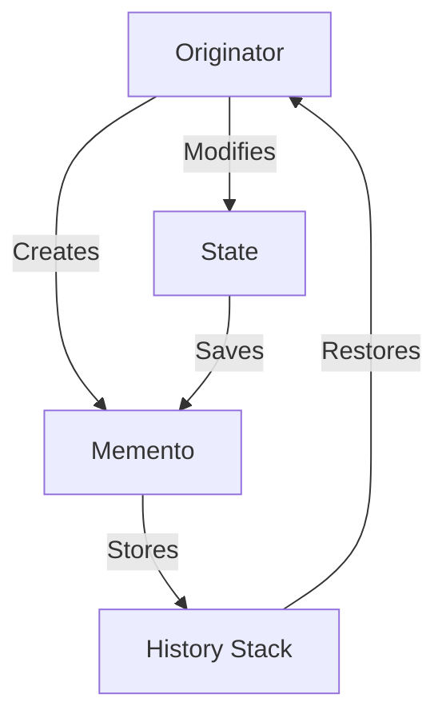

## 2.3.6 Memento (GoF) in Clojure

The Memento design pattern is a behavioral pattern that allows you to capture and externalize an object's internal state without violating encapsulation, so that the object can be restored to this state later. This pattern is particularly useful in scenarios where you need to implement undo functionality or maintain a history of changes. In Clojure, leveraging immutable data structures makes capturing and restoring state both efficient and straightforward.

### Introduction

The Memento pattern is composed of three main components:

1. **Originator**: The object whose state needs to be saved and restored.
2. **Memento**: A representation of the saved state.
3. **Caretaker**: Manages the memento's lifecycle, typically storing and restoring states.

In Clojure, we can utilize atoms for mutable state management and leverage immutable data structures to represent mementos, ensuring that state snapshots are both efficient and safe.

### Detailed Explanation

#### Originator with Mutable State

In Clojure, the `atom` is a perfect fit for managing mutable state. It allows us to encapsulate the state of the originator while providing thread-safe operations to modify it.

```clojure
(def state (atom {:content ""}))
```

Here, `state` is an atom holding a map with a `:content` key. This represents the internal state of our originator.

#### Creating Mementos by Copying State

To capture the current state, we simply dereference the atom. This operation is efficient due to Clojure's persistent data structures.

```clojure
(defn save-state []
  @state)
```

The `save-state` function returns the current state, effectively creating a memento.

#### Restoring State from Memento

Restoring the state involves resetting the atom to a previously saved state.

```clojure
(defn restore-state [memento]
  (reset! state memento))
```

The `restore-state` function takes a memento and uses `reset!` to revert the atom to this state.

#### Managing History Stack

To implement undo functionality, we need to maintain a history of states. This is managed using another atom that acts as a stack.

```clojure
(def history (atom []))

(defn make-change [new-content]
  (swap! history conj (save-state))
  (swap! state assoc :content new-content))
```

The `make-change` function saves the current state to the history before updating the state with new content.

#### Implementing Undo Functionality

Undoing a change involves popping the last state from the history and restoring it.

```clojure
(defn undo []
  (when-let [prev-state (peek @history)]
    (restore-state prev-state)
    (swap! history pop)))
```

The `undo` function checks if there is a previous state in the history, restores it, and then removes it from the history stack.

### Visual Aids

Below is a conceptual diagram illustrating the Memento pattern workflow in Clojure:



### Code Examples

Let's see the Memento pattern in action with a simple text editor simulation:

```clojure
(def state (atom {:content ""}))
(def history (atom []))

(defn save-state []
  @state)

(defn restore-state [memento]
  (reset! state memento))

(defn make-change [new-content]
  (swap! history conj (save-state))
  (swap! state assoc :content new-content))

(defn undo []
  (when-let [prev-state (peek @history)]
    (restore-state prev-state)
    (swap! history pop)))

;; Usage
(make-change "Hello, World!")
(make-change "Hello, Clojure!")
(println @state) ;; {:content "Hello, Clojure!"}
(undo)
(println @state) ;; {:content "Hello, World!"}
```

### Use Cases

- **Text Editors**: Implementing undo/redo functionality.
- **Game Development**: Saving and restoring game states.
- **Form Management**: Reverting form fields to previous states.

### Advantages and Disadvantages

**Advantages:**

- **Encapsulation**: State is captured without exposing internal details.
- **Simplicity**: Easy to implement with immutable data structures.
- **Flexibility**: Can be adapted to various use cases requiring state restoration.

**Disadvantages:**

- **Memory Usage**: Storing multiple states can increase memory consumption.
- **Complexity**: Managing a large number of states may complicate the system.

### Best Practices

- Use immutable data structures for mementos to ensure thread safety and efficiency.
- Limit the number of stored states to manage memory usage effectively.
- Consider using libraries like `core.async` for more complex state management scenarios.

### Comparisons

The Memento pattern is often compared with the Command pattern, which also deals with state management but focuses on encapsulating operations rather than states.

### Conclusion

The Memento pattern in Clojure provides a robust mechanism for capturing and restoring object states, leveraging the language's strengths in immutability and functional programming. By following best practices and understanding its advantages and limitations, developers can effectively implement this pattern in various applications.

## Quiz Time!



### What is the primary purpose of the Memento pattern?

- [x] To capture and restore an object's internal state without exposing its details.
- [ ] To manage concurrent access to shared resources.
- [ ] To provide a simplified interface to a complex subsystem.
- [ ] To decouple an abstraction from its implementation.

> **Explanation:** The Memento pattern is designed to capture and restore an object's internal state without exposing its details, allowing for state restoration.

### In Clojure, which data structure is typically used to manage mutable state in the Memento pattern?

- [x] Atom
- [ ] Vector
- [ ] List
- [ ] Set

> **Explanation:** Atoms are used in Clojure to manage mutable state, providing thread-safe operations for state changes.

### How is a memento created in the provided Clojure example?

- [x] By dereferencing the atom holding the state.
- [ ] By creating a new atom for each state.
- [ ] By using a protocol to define state.
- [ ] By serializing the state to a file.

> **Explanation:** A memento is created by dereferencing the atom, which captures the current state as an immutable snapshot.

### What is the role of the history stack in the Memento pattern?

- [x] To store previous states for undo functionality.
- [ ] To manage concurrent state changes.
- [ ] To provide a backup of the current state.
- [ ] To log state changes for auditing.

> **Explanation:** The history stack stores previous states, allowing the system to revert to earlier states for undo functionality.

### Which function is responsible for restoring a state from a memento in the example?

- [x] `restore-state`
- [ ] `save-state`
- [ ] `make-change`
- [ ] `undo`

> **Explanation:** The `restore-state` function takes a memento and resets the atom to this state, restoring the previous state.

### What happens when the `undo` function is called and the history stack is empty?

- [x] Nothing happens; the state remains unchanged.
- [ ] An error is thrown.
- [ ] The state is reset to an initial value.
- [ ] A new state is created.

> **Explanation:** If the history stack is empty, the `undo` function does nothing, leaving the state unchanged.

### Which of the following is a disadvantage of the Memento pattern?

- [x] Increased memory usage due to storing multiple states.
- [ ] Difficulty in capturing an object's state.
- [ ] Lack of encapsulation for internal state.
- [ ] Complexity in implementing the pattern.

> **Explanation:** Storing multiple states can increase memory usage, which is a potential disadvantage of the Memento pattern.

### What is a common use case for the Memento pattern?

- [x] Implementing undo functionality in text editors.
- [ ] Managing user authentication.
- [ ] Simplifying complex interfaces.
- [ ] Decoupling system components.

> **Explanation:** The Memento pattern is commonly used to implement undo functionality, such as in text editors.

### How does Clojure's immutability benefit the Memento pattern?

- [x] It ensures that state snapshots are safe and efficient.
- [ ] It complicates the process of capturing state.
- [ ] It requires additional libraries for state management.
- [ ] It limits the pattern's applicability.

> **Explanation:** Clojure's immutability ensures that state snapshots are safe and efficient, as they cannot be modified once created.

### True or False: The Memento pattern violates encapsulation by exposing an object's internal state.

- [x] False
- [ ] True

> **Explanation:** The Memento pattern preserves encapsulation by capturing an object's state without exposing its internal details.


