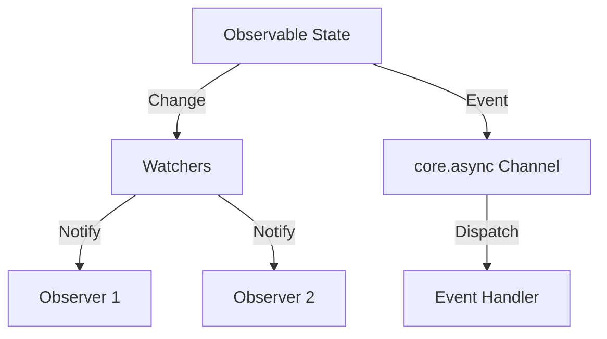

## 2.3.7 Observer (GoF) in Clojure

The Observer pattern is a fundamental design pattern in software engineering, often used to implement distributed event-handling systems. It defines a one-to-many dependency between objects so that when one object changes state, all its dependents are notified and updated automatically. In Clojure, this pattern can be elegantly implemented using its functional programming paradigms, leveraging reference types and concurrency primitives.

### Introduction

The Observer pattern is particularly useful in scenarios where a change in one part of an application needs to be communicated to other parts without tightly coupling the components. This pattern is commonly used in GUI toolkits, event-driven systems, and real-time data processing applications.

### Detailed Explanation

In Clojure, the Observer pattern can be implemented using atoms and their watch capabilities, as well as `core.async` for more complex reactive systems. Let's explore these implementations in detail.

#### Using Atoms and Watches

Atoms in Clojure provide a way to manage shared, synchronous, and independent state. They are perfect for implementing the Observer pattern due to their ability to notify watchers of state changes.

##### Creating an Observable Reference

To start, we define an atom that will hold our observable state:

```clojure
(def observable (atom {:count 0}))
```

##### Adding Watchers to Monitor Changes

We can add watchers to this atom to react to state changes. A watcher is a function that gets called whenever the atom's state changes:

```clojure
(add-watch observable :observer
  (fn [key ref old-state new-state]
    (println "State changed from" old-state "to" new-state)))
```

In this example, the watcher prints the old and new state whenever the atom's state changes.

##### Updating State to Trigger Notifications

To trigger the watchers, we update the state of the atom using `swap!`:

```clojure
(swap! observable update :count inc)
```

This will increment the `:count` in the atom and notify all watchers of the change.

#### Using `core.async` for Reactive Systems

For more complex scenarios, such as handling asynchronous events or building reactive systems, `core.async` provides a powerful toolset.

##### Setting Up a Channel for Event Notifications

First, we create a channel to handle event notifications:

```clojure
(require '[clojure.core.async :refer [chan go <! >!!]])

(def event-chan (chan))
```

##### Observing Events

We can define a function to observe and handle events from the channel:

```clojure
(defn observe-events []
  (go (while true
        (let [event (<! event-chan)]
          (println "Received event:" event)))))
```

This function continuously listens for events on the channel and processes them.

##### Publishing Events to Observers

To publish an event, we simply put it onto the channel:

```clojure
(>!! event-chan {:type :update :data "New Data"})
```

This will send the event to all observers listening on the channel.

### Visual Aids

#### Conceptual Diagram

Below is a conceptual diagram illustrating the Observer pattern in Clojure using atoms and `core.async`:



### Use Cases

- **Real-time Data Monitoring:** Use the Observer pattern to update UI components in real-time as data changes.
- **Event-Driven Systems:** Implement event-driven architectures where components react to changes in state or external events.
- **Decoupled Systems:** Maintain loose coupling between components by using observers to handle state changes.

### Advantages and Disadvantages

**Advantages:**
- Promotes loose coupling between components.
- Simplifies the implementation of reactive systems.
- Enhances modularity and separation of concerns.

**Disadvantages:**
- Can lead to performance overhead if not managed properly, especially with a large number of observers.
- Complexity increases with the number of dependencies and interactions.

### Best Practices

- **Use Atoms for Simplicity:** For simple state changes, atoms and watches provide a straightforward implementation.
- **Leverage core.async for Complexity:** Use `core.async` for more complex scenarios requiring asynchronous processing.
- **Avoid Over-Notification:** Ensure that state changes are meaningful to avoid unnecessary notifications and performance hits.

### Comparisons

- **Observer vs. Pub-Sub:** While both patterns involve notifying subscribers, the Observer pattern is more about state changes, whereas Pub-Sub is about broadcasting messages.
- **Observer vs. Reactive Streams:** Reactive streams provide backpressure and are more suitable for handling large volumes of data efficiently.

### Conclusion

The Observer pattern in Clojure is a powerful tool for building responsive and decoupled systems. By leveraging Clojure's atoms and `core.async`, developers can create efficient and scalable applications that react to state changes and events seamlessly.

## Quiz Time!



### What is the primary purpose of the Observer pattern?

- [x] To define a one-to-many dependency between objects
- [ ] To encapsulate a request as an object
- [ ] To provide a simplified interface to a complex subsystem
- [ ] To convert the interface of a class into another interface

> **Explanation:** The Observer pattern defines a one-to-many dependency so that when one object changes state, all its dependents are notified.

### Which Clojure construct is commonly used to implement the Observer pattern?

- [x] Atoms
- [ ] Refs
- [ ] Vars
- [ ] Agents

> **Explanation:** Atoms are used in Clojure to manage shared, synchronous, and independent state, making them suitable for the Observer pattern.

### How do you add a watcher to an atom in Clojure?

- [x] Using `add-watch`
- [ ] Using `add-observer`
- [ ] Using `watch`
- [ ] Using `observe`

> **Explanation:** The `add-watch` function is used to add a watcher to an atom in Clojure.

### What is the role of `core.async` in implementing the Observer pattern?

- [x] To handle asynchronous event notifications
- [ ] To manage synchronous state changes
- [ ] To provide a simplified interface
- [ ] To encapsulate requests as objects

> **Explanation:** `core.async` is used to handle asynchronous event notifications, making it suitable for implementing the Observer pattern in reactive systems.

### What function is used to update the state of an atom?

- [x] `swap!`
- [ ] `reset!`
- [ ] `alter`
- [ ] `ref-set`

> **Explanation:** The `swap!` function is used to update the state of an atom in Clojure.

### What is a potential disadvantage of the Observer pattern?

- [x] Performance overhead with many observers
- [ ] Tight coupling between components
- [ ] Lack of modularity
- [ ] Difficulty in implementing

> **Explanation:** The Observer pattern can lead to performance overhead if there are many observers, as each state change can trigger multiple notifications.

### Which of the following is a best practice when using the Observer pattern in Clojure?

- [x] Use `core.async` for complex scenarios
- [ ] Use refs for all state changes
- [ ] Avoid using atoms
- [ ] Implement observers as synchronous functions

> **Explanation:** Using `core.async` for complex scenarios allows handling asynchronous processing efficiently.

### What is the difference between the Observer pattern and Pub-Sub?

- [x] Observer is about state changes, Pub-Sub is about message broadcasting
- [ ] Observer is synchronous, Pub-Sub is asynchronous
- [ ] Observer is for UI updates, Pub-Sub is for backend processing
- [ ] Observer is for data storage, Pub-Sub is for data retrieval

> **Explanation:** The Observer pattern focuses on state changes, while Pub-Sub is about broadcasting messages to subscribers.

### Which Clojure library is often used for reactive streams?

- [x] `core.async`
- [ ] `clojure.spec`
- [ ] `clojure.test`
- [ ] `clojure.java.jdbc`

> **Explanation:** `core.async` is commonly used in Clojure for handling reactive streams and asynchronous processing.

### True or False: The Observer pattern in Clojure can only be implemented using atoms.

- [x] False
- [ ] True

> **Explanation:** While atoms are commonly used, the Observer pattern can also be implemented using other constructs like `core.async` for more complex scenarios.


