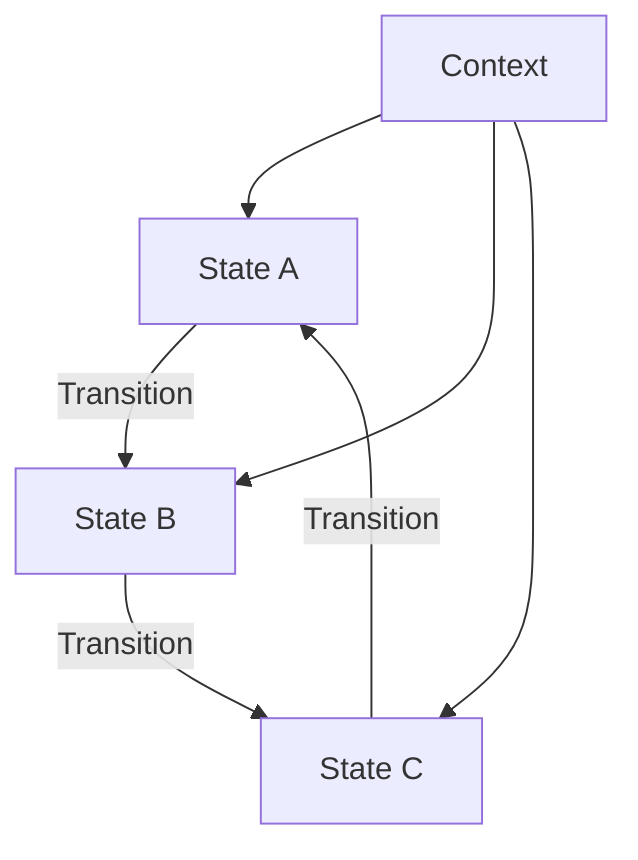

---

linkTitle: "2.3.8 State (GoF) in Clojure"
title: "State Design Pattern in Clojure: Implementing Dynamic Behavior with Pure Functions"
description: "Explore the State design pattern in Clojure, allowing objects to change behavior based on internal state changes using pure functions and functional programming paradigms."
categories:
- Design Patterns
- Clojure
- Functional Programming
tags:
- State Pattern
- Clojure
- Functional Design
- Behavioral Patterns
- Pure Functions
date: 2024-10-25
type: docs
nav_weight: 238000
canonical: "https://softwarepatternslexicon.com/patterns-clojure/2/3/8"
license: "© 2024 Tokenizer Inc. CC BY-NC-SA 4.0"
---

## 2.3.8 State (GoF) in Clojure

### Introduction

The State design pattern is a behavioral pattern that allows an object to change its behavior when its internal state changes. This pattern is particularly useful in scenarios where an object must exhibit different behaviors in different states, and these states can change dynamically at runtime. In Clojure, we can leverage the power of functional programming to implement the State pattern using pure functions and immutable data structures, ensuring that our code remains clean, maintainable, and scalable.

### Detailed Explanation

In the traditional object-oriented approach, the State pattern involves creating a state interface and concrete state classes that encapsulate the behavior associated with each state. However, in Clojure, we can represent states as functions or data, allowing us to manage state transitions in a more functional and idiomatic manner.

#### Key Components

1. **State Functions:** Each state is represented by a function that takes the current context as an argument and returns an updated context. This function encapsulates the behavior associated with that state.

2. **Context:** A map that holds the current state and any additional data required by the state functions. The context is passed to each state function, which can modify it as needed.

3. **State Transition Loop:** A loop that continuously invokes the current state function, allowing the context to transition between states based on the logic defined within each state function.

### Visualizing the State Pattern

Here's a conceptual diagram illustrating the State pattern in Clojure:



### Implementing the State Pattern in Clojure

Let's walk through a practical implementation of the State pattern in Clojure, using a simple example of a traffic light system with three states: Red, Green, and Yellow.

#### Define State Functions

Each state function will encapsulate the behavior of the traffic light in that state and determine the next state.

```clojure
(defn red-state [context]
  (println "Traffic light is RED. Stop!")
  ;; Transition to green state
  (assoc context :state green-state))

(defn green-state [context]
  (println "Traffic light is GREEN. Go!")
  ;; Transition to yellow state
  (assoc context :state yellow-state))

(defn yellow-state [context]
  (println "Traffic light is YELLOW. Slow down!")
  ;; Transition back to red state
  (assoc context :state red-state))
```

#### Initialize Context with Initial State

The context holds the current state and any additional data. Here, we initialize it with the `red-state`.

```clojure
(def context {:state red-state :data {}})
```

#### State Transition Loop

The `run` function continuously invokes the current state function, allowing the traffic light to cycle through its states.

```clojure
(defn run [context]
  (let [current-state (:state context)]
    (when current-state
      (recur ((:state context) context)))))
```

#### Start the State Machine

Finally, we start the state machine by calling the `run` function with the initial context.

```clojure
(run context)
```

### Use Cases

The State pattern is applicable in various scenarios, such as:

- **UI Components:** Managing different states of a UI component (e.g., enabled, disabled, loading).
- **Game Development:** Handling different states of a game character (e.g., idle, running, jumping).
- **Workflow Systems:** Managing different stages of a workflow process.

### Advantages and Disadvantages

#### Advantages

- **Encapsulation:** Each state encapsulates its behavior, promoting separation of concerns.
- **Flexibility:** Easily add new states or modify existing ones without affecting other parts of the system.
- **Clarity:** State transitions are explicit, making the system's behavior easier to understand and maintain.

#### Disadvantages

- **Complexity:** Can introduce complexity if there are many states and transitions.
- **Overhead:** May require additional overhead to manage state transitions and context updates.

### Best Practices

- **Use Pure Functions:** Ensure that state functions are pure, returning a new context without side effects.
- **Leverage Immutability:** Use immutable data structures to manage context, ensuring thread safety and consistency.
- **Keep State Functions Simple:** Each state function should focus on a single responsibility, making it easier to test and maintain.

### Comparisons

The State pattern is often compared to the Strategy pattern. While both involve encapsulating behavior, the State pattern focuses on changing behavior based on internal state, whereas the Strategy pattern allows behavior to be selected externally.

### Conclusion

The State design pattern is a powerful tool for managing dynamic behavior in Clojure applications. By leveraging pure functions and immutable data, we can implement this pattern in a way that is both idiomatic and efficient. Whether you're building a complex UI, a game, or a workflow system, the State pattern can help you manage state transitions cleanly and effectively.

## Quiz Time!



### What is the primary purpose of the State design pattern?

- [x] To allow an object to change its behavior when its internal state changes.
- [ ] To encapsulate a family of algorithms.
- [ ] To provide a simplified interface to a complex system.
- [ ] To manage object creation.

> **Explanation:** The State pattern allows an object to alter its behavior when its internal state changes, making it appear as if the object changes its class.

### How are states represented in the State pattern in Clojure?

- [x] As functions or data.
- [ ] As classes and interfaces.
- [ ] As global variables.
- [ ] As mutable objects.

> **Explanation:** In Clojure, states are typically represented as functions or data, leveraging the language's functional programming capabilities.

### What is the role of the context in the State pattern?

- [x] It holds the current state and any additional data required by state functions.
- [ ] It defines the interface for state transitions.
- [ ] It manages the lifecycle of state objects.
- [ ] It provides a global point of access to state functions.

> **Explanation:** The context is a map that holds the current state and any additional data needed by the state functions.

### Which of the following is a key advantage of using the State pattern?

- [x] It promotes separation of concerns by encapsulating behavior within state functions.
- [ ] It reduces the number of classes in the system.
- [ ] It simplifies the user interface design.
- [ ] It eliminates the need for state transitions.

> **Explanation:** The State pattern encapsulates behavior within state functions, promoting separation of concerns and making the system easier to maintain.

### In the provided Clojure example, what does the `run` function do?

- [x] It continuously invokes the current state function, allowing state transitions.
- [ ] It initializes the context with the initial state.
- [ ] It defines the behavior for each state.
- [ ] It manages the lifecycle of state objects.

> **Explanation:** The `run` function continuously invokes the current state function, allowing the context to transition between states.

### What is a potential disadvantage of the State pattern?

- [x] It can introduce complexity if there are many states and transitions.
- [ ] It makes the system less flexible.
- [ ] It reduces code readability.
- [ ] It increases coupling between components.

> **Explanation:** The State pattern can introduce complexity if there are many states and transitions to manage.

### How can you ensure thread safety when implementing the State pattern in Clojure?

- [x] By using immutable data structures to manage context.
- [ ] By using global variables to store state.
- [ ] By using mutable objects for state transitions.
- [ ] By avoiding the use of functions.

> **Explanation:** Using immutable data structures ensures thread safety and consistency when managing context in Clojure.

### Which of the following best describes a state function in the State pattern?

- [x] A function that takes the current context and returns an updated context.
- [ ] A function that initializes the context with the initial state.
- [ ] A function that manages the lifecycle of state objects.
- [ ] A function that provides a global point of access to state functions.

> **Explanation:** A state function takes the current context as an argument and returns an updated context, encapsulating the behavior of that state.

### What is the difference between the State and Strategy patterns?

- [x] The State pattern focuses on changing behavior based on internal state, while the Strategy pattern allows behavior to be selected externally.
- [ ] The State pattern is used for object creation, while the Strategy pattern is used for behavior encapsulation.
- [ ] The State pattern provides a simplified interface, while the Strategy pattern manages object lifecycles.
- [ ] The State pattern is used for managing dependencies, while the Strategy pattern is used for managing state transitions.

> **Explanation:** The State pattern focuses on changing behavior based on internal state, whereas the Strategy pattern allows behavior to be selected externally.

### True or False: In Clojure, state transitions in the State pattern should be managed using mutable objects.

- [ ] True
- [x] False

> **Explanation:** In Clojure, state transitions should be managed using immutable data structures and pure functions to ensure thread safety and maintainability.




