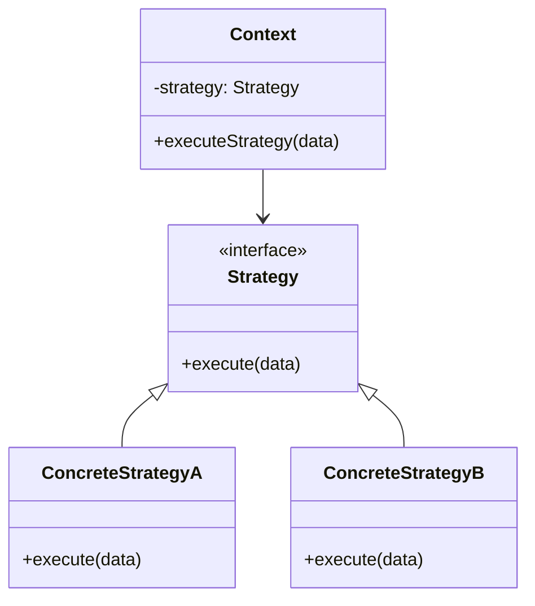

## 2.3.9 Strategy (GoF) in Clojure

The Strategy design pattern is a behavioral pattern that enables selecting an algorithm's behavior at runtime. This pattern defines a family of algorithms, encapsulates each one, and makes them interchangeable. In Clojure, the Strategy pattern can be elegantly implemented using higher-order functions, which allow algorithms to be passed as parameters and executed dynamically.

### Introduction

The Strategy pattern is particularly useful when you have multiple algorithms for a specific task and want to switch between them without altering the client code. This pattern promotes the Open/Closed Principle, one of the SOLID principles, by allowing new strategies to be added without modifying existing code.

### Detailed Explanation

In Clojure, the Strategy pattern can be implemented using functions as first-class citizens. This allows us to pass different algorithms (strategies) as arguments to a context function that executes them based on the current need.

#### Components of the Strategy Pattern

1. **Strategy Interface**: In Clojure, this is represented by a function signature that all strategies must adhere to.
2. **Concrete Strategies**: These are specific implementations of the strategy interface, each encapsulating a different algorithm.
3. **Context**: This component is responsible for selecting and executing the appropriate strategy.

### Visual Aids

Below is a conceptual diagram illustrating the Strategy pattern:



### Code Examples

Let's dive into some Clojure code to see how the Strategy pattern can be implemented.

#### Define Strategy Functions

First, we define a set of strategy functions, each implementing a different algorithm:

```clojure
(defn strategy-x [data]
  (println "Executing Strategy X with data:" data)
  ;; algorithm implementation for strategy X
  )

(defn strategy-y [data]
  (println "Executing Strategy Y with data:" data)
  ;; alternative implementation for strategy Y
  )
```

#### Create a Context Function

Next, we create a context function that takes a strategy and data as arguments and executes the strategy:

```clojure
(defn execute-strategy [strategy data]
  (strategy data))
```

#### Select and Execute Strategy

We can now select and execute a strategy by passing the desired strategy function to the context:

```clojure
(def input-data {:key "value"})

(execute-strategy strategy-x input-data)
```

#### Store Strategies in a Map for Dynamic Selection

To facilitate dynamic strategy selection, we can store strategies in a map and select them based on runtime conditions:

```clojure
(def strategies {:x strategy-x :y strategy-y})

(execute-strategy (strategies :x) input-data)
```

### Use Cases

The Strategy pattern is applicable in various scenarios, such as:

- **Sorting Algorithms**: Switching between different sorting algorithms based on data size or characteristics.
- **Payment Processing**: Selecting different payment gateways or methods based on user preference or location.
- **Compression Algorithms**: Choosing the most efficient compression algorithm based on file type or size.

### Advantages and Disadvantages

#### Advantages

- **Flexibility**: Easily switch between different algorithms at runtime.
- **Maintainability**: New strategies can be added without modifying existing code.
- **Reusability**: Strategies can be reused across different contexts.

#### Disadvantages

- **Complexity**: Introducing multiple strategies can increase the complexity of the codebase.
- **Overhead**: May introduce overhead if strategies are frequently switched or if there are many strategies.

### Best Practices

- **Use Higher-Order Functions**: Leverage Clojure's functional capabilities to pass strategies as arguments.
- **Encapsulate Strategy Logic**: Keep strategy logic separate from the context to promote modularity.
- **Consider Performance**: Be mindful of the performance implications of switching strategies frequently.

### Comparisons

The Strategy pattern is often compared to the State pattern. While both involve changing behavior at runtime, the Strategy pattern is focused on selecting algorithms, whereas the State pattern is concerned with changing an object's state.

### Conclusion

The Strategy pattern in Clojure provides a powerful mechanism for selecting algorithms dynamically, leveraging the language's functional programming capabilities. By encapsulating algorithms as first-class functions, Clojure developers can create flexible and maintainable systems that adhere to the Open/Closed Principle.

## Quiz Time!



### What is the primary purpose of the Strategy pattern?

- [x] To define a family of algorithms and make them interchangeable.
- [ ] To encapsulate object creation logic.
- [ ] To provide a simplified interface to a complex subsystem.
- [ ] To manage object state transitions.

> **Explanation:** The Strategy pattern is designed to define a family of algorithms, encapsulate each one, and make them interchangeable.

### How are strategies typically represented in Clojure?

- [x] As higher-order functions.
- [ ] As classes and interfaces.
- [ ] As macros.
- [ ] As global variables.

> **Explanation:** In Clojure, strategies are typically represented as higher-order functions, allowing them to be passed as arguments and executed dynamically.

### Which principle does the Strategy pattern promote?

- [x] Open/Closed Principle
- [ ] Single Responsibility Principle
- [ ] Dependency Inversion Principle
- [ ] Liskov Substitution Principle

> **Explanation:** The Strategy pattern promotes the Open/Closed Principle by allowing new strategies to be added without modifying existing code.

### What is a potential disadvantage of using the Strategy pattern?

- [x] Increased complexity due to multiple strategies.
- [ ] Difficulty in adding new strategies.
- [ ] Lack of flexibility in algorithm selection.
- [ ] Poor performance due to static strategy selection.

> **Explanation:** A potential disadvantage of the Strategy pattern is increased complexity due to the introduction of multiple strategies.

### How can strategies be dynamically selected in Clojure?

- [x] By storing them in a map and selecting based on runtime conditions.
- [ ] By using macros to switch strategies.
- [ ] By hardcoding strategy selection in the context function.
- [ ] By using global variables to store strategies.

> **Explanation:** Strategies can be dynamically selected in Clojure by storing them in a map and selecting based on runtime conditions.

### What is the role of the context in the Strategy pattern?

- [x] To select and execute the appropriate strategy.
- [ ] To define the algorithm interface.
- [ ] To encapsulate all strategies.
- [ ] To manage object state transitions.

> **Explanation:** The context in the Strategy pattern is responsible for selecting and executing the appropriate strategy.

### Which of the following is a real-world use case for the Strategy pattern?

- [x] Switching between different sorting algorithms.
- [ ] Managing object state transitions.
- [ ] Providing a simplified interface to a complex subsystem.
- [ ] Encapsulating object creation logic.

> **Explanation:** A real-world use case for the Strategy pattern is switching between different sorting algorithms.

### What is a key benefit of using higher-order functions in the Strategy pattern?

- [x] They allow strategies to be passed as arguments and executed dynamically.
- [ ] They simplify object creation logic.
- [ ] They provide a simplified interface to a complex subsystem.
- [ ] They manage object state transitions.

> **Explanation:** A key benefit of using higher-order functions in the Strategy pattern is that they allow strategies to be passed as arguments and executed dynamically.

### How does the Strategy pattern differ from the State pattern?

- [x] Strategy focuses on selecting algorithms, while State focuses on object state transitions.
- [ ] Strategy encapsulates object creation logic, while State manages state transitions.
- [ ] Strategy provides a simplified interface, while State defines a family of algorithms.
- [ ] Strategy manages object state transitions, while State encapsulates object creation logic.

> **Explanation:** The Strategy pattern focuses on selecting algorithms, while the State pattern focuses on object state transitions.

### True or False: The Strategy pattern can be used to encapsulate object creation logic.

- [ ] True
- [x] False

> **Explanation:** False. The Strategy pattern is not used to encapsulate object creation logic; it is used to define and select algorithms dynamically.


