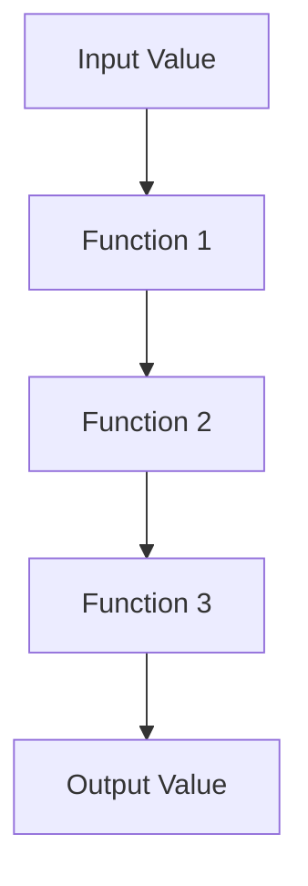

## 2.3. First-Class and Higher-Order Functions

In the realm of functional programming, Clojure stands out with its elegant handling of functions as first-class citizens. This section delves into the concept of first-class functions, explores higher-order functions, and demonstrates how these features enhance code expressiveness and flexibility.

### Understanding First-Class Functions

In Clojure, functions are first-class entities. This means that functions can be:

- **Assigned to variables**: Just like any other data type, functions can be stored in variables.
- **Passed as arguments**: Functions can be passed to other functions as parameters.
- **Returned from other functions**: Functions can be the return value of other functions.

This flexibility allows developers to write more abstract and reusable code. Let's explore these capabilities with examples.

#### Assigning Functions to Variables

```clojure
(def add-one (fn [x] (+ x 1)))

;; Using the function
(println (add-one 5)) ; Output: 6
```

In this example, we define a function `add-one` that increments its input by one. This function is assigned to a variable, allowing us to use it like any other value.

#### Passing Functions as Arguments

```clojure
(defn apply-twice [f x]
  (f (f x)))

;; Using apply-twice with add-one
(println (apply-twice add-one 5)) ; Output: 7
```

Here, `apply-twice` is a function that takes another function `f` and a value `x`, applying `f` to `x` twice. This demonstrates the power of passing functions as arguments.

#### Returning Functions from Other Functions

```clojure
(defn make-adder [n]
  (fn [x] (+ x n)))

(def add-five (make-adder 5))

;; Using the returned function
(println (add-five 10)) ; Output: 15
```

The `make-adder` function returns a new function that adds a specified number to its input. This showcases how functions can be returned from other functions, enabling dynamic function creation.

### Exploring Higher-Order Functions

Higher-order functions are functions that take other functions as arguments or return them as results. They are a cornerstone of functional programming, allowing for powerful abstractions and code reuse.

#### Common Higher-Order Functions in Clojure

Clojure provides several built-in higher-order functions that are widely used in functional programming:

- **`map`**: Applies a function to each element of a collection, returning a new collection of results.
- **`reduce`**: Reduces a collection to a single value by iteratively applying a function.
- **`filter`**: Returns a collection of elements that satisfy a predicate function.

Let's explore each of these with examples.

##### Using `map`

```clojure
(def numbers [1 2 3 4 5])

(defn square [x] (* x x))

;; Applying square to each element
(println (map square numbers)) ; Output: (1 4 9 16 25)
```

The `map` function applies the `square` function to each element of the `numbers` collection, producing a new collection of squared values.

##### Using `reduce`

```clojure
(defn sum [a b] (+ a b))

;; Summing all elements
(println (reduce sum numbers)) ; Output: 15
```

The `reduce` function combines elements of the `numbers` collection using the `sum` function, resulting in their total sum.

##### Using `filter`

```clojure
(defn even? [x] (zero? (mod x 2)))

;; Filtering even numbers
(println (filter even? numbers)) ; Output: (2 4)
```

The `filter` function selects elements from the `numbers` collection that satisfy the `even?` predicate, returning only the even numbers.

### Creating Custom Higher-Order Functions

Beyond using built-in higher-order functions, you can create your own to encapsulate specific patterns of computation.

#### Example: A Custom `apply-n-times` Function

```clojure
(defn apply-n-times [f n x]
  (if (zero? n)
    x
    (recur f (dec n) (f x))))

;; Using apply-n-times
(println (apply-n-times add-one 3 5)) ; Output: 8
```

The `apply-n-times` function applies a given function `f` to a value `x`, `n` times. This custom higher-order function demonstrates how you can encapsulate repetitive patterns.

### Impact on Code Expressiveness and Flexibility

First-class and higher-order functions significantly enhance the expressiveness and flexibility of Clojure code. They allow developers to:

- **Abstract common patterns**: By encapsulating repetitive logic in higher-order functions, you can reduce code duplication and improve maintainability.
- **Compose complex operations**: Functions can be composed to create more complex behaviors from simple building blocks.
- **Enhance modularity**: Functions can be easily reused and combined in different contexts, promoting modular design.

### Visualizing Function Composition

To better understand how functions can be composed, let's visualize the process using a flowchart.



This diagram illustrates how an input value is transformed through a series of functions, each building upon the result of the previous one. This is a fundamental concept in functional programming, enabling complex transformations through simple, composable functions.

### Try It Yourself

Experiment with the code examples provided in this section. Try modifying the functions to see how changes affect the output. For instance, create a new higher-order function that applies a function to each element of a collection twice, or modify the `apply-n-times` function to apply a function until a certain condition is met.

### References and Further Reading

- [Clojure Official Documentation](https://clojure.org/)
- [Functional Programming Concepts](https://en.wikipedia.org/wiki/Functional_programming)
- [Higher-Order Functions in Clojure](https://clojure.org/reference/higher_order_functions)

### Knowledge Check

Before moving on, let's test your understanding of first-class and higher-order functions with a few questions.

## **Ready to Test Your Knowledge?**



### What does it mean for functions to be first-class in Clojure?

- [x] Functions can be assigned to variables, passed as arguments, and returned from other functions.
- [ ] Functions can only be used within the scope they are defined.
- [ ] Functions cannot be passed as arguments.
- [ ] Functions cannot be returned from other functions.

> **Explanation:** First-class functions can be treated like any other data type, allowing them to be assigned, passed, and returned.

### Which of the following is a higher-order function in Clojure?

- [x] `map`
- [ ] `println`
- [ ] `def`
- [ ] `let`

> **Explanation:** `map` is a higher-order function because it takes another function as an argument.

### What is the output of `(map inc [1 2 3])`?

- [x] (2 3 4)
- [ ] (1 2 3)
- [ ] (0 1 2)
- [ ] (3 4 5)

> **Explanation:** The `inc` function increments each element of the collection by one.

### How does the `reduce` function work?

- [x] It combines elements of a collection using a specified function.
- [ ] It filters elements of a collection based on a predicate.
- [ ] It applies a function to each element of a collection.
- [ ] It sorts elements of a collection.

> **Explanation:** `reduce` iteratively applies a function to combine elements into a single value.

### What is the purpose of the `filter` function?

- [x] To select elements from a collection that satisfy a predicate.
- [ ] To sort elements of a collection.
- [ ] To combine elements of a collection.
- [ ] To transform each element of a collection.

> **Explanation:** `filter` returns a collection of elements that satisfy a given predicate function.

### Can functions be returned from other functions in Clojure?

- [x] Yes
- [ ] No

> **Explanation:** Functions can be returned from other functions, allowing dynamic function creation.

### What is a key benefit of higher-order functions?

- [x] They allow for code reuse and abstraction of common patterns.
- [ ] They make code harder to read.
- [ ] They limit the use of functions.
- [ ] They reduce the need for functions.

> **Explanation:** Higher-order functions promote code reuse and abstraction, making code more maintainable.

### Which function applies a function to each element of a collection?

- [x] `map`
- [ ] `reduce`
- [ ] `filter`
- [ ] `apply`

> **Explanation:** `map` applies a function to each element of a collection, returning a new collection.

### What is the result of `(filter odd? [1 2 3 4 5])`?

- [x] (1 3 5)
- [ ] (2 4)
- [ ] (1 2 3 4 5)
- [ ] ()

> **Explanation:** `filter` selects elements that satisfy the `odd?` predicate, returning only odd numbers.

### True or False: Higher-order functions can only take functions as arguments, not return them.

- [ ] True
- [x] False

> **Explanation:** Higher-order functions can both take functions as arguments and return them as results.



Remember, mastering first-class and higher-order functions is a journey that will greatly enhance your ability to write expressive and flexible Clojure code. Keep experimenting, stay curious, and enjoy the process!
