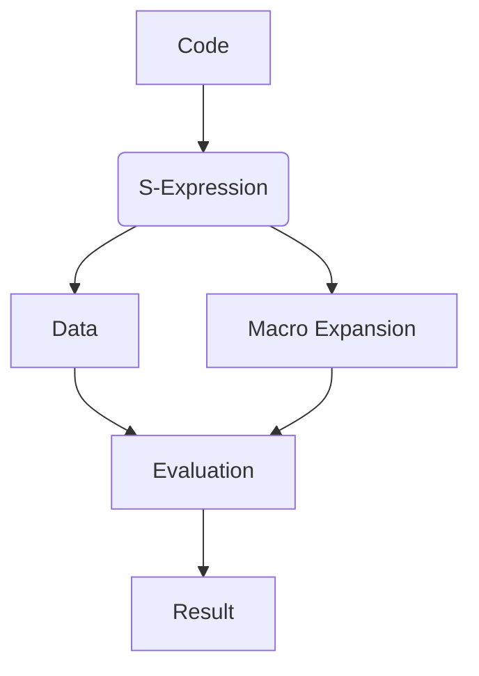

## 2.4. Lisp Syntax and Homoiconicity

In this section, we delve into the fascinating world of Lisp syntax and the concept of homoiconicity in Clojure. These foundational elements are not only central to understanding Clojure but also open the door to powerful metaprogramming techniques that can transform how we write and think about code. Let's embark on this journey by exploring the basics of Lisp syntax, understanding the significance of homoiconicity, and discovering how these concepts enable advanced programming techniques in Clojure.

### Understanding Lisp Syntax

Lisp, short for "LISt Processing," is a family of programming languages with a long history, dating back to the late 1950s. Clojure, as a modern dialect of Lisp, inherits its distinctive syntax, which is both simple and powerful. At the heart of Lisp syntax are **s-expressions** (or symbolic expressions), which are the building blocks of Lisp code.

#### S-Expressions: The Building Blocks

S-expressions are a uniform way to represent both code and data in Lisp. They are essentially lists enclosed in parentheses, where the first element is typically a function or operator, and the subsequent elements are arguments. This uniformity is a key feature of Lisp languages, including Clojure.

Here's a simple example of an s-expression in Clojure:

```clojure
(+ 1 2 3)
```

In this expression, `+` is the function, and `1`, `2`, and `3` are the arguments. The result of evaluating this expression is `6`.

#### Code as Data: The Essence of Homoiconicity

One of the most intriguing aspects of Lisp syntax is its **homoiconicity**. This term refers to the property of a language where the primary representation of programs is also a data structure in a straightforward way. In Clojure, this means that code is written in the same form as the data structures it manipulates, specifically lists.

This property allows us to treat code as data and vice versa, enabling powerful metaprogramming capabilities. Let's illustrate this with an example:

```clojure
(def my-code '(+ 1 2 3))
(eval my-code) ; => 6
```

In this example, `my-code` is a list that represents the code `(+ 1 2 3)`. By using the `eval` function, we can execute this list as if it were code, demonstrating the seamless interchangeability of code and data.

### The Significance of Homoiconicity in Clojure

Homoiconicity is not just a theoretical curiosity; it has practical implications that make Clojure a powerful tool for developers. This property simplifies the manipulation of code, making it easier to write programs that generate other programs, a technique known as **metaprogramming**.

#### Enabling Metaprogramming

Metaprogramming is the practice of writing code that can manipulate other code. In Clojure, the ability to treat code as data makes metaprogramming both natural and powerful. This is most commonly achieved through the use of **macros**, which allow developers to extend the language by defining new syntactic constructs.

Consider the following macro example:

```clojure
(defmacro unless [condition & body]
  `(if (not ~condition)
     (do ~@body)))

(unless false
  (println "This will print!"))
```

In this example, the `unless` macro provides a new control structure that executes the body only if the condition is false. The backtick (`) and tilde (`~`) are used to construct a new s-expression, demonstrating how macros can transform code before it is evaluated.

### Code as Data and Data as Code

The interchangeability of code and data in Clojure allows for elegant solutions to complex problems. Let's explore some scenarios where this property shines:

#### Generating Code Dynamically

Imagine a scenario where you need to generate a series of similar functions. Instead of writing each function manually, you can use Clojure's homoiconicity to generate them programmatically:

```clojure
(defn generate-adder [n]
  (eval `(fn [x] (+ x ~n))))

(def add-five (generate-adder 5))
(add-five 10) ; => 15
```

Here, `generate-adder` creates a new function that adds a specific number to its argument. By leveraging `eval`, we dynamically generate and execute code.

#### Data-Driven Programming

Homoiconicity also facilitates data-driven programming, where the structure of the data dictates the flow of the program. This is particularly useful in scenarios like configuration management or building domain-specific languages (DSLs).

```clojure
(def config
  {:db {:host "localhost" :port 5432}
   :cache {:enabled true :ttl 300}})

(defn process-config [config]
  (println "Database host:" (:host (:db config)))
  (println "Cache enabled:" (:enabled (:cache config))))

(process-config config)
```

In this example, the `config` map drives the behavior of the `process-config` function, illustrating how data can dictate program logic.

### Preparing for Macros

As we continue our journey through Clojure, understanding Lisp syntax and homoiconicity sets the stage for exploring macros in depth. Macros are a cornerstone of Clojure's metaprogramming capabilities, allowing us to extend the language in ways that are both expressive and efficient.

In the next sections, we will dive deeper into the world of macros, exploring how they work, how to write them effectively, and how they can be used to solve real-world problems.

### Visualizing Lisp Syntax and Homoiconicity

To better understand the relationship between code and data in Clojure, let's visualize it using a diagram. This diagram illustrates how s-expressions serve as both code and data, highlighting the seamless interchangeability that homoiconicity provides.



**Diagram Description**: This diagram shows the flow from code to s-expression, which can be treated as data. The s-expression can be evaluated directly or expanded through macros, ultimately leading to a result.

### Key Takeaways

- **Lisp Syntax**: Clojure's syntax is based on s-expressions, which are uniform representations of code and data.
- **Homoiconicity**: This property allows code to be treated as data and vice versa, enabling powerful metaprogramming techniques.
- **Metaprogramming**: Clojure's macros leverage homoiconicity to extend the language and create new syntactic constructs.
- **Code as Data**: The interchangeability of code and data facilitates dynamic code generation and data-driven programming.

### Try It Yourself

Experiment with the examples provided in this section. Try modifying the `unless` macro to add additional functionality, or create your own macros to see how they can transform code. Explore generating code dynamically and using data to drive program logic. Remember, the power of Clojure lies in its ability to treat code as data, opening up a world of possibilities for creative and efficient programming.

### References and Further Reading

- [Clojure Documentation](https://clojure.org/)
- [Lisp (programming language) - Wikipedia](https://en.wikipedia.org/wiki/Lisp_(programming_language))
- [Metaprogramming in Clojure](https://clojure.org/reference/macros)

## **Ready to Test Your Knowledge?**



### What is the primary representation of programs in Lisp languages like Clojure?

- [x] S-expressions
- [ ] Arrays
- [ ] Objects
- [ ] Strings

> **Explanation:** In Lisp languages, including Clojure, the primary representation of programs is s-expressions, which are lists that can represent both code and data.

### What does homoiconicity in Clojure allow?

- [x] Code to be treated as data and vice versa
- [ ] Faster execution of programs
- [ ] Improved memory management
- [ ] Enhanced error handling

> **Explanation:** Homoiconicity allows code to be treated as data and vice versa, enabling powerful metaprogramming techniques in Clojure.

### Which function is used to evaluate a list as code in Clojure?

- [x] eval
- [ ] apply
- [ ] map
- [ ] filter

> **Explanation:** The `eval` function is used to evaluate a list as code in Clojure, allowing dynamic execution of code.

### What is a macro in Clojure?

- [x] A construct that allows code transformation before evaluation
- [ ] A type of data structure
- [ ] A function that performs I/O operations
- [ ] A method for error handling

> **Explanation:** A macro in Clojure is a construct that allows code transformation before evaluation, enabling metaprogramming.

### How can you dynamically generate functions in Clojure?

- [x] By using eval with s-expressions
- [ ] By using arrays
- [ ] By using objects
- [ ] By using strings

> **Explanation:** You can dynamically generate functions in Clojure by using `eval` with s-expressions, leveraging the language's homoiconicity.

### What is the significance of s-expressions in Clojure?

- [x] They provide a uniform way to represent code and data
- [ ] They improve memory management
- [ ] They enhance error handling
- [ ] They increase execution speed

> **Explanation:** S-expressions provide a uniform way to represent code and data in Clojure, facilitating homoiconicity and metaprogramming.

### What is the role of macros in Clojure?

- [x] To extend the language by defining new syntactic constructs
- [ ] To perform I/O operations
- [ ] To manage memory
- [ ] To handle errors

> **Explanation:** Macros in Clojure are used to extend the language by defining new syntactic constructs, leveraging the power of homoiconicity.

### How does homoiconicity benefit metaprogramming?

- [x] It allows code to be manipulated as data
- [ ] It speeds up program execution
- [ ] It reduces memory usage
- [ ] It simplifies error handling

> **Explanation:** Homoiconicity benefits metaprogramming by allowing code to be manipulated as data, enabling dynamic code generation and transformation.

### What is the purpose of the `unless` macro example?

- [x] To demonstrate creating a new control structure
- [ ] To perform mathematical calculations
- [ ] To handle errors
- [ ] To manage memory

> **Explanation:** The `unless` macro example demonstrates creating a new control structure in Clojure, showcasing the power of macros.

### True or False: In Clojure, code and data are represented differently.

- [ ] True
- [x] False

> **Explanation:** False. In Clojure, code and data are represented in the same way, using s-expressions, due to the language's homoiconicity.



Remember, this is just the beginning. As you progress, you'll build more complex and interactive applications. Keep experimenting, stay curious, and enjoy the journey!
