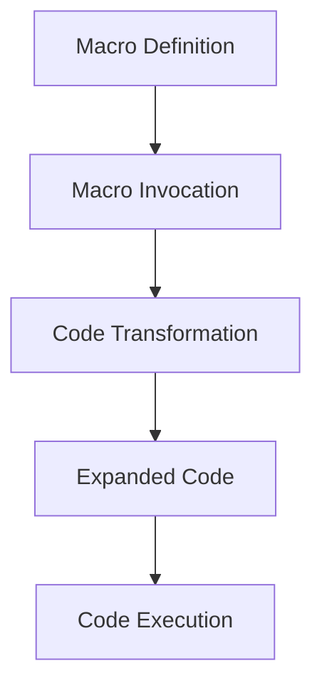

## 2.5. Macros and Metaprogramming

### Introduction to Macros in Clojure

Macros are a powerful feature in Clojure that allow developers to extend the language by performing transformations on code at compile time. Unlike functions, which operate on values, macros operate on the code itself, enabling developers to introduce new syntactic constructs and abstractions. This capability is a cornerstone of metaprogramming, where programs have the ability to treat other programs as their data.

### What Are Macros?

In Clojure, a macro is a special kind of function that receives unevaluated code as its arguments and returns a new piece of code to be evaluated. This allows macros to manipulate the structure of the code before it is executed, providing a way to implement custom language features and domain-specific languages (DSLs).

#### Differences Between Macros and Functions

- **Evaluation Timing**: Functions evaluate their arguments before execution, while macros receive their arguments as raw code and can decide how and when to evaluate them.
- **Code Transformation**: Macros can transform code, enabling the creation of new syntactic constructs that are not possible with functions alone.
- **Compile-Time Execution**: Macros execute at compile time, allowing them to generate and modify code before the program runs.

### The Role of Macros in Metaprogramming

Metaprogramming involves writing programs that can read, generate, analyze, or transform other programs. In Clojure, macros are the primary tool for metaprogramming, allowing developers to create abstractions that are not limited by the language's existing syntax.

#### Benefits of Macros in Metaprogramming

- **Code Reusability**: Macros enable the creation of reusable code patterns that can be applied across different parts of a program.
- **Domain-Specific Languages**: Macros can be used to create DSLs tailored to specific problem domains, making code more expressive and easier to understand.
- **Performance Optimization**: By transforming code at compile time, macros can optimize performance by eliminating unnecessary computations or simplifying complex expressions.

### Creating Simple Macros in Clojure

Let's explore how to create a basic macro in Clojure. We'll start with a simple example that demonstrates the syntax and structure of a macro.

```clojure
(defmacro when-not [condition & body]
  `(if (not ~condition)
     (do ~@body)))

;; Usage example
(when-not false
  (println "This will be printed"))
```

#### Explanation

- **Macro Definition**: The `defmacro` keyword is used to define a macro. The `when-not` macro takes a condition and a body of code.
- **Syntax Quoting**: The backtick (`) is used for syntax quoting, which preserves the structure of the code while allowing for unquoting with the tilde (`~`) and splicing with `~@`.
- **Code Transformation**: The macro transforms the code into an `if` expression that checks the negation of the condition and executes the body if the condition is false.

### Macro Hygiene and Potential Pitfalls

While macros are powerful, they come with certain challenges and potential pitfalls. One of the most important considerations when writing macros is maintaining hygiene.

#### Macro Hygiene

Macro hygiene refers to the practice of avoiding unintended interactions between the macro's code and the code in which it is used. This can be achieved by:

- **Avoiding Name Collisions**: Use unique names for variables within the macro to prevent conflicts with variables in the surrounding code.
- **Using `gensym`**: The `gensym` function generates unique symbols to avoid name collisions.

```clojure
(defmacro safe-let [bindings & body]
  (let [syms (map (fn [_] (gensym)) bindings)]
    `(let [~@(interleave syms bindings)]
       ~@body)))
```

#### Potential Pitfalls

- **Complexity**: Macros can make code harder to understand and debug, especially if they are overly complex or used excessively.
- **Error Messages**: Errors in macro-generated code can be difficult to trace back to the original macro definition.
- **Overuse**: Overusing macros can lead to code that is difficult to read and maintain. It's important to use macros judiciously and only when they provide a clear benefit.

### Best Practices for Using Macros

To make the most of macros while avoiding common pitfalls, consider the following best practices:

- **Keep Macros Simple**: Aim for simplicity and clarity in macro definitions. Avoid complex logic that can obscure the macro's purpose.
- **Document Macros**: Provide clear documentation for macros, including their intended use and any limitations or side effects.
- **Test Macros Thoroughly**: Write comprehensive tests for macros to ensure they behave as expected in different scenarios.
- **Use Functions When Possible**: Before reaching for a macro, consider whether a function can achieve the same result. Functions are generally easier to understand and debug.

### Encouraging Cautious and Judicious Use of Macros

While macros are a powerful tool in the Clojure developer's toolkit, they should be used with caution. Overuse or misuse of macros can lead to code that is difficult to understand and maintain. By following best practices and using macros judiciously, developers can harness their power to create expressive and efficient code.

### Try It Yourself

To deepen your understanding of macros, try modifying the examples provided in this section. Experiment with creating your own macros and observe how they transform code at compile time. Consider the following challenges:

- **Challenge 1**: Create a macro that logs the execution time of a block of code.
- **Challenge 2**: Write a macro that implements a simple DSL for defining HTML elements.

### Visualizing Macros and Metaprogramming

To better understand how macros work, let's visualize the process of macro expansion and code transformation using a flowchart.



**Caption**: This diagram illustrates the process of macro expansion in Clojure, where a macro definition is invoked, transforming code into an expanded form that is then executed.

### References and Links

For further reading on macros and metaprogramming in Clojure, consider exploring the following resources:

- [Clojure Macros Guide](https://clojure.org/reference/macros)
- [Metaprogramming in Clojure](https://clojure.org/guides/metaprogramming)
- [Clojure for the Brave and True](https://www.braveclojure.com/)

### Knowledge Check

To reinforce your understanding of macros and metaprogramming, consider the following questions and exercises:

- **Question 1**: What is the primary difference between a macro and a function in Clojure?
- **Exercise 1**: Write a macro that implements a custom control flow construct, such as a `while` loop.

### Summary

In this section, we've explored the power and potential of macros in Clojure. We've learned how macros enable compile-time code transformation, allowing developers to extend the language and create custom abstractions. By understanding the role of macros in metaprogramming and following best practices, we can harness their power to write expressive and efficient code.

Remember, this is just the beginning. As you progress, you'll discover more advanced techniques and patterns for using macros in Clojure. Keep experimenting, stay curious, and enjoy the journey!

## **Ready to Test Your Knowledge?**



### What is a primary difference between macros and functions in Clojure?

- [x] Macros operate on code, while functions operate on values.
- [ ] Functions operate on code, while macros operate on values.
- [ ] Both macros and functions operate on values.
- [ ] Both macros and functions operate on code.

> **Explanation:** Macros operate on code, allowing them to transform it at compile time, whereas functions operate on evaluated values.

### How do macros contribute to metaprogramming in Clojure?

- [x] By allowing code transformation at compile time.
- [ ] By executing code at runtime.
- [ ] By providing runtime error handling.
- [ ] By optimizing memory usage.

> **Explanation:** Macros enable metaprogramming by allowing code transformation at compile time, creating new syntactic constructs.

### What is macro hygiene?

- [x] Avoiding unintended interactions between macro code and surrounding code.
- [ ] Ensuring macros are simple and easy to read.
- [ ] Writing macros that execute quickly.
- [ ] Using macros to handle errors.

> **Explanation:** Macro hygiene involves avoiding name collisions and unintended interactions between macro code and the code in which it is used.

### What function can be used to generate unique symbols in macros?

- [x] `gensym`
- [ ] `unique`
- [ ] `symbol`
- [ ] `generate`

> **Explanation:** The `gensym` function generates unique symbols to avoid name collisions in macros.

### When should you consider using a function instead of a macro?

- [x] When the desired behavior can be achieved without code transformation.
- [ ] When you need to transform code at compile time.
- [ ] When you need to create new syntactic constructs.
- [ ] When you want to optimize performance.

> **Explanation:** Functions should be used when the desired behavior can be achieved without code transformation, as they are generally easier to understand and debug.

### What is a potential pitfall of using macros?

- [x] Increased complexity and difficulty in debugging.
- [ ] Improved code readability.
- [ ] Enhanced performance.
- [ ] Simplified error handling.

> **Explanation:** Macros can increase complexity and make debugging more difficult, especially if they are overly complex or used excessively.

### What keyword is used to define a macro in Clojure?

- [x] `defmacro`
- [ ] `def`
- [ ] `macro`
- [ ] `define`

> **Explanation:** The `defmacro` keyword is used to define a macro in Clojure.

### What is the purpose of syntax quoting in macros?

- [x] To preserve the structure of the code while allowing for unquoting.
- [ ] To execute code at runtime.
- [ ] To optimize code performance.
- [ ] To handle errors in macros.

> **Explanation:** Syntax quoting preserves the structure of the code while allowing for unquoting with the tilde (`~`) and splicing with `~@`.

### What is the role of macros in creating domain-specific languages (DSLs)?

- [x] They allow for the creation of custom syntactic constructs tailored to specific domains.
- [ ] They execute code at runtime.
- [ ] They optimize memory usage.
- [ ] They handle errors in DSLs.

> **Explanation:** Macros enable the creation of custom syntactic constructs, making them ideal for creating domain-specific languages (DSLs).

### True or False: Macros execute at runtime in Clojure.

- [ ] True
- [x] False

> **Explanation:** Macros execute at compile time, transforming code before it is run.




