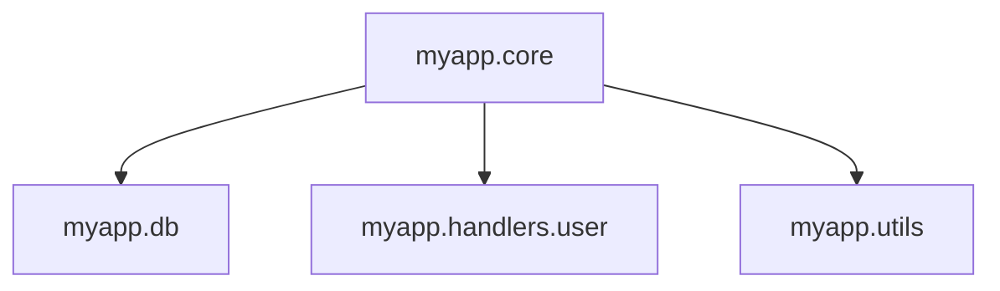

## 2.6. Namespaces and Organization

In the world of Clojure, namespaces play a crucial role in organizing code and managing symbol visibility. They are akin to packages in Java or modules in Python, providing a way to group related functions, macros, and data structures together. This section will delve into the concept of namespaces, how to create and switch between them, and best practices for organizing your Clojure projects effectively.

### Understanding Namespaces

Namespaces in Clojure serve as containers for symbols. They help avoid naming conflicts by allowing the same symbol name to exist in different contexts. This is particularly useful in large projects where multiple libraries might define functions with similar names.

#### Purpose of Namespaces

- **Symbol Management**: Namespaces prevent naming collisions by providing a context for symbols.
- **Code Organization**: They allow you to logically group related code, making it easier to maintain and understand.
- **Modularity**: Namespaces facilitate modular design, enabling you to separate concerns and manage dependencies effectively.

### Creating and Using Namespaces

Let's explore how to define and utilize namespaces in Clojure.

#### Defining a Namespace

To define a namespace, use the `ns` macro. This macro not only creates a namespace but also allows you to specify dependencies and import other namespaces.

```clojure
(ns myapp.core
  (:require [clojure.string :as str]
            [clojure.set :refer [union]]))

(defn greet [name]
  (str "Hello, " name "!"))

(defn combine-sets [set1 set2]
  (union set1 set2))
```

- **`ns` Macro**: The `ns` macro is used to define a namespace. It takes the namespace name as its first argument.
- **`require`**: The `:require` keyword is used to include other namespaces. You can alias them for convenience using `:as`.
- **`refer`**: The `:refer` keyword allows you to include specific symbols from a namespace.

#### Switching Between Namespaces

In a REPL session, you can switch between namespaces using the `in-ns` function.

```clojure
(in-ns 'myapp.core)
```

This command changes the current namespace to `myapp.core`, allowing you to access its symbols directly.

### Importing and Requiring Namespaces

Clojure provides several ways to include code from other namespaces: `require`, `use`, and `import`.

#### Using `require`

The `require` function is the most common way to include other namespaces. It loads the specified namespace and makes its symbols available.

```clojure
(require '[clojure.string :as str])
```

- **Aliasing**: Use `:as` to create an alias for the namespace, making it easier to reference its symbols.

#### Using `use`

The `use` function is similar to `require`, but it automatically refers all symbols from the specified namespace into the current namespace.

```clojure
(use 'clojure.string)
```

- **Caution**: `use` can lead to naming conflicts and is generally discouraged in favor of `require`.

#### Using `import`

The `import` function is used to include Java classes into a Clojure namespace.

```clojure
(import 'java.util.Date)
```

- **Java Interop**: `import` is essential for leveraging Java libraries within Clojure code.

### Best Practices for Namespace Organization

Organizing namespaces effectively is crucial for maintaining a clean and scalable codebase. Here are some best practices to consider:

#### Logical Grouping

- **Group Related Code**: Organize your code into namespaces based on functionality. For example, separate namespaces for database access, business logic, and utilities.
- **Consistent Naming**: Use a consistent naming convention for namespaces to improve readability and navigation.

#### Managing Dependencies

- **Minimal Dependencies**: Keep dependencies to a minimum within each namespace to reduce coupling.
- **Explicit Imports**: Use `require` with explicit aliases to avoid naming conflicts and improve code clarity.

#### Documentation and Comments

- **Docstrings**: Include docstrings for namespaces and functions to provide context and usage information.
- **Comments**: Use comments to explain complex logic or decisions within the code.

### Structuring a Clojure Application

Let's look at an example of how to structure a Clojure application using namespaces.

#### Example Project Structure

```
myapp/
├── core.clj
├── db.clj
├── handlers/
│   ├── user.clj
│   └── product.clj
└── utils.clj
```

- **`core.clj`**: The entry point of the application, containing the main logic and initialization code.
- **`db.clj`**: A namespace dedicated to database interactions.
- **`handlers/`**: A directory containing namespaces for handling different types of requests or operations.
- **`utils.clj`**: A utility namespace for common helper functions.

#### Sample Code

Here's how you might define namespaces in this structure:

```clojure
;; core.clj
(ns myapp.core
  (:require [myapp.db :as db]
            [myapp.handlers.user :as user-handler]
            [myapp.utils :as utils]))

(defn start-app []
  (println "Starting application...")
  (user-handler/init)
  (db/connect))

;; db.clj
(ns myapp.db)

(defn connect []
  (println "Connecting to the database..."))

;; handlers/user.clj
(ns myapp.handlers.user)

(defn init []
  (println "Initializing user handler..."))

;; utils.clj
(ns myapp.utils)

(defn log [message]
  (println "LOG:" message))
```

### Try It Yourself

Experiment with namespaces by creating a simple project. Define multiple namespaces and practice using `require`, `use`, and `import`. Try organizing your code into logical groups and see how it improves readability and maintainability.

### Visualizing Namespace Relationships

To better understand how namespaces interact, let's visualize the relationships between them using a diagram.



**Diagram Description**: This diagram illustrates the dependencies between namespaces in a Clojure application. The `myapp.core` namespace depends on `myapp.db`, `myapp.handlers.user`, and `myapp.utils`.

### References and Further Reading

- [Clojure Documentation on Namespaces](https://clojure.org/reference/namespaces)
- [Clojure Style Guide](https://guide.clojure.style/)
- [Effective Clojure: Namespaces](https://github.com/technomancy/effective-clojure)

### Knowledge Check

Before we wrap up, let's test your understanding of namespaces in Clojure.

## **Ready to Test Your Knowledge?**



### What is the primary purpose of namespaces in Clojure?

- [x] To manage symbol visibility and avoid naming conflicts
- [ ] To improve performance
- [ ] To enable parallel processing
- [ ] To provide security

> **Explanation:** Namespaces help manage symbol visibility and avoid naming conflicts by providing a context for symbols.

### Which macro is used to define a namespace in Clojure?

- [x] `ns`
- [ ] `def`
- [ ] `let`
- [ ] `import`

> **Explanation:** The `ns` macro is used to define a namespace in Clojure.

### What is the difference between `require` and `use`?

- [x] `require` loads a namespace, while `use` loads and refers all symbols
- [ ] `require` is faster than `use`
- [ ] `use` is deprecated
- [ ] `require` is only for Java classes

> **Explanation:** `require` loads a namespace, while `use` loads and refers all symbols, which can lead to naming conflicts.

### How do you switch to a different namespace in the REPL?

- [x] Use the `in-ns` function
- [ ] Use the `switch-ns` function
- [ ] Use the `change-ns` function
- [ ] Use the `set-ns` function

> **Explanation:** The `in-ns` function is used to switch to a different namespace in the REPL.

### What is a best practice for managing dependencies in namespaces?

- [x] Use `require` with explicit aliases
- [ ] Use `use` for all dependencies
- [ ] Avoid using any dependencies
- [ ] Use `import` for all dependencies

> **Explanation:** Using `require` with explicit aliases helps avoid naming conflicts and improves code clarity.

### Which function is used to include Java classes in a Clojure namespace?

- [x] `import`
- [ ] `require`
- [ ] `use`
- [ ] `include`

> **Explanation:** The `import` function is used to include Java classes in a Clojure namespace.

### What is the recommended way to organize code in a Clojure project?

- [x] Group related code into namespaces based on functionality
- [ ] Place all code in a single namespace
- [ ] Use random naming conventions
- [ ] Avoid using namespaces

> **Explanation:** Grouping related code into namespaces based on functionality improves maintainability and readability.

### What is the risk of using the `use` function?

- [x] It can lead to naming conflicts
- [ ] It is slower than `require`
- [ ] It does not work with Java classes
- [ ] It is deprecated

> **Explanation:** The `use` function can lead to naming conflicts because it refers all symbols from a namespace.

### How can you alias a namespace when using `require`?

- [x] Use the `:as` keyword
- [ ] Use the `:alias` keyword
- [ ] Use the `:refer` keyword
- [ ] Use the `:name` keyword

> **Explanation:** The `:as` keyword is used to create an alias for a namespace when using `require`.

### True or False: Namespaces in Clojure are similar to packages in Java.

- [x] True
- [ ] False

> **Explanation:** Namespaces in Clojure are similar to packages in Java as they both provide a way to group related code and manage symbol visibility.



Remember, mastering namespaces is a key step in becoming proficient in Clojure. As you continue your journey, keep experimenting with different ways to organize your code and manage dependencies. Happy coding!
