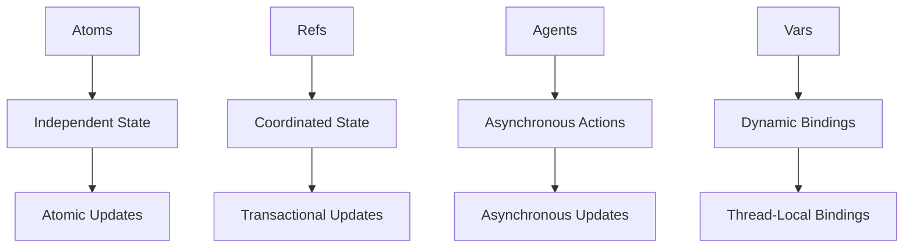

## 2.7. Concurrency Primitives: Atoms, Refs, Agents, and Vars

Concurrency is a fundamental aspect of modern software development, especially in a world where multi-core processors are the norm. However, managing concurrency can be challenging, particularly when dealing with shared mutable state. Clojure, a functional programming language that runs on the Java Virtual Machine (JVM), offers a unique approach to concurrency through its immutable data structures and concurrency primitives: atoms, refs, agents, and vars. These primitives provide powerful tools for managing state changes in a concurrent environment, allowing developers to write robust and efficient code.

### Understanding the Challenges of Concurrency

Concurrency involves multiple computations happening simultaneously, which can lead to complex interactions between different parts of a program. The primary challenge is managing shared mutable state, where multiple threads may attempt to read or write to the same data simultaneously. This can result in race conditions, deadlocks, and other concurrency-related bugs.

Clojure addresses these challenges by emphasizing immutability and providing concurrency primitives that help manage state changes safely and efficiently. Let's explore each of these primitives in detail.

### Atoms: Managing Independent State

Atoms in Clojure are used to manage independent, synchronous state changes. They provide a way to safely update a single piece of state without worrying about race conditions. Atoms are ideal for situations where you have a single, independent value that needs to be updated atomically.

#### Key Features of Atoms

- **Atomic Updates**: Atoms ensure that updates to their state are atomic, meaning they are completed in a single, indivisible step.
- **Compare-and-Swap (CAS)**: Atoms use a compare-and-swap mechanism to ensure that updates are only applied if the current state matches the expected state.
- **Synchronous**: Updates to atoms are synchronous, meaning the caller waits for the update to complete before proceeding.

#### Example: Using Atoms

```clojure
;; Define an atom with an initial value
(def counter (atom 0))

;; Increment the counter atomically
(defn increment-counter []
  (swap! counter inc))

;; Use the function to increment the counter
(increment-counter)
(increment-counter)

;; Print the current value of the counter
(println @counter) ; Output: 2
```

In this example, we define an atom `counter` with an initial value of `0`. The `increment-counter` function uses `swap!` to atomically increment the counter. The `@` symbol is used to dereference the atom and retrieve its current value.

#### Best Practices for Atoms

- **Use for Independent State**: Atoms are best suited for managing independent pieces of state that do not require coordination with other state changes.
- **Avoid Complex Transactions**: If your state changes require coordination with other state changes, consider using refs instead.

### Refs and Software Transactional Memory (STM): Coordinated State Changes

Refs in Clojure are used for managing coordinated state changes across multiple pieces of state. They are part of Clojure's Software Transactional Memory (STM) system, which provides a way to perform atomic transactions on multiple refs.

#### Key Features of Refs

- **Transactional Updates**: Refs allow you to perform coordinated updates across multiple pieces of state within a transaction.
- **Consistency**: STM ensures that all updates within a transaction are consistent and isolated from other transactions.
- **Automatic Retry**: If a transaction fails due to a conflict, STM automatically retries the transaction.

#### Example: Using Refs and STM

```clojure
;; Define refs for two accounts
(def account-a (ref 100))
(def account-b (ref 200))

;; Transfer money between accounts using a transaction
(defn transfer [amount from-account to-account]
  (dosync
    (alter from-account - amount)
    (alter to-account + amount)))

;; Perform a transfer
(transfer 50 account-a account-b)

;; Print the current balances
(println @account-a) ; Output: 50
(println @account-b) ; Output: 250
```

In this example, we define two refs `account-a` and `account-b` with initial balances. The `transfer` function uses `dosync` to perform a transaction that transfers money between the accounts. The `alter` function is used to update the refs within the transaction.

#### Best Practices for Refs

- **Use for Coordinated State**: Refs are ideal for managing state changes that require coordination across multiple pieces of state.
- **Avoid Long Transactions**: Keep transactions short to minimize the risk of conflicts and retries.

### Agents: Asynchronous Actions

Agents in Clojure are used for managing asynchronous state changes. They provide a way to perform actions asynchronously, allowing other computations to proceed without waiting for the action to complete.

#### Key Features of Agents

- **Asynchronous Updates**: Agents perform updates asynchronously, allowing other computations to continue without blocking.
- **Error Handling**: Agents provide mechanisms for handling errors that occur during asynchronous actions.
- **Queueing**: Updates to agents are queued and processed sequentially.

#### Example: Using Agents

```clojure
;; Define an agent with an initial value
(def counter-agent (agent 0))

;; Increment the counter asynchronously
(defn increment-agent [agent]
  (send agent inc))

;; Use the function to increment the counter
(increment-agent counter-agent)
(increment-agent counter-agent)

;; Wait for all actions to complete
(await counter-agent)

;; Print the current value of the counter
(println @counter-agent) ; Output: 2
```

In this example, we define an agent `counter-agent` with an initial value of `0`. The `increment-agent` function uses `send` to asynchronously increment the counter. The `await` function is used to wait for all actions to complete before printing the current value.

#### Best Practices for Agents

- **Use for Asynchronous Actions**: Agents are best suited for managing state changes that can be performed asynchronously.
- **Handle Errors Gracefully**: Use error handlers to manage errors that occur during asynchronous actions.

### Vars: Dynamic Bindings

Vars in Clojure are used for managing dynamic bindings, allowing you to temporarily override the value of a var within a specific scope.

#### Key Features of Vars

- **Dynamic Bindings**: Vars allow you to create dynamic bindings that temporarily override the value of a var within a specific scope.
- **Thread-Local**: Dynamic bindings are thread-local, meaning they do not affect other threads.
- **Global State**: Vars can also be used to manage global state, although this is generally discouraged in favor of more functional approaches.

#### Example: Using Vars

```clojure
;; Define a var with an initial value
(def ^:dynamic *greeting* "Hello")

;; Function that uses the var
(defn greet []
  (println *greeting*))

;; Use the function with the default value
(greet) ; Output: Hello

;; Temporarily override the value using binding
(binding [*greeting* "Hi"]
  (greet)) ; Output: Hi

;; Use the function with the default value again
(greet) ; Output: Hello
```

In this example, we define a dynamic var `*greeting*` with an initial value of `"Hello"`. The `greet` function uses the var to print a greeting. The `binding` form is used to temporarily override the value of the var within a specific scope.

#### Best Practices for Vars

- **Use Sparingly**: Vars should be used sparingly, as they introduce global state that can lead to unexpected behavior.
- **Prefer Functional Approaches**: Whenever possible, prefer functional approaches that avoid global state.

### Visualizing Concurrency Primitives

To better understand how these concurrency primitives work together, let's visualize their interactions using a flowchart.



This diagram illustrates the primary use cases for each concurrency primitive. Atoms are used for independent state, refs for coordinated state, agents for asynchronous actions, and vars for dynamic bindings.

### Best Practices and Potential Pitfalls

When working with Clojure's concurrency primitives, it's important to follow best practices to ensure your code is robust and efficient.

#### Best Practices

- **Choose the Right Primitive**: Select the appropriate concurrency primitive based on your specific use case. Use atoms for independent state, refs for coordinated state, agents for asynchronous actions, and vars for dynamic bindings.
- **Minimize Shared State**: Whenever possible, minimize shared state to reduce the complexity of your code and the potential for concurrency-related bugs.
- **Keep Transactions Short**: When using refs and STM, keep transactions short to minimize the risk of conflicts and retries.
- **Handle Errors Gracefully**: When using agents, ensure you handle errors gracefully to prevent them from affecting the rest of your program.

#### Potential Pitfalls

- **Overusing Vars**: Avoid overusing vars, as they introduce global state that can lead to unexpected behavior.
- **Ignoring Error Handling**: Failing to handle errors in agents can lead to silent failures and difficult-to-debug issues.
- **Complex Transactions**: Avoid complex transactions with refs, as they can lead to performance issues and increased risk of conflicts.

### Try It Yourself

Now that we've explored Clojure's concurrency primitives, try experimenting with the code examples provided. Modify the examples to see how different concurrency primitives behave in various scenarios. For example, try using refs to coordinate state changes across multiple atoms, or use agents to perform asynchronous actions in parallel.

### References and Further Reading

- [Clojure Documentation on Atoms](https://clojure.org/reference/atoms)
- [Clojure Documentation on Refs and STM](https://clojure.org/reference/refs)
- [Clojure Documentation on Agents](https://clojure.org/reference/agents)
- [Clojure Documentation on Vars](https://clojure.org/reference/vars)

### Summary

Clojure's concurrency primitives provide powerful tools for managing state changes in a concurrent environment. By understanding and using atoms, refs, agents, and vars effectively, you can write robust and efficient code that takes full advantage of Clojure's functional programming paradigm. Remember, this is just the beginning. As you progress, you'll build more complex and interactive applications. Keep experimenting, stay curious, and enjoy the journey!

## **Ready to Test Your Knowledge?**



### What is the primary use case for atoms in Clojure?

- [x] Managing independent state
- [ ] Coordinated state changes
- [ ] Asynchronous actions
- [ ] Dynamic bindings

> **Explanation:** Atoms are used for managing independent state changes in Clojure.

### Which concurrency primitive is part of Clojure's Software Transactional Memory (STM) system?

- [ ] Atoms
- [x] Refs
- [ ] Agents
- [ ] Vars

> **Explanation:** Refs are part of Clojure's STM system, allowing for coordinated state changes.

### What is the primary feature of agents in Clojure?

- [ ] Synchronous updates
- [ ] Dynamic bindings
- [x] Asynchronous updates
- [ ] Transactional updates

> **Explanation:** Agents perform asynchronous updates, allowing other computations to proceed without blocking.

### How do vars in Clojure manage dynamic bindings?

- [x] By temporarily overriding the value within a specific scope
- [ ] By performing asynchronous updates
- [ ] By using compare-and-swap
- [ ] By coordinating state changes

> **Explanation:** Vars allow for dynamic bindings by temporarily overriding the value within a specific scope.

### What mechanism do atoms use to ensure atomic updates?

- [ ] Dynamic bindings
- [x] Compare-and-swap (CAS)
- [ ] Asynchronous actions
- [ ] Transactional updates

> **Explanation:** Atoms use a compare-and-swap mechanism to ensure atomic updates.

### What should you do to minimize the risk of conflicts when using refs?

- [ ] Use dynamic bindings
- [x] Keep transactions short
- [ ] Perform asynchronous updates
- [ ] Use compare-and-swap

> **Explanation:** Keeping transactions short minimizes the risk of conflicts when using refs.

### What is a potential pitfall of overusing vars in Clojure?

- [ ] Increased performance
- [ ] Simplified code
- [x] Introduction of global state
- [ ] Enhanced error handling

> **Explanation:** Overusing vars can introduce global state, leading to unexpected behavior.

### Which concurrency primitive is best suited for managing asynchronous actions?

- [ ] Atoms
- [ ] Refs
- [x] Agents
- [ ] Vars

> **Explanation:** Agents are best suited for managing asynchronous actions in Clojure.

### What is the primary benefit of using Clojure's concurrency primitives?

- [ ] Increased complexity
- [ ] Reduced performance
- [x] Safe management of state changes
- [ ] Simplified syntax

> **Explanation:** Clojure's concurrency primitives provide safe management of state changes in a concurrent environment.

### True or False: Dynamic bindings in Clojure affect all threads.

- [ ] True
- [x] False

> **Explanation:** Dynamic bindings in Clojure are thread-local and do not affect other threads.


