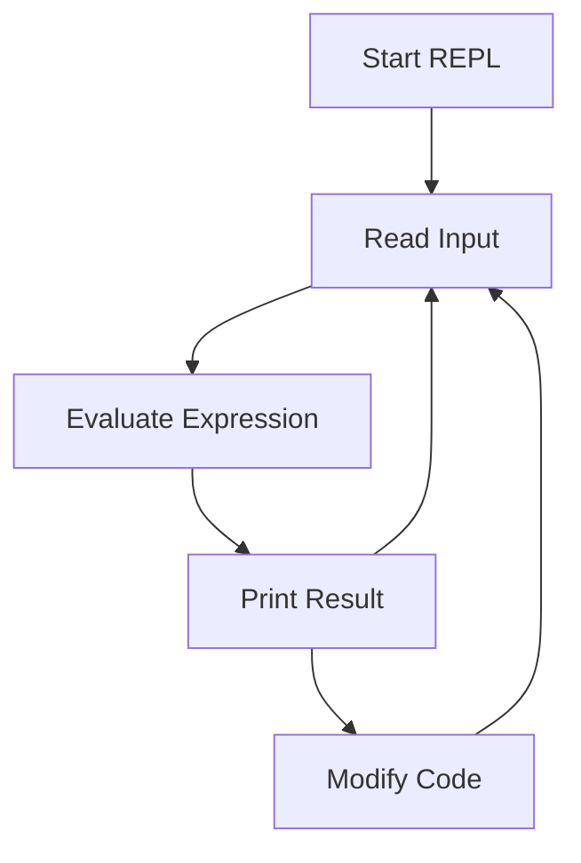

## 2.8. The REPL and Interactive Development

### Introduction to the REPL

The Read-Eval-Print Loop (REPL) is a cornerstone of Clojure development, offering a dynamic and interactive environment for writing, testing, and debugging code. The REPL allows developers to execute Clojure expressions and immediately see the results, fostering a rapid feedback loop that enhances productivity and creativity.

### What is the REPL?

The REPL is an interactive programming environment that reads user input, evaluates it, prints the result, and loops back to read more input. This cycle—Read, Eval, Print, Loop—enables developers to experiment with code snippets, test functions, and explore libraries in real-time.

#### Key Components of the REPL

- **Read**: The REPL reads the input expression from the user.
- **Eval**: The expression is evaluated in the current environment.
- **Print**: The result of the evaluation is printed to the console.
- **Loop**: The process repeats, allowing for continuous interaction.

### Starting the REPL

To start the REPL, you need to have Clojure installed on your system. You can start the REPL using the command line or through an integrated development environment (IDE) that supports Clojure.

#### Starting the REPL from the Command Line

1. **Install Clojure**: Ensure that Clojure is installed on your system. You can follow the installation instructions from the [Clojure website](https://clojure.org/guides/getting_started).

2. **Open Terminal**: Launch your terminal or command prompt.

3. **Run the REPL**: Execute the following command to start the Clojure REPL:

   ```bash
   clj
   ```

   This command will start the REPL session, and you will see a prompt where you can enter Clojure expressions.

#### Starting the REPL in an IDE

Many IDEs, such as IntelliJ IDEA with the Cursive plugin or Emacs with CIDER, provide integrated REPL support. These tools offer additional features like code completion, inline documentation, and debugging capabilities.

### Using the REPL for Interactive Development

The REPL is not just a tool for executing code; it is an integral part of the Clojure development workflow. Let's explore how to use the REPL effectively for interactive development.

#### Loading Code into the REPL

You can load code into the REPL from a file or directly input expressions. This flexibility allows you to test individual functions or entire namespaces.

- **Loading a File**: Use the `load-file` function to load a Clojure file into the REPL.

  ```clojure
  (load-file "path/to/your/file.clj")
  ```

- **Evaluating Expressions**: Type expressions directly into the REPL to evaluate them immediately.

  ```clojure
  (+ 1 2 3) ; Evaluates to 6
  ```

#### Testing Functions in the REPL

The REPL is an excellent environment for testing functions. You can define functions and immediately test them with different inputs.

```clojure
(defn add [a b]
  (+ a b))

(add 3 5) ; Evaluates to 8
```

#### Debugging with the REPL

Debugging in the REPL involves evaluating expressions step-by-step, inspecting variables, and modifying code on the fly. This interactive approach allows you to identify and fix issues quickly.

- **Inspecting Variables**: Use the `println` function to print variable values for inspection.

  ```clojure
  (defn divide [a b]
    (println "a:" a "b:" b)
    (/ a b))

(divide 10 2) ; Prints "a: 10 b: 2" and evaluates to 5
```

- **Modifying Code**: You can redefine functions and variables in the REPL without restarting the session.

### Benefits of REPL-Driven Development

REPL-driven development offers numerous benefits that enhance the development experience:

- **Immediate Feedback**: The REPL provides instant feedback, allowing you to see the results of your code immediately.
- **Rapid Prototyping**: Experiment with new ideas and prototype solutions quickly.
- **Incremental Development**: Build and test your application incrementally, reducing the risk of errors.
- **Exploratory Programming**: Explore libraries and APIs interactively, making it easier to understand and use them.

### Integrating the REPL into Development Workflows

To maximize the benefits of the REPL, integrate it into your development workflow. Here are some tips:

- **Use the REPL for Exploration**: Before writing code in a file, explore ideas and test functions in the REPL.
- **Leverage IDE Features**: Use an IDE with REPL integration to take advantage of features like code completion and inline documentation.
- **Automate REPL Sessions**: Use scripts to automate repetitive tasks in the REPL, such as loading files or setting up the environment.
- **Persist REPL Sessions**: Save your REPL history to revisit previous commands and results.

### Try It Yourself

To get the most out of this section, try the following exercises:

1. **Start the REPL**: Open a terminal and start the Clojure REPL using the `clj` command.

2. **Define and Test Functions**: Define a simple function in the REPL and test it with different inputs.

3. **Load a File**: Create a Clojure file with some functions and load it into the REPL using `load-file`.

4. **Debug a Function**: Introduce a bug in a function and use the REPL to debug and fix it.

### Visualizing the REPL Workflow

To better understand the REPL workflow, let's visualize the process using a flowchart.



**Figure 1**: The REPL Workflow - This flowchart illustrates the continuous cycle of reading input, evaluating expressions, printing results, and modifying code in the REPL.

### References and Further Reading

- [Clojure REPL Guide](https://clojure.org/guides/repl)
- [Interactive Programming with Clojure](https://clojure.org/about/rationale)
- [Clojure for the Brave and True](https://www.braveclojure.com/)

### Knowledge Check

To reinforce your understanding of the REPL and interactive development, try answering the following questions.

## **Ready to Test Your Knowledge?**



### What does REPL stand for in Clojure?

- [x] Read-Eval-Print Loop
- [ ] Run-Evaluate-Print Loop
- [ ] Read-Execute-Print Loop
- [ ] Read-Eval-Process Loop

> **Explanation:** REPL stands for Read-Eval-Print Loop, which is a core concept in Clojure for interactive development.

### How do you start the Clojure REPL from the command line?

- [x] By running the `clj` command
- [ ] By running the `repl` command
- [ ] By running the `start-repl` command
- [ ] By running the `clojure-repl` command

> **Explanation:** You start the Clojure REPL from the command line by running the `clj` command.

### What function is used to load a Clojure file into the REPL?

- [x] `load-file`
- [ ] `import-file`
- [ ] `require-file`
- [ ] `include-file`

> **Explanation:** The `load-file` function is used to load a Clojure file into the REPL.

### Which of the following is a benefit of REPL-driven development?

- [x] Immediate feedback
- [ ] Slower prototyping
- [ ] Increased complexity
- [ ] Reduced interactivity

> **Explanation:** REPL-driven development provides immediate feedback, allowing developers to see the results of their code instantly.

### What command is used to print variable values for inspection in the REPL?

- [x] `println`
- [ ] `print`
- [ ] `inspect`
- [ ] `display`

> **Explanation:** The `println` command is used to print variable values for inspection in the REPL.

### Can you redefine functions in the REPL without restarting the session?

- [x] Yes
- [ ] No

> **Explanation:** You can redefine functions in the REPL without restarting the session, allowing for dynamic code modification.

### Which IDEs provide integrated REPL support for Clojure?

- [x] IntelliJ IDEA with Cursive
- [x] Emacs with CIDER
- [ ] Visual Studio Code
- [ ] NetBeans

> **Explanation:** IntelliJ IDEA with Cursive and Emacs with CIDER provide integrated REPL support for Clojure.

### What is the primary role of the REPL in Clojure development?

- [x] To provide an interactive environment for writing, testing, and debugging code
- [ ] To compile Clojure code into Java bytecode
- [ ] To manage project dependencies
- [ ] To deploy Clojure applications

> **Explanation:** The primary role of the REPL in Clojure development is to provide an interactive environment for writing, testing, and debugging code.

### How can you automate repetitive tasks in the REPL?

- [x] By using scripts
- [ ] By using macros
- [ ] By using plugins
- [ ] By using configuration files

> **Explanation:** You can automate repetitive tasks in the REPL by using scripts.

### Is it possible to save your REPL history for future reference?

- [x] True
- [ ] False

> **Explanation:** It is possible to save your REPL history, allowing you to revisit previous commands and results.



### Conclusion

The REPL is an indispensable tool in Clojure development, enabling interactive programming and rapid feedback. By mastering the REPL, you can enhance your productivity, explore new ideas, and build robust applications efficiently. Remember, this is just the beginning. As you progress, you'll discover more advanced techniques and workflows that will further empower your Clojure development journey. Keep experimenting, stay curious, and enjoy the journey!
