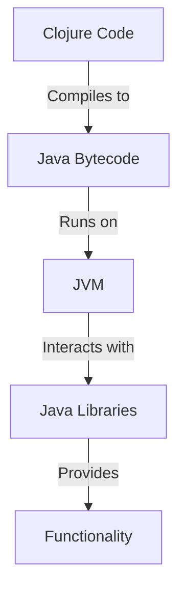

## 2.9. Interoperability with the JVM

Clojure's interoperability with the Java Virtual Machine (JVM) is one of its most powerful features, allowing developers to leverage the vast ecosystem of Java libraries and tools. This section explores how Clojure runs on the JVM, how it interacts with Java code, and the benefits and considerations of this interoperability.

### Understanding Clojure's Relationship with the JVM

Clojure is a dynamic, functional programming language that runs on the JVM. This means that Clojure code is compiled into Java bytecode, which the JVM executes. This relationship provides several advantages:

- **Access to Java Libraries**: Clojure can seamlessly use any Java library, enabling developers to leverage existing Java code and tools.
- **Performance**: The JVM is a mature platform with sophisticated optimizations, providing Clojure applications with robust performance.
- **Portability**: Running on the JVM allows Clojure applications to be platform-independent, running anywhere the JVM is supported.

### Calling Java Methods and Using Java Classes in Clojure

Clojure provides straightforward syntax for interacting with Java classes and methods. Let's explore how to call Java methods and use Java classes in Clojure.

#### Accessing Java Classes and Methods

To call a static method or access a static field in Java, use the `.` operator. For instance, to call the `Math` class's `sqrt` method:

```clojure
;; Calling a static method
(defn calculate-square-root [x]
  (Math/sqrt x))

;; Usage
(calculate-square-root 9) ; => 3.0
```

For instance methods, use the `.` operator with an instance of the class:

```clojure
;; Creating a Java object and calling an instance method
(defn get-string-length [s]
  (.length s))

;; Usage
(get-string-length "Clojure") ; => 7
```

#### Creating Java Objects

To create a new instance of a Java class, use the `new` keyword or the class name followed by a period:

```clojure
;; Creating a new Java object
(defn create-date []
  (java.util.Date.))

;; Usage
(create-date) ; => #inst "2024-11-25T00:00:00.000-00:00"
```

#### Using Java Libraries in Clojure

Clojure's ability to use Java libraries is a significant advantage. Let's see how to integrate a popular Java library, Apache Commons Lang, into a Clojure application.

First, add the dependency to your `project.clj` file:

```clojure
:dependencies [[org.clojure/clojure "1.10.3"]
               [org.apache.commons/commons-lang3 "3.12.0"]]
```

Then, you can use the library in your Clojure code:

```clojure
;; Using Apache Commons Lang StringUtils
(ns myapp.core
  (:import (org.apache.commons.lang3 StringUtils)))

(defn is-blank? [s]
  (StringUtils/isBlank s))

;; Usage
(is-blank? " ") ; => true
```

### Benefits and Considerations of Java Interoperability

#### Benefits

1. **Rich Ecosystem**: Access to a vast array of Java libraries and frameworks.
2. **Performance**: Benefit from JVM optimizations and mature garbage collection.
3. **Community Support**: Leverage the extensive Java community and resources.

#### Considerations

1. **Complexity**: Mixing paradigms (functional Clojure with object-oriented Java) can increase complexity.
2. **Performance Overheads**: While the JVM is optimized, certain operations may introduce overhead.
3. **Error Handling**: Java exceptions need to be handled appropriately in Clojure.

### Performance Implications and Best Practices

While Clojure's interoperability with Java is powerful, it's essential to consider performance implications:

- **Avoid Reflection**: Use type hints to avoid reflection, which can slow down performance.
- **Leverage Primitives**: Use primitive types where possible to enhance performance.
- **Optimize Hotspots**: Profile your application to identify and optimize performance-critical sections.

#### Type Hints Example

Type hints help the Clojure compiler avoid reflection:

```clojure
;; Using type hints to avoid reflection
(defn add-numbers ^long [^long a ^long b]
  (+ a b))

;; Usage
(add-numbers 5 10) ; => 15
```

### Visualizing Clojure and JVM Interoperability

To better understand how Clojure interacts with the JVM, let's visualize the process:



**Diagram Description**: This diagram illustrates the flow from Clojure code compilation to Java bytecode, which runs on the JVM and interacts with Java libraries to provide functionality.

### Try It Yourself

Experiment with the following exercises to deepen your understanding:

1. **Modify the `calculate-square-root` function** to handle negative inputs gracefully.
2. **Integrate another Java library** of your choice and use it in a Clojure function.
3. **Profile a Clojure application** using a Java profiler to identify performance bottlenecks.

### Knowledge Check

- What are the benefits of Clojure running on the JVM?
- How do you call a static Java method from Clojure?
- What are some considerations when using Java libraries in Clojure?

### Summary

Clojure's interoperability with the JVM is a cornerstone of its power and flexibility, allowing developers to harness the full potential of Java's ecosystem. By understanding how to effectively integrate Java code and libraries, you can create robust, high-performance applications that leverage the best of both worlds.

## **Ready to Test Your Knowledge?**



### What is one of the main benefits of Clojure running on the JVM?

- [x] Access to Java libraries
- [ ] Easier syntax
- [ ] Faster compilation
- [ ] Built-in GUI support

> **Explanation:** Running on the JVM allows Clojure to access a vast array of Java libraries, enhancing its functionality.

### How do you call a static method from a Java class in Clojure?

- [x] Using the `.` operator
- [ ] Using the `new` keyword
- [ ] Using the `import` statement
- [ ] Using the `defn` keyword

> **Explanation:** The `.` operator is used to call static methods from Java classes in Clojure.

### What is a consideration when using Java libraries in Clojure?

- [x] Mixing paradigms can increase complexity
- [ ] Java libraries are not performant
- [ ] Java libraries are not compatible with Clojure
- [ ] Java libraries are deprecated

> **Explanation:** Mixing functional Clojure with object-oriented Java can increase complexity in the codebase.

### What is a performance implication of Clojure's Java interoperability?

- [x] Reflection can slow down performance
- [ ] Java libraries are always faster
- [ ] Clojure cannot use Java primitives
- [ ] Java code is compiled slower

> **Explanation:** Reflection can introduce performance overhead, so it's best to avoid it using type hints.

### How can you avoid reflection in Clojure?

- [x] Use type hints
- [ ] Use more Java libraries
- [ ] Avoid using Java classes
- [ ] Use the `new` keyword

> **Explanation:** Type hints help the Clojure compiler avoid reflection, improving performance.

### What is the purpose of the `new` keyword in Clojure?

- [x] To create a new instance of a Java class
- [ ] To call a static method
- [ ] To define a new function
- [ ] To import a Java library

> **Explanation:** The `new` keyword is used to create new instances of Java classes in Clojure.

### What is a benefit of using Java libraries in Clojure?

- [x] Access to a rich ecosystem
- [ ] Clojure code becomes object-oriented
- [ ] Java libraries are always faster
- [ ] Java libraries simplify Clojure syntax

> **Explanation:** Java libraries provide access to a rich ecosystem of tools and functionalities.

### How can you integrate a Java library into a Clojure project?

- [x] Add the library as a dependency in `project.clj`
- [ ] Use the `import` statement
- [ ] Use the `new` keyword
- [ ] Use the `defn` keyword

> **Explanation:** Adding the library as a dependency in `project.clj` allows you to use it in your Clojure project.

### What is the role of the JVM in Clojure applications?

- [x] It executes the compiled Java bytecode
- [ ] It compiles Clojure code directly
- [ ] It provides a GUI framework
- [ ] It simplifies Clojure syntax

> **Explanation:** The JVM executes the compiled Java bytecode, allowing Clojure applications to run.

### True or False: Clojure can only use Java libraries that are specifically designed for it.

- [ ] True
- [x] False

> **Explanation:** Clojure can use any Java library, not just those specifically designed for it.



Remember, this is just the beginning. As you progress, you'll discover more ways to integrate Java's powerful features into your Clojure applications. Keep experimenting, stay curious, and enjoy the journey!
